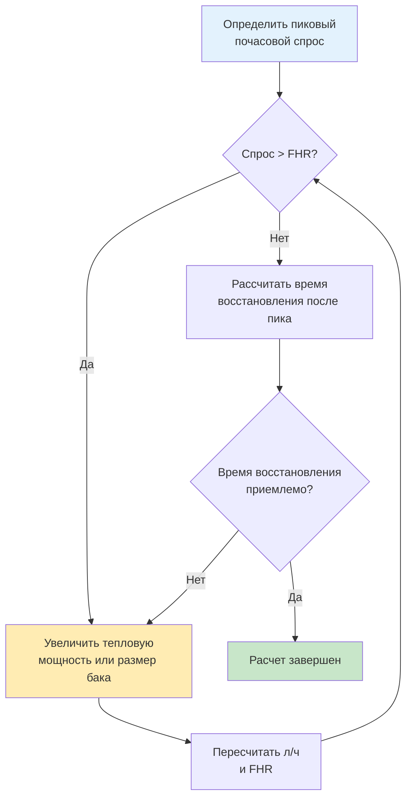
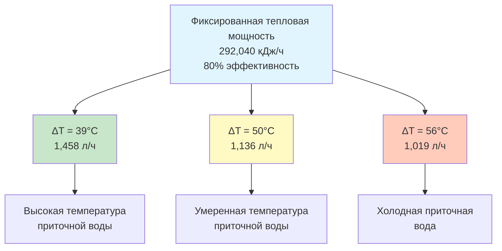

## Фундаментальная формула производительности восстановления

Производительность восстановления в литрах в час (л/ч) определяет, с какой скоростью водонагреватель может нагреть поступающую холодную воду до желаемой температуры подачи. Этот показатель имеет решающее значение для правильного расчета размера и оценки способности водонагревателя удовлетворять спрос.

Фундаментальное уравнение:

$$\text{л/ч} = \frac{\text{кДж/ч} \times \eta}{4.19 \times \Delta T}$$

Где:
- **л/ч** = Производительность восстановления (литры в час)
- **кДж/ч** = Рейтинг тепловой мощности нагревателя
- **η** = Коэффициент эффективности (в десятичном виде: 0.80 для 80%)
- **4.19** = Теплоемкость воды в кДж/(л·°C)
- **ΔT** = Необходимое повышение температуры (°C)

## Физические основы

Константа 4.19 кДж/(л·°C) представляет теплоемкость воды при стандартных условиях. Расчет повышения температуры следует уравнению явного тепла:

$$Q = m \times c_p \times \Delta T$$

Где:
- **Q** = Тепловая энергия (кДж)
- **m** = Масса воды (кг)
- **c_p** = Удельная теплоемкость воды (4.19 кДж/кг·°C)
- **ΔT** = Изменение температуры (°C)

Поскольку один литр воды весит 1 кг и имеет удельную теплоемкость 4.19 кДж/кг·°C, нагрев одного литра на один градус Цельсия требует 4.19 кДж.

## Определение повышения температуры

Повышение температуры зависит от температуры поступающей воды и желаемой температуры подачи:

$$\Delta T = T_{\text{подача}} - T_{\text{приток}}$$

Типичные температуры поступающей воды варьируются по регионам и сезонам:

| Регион | Зимний приток | Летний приток | Проектный ΔT (до 60°C) |
|--------|--------------|--------------|---------------------|
| Южная часть США | 13-16°C | 21-24°C | 36-39°C |
| Центральная часть США | 7-10°C | 18-21°C | 40-43°C |
| Северная часть США | 4-7°C | 16-18°C | 43-46°C |

ASHRAE 90.1 рекомендует использовать температуру приточной воды 4°C для консервативных проектных расчетов в большинстве приложений.

## Примеры расчета производительности восстановления

### Пример 1: Жилой газовый водонагреватель

Дано:
- Тепловая мощность: 116,544 кДж/ч (40,000 BTU/hr)
- Эффективность: 0.62 (62% для атмосферного газа)
- Температура приточной воды: 10°C
- Температура подачи: 60°C
- Повышение температуры: 50°C

$$\text{л/ч} = \frac{116,544 \times 0.62}{4.19 \times 50} = \frac{72,252}{209.5} = 344.9 \text{ л/ч}$$

### Пример 2: Коммерческий электрический водонагреватель

Дано:
- Мощность: 18,000 Вт = 64,872 кДж/ч
- Эффективность: 0.98 (98% электрическое сопротивление)
- Повышение температуры: 56°C

$$\text{л/ч} = \frac{64,872 \times 0.98}{4.19 \times 56} = \frac{63,574}{234.6} = 271.0 \text{ л/ч}$$

### Пример 3: Конденсационный газовый нагреватель высокой эффективности

Дано:
- Тепловая мощность: 572,832 кДж/ч (199,000 BTU/hr)
- Эффективность: 0.96 (96% конденсационный)
- Повышение температуры: 50°C

$$\text{л/ч} = \frac{572,832 \times 0.96}{4.19 \times 50} = \frac{549,919}{209.5} = 2,624.0 \text{ л/ч}$$

## Таблица сравнения производительности восстановления

| Тепловая мощность (кДж/ч) | Эффективность | ΔT = 39°C | ΔT = 50°C | ΔT = 56°C |
|----------------|-----------|-----------|-----------|------------|
| 87,912 | 0.60 | 327.9 л/ч | 251.5 л/ч | 224.8 л/ч |
| 116,544 | 0.62 | 451.5 л/ч | 344.9 л/ч | 308.0 л/ч |
| 219,600 | 0.80 | 1,095.3 л/ч | 840.9 л/ч | 751.8 л/ч |
| 293,040 | 0.82 | 1,506.4 л/ч | 1,152.5 л/ч | 1,029.9 л/ч |
| 572,832 | 0.96 | 3,504.3 л/ч | 2,624.0 л/ч | 2,345.7 л/ч |

## Рейтинг первого часа (FHR)

Рейтинг первого часа объединяет емкость накопительного бака с производительностью восстановления:

$$\text{FHR} = (\text{Объем бака} \times 0.70) + \text{л/ч}$$

Коэффициент 0.70 учитывает полезное количество горячей воды из бака (обычно 70% до значительного падения температуры).

### Пример расчета FHR

Бак на 189 л с производительностью восстановления 151 л/ч:

$$\text{FHR} = (189 \times 0.70) + 151 = 132.3 + 151 = 283.3 \text{ л}$$

## Коэффициент эффективности по типу нагревателя

| Тип нагревателя | Типичная эффективность | Диапазон |
|-------------|-------------------|-------|
| Электрическое сопротивление | 0.95-0.98 | Высокая (минимальные потери) |
| Атмосферный газ | 0.58-0.64 | Низкая (потери в дымоходе) |
| Газ с принудительной тягой | 0.62-0.67 | Умеренное улучшение |
| Конденсационный газ | 0.90-0.98 | Высокая (утилизация скрытого тепла) |
| Тепловой насос для ГВС | 2.0-3.5 COP* | Электрический эквивалент |
| Косвенный (от котла) | 0.70-0.85 | Зависит от эффективности котла |

*COP теплового насоса преобразуется в эквивалентную эффективность >200%, но использует другой метод расчета в соответствии с ASHRAE 118.2.

## Методология расчета размера

### Этапы расчета размера

1. **Определить пиковый почасовой спрос** на основе расчетных единиц приборов или фактических данных использования (ASHRAE Handbook - HVAC Applications Chapter 51)
2. **Выбрать температуру подачи** (обычно 60°C для накопительной, 49°C для точечного применения)
3. **Установить температуру приточной воды** (использовать 4-10°C для проектных расчетов)
4. **Рассчитать необходимый л/ч** для удовлетворения спроса
5. **Проверить время восстановления** между пиковыми периодами использования
6. **Применить коэффициент безопасности** (1.2-1.5× для критических приложений)

## Коэффициенты преобразования

### кДж/ч в киловатты

$$\text{кВт} = \frac{\text{кДж/ч}}{3,600}$$

### Электрическая мощность в л/ч

Для электрических нагревателей с эффективностью 98%:

$$\text{л/ч} = \frac{\text{Вт} \times 0.086}{\Delta T}$$

Эта упрощенная формула включает преобразование кДж и типичную электрическую эффективность.

## Ссылки на стандарты ASHRAE

- **ASHRAE 90.1**: Требования к энергоэффективности оборудования систем горячего водоснабжения
- **ASHRAE 118.2**: Методика испытаний и оценки жилых водонагревателей
- **ASHRAE Handbook - HVAC Applications, Chapter 51**: Проектирование систем горячего водоснабжения, емкость хранения и требования к восстановлению
- **ASHRAE 90.2**: Энергоэффективное проектирование малоэтажных жилых зданий, положения по горячему водоснабжению

## Практические рекомендации по расчету размера

### Приложения с непрерывным водозабором

Для приложений с постоянным водозабором (коммерческие кухни, прачечные) производительность восстановления становится более критичной, чем емкость накопителя. Расчет на основе:

$$\text{Требуемый л/ч} \geq \text{Непрерывный расход} \times 1.25$$

### Приложения с пиковым водозабором

Для приложений с короткими интенсивными пиками (утреннее жилое использование) емкость накопителя более важна. Использовать метод FHR с адекватным восстановлением между пиками.

### Массивы нескольких нагревателей

При использовании нескольких нагревателей общая производительность восстановления складывается:

$$\text{Общий л/ч} = \text{л/ч}_1 + \text{л/ч}_2 + \text{л/ч}_3 + \ldots$$

Это обеспечивает избыточность и позволяет использовать поэтапное регулирование при частичных нагрузках.

## Влияние повышения температуры на производительность

Производительность восстановления снижается пропорционально увеличению повышения температуры. Увеличение повышения температуры на 30% (39°C на 56°C) снижает производительность л/ч на 30%.

## Проверка на месте

Для проверки фактической производительности восстановления:

1. Слить нагреватель до 50% емкости
2. Зафиксировать время возврата к установленному значению
3. Рассчитать литры нагретой воды и прошедшее время
4. Сравнить с номинальными л/ч

Значительное отклонение указывает на потерю эффективности, накипь или отказ компонента, требующий технического обслуживания.
