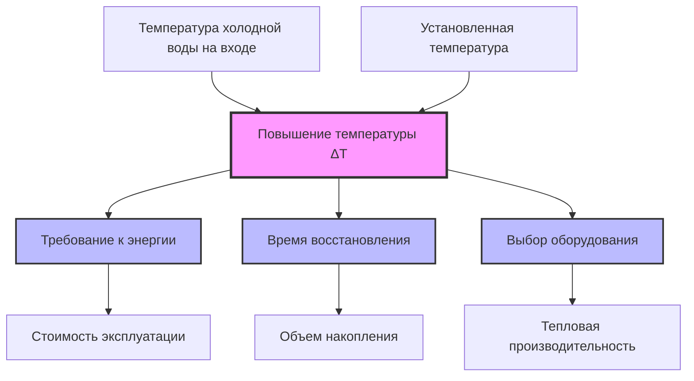
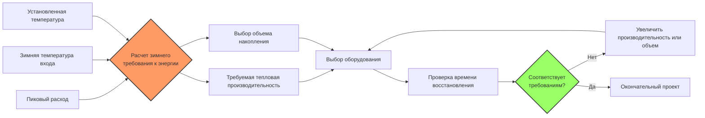

Повышение температуры (ΔT) представляет критическую тепловую разницу между холодной водой на входе и требуемой точкой установки горячей воды. Этот параметр фундаментально определяет требования к энергии, время восстановления и надлежащий выбор оборудования для систем горячего водоснабжения.

## Основное уравнение повышения температуры

Энергия, необходимая для повышения температуры воды, следует уравнению чувствительного тепла:

$$Q = \dot{m} \cdot c_p \cdot \Delta T$$

Где:
- $Q$ = Интенсивность теплопередачи (кВт)
- $\dot{m}$ = Массовый расход (кг/с)
- $c_p$ = Удельная теплоемкость воды (4,186 кДж/кг-°C)
- $\Delta T$ = Повышение температуры (°C)

Для практических расчетов водонагревателя в метрической системе:

$$Q_{кВт} = \dot{V}_{л/ч} \times 1,163 \times \Delta T$$

Эта упрощенная форма включает плотность воды (1000 кг/м³), удельную теплоемкость (4,186 кДж/кг-°C) и преобразование единиц.

## Колебания температуры холодной воды на входе

Температура холодной воды на входе значительно варьируется в зависимости от географии и сезона, напрямую влияя на требуемое повышение температуры:

| Сезон | Типичный диапазон на входе | Типовое проектное значение | ΔT до 60°C |
|--------|---------------------|---------------------|-------------|
| Зима | 4–10°C | 7°C | 53°C |
| Лето | 16–21°C | 18°C | 42°C |
| Весна/Осень | 10–16°C | 13°C | 47°C |
| Круглогодичное проектирование | 4–10°C | 10°C | 50°C |

ASHRAE Handbook—HVAC Applications рекомендует использовать самую низкую ожидаемую температуру на входе для расчетов выбора, чтобы обеспечить достаточную пропускную способность при пиковых условиях спроса.

### Географические соображения

Температура холодной воды на входе коррелирует с местными температурами грунтовых вод и муниципального водопровода:

- **Северные климатические зоны**: Зимние температуры на входе 4–7°C обычны
- **Южные климатические зоны**: Зимние температуры на входе 10–13°C типичны
- **Прибрежные регионы**: Умеренные сезонные колебания
- **Пустынные регионы**: Более значительные сезонные колебания температуры

## Влияние повышения температуры на производительность системы

### Взаимосвязь требований к энергии

Прямая пропорциональность между ΔT и потреблением энергии создает значительные сезонные колебания:

**Пример расчета:**
- Расход: 37,9 л/мин
- Зимний вход: 7°C, ΔT = 53°C
- Летний вход: 18°C, ΔT = 42°C
- Установленная температура: 60°C

Требование к энергии зимой:
$$Q_{зима} = 37,9 \times 1,163 \times 53 = 2339 \text{ кВт}$$

Требование к энергии летом:
$$Q_{лето} = 37,9 \times 1,163 \times 42 = 1849 \text{ кВт}$$

Зимнее условие требует на 26,5% больше энергии, чем летом для одинаковых расходов.

## Расчеты времени восстановления

Время восстановления зависит от объема накопления, тепловой производительности и повышения температуры:

$$t_{восстановления} = \frac{V \times \Delta T}{Q_{input} \times \eta \times 0,001163}$$

Где:
- $t_{восстановления}$ = Время нагрева накопленного объема (часы)
- $V$ = Объем накопления (литры)
- $\Delta T$ = Повышение температуры (°C)
- $Q_{input}$ = Тепловая производительность нагревателя (кВт)
- $\eta$ = Тепловой КПД (в долях)

### Таблица сравнения времени восстановления

| Объем накопления | Тепловая производительность | Зимний ΔT (53°C) | Летний ΔT (42°C) | Разница времени |
|----------------|--------------|------------------|------------------|-----------------|
| 300 л | 22 кВт (0,80 η) | 1,32 часа | 1,04 часа | +27% |
| 450 л | 29 кВт (0,80 η) | 1,48 часа | 1,17 часа | +27% |
| 750 л | 44 кВт (0,80 η) | 1,65 часа | 1,30 часа | +27% |

## Влияние выбора оборудования и проектные соображения

### Критерии выбора оборудования

Надлежащий выбор должен учитывать наихудшие условия повышения температуры:

1. **Выбор проектного ΔT**: Использование зимней температуры на входе (средняя температура холодного месяца минус коэффициент безопасности 3°C)
2. **Анализ пикового спроса**: Расчет максимального одновременного расхода через приборы
3. **Требования ко времени восстановления**: Установление приемлемых периодов повторного нагрева между циклами спроса
4. **Компромисс между накоплением и производительностью**: Балансировка размера бака против тепловой производительности

### Последствия недостаточного выбора

Неадекватный учет повышения температуры приводит к:

- Недостаточной доступности горячей воды в холодные месяцы
- Продолжительным периодам восстановления, превышающим циклы спроса
- Жалобам пользователей и модификациям систем
- Увеличенной стоимости эксплуатации из-за непрерывных попыток нагрева

### Соображения при избыточном выборе

Хотя консервативный выбор обеспечивает коэффициент безопасности, чрезмерная пропускная способность приводит к:

- Более высокой первоначальной стоимости оборудования
- Увеличенным потерям в режиме ожидания от больших объемов накопления
- Сниженной эффективности при частичной нагрузке
- Ненужному потреблению энергии

## Сезонные колебания эффективности

Годовой анализ эффективности требует интеграции повышения температуры:

$$\text{Годовая энергия} = \sum_{месяц=1}^{12} \text{Потребление}_{месяц} \times \Delta T_{месяц}$$

Системы, выбранные для зимних условий, работают при частичной пропускной способности в летние месяцы, потенциально снижая эффективность горения для топливных установок и потери от циклирования для всех типов оборудования.

## Ссылки на проектные стандарты ASHRAE

ASHRAE Standard 90.1 Energy Standard for Buildings Except Low-Rise Residential Buildings предоставляет требования к минимальной эффективности, взаимодействующие с выбором размера при повышении температуры:

- Раздел 7: Требования к эффективности подогрева воды для обслуживания
- Таблица 7.8: Требования производительности для водонагревателей

ASHRAE Handbook—HVAC Applications Глава 51 Service Water Heating:

- Таблица 7: Требование горячей воды на прибор
- Таблица 10: Емкость накопления и требования восстановления
- Рисунок 11: Кривые выбора размера с учетом коэффициентов повышения температуры

## Практические рекомендации по проектированию

1. **Основание проекта**: Использование зимней температуры входа для всех расчетов пропускной способности
2. **Коэффициент безопасности**: Применение 10–15% запаса производительности сверх расчетного пикового спроса
3. **Местные данные**: Получение фактических температур муниципальной воды от поставщиков услуг
4. **Мониторинг**: Установка датчиков температуры на входе для сезонной проверки
5. **Эффективность**: Рассмотрение модулирующего оборудования, адаптирующегося к сезонным колебаниям ΔT
6. **Предварительный подогрев**: Оценка солнечного теплоснабжения или рекуперации тепла для снижения эффективного ΔT

Расчеты повышения температуры составляют основу надежного проектирования систем горячего водоснабжения. Точная оценка колебаний температуры входа, особенно зимних условий, обеспечивает достаточную пропускную способность, избегая дорогостоящего избыточного выбора.
