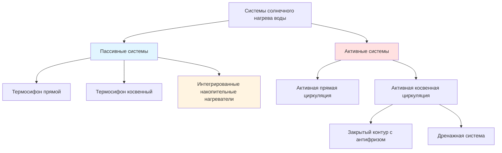
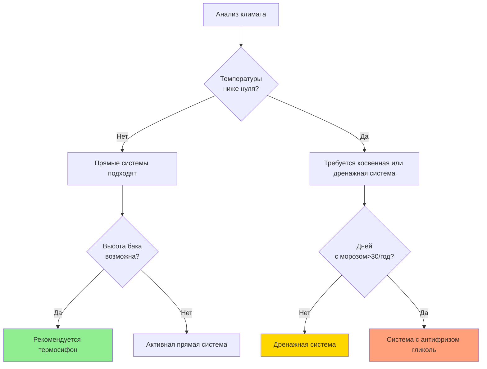

# Активные и пассивные системы солнечного нагрева воды

Системы солнечного нагрева воды разделяются на две фундаментальные категории в зависимости от механизма циркуляции: **пассивные системы**, использующие естественную конвекцию, и **активные системы**, применяющие насосы для циркуляции теплоносителя. Понимание физики, лежащей в основе каждого подхода, критически важно для правильного выбора системы и прогнозирования производительности.

## Фундаментальные принципы работы

### Пассивные системы термосифонирования

Системы термосифонирования используют разность плотности между горячей и холодной водой для создания естественной циркуляции. Движущая сила потока возникает из разности давления плавучести:

$$\Delta P_{buoyancy} = g H (\rho_{cold} - \rho_{hot})$$

Где:
- $g$ = ускорение свободного падения (9,81 м/с²)
- $H$ = вертикальная высота между выходом коллектора и входом накопительного бака (м)
- $\rho_{cold}$, $\rho_{hot}$ = плотность холодной и горячей воды (кг/м³)

Эта разность давления должна преодолеть потери на трение по всей цепи:

$$\Delta P_{friction} = f \frac{L}{D} \frac{\rho v^2}{2} + \sum K \frac{\rho v^2}{2}$$

Система достигает равновесия, когда давление плавучести равно потерям на трение, устанавливая естественный расход циркуляции. Для воды, нагретой с 15°C до 60°C при подъеме на 1 метр, доступное движущее давление составляет приблизительно 180 Па.

**Ключевое требование конструкции:** Накопительный бак должен быть расположен **выше** выхода коллектора для работы термосифона. Минимальная разность высот обычно составляет 0,3–1,0 метра в зависимости от конфигурации трубопровода.

### Активные системы с насосом

Активные системы используют циркуляционные насосы, управляемые датчиками дифференциальной температуры. Насос работает при:

$$T_{collector} > T_{storage} + \Delta T_{on}$$

Где $\Delta T_{on}$ обычно варьируется от 5–10°C для предотвращения циклирования и обеспечения чистого прироста энергии. Требования к электроэнергии насоса обычно составляют 50–100 ватт для жилых систем, с годовым потреблением электроэнергии 200–400 кВч в зависимости от климата и стратегии управления.

Насос обеспечивает достаточное давление для преодоления всех сопротивлений системы и позволяет гибко размещать компоненты и прокладывать трубопровод.

## Типы конфигурации систем

### Прямые и косвенные системы

**Прямые системы** циркулируют питьевую воду через солнечные коллекторы:
- Более низкая стоимость (односкоростной контур)
- Более высокая эффективность (без потерь на теплообменник)
- Риск замерзания в климатах с температурой ниже 0°C
- Риск накипи при жесткой воде
- Ограничены нетоксичной и некоррозионной химией воды

**Косвенные системы** используют отдельный контур теплоносителя с теплообменником:
- Защита от замерзания с помощью растворов антифриза (обычно пропилен-гликоль)
- Изоляция от проблем с химией воды
- Потери эффективности теплообменника: 5–15% тепловых потерь
- Более высокая начальная стоимость и сложность
- Дренажные варианты используют воду, но требуют надлежащего уклона для дренажа

Эффективность теплообменника в косвенных системах следует:

$$\epsilon = \frac{Q_{actual}}{Q_{maximum}} = \frac{T_{storage,out} - T_{storage,in}}{T_{fluid,in} - T_{storage,in}}$$

Типичные значения эффективности варьируются от 0,6 до 0,8 для погруженных спиральных теплообменников и 0,7 до 0,85 для пластинчатых теплообменников.

### ИНН (интегрированные накопительные нагреватели)

ИНН системы объединяют сбор и хранение в одном устройстве. Сам накопительный бак служит абсорбером, с изоляцией на пяти сторонах и остеклением на шестой. Они представляют самый простой пассивный солнечный водонагреватель:

**Преимущества:**
- Минимум компонентов (нет отдельного коллектора или системы циркуляции)
- Исключительная надежность (нет движущихся частей или элементов управления)
- Низкие требования к техническому обслуживанию

**Недостатки:**
- Высокие потери тепла ночью (хранилище подвергается воздействию атмосферы)
- Большая тепловая масса ограничивает суточный рост температуры
- Большие нагрузки на кровлю (150–300 кг при наполнении)
- Проблемы с эстетикой (видимый профиль бака)

Тепловая производительность ИНН систем значительно ухудшается в холодные, облачные периоды из-за тепловой связи между хранилищем и окружающей средой. Коэффициент теплопотерь для устройств ИНН обычно варьируется от 5–10 Вт/м²·К в сравнении с 1–3 Вт/м²·К для изолированных накопительных баков.

## Сравнение производительности

| Параметр | Пассивный термосифон | Активная циркуляция | ИНН |
|-----------|---------------------|---------------|-----------|
| Годовая эффективность | 35–50% | 40–60% | 25–40% |
| Защита от замерзания | Требуется косвенный контур | Антифриз или дренажная система | Требуется слив |
| Сложность монтажа | Средняя | Высокая | Низкая |
| Техническое обслуживание | Низкое | Среднее (насос, управление) | Минимальное |
| Капитальные затраты (руб./м² коллектора) | 25000–37000 | 37000–55000 | 19000–31000 |
| Операционные затраты | Нулевые | 1900–3700 руб./год (энергия насоса) | Нулевые |
| Гибкость конструкции | Ограниченная (высота бака) | Высокая | Очень ограниченная |
| Типичный срок службы | 15–20 лет | 12–18 лет | 20–25 лет |

## Применимость в различных климатических условиях

### Рекомендации по климатическим зонам

**Тропический/субтропический (климатические зоны ASHRAE 1–3):**
- Прямые системы термосифона оптимальны
- ИНН нагреватели возможны, но с более низкой эффективностью
- Защита от замерзания не требуется
- Проблемы коррозии для прибрежных установок

**Умеренный климат (климатические зоны 4–5):**
- Косвенный термосифон или активные системы
- Дренажные системы предпочтительнее гликоля (без деградации)
- ИНН требует консервации (слива) в холодные месяцы

**Холодный климат (климатические зоны 6–8):**
- Требуются активные косвенные системы с гликолем
- Периодическое тестирование и замена гликоля необходимы (интервалы 3–5 лет)
- Более высокое обоснование производительности из-за более низкого солнечного ресурса
- Соображения снеговой нагрузки и ветра для монтажа коллектора

## Определители эффективности

Эффективность системы зависит от нескольких взаимосвязанных факторов:

$$\eta_{system} = \eta_{optical} \cdot \eta_{thermal} \cdot \eta_{transfer} \cdot \eta_{storage}$$

Где:
- $\eta_{optical}$ = оптическая эффективность коллектора (0,7–0,85 для селективных покрытий)
- $\eta_{thermal}$ = тепловая эффективность коллектора (функция рабочей температуры)
- $\eta_{transfer}$ = эффективность циркуляции и теплообмена (0,85–1,0)
- $\eta_{storage}$ = тепловое удержание накопительного бака (0,90–0,98)

Компонент тепловой эффективности следует:

$$\eta_{thermal} = 1 - \frac{U_L (T_{collector} - T_{ambient})}{I}$$

Где $U_L$ – коэффициент теплопотерь коллектора (3–6 Вт/м²·К для плоских коллекторов) и $I$ – падающее солнечное излучение (Вт/м²). Эта зависимость показывает, что системы термосифонирования, работающие при немного более высоких температурах коллектора из-за более низких расходов, испытывают немного сниженную эффективность по сравнению с оптимизированными активными системами.

## Концепция выбора системы

**Выбирайте пассивный термосифон, если:**
- Участок позволяет поднять бак выше коллекторов
- Минимальная инфраструктура технического обслуживания доступна
- Существуют опасения по надежности электроэнергии
- Приоритет – минимизация затрат за весь жизненный цикл
- Климат без морозов или приемлема косвенная система

**Выбирайте активную циркуляцию, если:**
- Требуется гибкость расположения бака
- Оптимизированная эффективность оправдывает дополнительную сложность
- Требуется интеграция с существующими гидроническими системами
- Желательны возможности мониторинга и управления
- Существуют ограничения нагрузки на крышу (удаленное хранилище)

**Выбирайте ИНН, если:**
- Простота превыше эффективности
- Конструкция крыши может выдержать нагрузку
- Умеренные потребления горячей воды (1–2 жилца)
- Применение в сезонных/рекреационных объектах
- Ограничения бюджета значительны

## Стандарты и тестирование

Рейтинг производительности солнечного водонагревателя следует протоколу **SRCC OG-300** (Solar Rating and Certification Corporation), который устанавливает стандартизированные условия тестирования:
- Эталонное излучение: 1000 Вт/м²
- Температура окружающей среды: 20°C
- Температура входящей воды: 11°C
- Профиль отбора: 919 л/день

Производительность указывается как коэффициент солнечной энергии (SEF) с типичными значениями:
- Активные косвенные системы: 2,0–3,0
- Пассивный термосифон: 1,5–2,5
- ИНН: 1,0–1,8

Более высокое значение SEF указывает на большую подачу энергии на единицу потребленной вспомогательной энергии. Системы должны выбираться на основе сертифицированных рейтингов, а не только теоретической площади коллектора.

---

**Файл:** `/Users/evgenygantman/Documents/github/gantmane/hvac/content/specialty-applications-testing/specialty-hvac-applications/service-water-heating-domestic-hot-water/solar-water-heating/active-vs-passive/_index.md`
