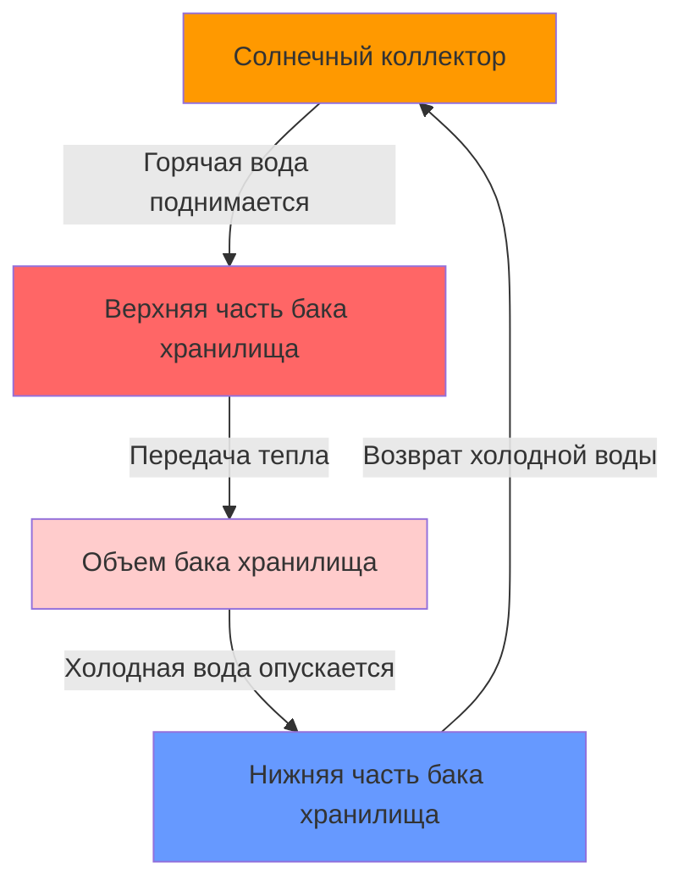

Системы пассивного солнечного нагрева воды используют принципы естественной конвекции и термосифона для циркуляции воды без механических насосов или электронных регуляторов. Эти системы обеспечивают простоту, надежность и снижение затрат на техническое обслуживание по сравнению с активными системами, хотя производительность зависит в основном от правильной геометрии установки и климатических условий.

## Принципы работы системы термосифона

Системы термосифона работают на основе естественной циркуляции, вызванной плавучестью, которая создается разностью плотностей нагретой воды. Движущей силой потока управляет разница гидростатического давления между горячей и холодной водяными колонками.

### Физика естественной циркуляции

Скорость циркуляции в контуре термосифона зависит от выталкивающей силы:

$$\Delta P = g \cdot H \cdot (\rho_c - \rho_h)$$

где:
- $\Delta P$ = движущая разность давлений (Па)
- $g$ = ускорение свободного падения (9,81 м/с²)
- $H$ = вертикальная высота между коллектором и хранилищем (м)
- $\rho_c$ = плотность холодной воды (кг/м³)
- $\rho_h$ = плотность горячей воды (кг/м³)

Плотность воды изменяется с температурой согласно:

$$\rho_T \approx 1000 - 0,2 \cdot (T - 4)$$

При 20°C $\rho = 998,2$ кг/м³; при 60°C $\rho = 983,2$ кг/м³. Эта разница плотности 15 кг/м³ обеспечивает циркуляцию.

Объемная скорость потока достигается путем балансировки выталкивающей силы против потерь на трение:

$$\dot{V} = \sqrt{\frac{2 \cdot g \cdot H \cdot \Delta\rho}{\rho \cdot (f \cdot L/D + \Sigma K)}}$$

где:
- $\dot{V}$ = объемный расход (м³/с)
- $f$ = коэффициент трения (безразмерный)
- $L/D$ = отношение длины трубопровода к диаметру
- $\Sigma K$ = сумма коэффициентов местных потерь

### Критические требования к установке

**Разница по высоте**: Дно бака хранилища должно быть расположено на 0,3-0,6 м выше верхней части коллектора для обеспечения надежной работы термосифона. Недостаточная разница по высоте создает слабую циркуляцию; чрезмерная разница увеличивает потери на трение в трубопроводе.

**Геометрия трубопровода**:
- Непрерывный восходящий уклон от выхода коллектора к входу в хранилище (минимум 1:40 подъема)
- Отсутствие горизонтальных участков или провисаний, которые задерживают воздух
- Короткие прямые маршруты трубопровода минимизируют трение
- Диаметр трубопровода обычно 19-25 мм для жилых систем

**Предотвращение обратного термосифона**: Во время ночного охлаждения может произойти обратная циркуляция, если коллектор охлаждается ниже температуры хранилища. Потери тепла через неизолированный трубопровод создают обратный градиент плотности. Решения включают:
- Обратные клапаны (снижают поток во время работы)
- Оптимизация угла наклона коллектора для сопротивления обратному потоку
- Изолированный трубопровод для минимизации ночных потерь

## Системы с интегрированным коллектором-хранилищем (ICS)

Коллекторы ICS или "проточные" комбинируют солнечный поглотитель и бак хранилища в одном устройстве. Вода остается в коллекторе постоянно, исключая требования к циркуляции, но создавая уязвимость к замерзанию.

### Конфигурации конструкции ICS

**Конструкция с одним баком**: Один большой цилиндрический бак (150-300 л) с селективным покрытием поверхности, заключенный в изолированный остекленный корпус. Простая конструкция, но подвержена значительным ночным потерям тепла.

**Конструкция с несколькими трубами**: Несколько параллельных труб (диаметром 75-100 мм) увеличивают отношение площади поверхности к объему, улучшая эффективность сбора на 15-20% по сравнению с однобаковыми конструкциями.

Получение тепла для коллектора ICS следует:

$$Q_u = A_c \cdot F_R \cdot [S - U_L \cdot (T_i - T_a)]$$

где:
- $Q_u$ = полезное получаемое тепло (Вт)
- $A_c$ = апертурная площадь коллектора (м²)
- $F_R$ = коэффициент удаления тепла (0,6-0,8 для ICS)
- $S$ = поглощенное солнечное излучение (Вт/м²)
- $U_L$ = общий коэффициент потерь (3-5 Вт/м²·К для ICS)
- $T_i$ = начальная температура воды (°C)
- $T_a$ = температура окружающей среды (°C)

Системы ICS имеют более высокие коэффициенты потерь, чем коллекторы термосифона, потому что масса хранилища остается в корпусе коллектора, подвергаясь воздействию наружных температур. Ночные потери тепла могут достигать 20-30% дневных выигрышей в холодном климате.

### Характеристики производительности ICS

Мгновенная эффективность коллекторов ICS снижается с разностью температур:

$$\eta = F_R \cdot \tau\alpha - F_R \cdot U_L \cdot \frac{(T_i - T_a)}{G_T}$$

где:
- $\eta$ = мгновенная эффективность
- $\tau\alpha$ = произведение пропускания-поглощаемости (0,7-0,85)
- $G_T$ = падающее солнечное излучение (Вт/м²)

При $G_T = 800$ Вт/м² и $(T_i - T_a) = 30$°C типичная эффективность ICS составляет 40-50%, по сравнению с 60-70% для систем термосифона с отдельным хранилищем.

## Сравнение типов систем

| Параметр | Термосифон | ICS (проточный) |
|----------|------------|-----------------|
| **Эффективность** | 60-70% | 40-50% |
| **Защита от замерзания** | Требуется слив | Критическая уязвимость |
| **Сложность установки** | Средняя | Простая |
| **Расположение бака** | Внутри/защищено | На открытом воздухе |
| **Ночные потери тепла** | Низкие (5-10%) | Высокие (20-30%) |
| **Стоимость** | 2000-3500 долл. США | 1500-2500 долл. США |
| **Срок службы** | 20-25 лет | 15-20 лет |
| **Вес (наполненный)** | 250-400 кг | 200-350 кг |

## Климатические ограничения и защита от замерзания

Пассивные системы сталкиваются с критическими ограничениями в замерзающих климатических условиях из-за отсутствия активных механизмов защиты от замерзания.

### Анализ риска замерзания

Вода замерзает при 0°C (273,15 К), расширяясь примерно на 9% по объему. Это расширение создает давления, превышающие 200 МПа, достаточные для разрыва медных трубопроводов и стенок бака.

**Критические пороги температур**:
- **-5°C**: Риск повреждения от замерзания в незащищенных коллекторах
- **-10°C**: Высокая вероятность повреждения без вмешательства
- **-15°C**: Гарантированное повреждение водозаполненных систем

### Стратегии защиты

**Ручной слив**: В мягком замерзающем климате (5-15 дней замерзания в год), ручной слив перед событиями замерзания обеспечивает адекватную защиту. Требует:
- Сливных клапанов во всех нижних точках
- Воздушных вентиляционных отверстий во всех высоких точках
- Осведомленности и дисциплины пользователя

**Защита рециркуляцией**: Некоторые системы термосифона используют циркуляцию с приводом от силы тяжести из теплого хранилища через коллекторы во время риска замерзания, используя накопленное тепло для защиты. Эффективна только при сохранении хранилищем температуры >15°C и длительности замерзания <6 часов.

**Морозостойкие коллекторы**: Медные трубчатые коллекторы с компенсацией расширения могут пережить случайное замерзание, хотя повторные циклы замораживания-оттаивания снижают производительность и срок службы.

## Сертификация SRCC и производительность

Solar Rating and Certification Corporation (SRCC) предоставляет стандартизированное тестирование для пассивных водонагревателей на солнечной энергии в соответствии с протоколом OG-300. Рейтинги SRCC включают:

**Рейтинг системы OG-300**: Годовая солнечная доля и доставка энергии на основе климатической зоны, ориентации и типичных нагрузок. Предоставляет коэффициент солнечной энергии (SEF) в диапазоне 0,85-1,8 для пассивных систем.

**Климатические зоны**: Тестирование SRCC охватывает шесть климатических зон от Майами (жаркое/влажное) до Альбукерке (холодное/сухое). Пассивные системы работают оптимально в зонах 1-3 (минимальный риск замерзания).

Производительность значительно снижается в замерзающих климатических условиях:
- Зона 1-2: 90-100% номинальной мощности
- Зона 3-4: 70-80% номинальной мощности (сезонный слив снижает доступность)
- Зона 5-6: <50% номинальной мощности (расширенные периоды слива)

## Оптимальные области применения

Системы пассивного солнечного нагрева воды достигают лучшей производительности при конкретных условиях:

**Географическая пригодность**:
- Широты 25-35° с более чем 300 солнечными днями в год
- Минимальный риск замерзания (<10 дней замерзания в год)
- Умеренные летние температуры (<35°C температура окружающей среды)

**Требования к зданию**:
- Неза­тененная кровля, обращенная на юг (северное полушарие)
- Конструктивная способность выдерживать сосредоточенную нагрузку 300-400 кг
- Пространство для приподнятого бака хранилища в системах термосифона

**Профили нагрузки**:
- Постоянный дневной спрос на горячую воду (150-300 л/день)
- Дневные или вечерние схемы отбора (плохая работа в утренние часы)
- Прием резервного отопления в периоды расширенной облачности

**Экономические факторы**:
- Стоимость электроэнергии >0,12 долл. США/кВч или газа >1,20 долл. США/терм
- Доступные солнечные стимулы или налоговые льготы
- 8-15 лет приемлемого периода окупаемости

Пассивные системы обеспечивают надежное, требующее минимального обслуживания солнечное нагревание воды в подходящих климатических условиях, используя фундаментальные термодинамические принципы без механической сложности. Успех определяется правильной геометрией установки и соответствием климату.
