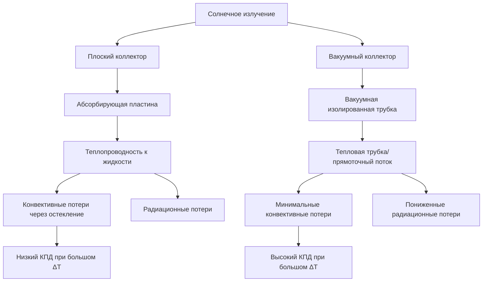

## Конструкция и принципы теплопередачи

**Плоские солнечные коллекторы** состоят из медного абсорбера с интегрированными трубками потока, заключённых в изолированный защитный корпус с прозрачным остеклением. Абсорбер имеет селективное покрытие (обычно чёрный хром или цермет) с высокой солнечной поглощаемостью (α ≈ 0,95) и низкой тепловой излучательностью (ε ≈ 0,10). Теплопередача происходит тремя механизмами:

- Солнечное излучение, поглощённое селективной поверхностью
- Теплопроводность от абсорбера к жидкости через медные трубки
- Конвективные и радиационные потери через остекление

**Вакуумные солнечные коллекторы** используют двустенные стеклянные трубки из боросиликатного стекла с вакуумом между стенками (давление < 10⁻³ Па). Каждая трубка содержит либо прямоточный абсорбер, либо тепловую трубку с жидкостью фазового перехода. Вакуум исключает кондуктивные и конвективные потери, оставляя только радиационные потери, описываемые законом Стефана-Больцмана:

$$Q_{loss} = \epsilon \sigma A (T_{absorber}^4 - T_{ambient}^4)$$

где $\sigma = 5,67 \times 10^{-8}$ Вт/(м²·К⁴) — константа Стефана-Больцмана.

## Характеристики эффективности

Эффективность коллектора соответствует модифицированному уравнению Хоттеля-Виллиера согласно ASHRAE 93 и стандарту SRCC 100:

$$\eta = F_R(\tau\alpha) - F_R U_L \frac{T_{inlet} - T_{ambient}}{G_T}$$

где:
- $F_R$ = коэффициент удаления тепла (0,85-0,95)
- $(\tau\alpha)$ = произведение пропускания и поглощаемости
- $U_L$ = общий коэффициент потерь тепла (Вт/(м²·К))
- $G_T$ = падающее солнечное излучение (Вт/м²)

| Параметр | Плоский коллектор | Вакуумный коллектор |
|-----------|-----------|----------------|
| КПД без потерь $F_R(\tau\alpha)$ | 0,70-0,80 | 0,60-0,70 |
| Коэффициент потерь $F_R U_L$ | 3,5-5,0 Вт/(м²·К) | 1,0-2,0 Вт/(м²·К) |
| КПД при ΔT = 50°C | 50-60% | 60-70% |
| Модификатор угла падения (45°) | 0,90-0,95 | 0,95-1,00 |

Вакуумные трубки демонстрируют превосходную производительность при повышенных температурных перепадах благодаря вакуумной изоляции. Точка пересечения приблизительно равна:

$$\Delta T_{crossover} = \frac{(\tau\alpha)_{fp} - (\tau\alpha)_{et}}{(U_L)_{et} - (U_L)_{fp}} \times G_T$$

При типичных условиях (1000 Вт/м² освещённость) это составляет повышение температуры 25-35°C.

## Эффективность в холодном климате

Эксплуатация при низких температурах окружающей среды выявляет фундаментальные различия. Для плоских коллекторов потери тепла растут линейно с температурным перепадом:

$$Q_{loss,fp} = U_L \times A \times (T_{fluid} - T_{ambient})$$

При температуре окружающей среды -20°C и температуре жидкости 60°C плоский коллектор испытывает потери 280-400 Вт/м². Вакуумные трубки теряют 80-160 Вт/м², сохраняя эффективность 60-75% при идентичных условиях, где плоские коллекторы падают до 20-35%.

**Критические соображения для холодных климатов:**
- Скорость ветра увеличивает конвективные потери на плоских коллекторах на 15-25%
- Снежное накопление на плоских коллекторах требует угла наклона 30-45°
- Вакуумные трубки сбрасывают снег благодаря цилиндрической геометрии и минимальным потерям тепла
- Системы защиты от замерзания с опорожнением благоприятствуют вакуумным трубкам в экстремальных условиях

## Риск стагнации и перегрева

При отсутствии циркуляции оба типа коллекторов достигают температуры стагнации $T_{stag}$ когда потери равны поглощению:

$$T_{stag} = T_{ambient} + \frac{G_T \times (\tau\alpha)}{U_L}$$

| Условие | Плоский коллектор | Вакуумный коллектор |
|-----------|-----------|----------------|
| Температура стагнации | 150-180°C | 220-280°C |
| Риск деградации гликоля | Умеренный | Высокий |
| Риск паровых давлений | Низкий | Значительный |
| Потенциал теплового удара | Минимальный | Повышенный |

Вакуумные трубки представляют более серьёзные проблемы перегрева благодаря превосходной изоляции. Стратегии снижения рисков включают:

1. **Гидравлическая защита**: Системы опорожнения исключают контакт жидкости с температурами стагнации
2. **Оптическое управление**: Температурочувствительные покрытия или затворы (редко практичны)
3. **Отвод тепла**: Вспомогательные контуры охлаждения или радиаторы излучения в ночное время
4. **Размерирование системы**: Консервативное соотношение площади к нагрузке (< 0,02 м²/л суточного использования)

## Экономическое и сравнение долговечности

**Стоимость установки** (2024 г., за м² апертурной площади):

| Компонент | Плоский коллектор | Вакуумный коллектор |
|-----------|-----------|----------------|
| Оборудование коллектора | $250-400 | $400-600 |
| Конструкция монтажа | $80-120 | $100-150 |
| Монтажные работы | $150-200 | $200-280 |
| **Общая стоимость установки** | **$480-720** | **$700-1030** |

**Срок службы и техническое обслуживание:**

Плоские коллекторы обеспечивают 20-25 лет службы с минимальным обслуживанием, помимо периодического тестирования гликоля (интервалы 3-5 лет). Остекление остаётся неповреждённым при надлежащей установке. Деградация селективного покрытия происходит медленно (< 5% потери эффективности в десятилетие).

Вакуумные трубки обеспечивают 15-20 лет службы с возможностью замены отдельных трубок. Потеря вакуума в 1-3% трубок за 10 лет — типичное явление. Индикаторы барийного поглотителя сигнализируют об целостности вакуума. Уплотнения тепловой трубки — основной режим отказа.

**Анализ затрат жизненного цикла** (NPV 20 лет, ставка дисконта 3%):

Для жилой системы площадью 4,5 м², производящей 3000 кВт·ч/год:
- Плоский коллектор: $6500 начальные + $800 обслуживание = $7300 всего
- Вакуумный коллектор: $9500 начальные + $1200 обслуживание = $10,700 всего

Вакуумные трубки оправдывают свою премию в приложениях, требующих:
- Высокотемпературный выход (> 70°C)
- Эксплуатация в холодном климате (< -10°C расчётная)
- Ограниченные площади установки (выше выход на единицу площади)
- Вертикальная или неоптимальная ориентация

## Рекомендации по выбору

**Выбирайте плоские коллекторы когда:**
- Требования по температуре < 60°C
- Достаточная площадь крыши доступна
- Мягкий климат (зимний расчёт > 0°C)
- Существуют бюджетные ограничения
- Долгосрочная надёжность приоритет

**Выбирайте вакуумные коллекторы когда:**
- Высокотемпературные приложения (70-90°C)
- Холодный климат с частыми отрицательными температурами
- Ограниченная площадь установки
- Неоптимальная ориентация (< 30° наклон, восточно-западное направление)
- Требуется интеграция для теплоснабжения помещений

Оптимальный выбор балансирует начальные инвестиции против увеличения поставляемой энергии от превосходной эффективности. Для большинства применений горячего водоснабжения в умеренном климате плоские коллекторы обеспечивают превосходное соотношение цены и качества. Приложения в холодном климате и высокотемпературные применения благоприятствуют вакуумным трубкам несмотря на более высокую стоимость.
