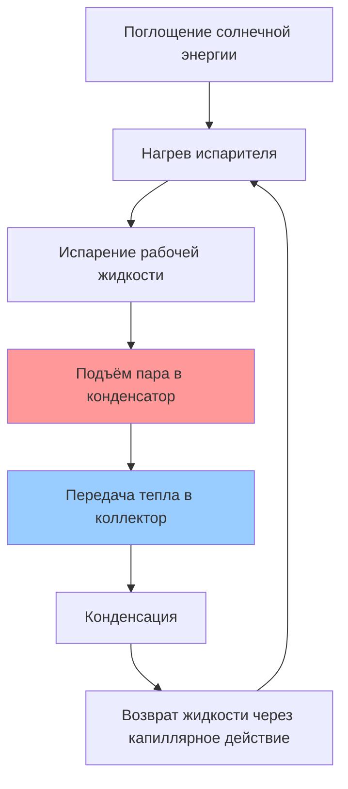

Вакуумные трубчатые коллекторы обеспечивают преимущества производительности по сравнению с плоскими конструкциями благодаря вакуумной изоляции, передовым механизмам теплопередачи и геометрической оптимизации. Технология превосходно работает в холодном климате, облачных условиях и высокотемпературных приложениях.

## Физика вакуумной изоляции

Вакуумная оболочка, окружающая поглотитель, исключает потери тепла проводимостью и конвекцией, оставляя только радиационные потери, описываемые законом Стефана-Больцмана.

### Механизмы теплопотерь

Потеря тепла с поверхности поглотителя выражается следующим образом:

$$Q_{loss} = A \cdot U_L \cdot (T_{absorber} - T_{ambient})$$

где общий коэффициент теплопотерь $U_L$ для вакуумных трубок варьируется от 0,5–1,5 Вт/м²·K в сравнении с 4–8 Вт/м²·K для плоских коллекторов. Вакуумное давление, поддерживаемое на уровне $10^{-5}$ to $10^{-6}$ торр, исключает молекулярные столкновения, которые в противном случае проводили бы тепло.

### Снижение радиационных потерь

Селективные покрытия минимизируют радиационные потери благодаря высокому поглощению ($\alpha = 0,92–0,96$) в солнечном спектре и низкому излучению ($\epsilon = 0,04–0,08$) в области теплового инфракрасного излучения. Чистый радиационный обмен становится:

$$Q_{rad} = A \cdot \sigma \cdot \epsilon \cdot (T_{absorber}^4 - T_{sky}^4)$$

где $\sigma = 5,67 \times 10^{-8}$ Вт/м²·K⁴. Соотношение четвертой степени означает, что радиационные потери доминируют только при температурах, превышающих 150°C.

## Технология тепловых трубок

Тепловые трубки обеспечивают пассивную, однонаправленную теплопередачу с эффективной теплопроводностью в 100–1000 раз выше, чем у сплошной меди.

### Работа тепловой трубки

Цикл тепловой трубки включает фазовое изменение теплопередачи, при котором скрытая теплота обеспечивает основной механизм переноса:

$$Q_{pipe} = \dot{m} \cdot h_{fg}$$

где $h_{fg}$ для типичных рабочих жидкостей (вода, метанол, ацетон) варьируется от 200–2400 кДж/кг. Эта огромная энергетическая плотность позволяет компактный транспорт тепла с минимальным температурным градиентом.

### Защита от замерзания

Тепловые трубки обеспечивают встроенную защиту от замерзания. Когда температура падает ниже точки замерзания рабочей жидкости, трубка становится неактивной, но не повреждается. Работа возобновляется автоматически при прогреве, в отличие от плоских коллекторов, требующих антифриза, который снижает теплоёмкость на 15–20%.

## Производительность в холодном климате

Вакуумные трубки сохраняют эффективность при низких температурах окружающей среды и высоких скоростях ветра благодаря вакуумной изоляции.

### Сравнение производительности

| Условие эксплуатации | Вакуумная трубка η | Плоский коллектор η | Преимущество |
|---------------------|------------------|--------------|-----------|
| Солнечно, -29°C, спокойно | 0,65–0,72 | 0,35–0,45 | +55% |
| Облачно, 0°C, ветер 32 км/ч | 0,45–0,55 | 0,15–0,25 | +80% |
| Солнечно, 20°C, спокойно | 0,70–0,75 | 0,65–0,72 | +8% |

Преимущество эффективности увеличивается по мере роста температурного дифференциала $(T_{collector} - T_{ambient})$.

### Уравнение эффективности

Тестирование SRCC количественно определяет производительность через уравнение эффективности:

$$\eta = F_R(\tau\alpha) - F_R U_L \frac{(T_{in} - T_{ambient})}{I}$$

Для вакуумных трубок коэффициент эффективности перехвата $F_R(\tau\alpha)$ варьируется от 0,65–0,75, в то время как коэффициент теплопотерь $F_R U_L$ остаётся 0,5–1,5 Вт/м²·K. Плоские коллекторы обычно показывают $F_R(\tau\alpha) = 0,70–0,80$, но $F_R U_L = 3,5–5,5$ Вт/м²·K.

## Высокотемпературная производительность

Вакуумная изоляция позволяет достичь температур застоя, превышающих 200°C, поддерживая высокотемпературные приложения.

### Потенциал температуры

Максимальная достижимая температура возникает, когда потеря тепла равна солнечному приращению:

$$I \cdot A \cdot \eta_{optical} = A \cdot \sigma \cdot \epsilon \cdot (T_{max}^4 - T_{ambient}^4)$$

Решение для максимальной температуры:

$$T_{max} = \left(\frac{I \cdot \eta_{optical}}{\sigma \cdot \epsilon} + T_{ambient}^4\right)^{0.25}$$

При инсоляции 1000 Вт/м² с $\eta_{optical} = 0,90$ и $\epsilon = 0,06$ максимальная температура достигает 260°C для вакуумных трубок по сравнению с 140°C для плоских коллекторов.

### Диапазоны температур приложений

| Приложение | Требуемая температура | Тип коллектора |
|-------------|--------------|----------------|
| Горячее водоснабжение | 50–60°C | Подходят оба типа |
| Отопление помещений | 40–80°C | Подходят оба типа |
| Абсорбционное охлаждение | 80–120°C | Вакуумная трубка предпочтительна |
| Технологическое отопление | 100–150°C | Вакуумная трубка необходима |
| Генерация пара | 150–200°C | Только вакуумная трубка |

## Производительность при рассеянном излучении

Цилиндрическая геометрия улавливает рассеянное излучение со всех направлений, улучшая производительность в облачные дни.

### Эффекты угла падения

Вакуумные трубки сохраняют практически постоянную проецируемую площадь для углов падения солнца, варьирующихся на ±30° от перпендикуляра, благодаря их круглому сечению. Модификатор угла падения остаётся:

$$K_{\theta} = 1 - b_0 \left(\frac{1}{\cos\theta} - 1\right)$$

с $b_0 = 0,05–0,10$ для вакуумных трубок в сравнении с $b_0 = 0,10–0,20$ для плоских коллекторов. Это снижает потери производительности в утреннее и вечернее время на 30–40%.

## Модульная замена

При отказе отдельной трубки требуется замена только повреждённого компонента, а не всего массива коллекторов.

### Экономика обслуживания

- Стоимость одной трубки: 2500–6500 руб.
- Время замены: 15–30 минут
- Слив системы не требуется
- Минимальная потеря производительности (1–2% на отказавшую трубку)

По сравнению с ремонтом плоского коллектора, требующим снятия панели, слива жидкости и возможной замены поглотителя стоимостью 40000–160000 руб.

## Сертификация SRCC

Корпорация Solar Rating and Certification Corporation тестирует вакуумные трубчатые коллекторы в соответствии со стандартами OG-100 с использованием методологии ASHRAE 93. Рейтинги указывают:

- Суточный выход энергии (МДж/день) при множественных температурных дифференциалах
- Параметры кривой эффективности, подтверждённые наружным тестированием
- Характеристики температуры застоя и перепада давления
- Надёжность при испытании тепловым ударом и ударной нагрузкой

Системы с более высоким рейтингом демонстрируют $F_R(\tau\alpha) > 0,70$ и $F_R U_L < 1,2$ Вт/м²·K с доказанной производительностью во всех климатических зонах.

## Рассмотрение нагрузок от ветра

Цилиндрический профиль создаёт меньшее аэродинамическое сопротивление, чем плоские панели:

$$F_{wind} = C_d \cdot \frac{1}{2} \rho v^2 \cdot A_{projected}$$

где коэффициент сопротивления $C_d = 0,4–0,6$ для вакуумных трубок в сравнении с $C_d = 1,2–1,5$ для плоских коллекторов. При скорости ветра 161 км/ч силы снижаются на 50–60%, позволяя использовать более лёгкие конструкции крепления.

## Следствия для проектирования системы

Преимущества вакуумных трубок влияют на архитектуру системы:

- **Холодный климат**: Исключить гликолевый антифриз, использовать схемы слива или тепловых трубок
- **Высокотемпературные нагрузки**: Прямая интеграция с абсорбционными холодильниками и технологическим отоплением
- **Облачные регионы**: Более высокий годовой выход энергии, несмотря на более низкий пиковый выход при ясном небе
- **Эстетическая интеграция**: Трубчатая форма обеспечивает архитектурную гибкость
- **Ограниченное пространство**: Более высокая эффективность на единицу площади снижает площадь коллектора на 20–30%

Премиум производительности оправдывает 30–50% более высокие первоначальные затраты в приложениях, требующих работы в холодную погоду, высокие температуры или максимальную энергетическую плотность.
