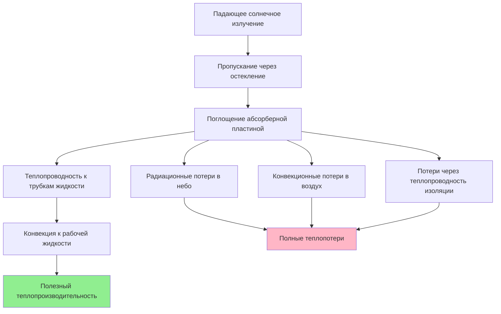

Плоские солнечные коллекторы представляют собой наиболее зарекомендовавшую себя и широко применяемую технологию для жилых и коммерческих систем солнечного нагрева воды. Их зрелая конструкция сочетает доказанные термодинамические принципы с надежными методами производства, обеспечивая стабильную работу в разнообразных климатических зонах при сохранении благоприятных экономических показателей.

## Фундаментальные принципы конструкции

Плоский солнечный коллектор преобразует солнечное излучение в тепловую энергию посредством простого механизма теплопередачи. Абсорберная пластина — обычно изготавливаемая из меди, алюминия или стали — получает падающее солнечное излучение и преобразует его в тепло. Эта тепловая энергия передается рабочей жидкости, циркулирующей через интегрированные или присоединенные трубки.

Энергетический баланс, определяющий производительность коллектора, выражается следующим образом:

$$Q_u = A_c F_R [G_T (\tau\alpha) - U_L(T_{f,i} - T_a)]$$

Где:
- $Q_u$ = полезный теплопроизводительность (Вт)
- $A_c$ = полная площадь коллектора (м²)
- $F_R$ = коэффициент теплоудаления коллектора (безразмерная величина)
- $G_T$ = полная солнечная облученность (Вт/м²)
- $(\tau\alpha)$ = произведение пропускания и поглощения (безразмерная величина)
- $U_L$ = общий коэффициент теплопотерь (Вт/м²·K)
- $T_{f,i}$ = температура жидкости на входе (°C)
- $T_a$ = температура окружающей среды (°C)

Это уравнение выявляет фундаментальное преимущество плоских коллекторов: оптимизированная производительность при умеренной разнице температур $(T_{f,i} - T_a)$, что именно соответствует требованиям горячего водоснабжения.

## Основные преимущества производительности

### Превосходная экономичность

Плоские коллекторы обеспечивают самую низкую стоимость установки на единицу апертурной площади среди технологий солнечной теплоэнергетики. Производственные процессы используют установившиеся методы формовки металла, сварки и остекления без необходимости в специализированном вакуумном оборудовании или экзотических материалах.

Сертифицированные SRCC плоские коллекторы обычно достигают установленной стоимости на 30–50% ниже, чем альтернативы с эвакуированными трубками, при обеспечении сопоставимого годового производства энергии в умеренных климатах. Экономическое преимущество вытекает из упрощенной конструкции и более высоких объемов производства, обеспечивающих экономию на масштабе.

### Надежная механическая долговечность

Жесткая рама из алюминия или стали обеспечивает исключительную конструктивную прочность с минимальным прогибом при снеговых и ветровых нагрузках. Остекление — либо закаленное стекло, либо поликарбонат — намного лучше переносит удары градом и осколками, чем узлы эвакуированных трубок.

Данные полевой надежности систем, сертифицированных SRCC OG-100, показывают, что плоские коллекторы сохраняют производительность 95% и выше спустя 20 лет при надлежащем обслуживании. Монолитная конструкция абсорберной пластины устраняет режимы отказов отдельных трубок, присутствующие в конструкциях с эвакуированными трубками.

### Оптимальная производительность в умеренных климатах

Когда температура окружающей среды превышает 0°C и солнечное излучение остается относительно постоянным, плоские коллекторы достигают пиковой эффективности. Коэффициент теплопотерь $U_L$ (обычно 4–6 Вт/м²·K для качественных устройств) становится менее значимым, когда температурные перепады остаются ниже 40–50 K.

## Компоненты конструкции и материалы

### Конструкция абсорберной пластины

Высокопроизводительные плоские абсорберы используют селективные поверхностные покрытия, которые максимизируют солнечное поглощение $\alpha$ (обычно 0,94–0,96) при минимизации тепловой эмиссии $\varepsilon$ (обычно 0,04–0,10). Это соотношение селективности $\alpha/\varepsilon > 10$ значительно снижает радиационные потери тепла:

$$Q_{rad} = \varepsilon \sigma A (T_p^4 - T_{sky}^4)$$

Где $\sigma$ = постоянная Стефана-Больцмана (5,67×10⁻⁸ Вт/м²·K⁴) и $T_p$ = температура абсорберной пластины.

Общие селективные покрытия включают:
- Черный хром (гальванический)
- Черный никель (гальванический)
- Нитрид титана (PVD)
- Цементитные покрытия (нитрид алюминия в матрице оксида алюминия)

### Варианты остекления и производительность

| Тип остекления | Пропускание солнечной энергии | Тепловые характеристики | Рейтинг долговечности | Коэффициент стоимости |
|----------------|-------------------------------|------------------------|----------------------|----------------------|
| Низкожелезное закаленное стекло | 0,90–0,92 | Отличная | 25+ лет | 1,0× |
| Стандартное закаленное стекло | 0,85–0,87 | Очень хорошая | 25+ лет | 0,8× |
| Двойной поликарбонат | 0,80–0,82 | Хорошая | 10–15 лет | 0,6× |
| Акрил однослойный | 0,88–0,90 | Удовлетворительная | 8–12 лет | 0,5× |

Низкожелезное закаленное стекло обеспечивает оптимальную долгосрочную производительность благодаря превосходному пропусканию и устойчивости к погодным условиям. Толщина 3–4 мм обеспечивает адекватную прочность при минимизации потерь от поглощения.

### Изоляция и корпус

Толщина задней изоляции критически влияет на потери тепла через тыльную поверхность коллектора. Качественные конструкции включают 50–75 мм минеральной ваты, стекловолокна или полиизоцианурата, достигая значений теплового сопротивления R = 2,0–3,5 м²·K/Вт.

Периметровая изоляция предотвращает тепловые мосты через раму и герметизирует края. Корпус должен выдерживать тепловое расширение, сохраняя герметичность при колебаниях температур от –40°C до +150°C.

## Преимущества установки и обслуживания

### Упрощенные требования к монтажу

Плоская прямоугольная форма легко интегрируется со стандартными профилями крыши. Монтажное оборудование крепится через обычные болты или конструкционные винты без специальных отверстий. Распределенная нагрузка (обычно 25–35 кг/м²) подходит для большинства жилых крыш без усиления.

### Сниженные требования к обслуживанию

Герметичная конструкция корпуса защищает внутренние компоненты от проникновения влаги и скопления осадков. В отличие от эвакуированных трубок, требующих целостности каждого уплотнения, плоские коллекторы требуют только периодического осмотра и очистки остекления.

Рекомендации SRCC включают:
- Очистку остекления: ежегодно или раз в полугодие
- Проверку системы жидкости: через 3–5 лет
- Испытание давлением: через 5 лет
- Проверку селективного покрытия: визуальный осмотр при очистке

### Совместимость интеграции системы

Плоские коллекторы непосредственно интегрируются со стандартными гидравлическими компонентами, включая насосы, теплообменники, расширительные баки и контроллеры. Большие объемы жидкости (обычно 1–2 литра на коллектор) лучше переносят более высокие уровни частиц и более устойчивы к замерзанию, чем конструкции с малодиаметровыми трубками.

## Сравнение производительности в стандартных условиях

Тестирование SRCC OG-100 устанавливает метрики производительности в контролируемых условиях. Репрезентативные сертифицированные плоские коллекторы демонстрируют:

| Параметр | Типичный диапазон | Единицы |
|----------|-------------------|---------|
| Пиковая эффективность $\eta_0$ | 0,72–0,78 | Безразмерная величина |
| Коэффициент теплопотерь $a_1$ | 3,5–5,5 | Вт/м²·K |
| Температурная зависимость $a_2$ | 0,010–0,018 | Вт/м²·K² |
| Модификатор угла падения 50° | 0,92–0,96 | Безразмерная величина |
| Температура застоя | 160–190 | °C |

Кривая эффективности следует:

$$\eta = \eta_0 - a_1 \frac{(T_m - T_a)}{G_T} - a_2 \frac{(T_m - T_a)^2}{G_T}$$

Где $T_m$ = средняя температура жидкости и второй член $a_2$ учитывает зависящие от температуры потери тепла при повышенных температурах.

## Экономические и экологические преимущества

Анализ стоимости жизненного цикла последовательно отдает предпочтение плоским коллекторам для приложений горячего водоснабжения в климатических зонах с умеренными зимними температурами (климатические зоны ASHRAE 3–5). Комбинация более низких капитальных затрат, минимальных требований к обслуживанию и срока службы 20–25 лет обеспечивает период окупаемости 6–12 лет по сравнению с традиционным электрическим или газовым нагревом воды.

Воплощенная энергия в производстве плоских коллекторов — в основном экструзия алюминия и производство стекла — возвращается через вытесненное потребление ископаемого топлива в течение 1–3 лет работы, обеспечивая благоприятное соотношение энергетической окупаемости выше 10:1 в течение срока службы системы.

## Рекомендации по применению

Плоские коллекторы обеспечивают оптимальную производительность для:
- Жилых систем горячего водоснабжения (ГВС)
- Коммерческого предварительного нагрева ГВС
- Приложений нагрева бассейнов
- Систем отопления помещений с умеренными температурами подачи (<60°C)
- Солнечных комбисистем в мягких и умеренных климатах

Критерии выбора, отдающие предпочтение технологии плоских коллекторов, включают температуру окружающей среды зимой >–15°C, достаточную площадь монтажа на крыше и приоритизацию долговечности системы и низких требований к обслуживанию перед максимальной эффективностью.

Сертификация SRCC обеспечивает проверку производительности и испытания на долговечность в соответствии со стандартами OG-100, предоставляя проектировщикам надежные сравнительные данные для проектирования и выбора системы.
