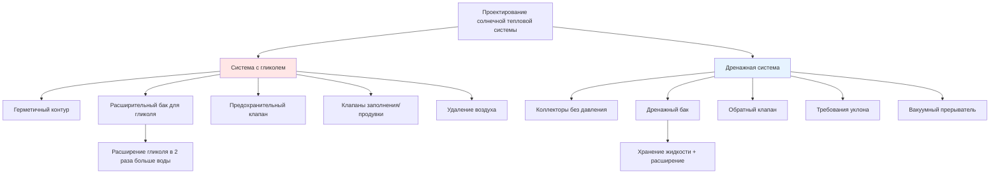

Системы солнечного водяного отопления, работающие в климате с морозами, требуют надежной защиты от замерзания. Два основных подхода — герметичные системы с гликолем и дренажные системы — представляют фундаментально различные инженерные философии с отличающимися характеристиками производительности, требованиями к обслуживанию и режимами отказа.

## Механизмы защиты от замерзания

### Системы с гликолем: химическое снижение точки замерзания

Системы на основе гликоля используют пропиленгликоль (предпочтительный для питьевых применений) или этиленгликоль, смешанные с водой для снижения точки замерзания теплоносителя. Депрессия точки замерзания следует коллигативным свойствам, где молекулы гликоля нарушают образование кристаллов льда.

Точка замерзания растворов гликоль-вода зависит от концентрации нелинейно:

$$T_f = T_{water} - K_f \cdot m \cdot i$$

где $T_f$ — точка замерзания, $K_f$ — криоскопическая постоянная, $m$ — моляльность, $i$ — коэффициент Вант-Гоффа. Для практических применений производители предоставляют кривые точки замерзания, показывающие, что 50% пропиленгликоль защищает примерно до -32°C.

Система работает постоянно под давлением, поддерживая жидкость в коллекторах независимо от условий эксплуатации.

### Дренажные системы: гравитационное удаление жидкости

Дренажные системы исключают риск замерзания путем физического удаления жидкости из открытых компонентов при остановке циркуляционного насоса. Когда дифференциальный контроллер отключает насос, гравитация отводит всю жидкость из коллекторов и открытых труб в защищенный дренажный бак, расположенный в отапливаемом пространстве.

Процесс дренажа требует:

1. Правильного уклона (минимум 2% уклон) во всех горизонтальных участках
2. Отсутствия ловушек или низких мест, которые могут удерживать жидкость
3. Пути входа воздуха для предотвращения образования сифона
4. Достаточного объема дренажного бака для всей отводимой жидкости плюс резерв расширения

Дренажные системы работают без давления в выключенном состоянии, с воздухом, занимающим коллекторы.

## Анализ производительности теплопередачи

### Влияние теплопроводности и удельной теплоемкости

Добавление гликоля значительно влияет на свойства теплопередачи. Теплопроводность растворов пропиленгликоля снижается с концентрацией:

| Концентрация | Теплопроводность | Удельная теплоемкость | Плотность |
|---------------|---------------------|---------------|---------|
| 0% (вода) | 0.627 Вт/(м·К) | 4.18 кДж/(кг·К) | 998 кг/м³ |
| 30% гликоль | 0.564 Вт/(м·К) | 3.98 кДж/(кг·К) | 1027 кг/м³ |
| 50% гликоль | 0.491 Вт/(м·К) | 3.68 кДж/(кг·К) | 1044 кг/м³ |

Скорость теплопередачи через абсорбер коллектора к жидкости следует:

$$Q = \frac{UA\Delta T_{lm}}{1 + \frac{UA}{mc_p}}$$

Снниженная удельная теплоемкость ($c_p$) растворов гликоля требует более высоких скоростей потока для передачи эквивалентной энергии, увеличивая требуемую мощность насоса на 15-25% для 50% растворов гликоля.

### Коэффициенты конвективной теплопередачи

Коэффициент конвективной теплопередачи в подъемных трубках коллектора зависит от свойств жидкости:

$$h = \frac{k \cdot Nu}{D}$$

где число Нуссельта $Nu$ связывает числа Рейнольдса и Прандтля. Растворы гликоля показывают более высокую вязкость (примерно в 3 раза выше при 50% концентрации), снижающую число Рейнольдса и производительность конвекции на 8-12% по сравнению с водой.

Дренажные системы, использующие воду, достигают превосходных коэффициентов конвективной теплопередачи, но должны преодолеть тепловую инертность переполнения холодных коллекторов при запуске.

## Сравнение сложности системы

### Компоненты системы с гликолем

**Расчет расширительного бака:** Гликоль проявляет большее тепловое расширение, чем вода. Коэффициент объемного расширения 50% пропиленгликоля составляет примерно 0.00099 на °C по сравнению с 0.000216 для воды при 37.8°C. Требуемый объем расширительного бака:

$$V_{exp} = \frac{V_s \cdot \beta \cdot \Delta T}{1 - \frac{P_i}{P_f}}$$

где $V_s$ — объем системы, $\beta$ — коэффициент расширения, $\Delta T$ — повышение температуры, $P_i$ — начальное давление, $P_f$ — конечное давление.

**Предохранительный клапан:** Системы требуют предохранительные клапаны 207 кПа согласно стандартам SRCC, защищающие от температур стагнации, превышающих 204°C в высокопроизводительных вакуумных трубчатых коллекторах.

### Требования дренажной системы

**Расчет объема дренажного бака:** Бак должен вмещать:

$$V_{tank} = V_{collectors} + V_{piping} + V_{expansion} + V_{reserve}$$

Типичный минимальный резерв составляет 10% отводимого объема. Для системы с 7.6 л в коллекторах и 3.8 л в трубопроводах подачи/возврата, минимальный объем бака составляет 12.5 л.

**Расчет насоса:** Насосы должны преодолеть статический напор для поднятия жидкости в коллекторы плюс потери на трение. Требуемый напор:

$$H_{total} = H_{static} + H_{friction} + H_{HX}$$

где $H_{static}$ равен вертикальному расстоянию от дренажного бака до самой высокой точки коллектора. Это накладывает практическое ограничение примерно 7.6-9.1 м для жилых систем, использующих стандартные циркуляционные насосы.

## Требования к обслуживанию

| Аспект | Система с гликолем | Дренажная система |
|--------|---------------|------------------|
| Замена жидкости | Каждые 3-5 лет | Не требуется |
| Мониторинг pH | Требуется ежегодно | Не требуется |
| Проверка защиты от замерзания | Тестирование рефрактометром | Визуальная проверка уклонов |
| Сложность системы | Выше количество компонентов | Более простой контур |
| Последствия утечек | Загрязнение гликолем | Только повреждение водой |
| Обработка стагнации | Деградация выше 148°C | Деградация жидкости отсутствует |
| Удаление воздуха | Критично для производительности | Воздух естественно присутствует |

### Механизмы деградации гликоля

Гликоль деградирует через термические и окислительные пути. Температуры стагнации выше 148°C ускоряют разложение, производя органические кислоты, которые снижают pH и способствуют коррозии. Скорость деградации следует кинетике Аррениуса:

$$k = A \cdot e^{-\frac{E_a}{RT}}$$

где повышенные температуры экспоненциально увеличивают константу скорости деградации $k$. Ежегодное тестирование pH (целевое значение pH 8.5-10.5) и визуальная проверка на обесцвечивание указывают деградацию, требующую замены жидкости.

### Долговечность дренажной системы

Водяные дренажные системы избегают химической деградации, но требуют внимания к:

- **Воздушному блокированию:** Неправильное размещение труб или уклон могут задерживать воздушные карманы, препятствующие полному заполнению
- **Отложению минералов:** Жесткая вода может откладывать накипь в теплообменниках; смягчение воды или использование дистиллированной воды предотвращает это
- **Износу насоса:** Повторяющиеся циклы запуска-остановки и более высокие требования напора могут снизить срок службы насоса по сравнению с системами гликоля

## Критерии выбора

**Выбирайте системы с гликолем когда:**

- Уклон крыши препятствует адекватному уклону дренажа
- Множественные перепады высот создают потенциальные ловушки
- Опыт установщика с дренажными системами ограничен
- Интеграция системы в существующие герметичные контуры

**Выбирайте дренажные системы когда:**

- Расположение коллектора позволяет прямые трубопроводы с постоянным уклоном
- Минимизация долгосрочных затрат на обслуживание является приоритетом
- Требуется максимальная эффективность теплопередачи
- Предпочтение избегать химических добавок

Оба подхода обеспечивают надежную защиту от замерзания при надлежащем проектировании и установке согласно Стандарту SRCC 100 и местным кодексам водопровода. Выбор включает балансировку начальной стоимости, требований к обслуживанию и ограничений установки, специфичных для площадки.
