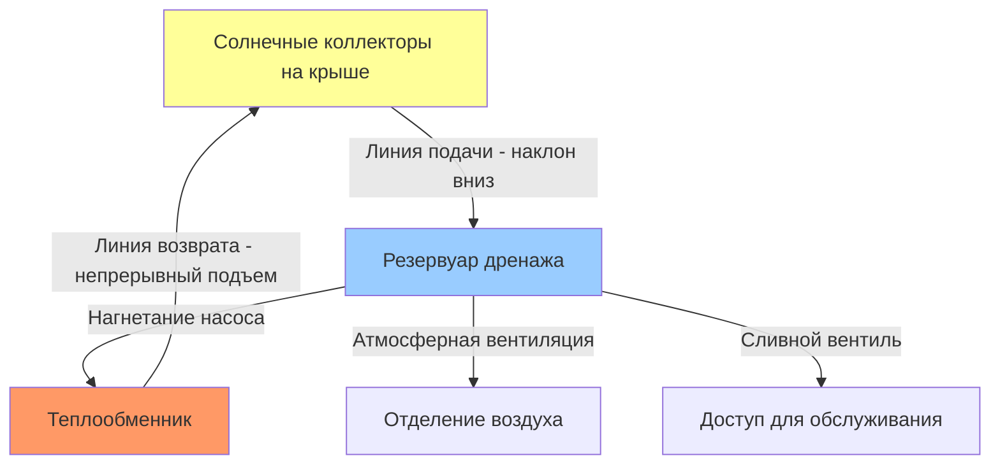
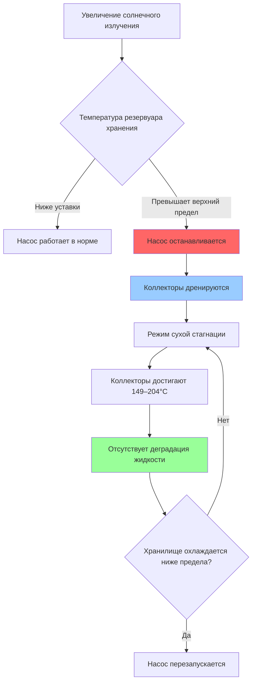

Системы солнечного водоснабжения с дренажем представляют элегантный и простой подход к защите от замерзания и перегрева посредством гравитационного дренажа. При остановке циркуляционного насоса жидкость полностью стекает из коллекторов и открытых трубопроводов в защищенный резервуар, устраняя необходимость в антифризных растворах.

## Принцип работы

Система с дренажем опирается на фундаментальную физику гравитации. Во время работы насос поднимает воду из резервуара дренажа через коллекторы и обратно в хранилище. Когда условия становятся неблагоприятными (температуры ниже точки замерзания, чрезмерное тепло или потеря питания), насос останавливается и гравитация возвращает всю жидкость в защищенный резервуар.

### Физика гравитационного дренажа

Полный дренаж зависит от преодоления поверхностного натяжения и установления непрерывного пути дренажа. Скорость дренажа следует физике свободного падения с учетом трения в трубе:

$$v_{drain} = \sqrt{2gh - f\frac{L}{D}\frac{v^2}{2}}$$

Где:
- $v_{drain}$ = скорость дренажа (м/с)
- $g$ = ускорение свободного падения (9,81 м/с²)
- $h$ = вертикальный перепад (м)
- $f$ = коэффициент трения Дарси (безразмерный)
- $L$ = длина трубы (м)
- $D$ = диаметр трубы (м)

Время дренажа должно быть достаточно коротким, чтобы предотвратить замерзание при холодной стагнации:

$$t_{drain} = \frac{V_{sys}}{Q_{drain}} = \frac{V_{sys}}{A_{pipe} \cdot v_{drain}}$$

Где $V_{sys}$ — полный объем жидкости в системе, а $A_{pipe}$ — площадь поперечного сечения трубы.

## Конструкция резервуара дренажа

Резервуар дренажа выполняет несколько критических функций: хранение жидкости во время дренажа, отделение воздуха во время работы и компенсация теплового расширения.

### Требования к определению размеров резервуара

Минимальный объем резервуара должен вмещать всю жидкость из коллекторов, трубопроводов и теплообменника:

$$V_{tank,min} = V_{collectors} + V_{piping} + V_{HX} + V_{expansion}$$

Стандарты SRCC рекомендуют добавлять 25–30 % коэффициента безопасности для обеспечения полного дренажа и теплового расширения. Типичная жилая система требует:

| Компонент | Диапазон объема |
|-----------|-------------|
| Плоские коллекторы (на панель) | 3,0–4,5 л |
| Коллекторы с вакуумными трубками (на панель) | 1,1–1,9 л |
| Трубопровод (на 30 м медной трубы диаметром 19 мм) | 8,7 л |
| Теплообменник | 1,9–7,6 л |
| Коэффициент расширения | 20–30 % от общего объема |

### Расположение и конфигурация резервуара

Резервуар дренажа должен быть расположен ниже самой низкой точки коллектора с достаточным зазором для отделения воздуха. Резервуар работает при атмосферном давлении, что упрощает конструкцию, но требует тщательной вентиляции:

## Требования к уклону трубопровода

Правильный уклон трубопровода критически важен для надежной работы системы дренажа. Недостаточный уклон создает карманы жидкости, которые препятствуют полному дренажу.

### Стандарты минимального уклона

Весь трубопровод от выхода коллектора к резервуару дренажа должен поддерживать непрерывный наклон вниз:

- **Минимальный уклон**: 0,64 см на метр (2 % уклона)
- **Рекомендуемый уклон**: 1,27 см на метр (4 % уклона)
- **Без горизонтальных участков**: Даже небольшие впадины создают препятствия для дренажа

Линия возврата от теплообменника к коллекторам должна иметь непрерывный наклон вверх, чтобы предотвратить образование воздушных карманов во время работы насоса. Это создает естественную конфигурацию "перевернутого U" с резервуаром дренажа внизу.

### Особенности выбора материала трубопровода

Системы дренажа испытывают чередующиеся циклы влажности-сухости и должны выдерживать границы раздела воздух/вода:

| Материал | Пригодность | Примечания |
|-----------|-------------|-------|
| Медь (тип L/M) | Отличная | Стандартный выбор, рассчитан на поток жидкости и дренаж |
| Нержавеющая сталь | Отличная | Коррозионностойкая, более высокая стоимость |
| CPVC | Низкая | Не рассчитана на температуры солнечных систем |
| PEX | Условная | Только в защищенных участках ниже 82°C |

Диаметр трубы должен быть достаточным как для циркулирующего потока, так и для дренажа. Трубы меньшего диаметра ограничивают скорость дренажа и могут задерживать жидкость:

$$D_{min} = \sqrt{\frac{4Q}{\pi v_{max}}}$$

Для потоков дренажа $v_{max}$ не должна превышать 2,4 м/с, чтобы предотвратить шум и эрозию.

## Механизм защиты от замерзания

Система дренажа обеспечивает встроенную защиту от замерзания путем полного удаления жидкости из открытых компонентов.

### Инициирование дренажа

Дифференциальный регулятор останавливает насос, когда:

$$T_{collector} - T_{storage} < \Delta T_{off}$$

Где $\Delta T_{off}$ обычно равняется 1,7–2,8°C. При условиях замерзания контроллер полностью предотвращает работу насоса, когда температура коллектора падает ниже порога замерзания (обычно 4,4°C).

### Критические точки защиты от замерзания

1. **Полный дренаж коллектора**: Отсутствие остатков жидкости в абсорбирующих трубках
2. **Дренаж открытого трубопровода**: Все наружные трубопроводы должны стекать в резервуар
3. **Позиционирование вентилей**: Все вентили должны позволять свободный путь дренажа
4. **Вход воздуха**: Достаточная вентиляция для разрыва вакуума и включения дренажа

Порог повреждения от замерзания наступает, когда оставшийся объем воды превышает примерно 10 % и температуры падают ниже −4°C в течение длительных периодов.

## Защита от перегрева

Системы дренажа обеспечивают превосходное управление температурой стагнации по сравнению с напорными системами с гликолем.

### Пределы температуры стагнации

Во время стагнации (насос выключен, отсутствует отвод тепла) температуры коллектора растут согласно:

$$T_{stag} = T_{ambient} + \frac{\alpha \tau I}{U_L}$$

Где:
- $\alpha$ = поглощаемость абсорбера (обычно 0,95)
- $\tau$ = коэффициент пропускания остекления (обычно 0,90)
- $I$ = солнечное излучение (кДж/ч·м²)
- $U_L$ = коэффициент потерь тепла (кДж/ч·м²·°C)

Температуры сухой стагнации достигают 149–204°C в плоских коллекторах и 260–316°C в вакуумных трубках. Резервуар дренажа остается при умеренной температуре (49–71°C), поскольку жидкость не циркулирует.

### Функции защиты от перегрева

Отсутствие жидкости во время стагнации предотвращает:
- Деградацию и окисление гликоля
- Чрезмерное повышение давления
- Испарение жидкости
- Тепловой стресс теплообменника

## Определение размеров и выбор насоса

Насосы дренажа должны преодолевать статический напор плюс трение системы при запуске и поддерживать адекватный поток во время работы.

### Требования к напору насоса

Общий напор насоса включает:

$$H_{total} = H_{static} + H_{friction} + H_{fill}$$

Где:
- $H_{static}$ = вертикальный подъем от резервуара к верхней части коллектора (м)
- $H_{friction}$ = потери трения в трубах при расчетном потоке (м)
- $H_{fill}$ = дополнительный напор для заполнения полости коллектора (обычно 1,5–2,4 м)

Требование к напору заполнения уникально для систем дренажа. При запуске насос должен протолкнуть воду в высушенные коллекторы, вытесняя воздух вниз через линию возврата. Это создает временное сопротивление до полного заполнения коллекторов.

### Определение расхода

Расчетный расход следует рекомендациям SRCC:

$$\dot{m} = 0,015 \times A_{collector} \text{ до } 0,025 \times A_{collector}$$

В л/ч на квадратный метр площади коллектора. Более низкие расходы (0,015 л/ч·м²) обеспечивают больший рост температуры, но рискуют неполным смачиванием коллектора. Более высокие расходы (0,025 л/ч·м²) обеспечивают полное смачивание, но снижают температурный дифференциал.

## Оптимизация производительности системы

Системы дренажа достигают оптимальной производительности благодаря тщательному вниманию к гидравлической конструкции и стратегиям управления.

### Регулирование скорости насоса

Насосы с переменной скоростью оптимизируют сбор энергии путем модуляции потока на основе:

$$\dot{Q}_{useful} = \dot{m} c_p (T_{out} - T_{in}) - P_{pump}$$

Оптимальный расход максимизирует полезное энергопередачу с учетом паразитного потребления насоса. При высокой интенсивности излучения увеличенный поток захватывает больше энергии. При граничных условиях сниженный поток минимизирует штрафы на насос.

### Управление воздухом

Правильное управление воздухом критично для надежной работы. Система должна:

1. **Позволить воздуху выйти при заполнении**: Автоматические воздушные вентили в верхних точках
2. **Предотвратить захват воздуха**: Достаточное разделение в резервуаре дренажа
3. **Отделить воздух во время работы**: Конструкция резервуара способствует отделению воздуха от воды
4. **Включить дренажный поток воздуха**: Размер вентиля для замещения воздуха при дренаже

Пропускная способность воздушного вентиля должна вмещать поток заполнения плюс возвратный поток воздуха при дренаже:

$$Q_{air,vent} = Q_{fill} + Q_{drain,air}$$

## Преимущества над системами с гликолем

Системы дренажа предлагают несколько преимуществ в эксплуатации:

| Особенность | Дренаж | Гликоль |
|---------|-----------|--------|
| Защита от замерзания | Автоматическая, постоянная | Требует обслуживания гликоля |
| Защита от перегрева | Встроенная | Требует предохранительного клапана |
| Теплоноситель | Чистая вода (оптимальная) | Гликоль (сниженная производительность) |
| Обслуживание | Минимальное | Требуется ежегодное тестирование гликоля |
| Толерантность к стагнации | Отличная | Риск деградации гликоля |
| Давление в системе | Атмосферное в резервуаре | Напорный по всей системе |

### Преимущество эффективности

Вода обеспечивает превосходную теплопередачу по сравнению с растворами гликоля:

$$\frac{Q_{water}}{Q_{glycol}} = \frac{(c_p)_{water}}{(c_p)_{glycol}} \approx 1,15$$

Это улучшение на 15 % теплоемкости непосредственно переводится в более высокую эффективность системы при эквивалентных расходах.

## Рекомендации по установке

Успешная установка системы дренажа требует внимания к нескольким критическим деталям:

1. **Проверить непрерывный уклон**: Использовать уровни и индикаторы уклона по всей системе
2. **Минимизировать длину трубопровода**: Более короткие трассы снижают объем заполнения и время дренажа
3. **Исключить провисание**: Любая низкая точка создает потенциальный карман
4. **Надлежащая вентиляция резервуара**: Атмосферный вентиль предотвращает образование вакуума
5. **Надлежащий выбор размеров насоса**: Должен преодолевать подъем плюс сопротивление заполнению
6. **Размещение воздушного вентиля**: Стратегическое расположение в верхних точках системы

Сертифицированные SRCC системы дренажа предоставляют проверенные данные о производительности и рекомендации по установке, подтвержденные лабораторными и полевыми испытаниями. Сертификация OG-100 подтверждает рейтинги тепловой производительности, а сертификация OG-300 подтверждает полный дизайн системы, включая функциональность дренажа.

## Заключение

Системы солнечного водоснабжения с дренажем обеспечивают надежную работу с низким уровнем обслуживания благодаря элегантному применению физики гравитации. Правильное проектирование обеспечивает полный дренаж для защиты от замерзания, тогда как использование чистой воды максимизирует эффективность теплопередачи. Встроенная защита системы от перегрева и работа при атмосферном давлении способствуют длительному сроку службы с минимальными требованиями к обслуживанию.
