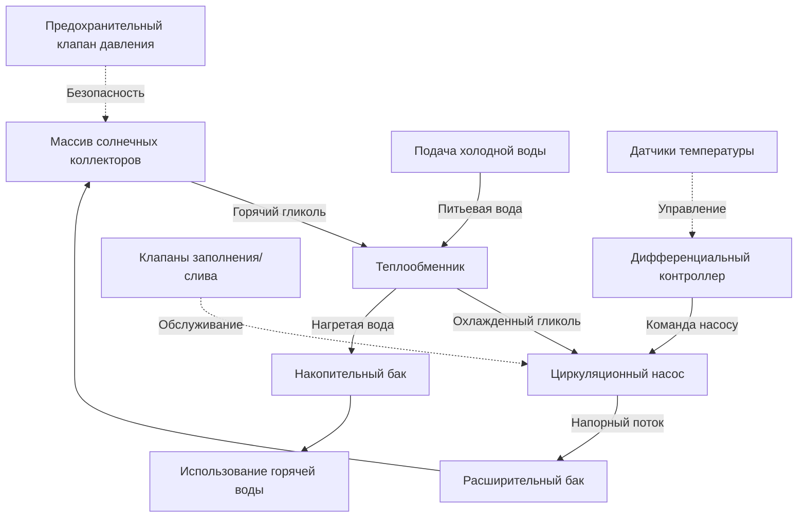

Солнечные системы водяного отопления на основе гликоля используют растворы антифриза для защиты от замерзания в климатических зонах, где температура окружающей среды падает ниже 0°C. Эти замкнутые, находящиеся под давлением системы циркулируют смеси пропиленгликоля через массив солнечных коллекторов, передавая тепловую энергию питьевой воде через теплообменник. Понимание термофизических свойств, поведения системы и требований к техническому обслуживанию необходимо для надежной работы.

## Свойства пропиленгликоля и выбор

### Депрессия точки замерзания

Растворы гликоля снижают точку замерзания через коллигативные свойства, при которых растворенные молекулы нарушают образование кристаллов льда. Связь между концентрацией гликоля и защитой от замерзания следует:

$$\Delta T_f = K_f \cdot m$$

Где $\Delta T_f$ — депрессия точки замерзания (°C), $K_f$ — криоскопическая постоянная для воды (1,86 °C·кг/моль), $m$ — моляльность раствора.

Для практического применения концентрация пропиленгликоля определяет уровни защиты от замерзания:

| Концентрация гликоля | Точка замерзания | Защита при разрыве | Применение |
|---------------------|------------------|-------------------|-------------|
| 30% по объему | −12°C | −29°C | Мягкий климат |
| 40% по объему | −23°C | −40°C | Умеренный климат |
| 50% по объему | −32°C | −51°C | Холодный климат |
| 60% по объему | −46°C | −59°C | Экстремальный холод |

ASHRAE 90.1 рекомендует проектирование по температуре зимнего дизайна 99,6% с коэффициентом безопасности 5,6°C.

### Изменения термофизических свойств

Добавление гликоля значительно изменяет свойства жидкости, прямо влияя на производительность системы:

**Снижение удельной теплоемкости:**

Удельная теплоемкость смеси следует соотношению, взвешенному по массе:

$$c_{p,mix} = x_{glycol} \cdot c_{p,glycol} + (1 - x_{glycol}) \cdot c_{p,water}$$

При концентрации 50% и 49°C:
- Чистая вода: $c_p = 1,0$ Btu/lb·°F (4,19 кДж/кг·K)
- 50% гликоль: $c_p = 0,90$ Btu/lb·°F (3,77 кДж/кг·K)

Это 10%-ное снижение теплоемкости требует пропорционально более высоких расходов для передачи эквивалентной тепловой энергии:

$$\dot{m}_{glycol} = \dot{m}_{water} \cdot \frac{c_{p,water}}{c_{p,glycol}}$$

**Увеличение вязкости:**

Динамическая вязкость экспоненциально возрастает с концентрацией гликоля, прямо влияя на мощность насоса:

$$\eta_{mix} = \eta_{water} \cdot e^{(a \cdot x_{glycol} + b \cdot x_{glycol}^2)}$$

При 38°C 50%-ный пропиленгликоль имеет вязкость примерно в 3,5 раза выше, чем вода, увеличивая потерю давления и энергию насоса.

**Деградация теплопроводности:**

Растворы гликоля имеют более низкую теплопроводность, чем вода:

$$k_{mix} \approx k_{water} \cdot (1 - 0,25 \cdot x_{glycol})$$

Это снижает эффективность теплопередачи как в коллекторах, так и в теплообменниках.

## Архитектура системы и компоненты

### Критические компоненты

**Требования теплообменника:**

Теплообменник вводит тепловое сопротивление между жидкостью коллектора и питьевой водой, снижая общую эффективность:

$$\eta_{system} = \eta_{collector} \cdot \epsilon_{HX}$$

Где $\epsilon_{HX}$ — эффективность теплообменника, обычно 0,80–0,90 для правильно подобранных устройств.

Эффективность теплообменника следует:

$$\epsilon_{HX} = \frac{Q_{actual}}{Q_{maximum}} = \frac{C_{min}(T_{h,in} - T_{c,out})}{C_{min}(T_{h,in} - T_{c,in})}$$

Для противоточных теплообменников с равными тепловыми мощностями эффективность зависит от NTU (числа единиц переноса):

$$\epsilon = \frac{1 - e^{-NTU(1-C_r)}}{1 - C_r \cdot e^{-NTU(1-C_r)}}$$

**Расчет расширительного бака:**

Растворы гликоля расширяются больше, чем вода при изменении температуры. Расширительный бак должен вмещать объемные изменения:

$$V_{expansion} = V_{system} \cdot (\beta_{glycol} \cdot \Delta T)$$

Где $\beta_{glycol}$ — коэффициент объемного расширения (примерно 0,00108/K для 50% гликоля, в сравнении с 0,00036/K для воды).

Для системы объемом 113 л с изменением температуры 55°C:
- Расширение воды: $113 \times 0,00036 \times 55 = 2,24$ л
- 50% гликоль: $113 \times 0,00108 \times 55 = 6,73$ л

Расширительный бак должен быть рассчитан на 3 расчетного расширения:

$$V_{tank} = 3 \cdot V_{expansion} \cdot \frac{P_{max}}{P_{max} - P_{min}}$$

## Механизмы деградации гликоля

### Тепловой распад

Высокие температуры застоя в коллекторах (121–204°C) вызывают деградацию гликоля через окисление и термическое разложение:

$$\text{Пропиленгликоль} + O_2 \xrightarrow{\Delta T} \text{Органические кислоты} + \text{Альдегиды} + \text{CO}_2$$

Продукты деградации снижают pH, становясь коррозийными для компонентов системы. Скорость деградации следует поведению Аррениуса:

$$k_{degradation} = A \cdot e^{-E_a/(R \cdot T)}$$

Где деградация экспоненциально ускоряется с температурой. Каждое увеличение на 10°C примерно удваивает скорость деградации.

### Мониторинг pH и тестирование

Свежий пропиленгликоль поддерживает pH 10–11 с ингибиторами коррозии. По мере деградации:

1. Образуются органические кислоты, снижая pH ниже 8,5
2. Ингибиторы коррозии истощаются
3. Коррозия металлов ускоряется

**Протокол тестирования (Guideline ASHRAE 3):**

- Ежегодное тестирование pH
- Замена жидкости при pH ниже 8,5
- Тестирование защиты от замерзания рефрактометром
- Визуальная проверка изменения цвета (коричневый указывает на деградацию)

### Требования к техническому обслуживанию

**Ежегодное обслуживание:**

- Измерение давления в системе (поддерживать 103–207 кПа в холодном состоянии)
- Тестирование концентрации гликоля и защиты от замерзания
- Тестирование pH откалиброванным измерителем
- Проверка утечек в фитингах и уплотнениях клапанов
- Проверка работы насоса и расхода

**Критерии замены жидкости:**

Заменить раствор гликоля, когда:
- pH < 8,5
- Защита от замерзания превышает расчетную температуру более чем на 5,6°C
- Жидкость становится темно-коричневой или черной
- Эффективность системы падает более чем на 15% от исходного уровня

**Ожидаемый срок службы:**

- Системы без застоя: 5–7 лет
- Системы с периодическим застоем: 3–5 лет
- Частый застой (>10 дней/год): 2–3 года

## Анализ влияния на производительность

Штраф по эффективности от систем с гликолем в сравнении с прямой циркуляцией воды включает:

**Снижение теплопередачи:**

$$Q_{glycol} = Q_{water} \cdot \left(\frac{c_{p,glycol}}{c_{p,water}}\right) \cdot \epsilon_{HX}$$

Для 50% гликоля с эффективностью теплообменника 85%:

$$Q_{glycol} = Q_{water} \cdot 0,90 \cdot 0,85 = 0,765 \cdot Q_{water}$$

Это представляет примерно 23,5%-ное снижение полезной доставки энергии в сравнении с прямыми водяными системами.

**Увеличение энергии насоса:**

Более высокая вязкость увеличивает потерю давления через трубопроводы и коллекторы:

$$\Delta P_{glycol} = \Delta P_{water} \cdot \left(\frac{\eta_{glycol}}{\eta_{water}}\right)$$

При типичных рабочих температурах мощность насоса увеличивается на 150–200%.

## Пригодность климата и рассмотрения проектирования

Системы с гликолем остаются предпочтительным выбором для:

- Климатических зон с температурой ниже нуля (ниже 0°C)
- Мест, где уклон трубопровода для слива не может быть обеспечен
- Коллекторов, установленных на крыше, со сложной прокладкой трубопровода
- Систем, требующих работы под высоким давлением
- Приложений, где качество питьевой воды должно быть изолировано

**Выбор расчетной температуры:**

Выберите концентрацию гликоля для расчетной температуры сухого термометра зимнего дизайна 99,6% с коэффициентом запаса 5,6°C. Для Чикаго (99,6% = −21°C):

$$T_{design} = -21°C - 5,6°C = -26,6°C$$

Это требует минимум 40% концентрации гликоля (точка замерзания −23°C, защита при разрыве −40°C).

## Операционные преимущества и ограничения

**Преимущества:**

- Надежная защита от замерзания независимо от питания
- Работа под давлением обеспечивает гибкие конфигурации трубопровода
- Минимальные требования к уклону трубопровода
- Подходит для всех типов коллекторов и ориентаций
- Хорошо зарекомендовавшая себя технология с доказанной надежностью

**Ограничения:**

- Снижение тепловой эффективности из-за теплообменника
- Требуется регулярное обслуживание для качества жидкости
- Периодические расходы на замену жидкости
- Повышенное потребление энергии насосом
- Возможность утечек с характерным запахом антифриза
- Экологические соображения при утилизации израсходованной жидкости

Понимание этих технических факторов обеспечивает надлежащий выбор системы, проектирование и обслуживание для долгосрочной надежной работы в климатических зонах с риском замерзания.
