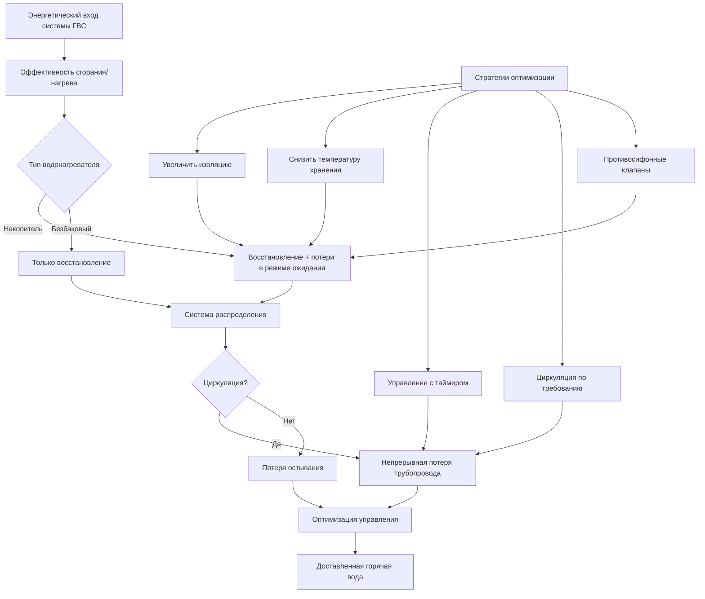

Эффективность системы горячего водоснабжения (ГВС) зависит от нескольких механизмов потерь энергии, которые происходят от подачи топлива до окончательной доставки. Понимание физики теплопередачи, механики жидкостей и термодинамических циклов позволяет систематически оптимизировать общую эффективность системы.

## Общая эффективность системы

Общая эффективность системы $\eta_{system}$ представляет собой отношение полезной энергии, поданной потребителю, к общей затраченной энергии:

$$\eta_{system} = \frac{Q_{delivered}}{Q_{input}} = \eta_{combustion} \times \eta_{recovery} \times \eta_{standby} \times \eta_{distribution}$$

Каждый компонент эффективности перемножается для получения общей производительности, что делает даже небольшие улучшения в отдельных факторах значительными для общего энергопотребления.

### Метод энергетического баланса

Первый закон термодинамики, применённый к контрольному объёму водонагревателя:

$$Q_{input} = Q_{useful} + Q_{standby} + Q_{flue} + Q_{pilot}$$

Где:
- $Q_{input}$ = энергия входного топлива (кДж/ч или кВт)
- $Q_{useful}$ = энергия, передаваемая воде, $\dot{m}c_p\Delta T$
- $Q_{standby}$ = потери корпуса и трубопроводов в период простоя
- $Q_{flue}$ = потери энергии продуктов сгорания
- $Q_{pilot}$ = расход непрерывного запального пламени (газовые агрегаты)

## Эффективность восстановления

Эффективность восстановления $\eta_r$ измеряет, насколько эффективно входная энергия нагревает воду во время активного горения:

$$\eta_r = \frac{\dot{m}c_p(T_{out} - T_{in})}{Q_{firing}} \times 100\%$$

Для газовых накопительных водонагревателей типичная эффективность восстановления составляет 76–84 %, ограниченная потерями дымовых газов. Электрические резистивные агрегаты достигают эффективности восстановления 98–100 %, поскольку почти вся электрическая энергия преобразуется в тепло внутри бака.

**Физика потерь при сгорании:**

Потери через дымоход возникают из-за явного и скрытого тепла, уносимого дымовыми газами:

$$Q_{flue} = \dot{m}_{flue}c_{p,flue}(T_{flue} - T_{ambient}) + \dot{m}_{vapor}h_{fg}$$

Конденсационные водонагреватели восстанавливают скрытое тепло, охлаждая дымовые газы ниже точки росы водяного пара (приблизительно 57 °C для сгорания природного газа), достигая эффективности восстановления 90–98 %.

## Механизмы потерь в режиме ожидания

Потери в режиме ожидания происходят непрерывно через стенки бака, соединения и связанный трубопровод при отсутствии потребления. Эти потери подчиняются закону охлаждения Ньютона:

$$Q_{standby} = UA(T_{stored} - T_{ambient})$$

Где:
- $U$ = общий коэффициент теплопередачи (кДж/ч·м²·°C)
- $A$ = площадь поверхности, подвергнутая воздействию окружающей среды (м²)
- $T_{stored}$ = температура хранения воды (типично 49–60 °C)
- $T_{ambient}$ = температура окружающего воздуха

### Коэффициент потерь в режиме ожидания

ASHRAE 90.1 определяет максимальные потери в режиме ожидания для накопительных водонагревателей:

$$SL_{max} = \frac{Q_{standby}}{V^{0.6}} \leq \text{предел кода}$$

Где $V$ = объём бака в литрах. Показатель степени 0,6 учитывает масштабирование площади поверхности с объёмом (площадь поверхности увеличивается пропорционально $V^{2/3}$ в геометрически подобных сосудах).

**Типичные скорости потерь в режиме ожидания:**

| Тип оборудования | Потери в режиме ожидания | Потеря тепла % в час |
|---|---|---|
| Стандартный газовый накопитель | 3–5% | 1,5–2,5% |
| Электрический накопитель | 2–4% | 1–2% |
| Высокоэффективный газовый | 1–2% | 0,5–1% |
| Косвенный водонагреватель | 0,5–1,5% | 0,25–0,75% |
| Безбаковый (в выключенном состоянии) | <0,1% | <0,05% |

## Потери в системе распределения

Потери в системе распределения происходят через трубопроводы между водонагревателем и приборами. Для циркуляционных систем, работающих непрерывно:

$$Q_{distribution} = \sum_{i=1}^{n} U_i A_i (T_{water} - T_{ambient})$$

Суммирование потерь от всех сегментов трубопровода, подвергнутых воздействию некондиционируемого пространства.

### Расчёт потерь тепла трубопровода

Для изолированного трубопровода общий коэффициент теплопередачи включает проводимость через стенку трубы и изоляцию, плюс конвекция на внешней поверхности:

$$U = \frac{1}{\frac{r_2}{h_i r_1} + \frac{r_2 \ln(r_2/r_1)}{k_{pipe}} + \frac{r_2 \ln(r_3/r_2)}{k_{insul}} + \frac{1}{h_o}}$$

Где:
- $r_1, r_2, r_3$ = внутренний радиус, внешний радиус трубы, внешний радиус изоляции
- $k_{pipe}, k_{insul}$ = теплопроводность материалов
- $h_i, h_o$ = коэффициенты конвекции внутри и снаружи

ASHRAE 90.1 требует минимальную толщину изоляции трубопровода в соответствии с таблицей 6.8.3:

| Размер трубы | Минимальная изоляция | λ = 0,047 кДж·см/ч·м²·°C |
|---|---|---|
| <25 мм | 1,3 см | 1,3 см |
| 25–38 мм | 1,9 см | 1,9 см |
| 38–102 мм | 2,5 см | 2,5 см |
| 102–203 мм | 3,8 см | 3,8 см |
| ≥203 мм | 5,1 см | 5,1 см |

## Энергетический коэффициент и унифицированный энергетический коэффициент

Энергетический коэффициент (EF) обеспечивает стандартизированную метрику эффективности, объединяющую эффективность восстановления и потери в режиме ожидания в соответствии с процедурами испытаний DOE:

$$EF = \frac{\text{Энергия, доставленная в стандартном тесте}}{\text{Общая потребленная энергия}}$$

Для накопительных водонагревателей, испытанных в соответствии с 10 CFR Part 430:

$$EF = \frac{V \times 8,25 \times \Delta T}{Q_{input,daily}}$$

Где $V$ = объём бака (литры), $\Delta T$ = повышение температуры 37 °C, и 8,25 кг/литр — плотность воды.

Новый унифицированный энергетический коэффициент (UEF) заменил EF в 2017 году, используя реалистичные схемы потребления:

$$UEF = \frac{\sum_{i=1}^{n} M_i c_p \Delta T_i}{\sum_{i=1}^{n} Q_{input,i} + Q_{standby}}$$

На основе четырёх репрезентативных профилей использования (низкое, среднее, высокое, очень высокое).

## Оптимизация эффективности системы

### Основные стратегии оптимизации

**1. Улучшенная изоляция**

Увеличение изоляции бака с RSI 2,1 до RSI 4,2 снижает потери в режиме ожидания примерно на 40–50%. Снижение теплопередачи подчиняется:

$$\frac{Q_2}{Q_1} = \frac{R_1}{R_2}$$

Например, удвоение R-значения вдвое снижает скорость потерь тепла в режиме ожидания.

**2. Оптимизация установки температуры**

Снижение температуры хранения снижает как потери в режиме ожидания, так и в распределении пропорционально разнице температур. Однако контроль легионеллы требует поддержания минимум 60 °C в хранилище с термостатическими смесительными клапанами у приборов.

**3. Управление циркуляцией**

Непрерывная циркуляция обеспечивает мгновенное горячее водоснабжение, но приносит существенные потери в распределении. DOE оценивает, что непрерывная циркуляция добавляет 115–230 кДж/день по сравнению с некциркуляционными системами.

Умные элементы управления снижают потери:
- **Управление с таймером**: Работа в периоды высокого использования (40–60% снижения энергии)
- **С температурным управлением**: Насос циклирует для поддержания минимальной температуры обратного потока
- **По требованию**: Активация кнопкой или датчиком присутствия (60–80% снижение)

**4. Противосифонные клапаны**

Противосифонные клапаны или петли трубопровода предотвращают естественную циркуляцию в вертикальных трубопроводах, подключённых к водонагревателю. Естественная конвекция вызывает движение горячей воды вверх при отсутствии потока:

$$\dot{Q}_{thermosiphon} \propto g\beta\Delta T \frac{D^4}{L}$$

Где $g$ = ускорение под действием силы тяжести, $\beta$ = коэффициент теплового расширения, $D$ = диаметр трубы, $L$ = длина петли. Противосифонные клапаны снижают эту потерю на 75–90%.

## Комбинированная производительность системы

**Пример расчёта:**

Система ГВС коммерческого здания обслуживает 100 человек со следующими характеристиками:
- Газовый накопительный водонагреватель: 80% эффективность восстановления
- Потеря в режиме ожидания: 2% в час в среднем
- 61 м циркуляционного изолированного трубопровода: 87 кДж/ч·м потерь
- Работает 8 часов/день с управлением таймером

Ежедневный энергетический баланс:
- Полезная горячая вода: 100 человек × 38 л/день × 1 кДж/л·°C × 50 °C = 190 000 кДж/день
- Потеря в режиме ожидания: 2%/ч × 16 ч простоя × 190 000 кДж = 60 800 кДж/день
- Потеря в распределении: 87 кДж/ч·м × 61 м × 8 ч = 42 456 кДж/день
- Требуемый общий вход: (190 000 + 60 800 + 42 456) / 0,80 = 348 320 кДж/день

Эффективность системы: 190 000 / 348 320 = 54,6%

Реализация циркуляции по требованию (90% снижение) и улучшенной изоляции (40% снижение потерь в режиме ожидания):
- Модифицированная потеря в режиме ожидания: 60 800 × 0,6 = 36 480 кДж/день
- Модифицированная потеря в распределении: 42 456 × 0,1 = 4 246 кДж/день
- Новый общий вход: (190 000 + 36 480 + 4 246) / 0,80 = 257 908 кДж/день
- Улучшенная эффективность: 190 000 / 257 908 = 73,6%

Ежегодная экономия: (348 320 - 257 908) кДж/день × 365 дней = 32 910 ГДж/год

## Сравнение производительности по технологиям

| Технология | Эффективность восстановления | Потеря в режиме ожидания | Влияние на распределение | Общая эффективность системы |
|---|---|---|---|---|
| Стандартный газовый накопитель | 76–80% | Высокая | Средняя–Высокая | 45–55% |
| Высокоэффективный газовый накопитель | 80–84% | Средняя | Средняя–Высокая | 55–65% |
| Конденсационный газовый накопитель | 90–98% | Низкая–Средняя | Средняя–Высокая | 65–80% |
| Электрический накопитель | 98–100% | Средняя | Средняя–Высокая | 60–75% |
| Тепловой насос водонагревателя | COP 2,0–3,5 | Средняя | Средняя–Высокая | 80–95%* |
| Газовый безбаковый | 80–96% | Пренебрежимая | Низкая–Средняя | 70–85% |
| Конденсационный газовый безбаковый | 94–98% | Пренебрежимая | Низкая–Средняя | 80–90% |

*Эффективность теплового насоса выражена как эквивалентное преобразование топлива с учётом первичной энергии

## Требования кодов и стандартов

**ASHRAE 90.1-2019** Раздел 7.4 устанавливает минимальную эффективность оборудования и максимальные потери в режиме ожидания. Ключевые положения:

- Водонагреватели ≥76 литров: Минимальная тепловая эффективность и максимальные потери в режиме ожидания в соответствии с таблицами 7.8-1 по 7.8-4
- Изоляция трубопровода горячего водоснабжения: Требования таблицы 6.8.3
- Циркуляционные системы: Требуется управление температурой (Раздел 7.4.4.5)
- Противосифонные клапаны требуются на накопительных водонагревателях (Раздел 7.4.4.6)

**DOE 10 CFR 430** определяет процедуры испытаний и минимальные стандарты эффективности для жилых водонагревателей, устанавливая требования UEF по объёму бака и расходу топлива.

Комплексный системный подход — рассмотрение потерь восстановления, режима ожидания и распределения в совокупности — позволяет определить наиболее экономически эффективные улучшения для конкретных приложений и моделей использования.
