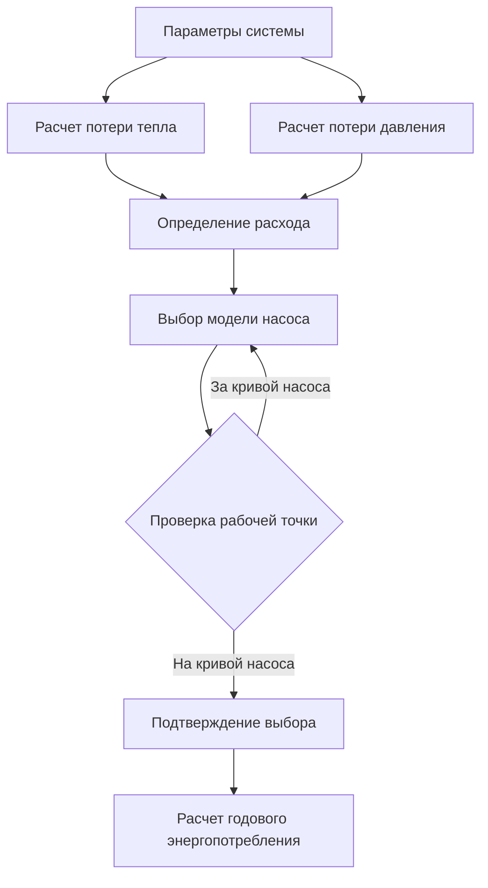
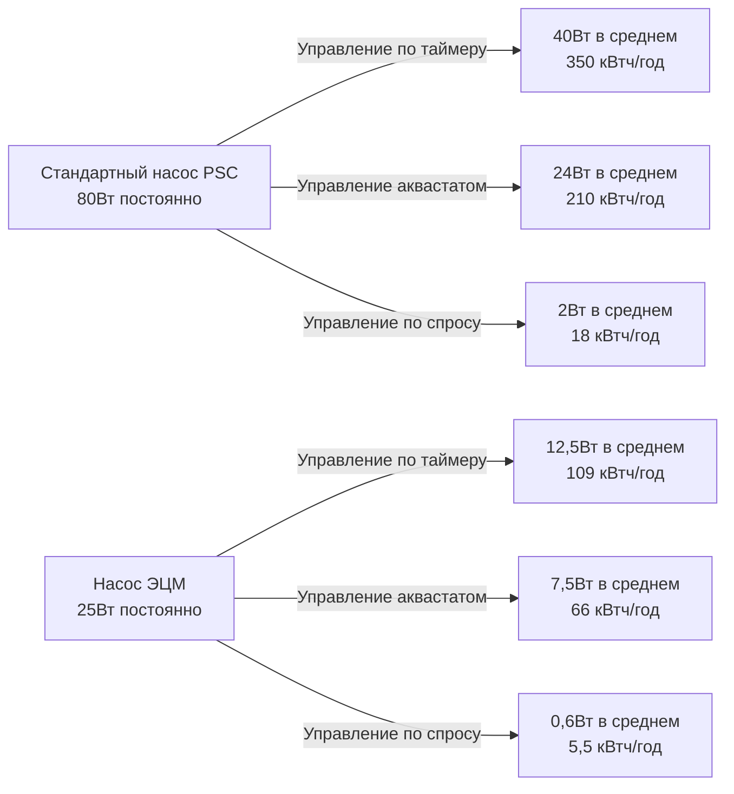

Циркуляционные насосы систем горячего водоснабжения поддерживают наличие горячей воды у приборов, исключая время ожидания. Энергетические затраты на эту удобство варьируются от 50 до 400 кВтч в год на один насос в зависимости от стратегии управления, эффективности насоса и конструкции системы. Понимание требований к мощности насоса и внедрение эффективных стратегий управления минимизируют паразитное энергопотребление при сохранении тепловой производительности.

## Основы мощности насоса

Энергопотребление циркуляционного насоса вытекает из работы, необходимой для преодоления потерь на трение в сети трубопровода распределения. Требование гидравлической мощности вытекает из фундаментальной механики жидкостей:

$$P_{\text{hydraulic}} = \frac{Q \cdot \Delta P}{1000}$$

Где:
- $P_{\text{hydraulic}}$ = гидравлическая мощность (Вт)
- $Q$ = расход (л/с)
- $\Delta P$ = потеря давления (кПа)

Электрическая мощность, потребляемая электродвигателем насоса, учитывает потери эффективности от питания к воде:

$$P_{\text{electrical}} = \frac{P_{\text{hydraulic}}}{\eta_{\text{pump}} \cdot \eta_{\text{motor}}}$$

Где:
- $\eta_{\text{pump}}$ = гидравлическая эффективность насоса (типично 0,30-0,60)
- $\eta_{\text{motor}}$ = электрическая эффективность двигателя (типично 0,50-0,90)

Стандартные циркуляционные насосы с мокрым ротором работают с объединенной эффективностью от питания к воде от 15% до 35%. Насосы с электронно-коммутируемым двигателем (ЭЦМ) достигают эффективности 35-50% благодаря улучшенной конструкции двигателя и системам магнитных подшипников.

## Расчет подбора насоса

Правильный выбор насоса требует точного определения требуемого расхода системы и полной потери давления по всему контуру циркуляции.

### Определение расхода

Требуемый расход поддерживает допустимое снижение температуры в обратной линии, предотвращая риск роста Legionella и обеспечивая надлежащую температуру горячей воды у наиболее удаленного прибора:

$$Q = \frac{q_{\text{loss}}}{\rho \cdot c_p \cdot \Delta T_{\text{allow}}}$$

Где:
- $q_{\text{loss}}$ = потеря тепла из трубопровода распределения (Вт)
- $\rho$ = плотность воды (1000 кг/м³)
- $c_p$ = удельная теплоемкость воды (4186 Дж/кг·К)
- $\Delta T_{\text{allow}}$ = допустимое снижение температуры (типично 0,5-1,5°C)

Для изолированного трубопровода потеря тепла на единицу длины приблизительно:

$$q_{\text{loss}} = \frac{2\pi k_{\text{ins}} L (T_{\text{water}} - T_{\text{amb}})}{\ln(r_{\text{out}}/r_{\text{in}})}$$

Где:
- $k_{\text{ins}}$ = теплопроводность изоляции (Вт/м·К)
- $L$ = длина трубопровода (м)
- $r_{\text{out}}$, $r_{\text{in}}$ = внешний и внутренний радиусы изоляции (м)

### Расчет потери давления

Полная потеря давления в системе объединяет потери на трение в прямых трубопроводах и дополнительные потери у фитингов:

$$\Delta P_{\text{total}} = \Delta P_{\text{friction}} + \Delta P_{\text{fittings}}$$

$$\Delta P_{\text{friction}} = f \cdot \frac{L}{D} \cdot \frac{\rho v^2}{2}$$

Где:
- $f$ = коэффициент трения Дарси (функция числа Рейнольдса и шероховатости)
- $L$ = длина трубопровода (м)
- $D$ = диаметр трубопровода (м)
- $v$ = скорость потока (м/с)

Потери на фитингах суммируют отдельные коэффициенты потерь:

$$\Delta P_{\text{fittings}} = \sum K \cdot \frac{\rho v^2}{2}$$

Для жилых систем циркуляции потеря давления обычно составляет от 7 до 35 кПа.

## Стратегии управления и энергопотребление

Выбор стратегии управления фундаментально определяет годовое энергопотребление, при этом постоянная работа потребляет в 5-10 раз больше энергии, чем оптимизированное управление по спросу.

### Постоянная работа

Постоянная работа насоса обеспечивает мгновенное снабжение горячей водой, но потребляет максимум энергии:

$$E_{\text{annual}} = P_{\text{pump}} \cdot t_{\text{operation}}$$

Для 25 Вт насоса, работающего 8760 часов в год:

$$E_{\text{annual}} = 25 \text{ Вт} \times 8760 \text{ ч} = 219 \text{ кВтч/год}$$

При $0,12/кВтч годовая стоимость эксплуатации достигает $26.

### Управление по таймеру

Управление часами ограничивает время работы насоса до периодов занятости, обычно сокращая годовые часы работы на 50-70%:

$$E_{\text{annual}} = P_{\text{pump}} \cdot t_{\text{timer}}$$

При 12 часов работы в день:

$$E_{\text{annual}} = 25 \text{ Вт} \times 4380 \text{ ч} = 109,5 \text{ кВтч/год}$$

Это снижает годовую стоимость до $13, сохраняя $13 в год по сравнению с постоянной работой.

### Управление аквастатом

Управление на основе температуры активирует насос, когда температура в обратной линии падает ниже установки (типично 35-40°C). Коэффициент включения зависит от потери тепла в системе и условий окружающей среды:

$$E_{\text{annual}} = P_{\text{pump}} \cdot t_{\text{operation}} \cdot DC$$

Где $DC$ = коэффициент включения (типично 0,10-0,40)

При 30% коэффициент включения:

$$E_{\text{annual}} = 25 \text{ Вт} \times 8760 \text{ ч} \times 0,30 = 65,7 \text{ кВтч/год}$$

Годовая стоимость снижается до $8, сохраняя $18 по сравнению с постоянной работой.

### Управление по спросу

Системы с кнопкой или датчиком движения работают только при необходимости горячей воды у приборов, минимизируя время работы до периодов фактического использования. Типичные жилые системы по спросу работают 30-90 минут в день:

$$E_{\text{annual}} = P_{\text{pump}} \cdot \frac{t_{\text{daily}} \cdot 365}{1000}$$

При 60 минут работы в день:

$$E_{\text{annual}} = 25 \text{ Вт} \times 365 \text{ ч} = 9,1 \text{ кВтч/год}$$

Годовая стоимость составляет всего $1,10, что представляет экономию 96% по сравнению с постоянной работой.

## Сравнение технологии насосов

| Тип насоса | Эффективность от питания к воде | Потребление мощности (типично жилое) | Годовое энергопотребление (постоянная работа) | Относительная стоимость |
|-----------|-------------------------|----------------------------------|----------------------------|---------------|
| Стандартный двигатель PSC | 15-25% | 60-100 Вт | 525-875 кВтч | Базовая |
| Высокоэффективный PSC | 25-35% | 40-60 Вт | 350-525 кВтч | +$50-100 |
| ЭЦМ (фиксированная скорость) | 35-45% | 20-35 Вт | 175-305 кВтч | +$150-250 |
| ЭЦМ (переменная скорость) | 40-50% | 15-25 Вт | 130-220 кВтч | +$200-350 |

Насосы ЭЦМ объединяют двигатели с постоянными магнитами и электронной коммутацией, исключая потери сопротивления ротора, присущие асинхронным двигателям. Возможность изменения скорости позволяет пропорциональное управление давлением, дополнительно снижая энергопотребление, когда система работает при частичных расходах.

## Требования энергетических кодексов

ASHRAE 90.1-2019 Раздел 7.4.4.4 требует автоматического управления, которое ограничивает работу циркуляционного насоса для систем горячего водоснабжения. Приемлемые методы управления включают:

- **Модуляция по температуре** - автоматическое управление, ограничивающее работу на основе температуры воды
- **Расписание по времени суток** - автоматическое отключение в периоды отсутствия
- **Управление по инициированному спросу** - работа только при наличии расхода горячей воды

Международный кодекс по энергосбережению (IECC) 2021 Раздел C404.7 предписывает автоматическое отключение или температурно-активированное управление циркуляцией для систем горячего водоснабжения с циркуляционными контурами.

California Title 24 Part 6 Раздел 120.3(b) определяет управление циркуляцией по спросу для приложений односемейных жилых помещений, с исключениями только для постоянно занятых объектов, где мгновенное снабжение горячей водой служит операционным требованиям.

## Оптимизация переменной скорости

Насосы переменной скорости модулируют расход для соответствия требованиям системы, снижая энергопотребление в соответствии с законами подобия:

$$\frac{P_2}{P_1} = \left(\frac{N_2}{N_1}\right)^3$$

Где:
- $P_1$, $P_2$ = мощность при скоростях 1 и 2
- $N_1$, $N_2$ = скорости насоса 1 и 2

Работа на 50% скорости снижает энергопотребление до 12,5% мощности при полной скорости:

$$P_2 = 25 \text{ Вт} \times (0,50)^3 = 3,1 \text{ Вт}$$

Эта кубическая зависимость между скоростью и мощностью создает существенный потенциал экономии энергии, когда системы работают при пониженных расходах при частичной нагрузке.

Насосы переменной скорости с интегрированными датчиками давления поддерживают постоянный перепад давления по системе распределения, автоматически снижая скорость по мере того, как меньше приборов требуют горячей воды. В многоквартирных жилых зданиях эта стратегия снижает среднюю мощность насоса на 40-60% по сравнению с постоянной скоростью.

## Пример практического применения

Рассмотрим односемейный жилой дом с 37 м медного циркуляционного трубопровода диаметром 19 мм, изолированного до R-0,5. Параметры системы:

- Потеря тепла: 1200 Вт (изолированный трубопровод при температуре воды 49°C, окружающей среде 21°C)
- Допустимое снижение температуры: 2,8°C
- Требуемый расход: 0,09 л/с
- Потеря давления в системе: 24 кПа

**Вариант 1: Стандартный 60Вт насос, постоянная работа**
- Годовое энергопотребление: 525 кВтч
- Годовая стоимость (при $0,12/кВтч): $63

**Вариант 2: Стандартный 60Вт насос, управление аквастатом (25% коэффициент включения)**
- Годовое энергопотребление: 131 кВтч
- Годовая стоимость: $16
- Экономия: $47/год (75% снижение)

**Вариант 3: Насос ЭЦМ 20Вт, управление аквастатом (25% коэффициент включения)**
- Годовое энергопотребление: 44 кВтч
- Годовая стоимость: $5
- Экономия: $58/год (92% снижение)
- Дополнительная стоимость: ~$200
- Простой период окупаемости: 3,4 года

**Вариант 4: Насос ЭЦМ 20Вт, управление по спросу (60 мин/день)**
- Годовое энергопотребление: 7,3 кВтч
- Годовая стоимость: $0,88
- Экономия: $62/год (99% снижение)
- Дополнительная стоимость: ~$250
- Простой период окупаемости: 4,0 года

## Соображения при реализации

Выбор насоса требует баланса между первоначальной стоимостью и энергопотреблением в течение жизненного цикла. Насосы ЭЦМ имеют в 3-5 раз более высокую первоначальную стоимость, чем стандартные циркуляторы PSC, но обеспечивают снижение энергопотребления на 60-75%. В постоянно работающих системах периоды окупаемости составляют 2-5 лет в зависимости от тарифов на электроэнергию и времени работы системы.

Выбор стратегии управления зависит от режима занятости и профилей спроса на горячую воду. Управление по инициированному спросу обеспечивает максимальную экономию энергии, но требует взаимодействия пользователя или интеграции датчиков. Управление аквастатом обеспечивает автономную работу с существенной экономией по сравнению с постоянной работой, особенно при объединении с расписанием по времени суток в периоды отсутствия.

Ввод системы в эксплуатацию должен проверить правильную работу насоса по всему диапазону работы. Насосы переменной скорости требуют калибровки датчика давления и регулировки минимальной скорости для предотвращения коротких циклов. Установки управления температурой должны поддерживать температуру в обратной линии выше 50°C для предотвращения Legionella при минимизации ненужного времени работы насоса.

Системы мониторинга энергии, которые отслеживают время работы и энергопотребление насоса, позволяют оптимизировать параметры управления на основе данных, выявляя возможности для снижения времени циркуляции без ущерба для производительности подачи горячей воды.
