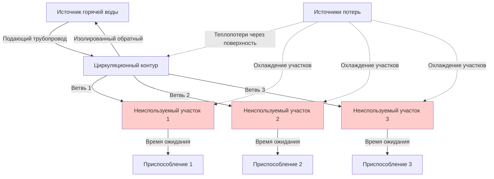

Потери в системе распределения представляют наибольший штраф на энергопотребление в большинстве систем горячего водоснабжения (ГВС), часто превышающий неэффективность оборудования водонагревателя в 2–3 раза при плохо спроектированных установках. Теплопередача от труб с горячей водой в окружающее пространство и потери воды из неиспользуемых участков являются основными механизмами потерь, требующими тщательного анализа.

## Основы теплопередачи через трубопровод

Теплопередача от изолированного трубопровода следует решению цилиндрической геометрии по закону Фурье. Радиальный тепловой поток на единицу длины составляет:

$$q_L = \frac{2\pi L (T_w - T_\infty)}{\frac{1}{h_i r_i} + \frac{\ln(r_2/r_1)}{k_{pipe}} + \frac{\ln(r_3/r_2)}{k_{ins}} + \frac{1}{h_o r_3}}$$

где $q_L$ — скорость тепловых потерь (Вт/м), $L$ — длина трубопровода (м), $T_w$ — температура воды, $T_\infty$ — окружающая температура, $r_1, r_2, r_3$ — внутренний радиус трубы, наружный радиус трубы и наружный радиус изоляции соответственно, $k_{pipe}$ и $k_{ins}$ — коэффициенты теплопроводности, $h_i, h_o$ — коэффициенты конвекции внутри и снаружи.

Для практических расчетов тепловое сопротивление изоляции преобладает, допуская упрощенное выражение:

$$q_L \approx \frac{2\pi k_{ins} (T_w - T_\infty)}{\ln(r_3/r_2)}$$

Это соотношение демонстрирует, что удвоение толщины изоляции снижает тепловые потери только в $\ln(2) \approx 0,69$ раз, объясняя убывающую отдачу при толщинах, превышающих нормативные минимумы.

## Требования ASHRAE 90.1 к изоляции

ASHRAE 90.1-2019, раздел 7.4.4.2, определяет минимальную толщину изоляции трубопровода в зависимости от рабочей температуры жидкости и размера трубы.

| Размер трубы (см) | Температура жидкости 40–60°C | Температура жидкости 61–93°C | Температура жидкости >93°C |
|-------------------|------------------------------|------------------------------|---------------------------|
| < 2,5             | 1,3 см                       | 2,5 см                       | 3,8 см                    |
| 2,5 до < 3,8      | 2,5 см                       | 3,8 см                       | 3,8 см                    |
| 3,8 до < 10       | 3,8 см                       | 3,8 см                       | 5,1 см                    |
| 10 до < 20        | 5,1 см                       | 6,4 см                       | 6,4 см                    |
| ≥ 20              | 6,4 см                       | 7,6 см                       | 8,9 см                    |

Эти толщины предполагают изоляцию с коэффициентом теплопроводности 0,043–0,050 Вт/(м·К) при средней температуре 24°C, типичной для стекловолокна и вспененных эластомерных продуктов.

## Пример расчета тепловых потерь

Рассмотрим участок медной трубы диаметром 19 мм длиной 30 м (наружный диаметр 22,2 мм), несущий воду температурой 60°C через механическое помещение с температурой 21°C, изолированный стекловолокном толщиной 2,5 см (k = 0,046 Вт/(м·К)):

$$r_2 = 11,1 \text{ мм}, \quad r_3 = 36,1 \text{ мм}$$

$$q_L = \frac{2\pi (0,046)(60-21)}{\ln(36,1/11,1)} = \frac{11,27}{1,197} = 9,42 \text{ Вт/м}$$

Для 30 м: $Q_{total} = 282,6$ Вт или 0,28 кВт непрерывных потерь.

За 8 760 часов в год: 2 471 кВтч потеряно. При 0,12 дол./кВтч это составляет 296 дол. годовых затрат на энергию от одного участка трубопровода, демонстрируя экономическую необходимость надлежащей изоляции.

## Потери воды в неиспользуемых участках

Неиспользуемые участки — сегменты трубопровода между последним подключением циркуляционного контура и приспособлением — приводят к потерям воды и энергии при каждом открытии крана. Объем цилиндрического трубопровода составляет:

$$V = \frac{\pi d^2 L}{4}$$

где $d$ — внутренний диаметр, $L$ — длина. Для неиспользуемого участка медной трубы диаметром 12,7 мм длиной 9 м (внутренний диаметр 13,4 мм):

$$V = \frac{\pi (13,4/10)^2 (9)}{4} = 1,277 \text{ см}^3 = 1,28 \text{ л}$$

Если эта вода охлаждается с 60°C до 21°C между использованиями:

$$Q_{sensible} = m c_p \Delta T = (1,28 \times 0,998)(4,19)(39) = 209 \text{ кДж}$$

При 10 ежедневных использованиях годовые потери составляют 762 МДж или 212 кВтч — эквивалент 25 дол. в год только на энергию на одно приспособление, плюс сборы за сточные воды за потраченную воду.

## Оптимизация схемы распределения

Минимизация потерь распределения требует систематических стратегий разработки:

**Конфигурация основного трубопровода** размещает оборудование водонагревателя центрально относительно основных групп приспособлений, минимизируя общую длину трубопровода. Для здания с приспособлениями, распределенными на 61 м, центральное размещение оборудования снижает среднюю длину хода до 15 м по сравнению с 46 м при угловом размещении — сокращение площади поверхности теплопотерь на 67%.

**Вертикальное сдвоение** выравнивает сантехнические приспособления в многоэтажных зданиях, позволяя одному вертикальному стояку обслуживать несколько этажей. Каждый этаж требует только коротких горизонтальных ветвей, а не независимых длинных участков.

**Дисциплина в выборе размеров труб** предотвращает завышенные размеры, которые увеличивают как площадь поверхности теплопотерь, так и объем неиспользуемых участков. Труба диаметром 25 мм имеет 2,67× площадь поверхности и 7,11× объем трубы диаметром 12,7 мм.

## Рассмотрение систем циркуляции

Непрерывная циркуляция исключает время ожидания, но вызывает 24/7 тепловые потери как от подающего, так и от обратного трубопровода:

$$Q_{recirc} = q_{L,supply} L_{supply} + q_{L,return} L_{return}$$

Для 91 м циркуляционного контура при среднем тепловом потоке 10 Вт/м: $Q_{recirc} = 910$ Вт = 0,91 кВт непрерывно.

Годовая энергия: 7 969 кВтч, стоящая 956 дол. при 0,12 дол./кВтч — намного превышающая потери неиспользуемых участков, но обеспечивающая мгновенную подачу горячей воды.

**Управление по таймеру** сокращает циркуляцию до занятых часов, обычно с 6 утра до 10 вечера (16 часов), снижая годовое время работы до 5 840 часов и стоимость энергии до 608 дол.

**Циркуляция с управлением по спросу** использует кнопку или датчики занятости для активации насосов только при необходимости горячей воды, достигая экономии энергии 60–80% по сравнению с непрерывной работой при сохранении приемлемого времени ожидания.

## Сравнение систем изоляции

| Тип системы | Первоначальная стоимость | Годовая энергия | Жизненный цикл 20 лет | Скорость теплопотерь |
|-------------|-------------------------|-----------------|----------------------|----------------------|
| Обнаженная медь | Базовая | 1 498 дол. | 29 960 дол. | 48,2 Вт/м |
| Минимальная изоляция по коду | +15% | 371 дол. | 7 420 дол. | 10,2 Вт/м |
| Двойная толщина кода | +22% | 222 дол. | 4 440 дол. | 6,2 Вт/м |
| Нагревательный кабель + минимальная изоляция | +180% | 1 104 дол. | 22 080 дол. | 30 Вт/м |

Это сравнение для системы распределения 91 м демонстрирует, что минимальная изоляция по коду обеспечивает 75% снижение энергии по сравнению с обнаженной трубой, в то время как улучшенная изоляция дает дополнительную 40% экономию при минимальных дополнительных затратах.

## Практическое внедрение

Эффективное снижение потерь распределения объединяет несколько стратегий. Компактные схемы трубопроводов снижают общую длину, правильно подобранные трубы минимизируют объем и площадь поверхности, изоляция, превышающая норму, снижает теплопередачу, а разумное управление циркуляцией балансирует удобство с эффективностью. Проектировщики систем должны оценивать эти меры комплексно, признавая, что инвестиция в размере 500 дол. в оптимизацию схемы часто экономит больше энергии, чем 5 000 дол. в экзотическое оборудование.
