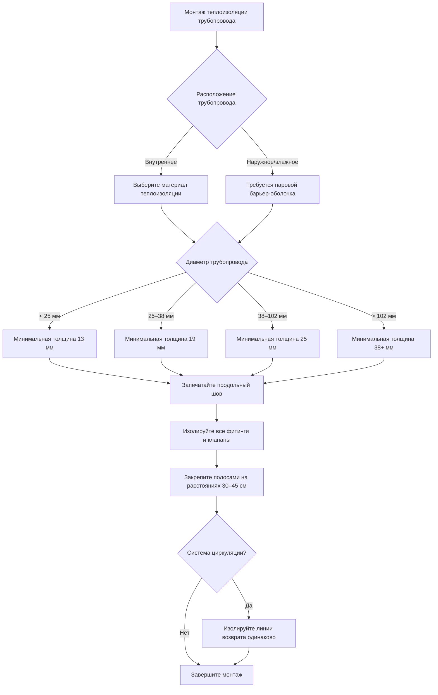

Теплоизоляция, применяемая к трубопроводам распределения горячего водоснабжения (ГВС) и резервуарам-аккумуляторам, снижает теплопередачу в окружающий воздух, минимизирует потери теплоты при хранении и поддерживает температуру подаваемой воды. Экономия энергии от надлежащей теплоизоляции обычно обеспечивает период окупаемости менее трёх лет, что делает её одной из наиболее экономически эффективных мер повышения эффективности в системах зданий.

## Основы теплопередачи

Потери теплоты из неизолированных или плохо изолированных систем ГВС происходят тремя путями: теплопроводность через стенки трубопровода или резервуара, конвекция от поверхностей к окружающему воздуху и излучение от горячих поверхностей. Для типичных систем ГВС, работающих при температуре 49–60°C, теплопроводность через материал теплоизоляции и конвекция на наружной поверхности доминируют в процессе теплопередачи.

Установившаяся потеря теплоты из изолированного цилиндрического трубопровода на единицу длины рассчитывается по формуле:

$$Q = \frac{2\pi L (T_w - T_a)}{\frac{1}{h_i r_i} + \frac{\ln(r_o/r_i)}{k_{pipe}} + \frac{\ln(r_{ins}/r_o)}{k_{ins}} + \frac{1}{h_o r_{ins}}}$$

Где:
- $Q$ = скорость потери теплоты (кДж/ч)
- $L$ = длина трубопровода (м)
- $T_w$ = температура воды (°C)
- $T_a$ = температура окружающего воздуха (°C)
- $r_i$ = внутренний радиус трубопровода (м)
- $r_o$ = внешний радиус трубопровода (м)
- $r_{ins}$ = внешний радиус теплоизоляции (м)
- $k_{pipe}$ = теплопроводность материала трубопровода (Вт/(м·°C))
- $k_{ins}$ = теплопроводность материала теплоизоляции (Вт/(м·°C))
- $h_i$ = коэффициент конвекции внутри (Вт/(м²·°C))
- $h_o$ = коэффициент конвекции снаружи (Вт/(м²·°C))

Для практических приложений тепловое сопротивление стенки трубопровода и внутренняя конвекция незначительны по сравнению с сопротивлением теплоизоляции, что упрощает расчёт, фокусируясь на тепловом сопротивлении изоляции и внешней конвекции.

## Требования кодексов к обязательной теплоизоляции

### Требования ASHRAE 90.1-2019

В разделе 7.4.4.1 ASHRAE 90.1 установлена минимальная толщина теплоизоляции в зависимости от диаметра трубопровода и температуры теплоносителя. Для систем ГВС, работающих при температуре ниже 60°C:

| Номинальный диаметр трубопровода | Минимальная толщина теплоизоляции | Минимальное значение RSI |
|-----------------------------------|-----------------------------------|--------------------------|
| < 25 мм | 13 мм | RSI 0,35 |
| 25–38 мм | 19 мм | RSI 0,44 |
| 38–102 мм | 25 мм | RSI 0,53 |
| 102–203 мм | 38 мм | RSI 0,70 |
| ≥ 203 мм | 51 мм | RSI 0,88 |

Для систем циркуляции и систем, работающих при температуре выше 60°C, минимальная толщина увеличивается на 13 мм в каждой категории.

### Требования IECC 2021 для коммерческих зданий

Международный энергетический кодекс (IECC) в разделе C403.11.3 требует изоляции трубопровода с тепловым сопротивлением (значением RSI), определяемым по формуле:

$$R_{required} = \frac{t}{12k}$$

Где $t$ — толщина изоляции в дюймах, а $k$ — теплопроводность в Btu·in/hr·ft²·°F. Распространённые материалы включают стекловату (k = 0,23–0,26), эластомерную пену (k = 0,27–0,28) и полиизоцианурат (k = 0,16–0,19).

### Требования для систем циркуляции

Трубопровод возврата циркуляции должен быть изолирован идентично трубопроводу подачи. Это требование предотвращает превращение линии возврата в источник излучения теплоты, что увеличило бы мощность насоса, снизило температуру подаваемой воды и свело бы на нет тепловые преимущества изоляции трубопровода подачи.

## Выбор и применение теплоизоляции трубопроводов

### Сравнение свойств материалов

| Материал | Теплопроводность (k) | Макс. температура | Относит. стоимость | Паропроницаемость |
|----------|----------------------|-------------------|-------------------|-------------------|
| Стекловата | 0,23–0,26 | 232°C | Низкая | Высокая (требует оболочки) |
| Эластомерная пена | 0,27–0,28 | 104°C | Средняя | Очень низкая (самоуплотняющаяся) |
| Полиизоцианурат | 0,16–0,19 | 149°C | Высокая | Средняя (требует оболочки) |
| Ячеистое стекло | 0,29–0,38 | 482°C | Очень высокая | Нулевая (непроницаемое) |

Выбор материала учитывает температуру теплоносителя, условия окружающей среды, пространственные ограничения и является ли установка внутренней или наружной. Эластомерная пена доминирует в жилых и лёгких коммерческих приложениях благодаря своему встроенному паровому барьеру и простоте монтажа. Стекловата с универсальной оболочкой (ASJ) предпочтительна в крупных коммерческих системах благодаря более низкой стоимости и более высокому температурному рейтингу.

### Теплоизоляция фитингов и арматуры

Фитинги, клапаны и фланцы создают тепловые мосты, если оставлены без изоляции. Кодекс требует изоляции всех фитингов на том же уровне, что и соседние трубопроводы. Готовые кожухи для фитингов, изоляционный цемент или съёмные одеяла удовлетворяют этому требованию. Потеря теплоты через неизолированный клапан может быть эквивалентна потерям 15–30 м неизолированного трубопровода, что делает покрытие фитингов критически важным для производительности системы.

## Теплоизоляция резервуаров-аккумуляторов

Резервуары-аккумуляторы теряют теплоту через цилиндрические стенки, верхний фланец и нижний фланец. Заводской изолированные резервуары обычно обеспечивают теплоизоляцию резервуара RSI 1,76–2,82. Старые резервуары или резервуары с неадекватной заводской изоляцией выигрывают от дополнительных одеял-теплоизоляции.

Коэффициент потери теплоты при хранении (значение UA) для цилиндрического резервуара составляет:

$$UA = \frac{2\pi r L}{R_{wall}} + \frac{2\pi r^2}{R_{head,top}} + \frac{2\pi r^2}{R_{head,bottom}}$$

Где $r$ — радиус резервуара, $L$ — высота резервуара, а значения $R$ представляют тепловое сопротивление каждой поверхности. ASHRAE 90.1 требует максимальную потерю теплоты при хранении 1,3% объёма резервуара в час (кДж/ч) при разнице температур 39°C.

Для резервуара объёмом 300 л при 60°C в окружающей среде 21°C:

$$Q_{standby,max} = 0,013 \times V \times 4,19 \times (T_{tank} - T_{amb})$$
$$Q_{standby,max} = 0,013 \times 300 \times 4,19 \times 39 = 640 \text{ кДж/ч}$$

Это эквивалентно примерно 5,6 МВтч/год для электрического резистивного нагревателя или 0,56 ГДж/год для газового нагревателя, представляя измеримые эксплуатационные затраты.

## Пример расчёта потерь теплоты

Рассчитайте потери теплоты из 30 м медного трубопровода диаметром 25 мм, перевозящего воду при 60°C через помещение при 21°C, сравнивая неизолированный трубопровод с трубопроводом, изолированным 25 мм стекловатой:

**Неизолированный трубопровод:**
- Внешний диаметр: 28,6 мм = 0,0286 м
- Площадь поверхности: $A = \pi DL = \pi \times 0,0286 \times 30 = 2,69 \text{ м}^2$
- Комбинированный коэффициент конвекции/излучения: $h_o = 11,36 \text{ Вт/(м}^2\text{·°C)}$
- Потеря теплоты: $Q = h_o A \Delta T = 11,36 \times 2,69 \times 39 = 1,190 \text{ кДж/ч}$

**Изолированный трубопровод (25 мм стекловата, k = 0,25 Вт/(м·°C)):**
- Внешний диаметр изоляции: 84 мм = 0,084 м
- Тепловое сопротивление: $R = \frac{\ln(r_{ins}/r_o)}{2\pi k L} = \frac{\ln(0,042/0,0143)}{2\pi \times 0,25 \times 30} = 0,648 \text{ м}^2\text{·°C/Вт}$
- Сопротивление наружной поверхности: $R_o = \frac{1}{h_o A_{ins}} = \frac{1}{11,36 \times 7,92} = 0,011 \text{ м}^2\text{·°C/Вт}$
- Общее сопротивление: $R_{total} = 0,648 + 0,011 = 0,659 \text{ м}^2\text{·°C/Вт}$
- Потеря теплоты: $Q = \frac{\Delta T}{R_{total}} = \frac{39}{0,659} = 59,2 \text{ кДж/ч}$

Изоляция снижает потери теплоты на 95%, с 1,190 до 59,2 кДж/ч. Годовая экономия энергии для этого 30-метрового участка составляет 11,4 ГДж, или примерно 0,114 ГДж при эффективности сжигания 80%.

## Требования к монтажу

Надлежащий монтаж требует:
- Непрерывного покрытия теплоизоляцией без промежутков на опорах, проёмах или стыках
- Запечатывания продольных швов паровым герметизирующим мастиком или самоуплотняющимися материалами
- Опорных полос над изоляцией, не сжимая её
- Паровой защиты-оболочки на всех наружных или подверженных конденсации участках
- Защиты от физических повреждений в механических комнатах и доступных местах

## Проверка производительности

Тепловизионные съёмки выявляют дефекты изоляции, включая отсутствующую изоляцию, сжатые участки и зазоры в фитингах. Измерения температуры на наружной поверхности изоляции подтверждают надлежащий монтаж. Для правильно установленной изоляции температура наружной оболочки должна быть в пределах 5,5–8,3°C от температуры окружающего воздуха.

Годовой мониторинг энергии количественно определяет фактическую экономию путём сравнения потребления топлива или электроэнергии до и после модернизации теплоизоляции. Экономия обычно составляет 3–10% от общего энергопотребления ГВС, с более высокими процентами в системах с обширными трубопроводами распределения или непрерывной циркуляцией.

## Экономический анализ

Стоимость материалов для изоляции трубопроводов варьируется от 1,6 до 9,8 € на погонный метр в зависимости от диаметра трубопровода и типа изоляции. Трудовые затраты на монтаж добавляют 3,3 до 13,1 € на погонный метр. Для типичной системы распределения ГВС длиной 150 м общая стоимость проекта варьируется от 750 до 3,500 €.

Экономия энергии зависит от часов работы системы, длины трубопровода, разницы температур и стоимости энергии. Типичные периоды окупаемости варьируются от 0,5 до 3,0 лет, что делает изоляцию одним из инвестиций с наибольшей отдачей в повышении эффективности коммерческих зданий.
