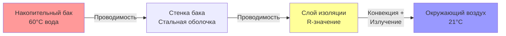
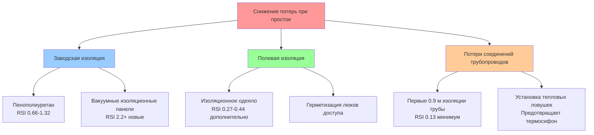

## Основы потерь при простое

Потери при простое представляют непрерывную передачу тепла от сохраняемой горячей воды через стенки бака, трубопроводные соединения и люки доступа в окружающую среду. Эти потери возникают всякий раз, когда температура воды превышает температуру окружающей среды, требуя периодического включения горелки или активации нагревательного элемента для поддержания заданной температуры даже при нулевом потреблении.

Скорость потерь при простое управляет паразитным потреблением энергии водонагревателями накопительного типа, напрямую влияя на годовые эксплуатационные расходы и показатели эффективности системы.

## Физика теплопередачи

Потеря тепла из цилиндрического накопительного бака следует фундаментальным принципам теплопередачи путем проводимости и конвекции. Путь термического сопротивления состоит из трех последовательно соединенных компонентов:

1. **Внутренняя конвекция** от воды к внутренней стенке бака
2. **Проводимость** через стенку бака и слой изоляции
3. **Внешняя конвекция и излучение** от внешней поверхности в окружающий воздух

Общий коэффициент теплопередачи объединяет эти сопротивления:

$$\frac{1}{U_o} = \frac{1}{h_i} + \frac{t_{steel}}{k_{steel}} + \frac{t_{ins}}{k_{ins}} + \frac{1}{h_o}$$

где:
- $U_o$ = общий коэффициент теплопередачи (кДж/ч·м²·°C)
- $h_i$ = коэффициент внутренней конвекции (≈568-1136 кДж/ч·м²·°C для воды)
- $h_o$ = коэффициент внешней конвекции и излучения (≈11-17 кДж/ч·м²·°C)
- $t_{steel}$, $t_{ins}$ = толщина стали и изоляции (м)
- $k_{steel}$, $k_{ins}$ = теплопроводность (кДж/ч·м·°C)

Термин сопротивления изоляции доминирует в этой последовательной сети. Для типичной пенополиуретановой изоляции ($k_{ins}$ = 0.086 кДж/ч·м·°C), тепловое сопротивление составляет:

$$R_{ins} = \frac{t_{ins}}{k_{ins}} = \frac{t_{ins} \text{ (см)}}{0.086 \times 100} = 11.63 \times t_{ins}$$

Таким образом, 5 см пены обеспечивает RSI 0.88 (R-5), а 7.5 см дает RSI 1.32 (R-7.5).

## Расчет потерь тепла при простое

Потеря тепла в установившемся режиме от водонагревателя может быть рассчитана с использованием взвешенной по площади поверхности разницы температур:

$$Q_{standby} = U_o \cdot A_{total} \cdot (T_{water} - T_{ambient})$$

Для цилиндрического бака с высотой $H$ и диаметром $D$:

$$A_{total} = \pi D H + 2 \times \frac{\pi D^2}{4} = \pi D (H + \frac{D}{2})$$

**Пример расчета** для жилого бака объемом 50 галлонов (189 л):
- Размеры бака: D = 508 мм, H = 1524 мм
- Площадь поверхности: $A_{total}$ = π × 0.508 × (1.524 + 0.254) = 2.56 м²
- Изоляция: RSI 0.88 (U = 0.355 кДж/ч·м²·°C)
- Разница температур: 60°C - 21°C = 39°C
- Потеря при простое: Q = 0.355 × 2.56 × 39 = **3.54 кДж/ч**

Это представляет приблизительно 85 кДж/день или 31 МДж/год в непрерывных потерях при простое.

## Процент потерь при простое

Процент потерь при простое выражает почасовую потерю тепла как долю от емкости термического хранилища бака:

$$\text{Потери при простое \%} = \frac{Q_{standby} \times 1 \text{ ч}}{V_{tank} \times 4.18 \times (T_{water} - T_{incoming})} \times 100\%$$

где $V_{tank}$ — объем бака в литрах.

| Уровень изоляции | RSI-значение | Потеря при простое (189 л бак) | Процент потерь при простое/ч |
|-----------------|---------|-------------------------------|-------------------------------|
| Минимальная (старая) | 0.44-0.63 | 63 кДж/ч | 0.7% |
| Стандартная жилая | 0.66-0.88 | 35-47 кДж/ч | 0.4-0.5% |
| Высокая эффективность | 1.10-1.32 | 22-28 кДж/ч | 0.25-0.3% |
| Премиум/коммерческая | >1.65 | <18 кДж/ч | <0.2% |

Современные жилые баки обычно показывают потери при простое 2-6% в час, означая, что сохраняемая энергия снижается на эту долю в час, если не добавляется дополнительное тепло.

## Влияние температуры окружающей среды

Потери при простое масштабируются линейно с температурной разницей между сохраняемой водой и окружающим воздухом. Расположение водонагревателя значительно влияет на годовое потребление энергии:

$$Q_{annual} = Q_{standby} \times 8760 \text{ ч} \times \frac{(T_{water} - T_{ambient,avg})}{(T_{water} - T_{ambient,test})}$$

Тестовые условия DOE используют температуру окружающей среды 21°C. Реальные установки различаются:

| Место установки | Типичная температура | ΔT от 60°C | Относительные потери при простое |
|----------------------|----------------|---------------|----------------------|
| Невентилируемый подвал (зима) | 10-13°C | 47-50°C | 121-129% |
| Кондиционируемое жилое пространство | 20-22°C | 38-40°C | 97-103% |
| Отапливаемое помещение техники | 18-24°C | 36-42°C | 93-107% |
| Невентилируемый гараж (лето) | 29-35°C | 25-31°C | 64-79% |
| Чердак (лето) | 43-54°C | 6-17°C | 14-43% |

Размещение водонагревателей в кондиционируемом пространстве увеличивает потери при простое (более высокая температура окружающей среды снижает потери), но тепло способствует обогреву помещения в зимние месяцы, потенциально снижая чистое потребление энергии в климатах с длительным периодом отопления.

## Рейтинг Energy Factor DOE

Метрика Energy Factor (EF) объединяет эффективность восстановления и потери при простое в один показатель производительности, определяемый процедурой тестирования DOE 10 CFR часть 430, подчасть B, приложение E:

$$\text{Energy Factor} = \frac{\text{Энергия передана воде}}{\text{Общая входная энергия}}$$

Стандартизированный тест выполняет шесть равных объемов, в общей сложности 243 л (для номинального бака 189 л) за 24-часовой период, измеряя как эффективность восстановления, так и потери при простое.

Для накопительных водонагревателей EF может быть приблизительно выражена как:

$$EF \approx \frac{\eta_{recovery}}{1 + \frac{UA_{standby} \times 24 \times 39}{V_{draw} \times 4.18 \times \Delta T}}$$

где:
- $\eta_{recovery}$ = эффективность горения или элемента во время включения
- $UA_{standby}$ = коэффициент потерь при простое (кДж/ч·°C)
- $V_{draw}$ = суточное потребление горячей воды (литры)
- $\Delta T$ = повышение температуры (°C)

**Действующие минимальные стандарты DOE** (вступили в силу в 2015 году):

| Тип водонагревателя | Объем хранилища | Минимум EF |
|------------------|---------------|-----------|
| Газовое хранилище | ≤208 л | 0.675 - (0.0004 × V) |
| Газовое хранилище | >208 л | 0.8012 - (0.0002 × V) |
| Электрическое хранилище | ≤208 л | 0.960 - (0.00008 × V) |
| Электрическое хранилище | >208 л | 2.057 - (0.0003 × V) |

Более строгие требования изоляции для больших баков отражают увеличенный штраф по соотношению поверхности к объему.

## Стратегии улучшения изоляции

Снижение потерь при простое предполагает увеличение термического сопротивления благодаря улучшенной изоляции:

### Заводская изоляция

Современные водонагреватели используют пенополиуретан или полиизоциануратную пену, вспрыскиваемую между стальным баком и наружной оболочкой. Толщина варьируется от 3.8 см (RSI 0.44) в экономичных моделях до 7.6+ см (RSI 1.10+) в высокоэффективных блоках. Пена одновременно обеспечивает термическое сопротивление и структурную поддержку наружной оболочки.

### Одеяла для бака

Добавляемые изоляционные одеяла оборачивают наружную оболочку стекловолоконными волокнами, облицованными виниловой или армированной фольгой. Они добавляют RSI 0.27-0.44 термического сопротивления за минимальную стоимость (600-1500 рублей). Требования установки:

- Оставить верхний люк доступа открытым для безопасности/доступа
- Избежать покрытия клапана температурно-напорного сброса
- Поддерживать зазоры от дымохода на газовых агрегатах
- Закрепить лентой или ремнями для предотвращения провисания

Расчет энергосбережения:

$$\text{Годовые сбережения} = \frac{Q_{before} - Q_{after}}{3.6} \times 8760 \times \text{Стоимость энергии}$$

Добавление RSI 0.44 одеяла к баку RSI 0.66 снижает потери при простое на приблизительно 45%, сэкономив 440-920 кВт·ч/год электричество или 4.5-7 ГДж/год газ.

### Клапаны тепловой ловушки

Циркуляция при термосифоне на соединениях бака вызывает дополнительные потери при простое, позволяя горячей воде подняться в неизолированный трубопровод. Клапаны тепловой ловушки (ANSI Z21.22) содержат обратные клапаны или шариковые механизмы, предотвращающие обратную циркуляцию при допуске нормального потока. Они снижают потери при простое на 4.4-8.8 кДж/ч на типичных жилых установках.

## Нормативные требования

**Стандарт ASHRAE 90.1-2019** (Коммерческие здания):
- Накопительные баки ≤454 л: максимальная потеря при простое варьируется в зависимости от объема и входной мощности
- Баки должны соответствовать SL ≤ (Q/2200 + 32√V) где Q — входная мощность (кДж/ч) и V — объем (литры)

**Международный кодекс энергосбережения (IECC) 2021**:
- Ссылается на минимальные стандарты эффективности DOE
- Требует первых 1.5 м трубопровода входа/выхода, изолированных до RSI минимум 0.13
- Запрещает циркуляционные насосы без автоматического управления температурой или таймерами

**California Title 24**:
- Более строгие, чем федеральные минимумы
- Требует внешней изоляции труб в пределах 3 м от водонагревателя
- Обязывает изоляцию на системах рециркуляции

## Полевые измерения

Потери при простое могут быть измерены на месте, используя простой энергетический баланс в период без потребления:

1. Запишите начальную температуру воды с нагревателем при заданной температуре
2. Отключите нагревательный элемент или газовый клапан на известный период (2-4 часа)
3. Измерьте падение температуры: $\Delta T_{drop}$
4. Рассчитайте скорость потерь:

$$Q_{standby} = \frac{V_{tank} \times 4.18 \times \Delta T_{drop}}{\Delta t_{hours}}$$

Этот метод учитывает все тепловые потери, включая трубопроводные и соединительные потери в установленной конфигурации.

## Рекомендации по оптимизации

Для минимизации потерь при простое:

1. **Выбирайте высокоэффективные модели** с RSI 0.88+ изоляцией при новом строительстве
2. **Устанавливайте в кондиционируемом пространстве** где отходящее тепло компенсирует нагрузку отопления зимой
3. **Добавляйте изоляционные одеяла** к существующим бакам с RSI 0.66 или менее заводской изоляцией
4. **Изолируйте подключенный трубопровод** минимум на 0.9 м от соединений бака
5. **Устанавливайте тепловые ловушки** если не оснащены на заводе (блоки до 2000 года)
6. **Снижайте заданную температуру** до 49-54°C где риск легионеллеза контролируется
7. **Рассмотрите проточные** для приложений с низким потреблением где потери при простое доминируют
8. **Консолидируйте хранилище** используя меньше больших баков, а не несколько маленьких, чтобы снизить соотношение поверхности к объему

Оптимальная стратегия сбалансирует первоначальную стоимость, эксплуатационные расходы, доступное пространство и режимы использования. Для приложений с высоким потреблением емкость восстановления имеет большее значение, чем потери при простое; для сценариев с низким потреблением минимизация потерь при простое становится главной для эффективности системы.
