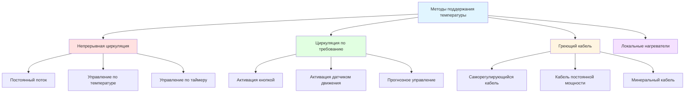

# Поддержание температуры горячей воды для бытовых нужд

Системы поддержания температуры предотвращают потери тепла в распределительных трубопроводах, обеспечивая доступ горячей воды к приборам в приемлемые сроки при одновременном поддержании минимальных температур для безопасности и комфорта. Основная сложность заключается в достижении баланса между производительностью подачи, энергоэффективностью и микробиологическим контролем.

## Физические принципы потерь тепла

Потери тепла из трубопроводов обусловливают необходимость поддержания температуры. Теплопотери в установившемся режиме из изолированного трубопровода определяются следующим образом:

$$Q = \frac{2\pi L(T_w - T_a)}{\frac{1}{h_i r_i} + \frac{\ln(r_o/r_i)}{k_{pipe}} + \frac{\ln(r_{ins}/r_o)}{k_{ins}} + \frac{1}{h_o r_{ins}}}$$

Где:
- $Q$ = скорость потерь тепла (Вт)
- $L$ = длина трубопровода (м)
- $T_w$ = температура воды (°C)
- $T_a$ = температура окружающей среды (°C)
- $r_i$, $r_o$, $r_{ins}$ = внутренний, внешний радиусы трубопровода и наружный радиус изоляции (м)
- $k_{pipe}$, $k_{ins}$ = коэффициент теплопроводности трубопровода и изоляции (Вт/м·K)
- $h_i$, $h_o$ = коэффициенты конвекции внутри и снаружи (Вт/м²·K)

Для практических расчетов используются упрощенные линейные аппроксимации:

$$Q = U \cdot A \cdot \Delta T = U \cdot \pi D L \cdot (T_w - T_a)$$

Коэффициент полного теплопередачи $U$ зависит от толщины и качества изоляции. Неизолированные медные трубопроводы обычно имеют $U \approx 10-15$ Вт/м²·K, в то время как изоляция из стекловолокна толщиной 25 мм снижает это значение до $U \approx 0,4-0,6$ Вт/м²·K.

## Методы поддержания температуры

### Системы циркуляции

Непрерывная или управляемая по требованию циркуляция поддерживает температуру воды путем возврата охлажденной воды в нагреватель. Требуемая расходная производительность насоса определяется допустимым падением температуры:

$$\dot{m} = \frac{Q}{c_p \Delta T_{allow}}$$

Где:
- $\dot{m}$ = массовый расход (кг/с)
- $Q$ = полные потери тепла в системе (Вт)
- $c_p$ = удельная теплоемкость воды (4186 Дж/кг·K)
- $\Delta T_{allow}$ = допустимое падение температуры (°C)

Для системы с 300 м трубопровода диаметром 25 мм с изоляцией при температуре 60°C в среде с температурой 20°C и $U = 0,5$ Вт/м²·K:

$$Q = 0,5 \times \pi \times 0,0254 \times 300 \times (60-20) = 478 \text{ Вт}$$

При допустимом падении на 5°C требуется:

$$\dot{m} = \frac{478}{4186 \times 5} = 0,023 \text{ кг/с} = 1,36 \text{ м}^3\text{/ч}$$

### Системы греющего кабеля

Электрический греющий кабель компенсирует потери тепла непосредственно у трубопровода. Саморегулирующиеся кабели автоматически регулируют выходную мощность на основе температуры трубопровода, обеспечивая энергоэффективность и защиту от замерзания. Линейная плотность мощности кабеля обычно варьируется от 10-40 Вт/м в зависимости от применения.

## Сравнение методов поддержания

| Метод | Энергоэффективность | Стоимость установки | Эксплуатационная стоимость | Время отклика | Лучшее применение |
|-------|-------------------|-------------------|--------------------------|---------------|------------------|
| Непрерывная циркуляция | Низкая (потери 24/7) | Средняя | Высокая | Мгновенное | Объекты с высокой нагрузкой |
| Циркуляция по требованию | Средняя (при необходимости) | Средняя-Высокая | Средняя | 30-60 секунд | Жилые дома, средняя нагрузка |
| Циркуляция с контролем температуры | Средняя-Высокая | Средняя-Высокая | Средняя-Низкая | Мгновенное при активности | Коммерческие здания |
| Саморегулирующийся греющий кабель | Высокая (автоматическая регулировка) | Высокая | Низкая-Средняя | Непрерывное | Длинные трассы, открытые трубопроводы |
| Кабель постоянной мощности | Средняя | Средняя-Высокая | Средняя | Непрерывное | Технологические приложения |
| Локальные нагреватели | Максимальная | Низкая-Средняя | Низкая | Мгновенное | Удаленные приборы, расширения |

## Требования энергетических кодексов

ASHRAE 90.1-2019 раздел 7.4.4.3 предусматривает управление системами поддержания температуры:

**Автоматическое отключение**: Системы циркуляции, обслуживающие жилые единицы, номера отелей/мотелей или системы циркуляции по требованию, должны иметь автоматические средства управления для ограничения времени работы насоса.

**Контроль температуры**: Системы должны включать средства управления для ограничения температуры возврата, предотвращая чрезмерную работу насоса при минимальных потерях тепла.

**Изоляция трубопроводов**: Трубопроводы системы обслуживающего водоснабжения должны соответствовать минимальным требованиям к изоляции согласно таблице 6.8.3A, обычно RSI 0,53 для труб диаметром ≤25 мм и RSI 0,71 для труб диаметром 25-50 мм.

**Ограничения мощности насоса**: Циркуляционные насосы не должны превышать 0,02 кВт на кубометр в час расхода насоса, что способствует выбору эффективных насосов.

### Факторы энергетической производительности

Годовое потребление энергии при непрерывной циркуляции определяется приблизительно следующим образом:

$$E_{annual} = Q_{loss} \times t_{operation} + P_{pump} \times t_{pump}$$

Где $P_{pump}$ — электрическая мощность насоса. Для предыдущего примера при работе 24/7:

$$E_{annual} = 478 \text{ Вт} \times 8760 \text{ ч} + 50 \text{ Вт} \times 8760 \text{ ч} = 4625 \text{ кВт·ч/год}$$

При стоимости 0,12 долл. США за кВт·ч годовая стоимость составляет 555 долл. США. Внедрение управления в зависимости от времени суток, ограничивающего работу до 12 часов в день, сокращает это примерно на 50%.

## Проектные соображения системы

**Балансировочные клапаны**: Многоконтурные системы требуют балансировки для обеспечения адекватного потока к удаленным ветвям. Каждая ветвь должна испытывать аналогичное падение давления для содействия естественному распределению потока.

**Размер обратного трубопровода**: Обратный трубопровод должен быть рассчитан на скорость 0,6-1,2 м/с для поддержания приемлемого падения давления при обеспечении адекватного потока. Недостаточный размер обратного трубопровода увеличивает энергопотребление насоса.

**Контроль легионеллы**: Поддержание температуры должно сбалансировать энергоэффективность и предотвращение бактериального роста. Поддерживайте температуру доставки выше 49°C на объектах с высоким риском, с периодической термической дезинфекцией до 76°C, где необходимо.

**Тепловое расширение**: Системы, работающие при повышенных температурах, требуют расширительных баков, рассчитанных в соответствии с объемом системы и повышением температуры. Предохранительные клапаны защищают от чрезмерного давления.

**Мониторинг системы**: Температурные датчики в критических точках проверяют эффективность поддержания. Регистрация данных выявляет операционные проблемы и подтверждает энергосбережение от стратегий управления.

## Стратегии управления для повышения эффективности

Современные системы поддержания температуры используют передовое управление:

1. **Управление акватермостатом**: Насос работает только при падении температуры возврата ниже установки
2. **Расписание по времени суток**: Снижает или приостанавливает работу в периоды низкого спроса
3. **Управление по наличию людей**: Связывает работу с графиком занятости здания
4. **Насосы переменной скорости**: Модулируют поток на основе дифференциала температуры
5. **Прогнозное обучение**: Предсказывает модели спроса для минимизации энергии при обеспечении доступности

Надлежащее проектирование, установка и управление системами поддержания температуры обеспечивают надежную подачу горячей воды при одновременной минимизации энергопотребления и соответствии требованиям кодексов по эффективности и безопасности.
