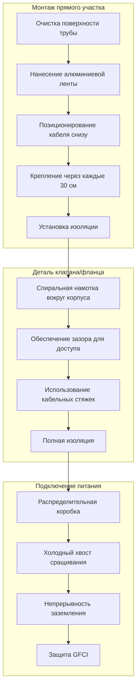

Электрическое прогревание труб обеспечивает резистивный нагрев для поддержания температуры водопроводных труб выше точки замерзания или установления определенной температуры технологического процесса в системах горячего водоснабжения. Технология предотвращает дорогостоящие повреждения от замерзания и обеспечивает непрерывное снабжение сервисной водой в открытых и неотапливаемых помещениях.

## Типы кабелей для прогревания

Три основных типа кабелей предназначены для различных применений в зависимости от требований к диапазону температур, возможностей регулирования и условий установки.

### Сравнение технологий прогревания

| Тип кабеля | Диапазон температур | Метод регулирования | Типичная мощность | Длина цепи | Применение |
|------------|-------------------|-------------------|----------------|----------------|--------------|
| Саморегулирующийся | -40°C до 85°C | Проводящая полимерная матрица | 10-40 Вт/м | До 75 м | Защита от замерзания, общее применение |
| Постоянная мощность | -40°C до 200°C | Провод с фиксированным сопротивлением | 16-65 Вт/м | До 150 м | Технологическое прогревание, точное управление |
| Минеральная изоляция | До 650°C | Фиксированное сопротивление в MgO | 33-165 Вт/м | По заказу | Высокотемпературные промышленные применения |

### Саморегулирующийся кабель

Саморегулирующийся кабель содержит проводящее полимерное ядро между двумя параллельными проводниками. Электрическое сопротивление полимера увеличивается с ростом температуры, автоматически снижая выходную мощность. Этот встроенный механизм обратной связи обеспечивает:

- Автоматическую компенсацию температуры по длине трубы
- Исключение риска перегорания от перекрытия кабеля
- Энергоэффективность благодаря снижению выходной мощности при повышенных температурах
- Отсутствие необходимости в наружных контроллерах для защиты от замерзания

Полимерная матрица демонстрирует поведение с положительным температурным коэффициентом (ПТК), при котором молекулярное расширение при повышенных температурах снижает проводящие пути между частицами углерода, увеличивая сопротивление.

### Кабель с постоянной мощностью

Системы с постоянной мощностью используют провод с фиксированным выходом независимо от температуры. Они требуют наружных температурных контроллеров и термостатов предельной температуры для предотвращения перегрева. Применения включают:

- Поддержание технологической температуры, где точное управление критично
- Высокотемпературные применения, превышающие пределы саморегулирующихся кабелей
- Длинные цепи, где требуется постоянный выход
- Системы, интегрированные с автоматизацией зданий

## Расчеты теплового выхода

Размер кабеля прогревания требует расчета теплопотерь из трубы и выбора кабеля с адекватным выходом для компенсации.

### Теплопотери трубы

Установившиеся теплопотери из изолированной трубы в окружающий воздух:

$$Q = \frac{2\pi k L (T_p - T_a)}{\ln\left(\frac{r_o}{r_i}\right)}$$

Где:
- $Q$ = теплопотери (Вт)
- $k$ = теплопроводность изоляции (Вт/м·К)
- $L$ = длина трубы (м)
- $T_p$ = температура поддержания трубы (°C)
- $T_a$ = температура окружающей среды (°C)
- $r_o$ = внешний радиус изоляции (м)
- $r_i$ = внешний радиус трубы (м)

### Требуемый выход кабеля прогревания

Минимальный выход кабеля на единицу длины:

$$q_{min} = \frac{Q}{L} \times SF$$

Где:
- $q_{min}$ = минимальный выход кабеля (Вт/м)
- $SF$ = коэффициент запаса (обычно 1,2–1,5)

Коэффициент запаса учитывает тепловые мосты на опорах трубы, колебания напряжения питания и эффекты старения.

### Практический пример расчета размера

Для медной трубы диаметром 25 мм с изоляцией из стекловолокна толщиной 25 мм ($k = 0,04$ Вт/м·К), поддерживаемой при 4,4°C в условиях -17,8°C:

$$Q = \frac{2\pi (0,04)(1)(4,4 - (-17,8))}{\ln\left(\frac{0,044}{0,019}\right)} = 6,7 \text{ Вт/м}$$

С коэффициентом запаса 1,3:

$$q_{min} = 6,7 \times 1,3 = 8,7 \text{ Вт/м}$$

Выберите кабель с номинальной мощностью 10 Вт/м (3 Вт/ft) при минимально ожидаемой температуре.

## Методы монтажа

Надлежащий монтаж обеспечивает тепловой контакт между кабелем и трубой, предотвращая повреждение нагревательного элемента.

### Конфигурация монтажа

Схема прокладки кабеля влияет на эффективность теплопередачи:

**Прямой участок**
- Позиционирование кабеля снизу горизонтальных труб (положение 6 часов)
- Поддерживает контакт с холодной частью трубы, где образуется конденсат
- Простой монтаж, требующий минимальной длины кабеля

**Спиральная намотка**
- Спиральный рисунок вокруг окружности трубы
- Используется для применений с высокими теплопотерями или технологического прогревания
- Увеличивает эффективную площадь теплопередачи
- Шаг обычно 15–30 см на один оборот

**Двойной кабель**
- Два кабеля в положениях 4 и 8 часов
- Обеспечивает резервирование для критичных сервисов
- Более равномерное распределение тепла вокруг окружности

### Требования соответствия NEC

Системы прогревания должны соответствовать NEC Article 427 (Электрооборудование для прогревания трубопроводов и сосудов):

1. **Защита от замыкания на землю**: Защита GFCI требуется для всех цепей (427.22)
2. **Средства отключения**: Легко доступное отключающее устройство в поле видимости (427.55)
3. **Идентификация**: Кабели маркированы с указанием напряжения, мощности и производителя (427.23)
4. **Тепловая изоляция**: Подходит для максимальной температуры кабеля (427.16)
5. **Монтаж**: Закреплено через интервалы, не превышающие спецификации производителя
6. **Контроллер**: Устройство ограничения температуры для систем с постоянной мощностью (427.56)

## Анализ энергопотребления

Прогревание труб представляет собой непрерывную электрическую нагрузку во время отопительного сезона. Анализ энергопотребления направляет экономические решения.

### Годовая стоимость эксплуатации

$$C = P \times H \times R$$

Где:
- $C$ = годовая стоимость эксплуатации ($)
- $P$ = установленная мощность (кВт)
- $H$ = часы отопления в год (часы)
- $R$ = тариф на электроэнергию ($/кВт·ч)

### Энергопотребление саморегулирующегося и постоянной мощности

Саморегулирующийся кабель обычно потребляет на 20–40% меньше энергии, чем системы с постоянной мощностью, благодаря автоматическому снижению выходной мощности по мере повышения температуры трубы. Для установки длиной 30 м в жилом помещении:

**Постоянная мощность (10 Вт/м с термостатом)**
- Средняя мощность при работе: 700 Вт (цикл 70%)
- Годовое потребление (3000 часов): 2100 кВт·ч
- Годовая стоимость при $0,12/кВт·ч: $252

**Саморегулирующийся (10 Вт/м при 0°C)**
- Средняя мощность при работе: 450 Вт (автоматическое регулирование)
- Годовое потребление (3000 часов): 1350 кВт·ч
- Годовая стоимость при $0,12/кВт·ч: $162

Саморегулирующаяся система экономит 90 долларов в год в этом сценарии, часто окупая более высокие первоначальные затраты в течение 3–5 лет.

## Рекомендации по применению

### Применения для защиты от замерзания

Стандартная защита от замерзания поддерживает трубы при минимальной температуре 4,4–10°C:
- Открытые линии холодного водоснабжения в подвалах и подпольях
- Наружные краны и скважины для полива
- Трубопроводы в неотапливаемых гаражах или складских помещениях
- Системы де-ледяции крыш и водостоков

**Критерии проектирования**:
- Поддерживайте температуру на 4–6°C выше точки замерзания
- Используйте саморегулирующийся кабель с номинальной мощностью 10–16 Вт/м
- Устанавливайте под минимальную изоляцию толщиной 25 мм
- Обеспечьте питание до первого события замерзания

### Применения для поддержания температуры

Технологические применения требуют поддержания повышенной температуры:
- Альтернатива циркуляции горячей воды на длинных участках
- Системы доставки подогретой воды
- Линии подачи химикатов, требующие контроля вязкости
- Защита оборудования водоочистки от замерзания

**Критерии проектирования**:
- Рассчитайте теплопотери при расчетных условиях окружающей среды
- Выберите выход кабеля с запасом 30–50%
- Используйте постоянную мощность с температурным контроллером для точности
- Контролируйте и сигнализируйте критичные системы

### Матрица выбора системы

Выберите технологию прогревания на основе требований применения:

- **Саморегулирующийся**: Защита от замерзания, общие водопроводные трубы, сложные для управления области, чувствительные к энергии применения
- **Постоянная мощность**: Технологическое прогревание, точное управление температурой, длинные цепи, высокие температуры окружающей среды
- **Минеральная изоляция**: Промышленные высокотемпературные применения, коррозионная среда, требуется механическая защита

## Техническое обслуживание и устранение неисправностей

Периодическая проверка обеспечивает продолжительную работу и выявляет сбои до события замерзания.

**Элементы годовой проверки**:
- Измерение сопротивления изоляции (тест мегаомметром)
- Проверка работы GFCI под нагрузкой
- Проверка установок контроллера и функции переключателя предела
- Осмотр кабеля на предмет физических повреждений или деградации изоляции
- Подтверждение надлежащего крепления кабеля к поверхности трубы
- Анализ тенденций энергопотребления на предмет аномалий

**Распространенные режимы отказа**:
- Замыкание на землю от проникновения влаги (наиболее распространено)
- Разрыв цепи от физического повреждения при обслуживании
- Неисправность контроллера, препятствующая подаче питания
- Недостаточная изоляция, позволяющая чрезмерные теплопотери
- Прерывание питания или срабатывание автоматического выключателя

Надлежащим образом спроектированные и установленные системы прогревания обеспечивают надежную защиту от замерзания с минимальным техническим обслуживанием на протяжении 15–20 лет эксплуатации.
