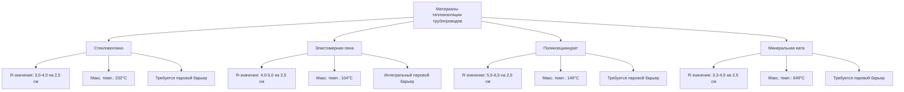
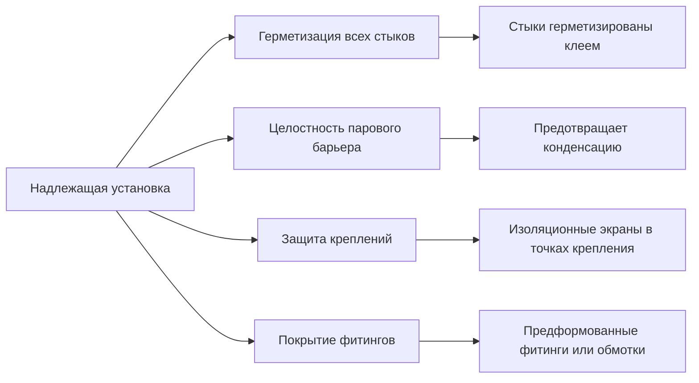

## Обзор

Теплоизоляция трубопроводов является критически важным компонентом систем поддержания температуры горячего водоснабжения, обеспечивая снижение тепловых потерь на 80-90% при правильном выборе и установке. Выбор материалов изоляции, толщины и методов применения напрямую влияет на энергопотребление, температуру подачи воды и соответствие энергетическим кодексам.

## Основы теплопередачи

Тепловые потери через неизолированные трубопроводы происходят путем теплопроводности, конвекции и излучения. Скорость теплопередачи зависит от диаметра трубы, температуры жидкости, условий окружающей среды и степени черноты поверхности.

### Расчет тепловых потерь

Потери тепла на единицу длины изолированной трубы рассчитываются по формуле:

$$Q = \frac{2\pi L(T_f - T_a)}{\frac{1}{h_i r_i} + \frac{\ln(r_o/r_i)}{k_p} + \frac{\ln(r_{ins}/r_o)}{k_{ins}} + \frac{1}{h_o r_{ins}}}$$

Где:
- $Q$ = скорость теплопотерь (кДж/ч)
- $L$ = длина трубопровода (м)
- $T_f$ = температура жидкости (°C)
- $T_a$ = температура окружающей среды (°C)
- $h_i$ = коэффициент внутренней конвекции (кДж/ч·м²·°C)
- $h_o$ = коэффициент внешней конвекции (кДж/ч·м²·°C)
- $r_i$ = внутренний радиус трубы (м)
- $r_o$ = внешний радиус трубы (м)
- $r_{ins}$ = наружный радиус изоляции (м)
- $k_p$ = теплопроводность трубы (кДж/ч·м·°C)
- $k_{ins}$ = теплопроводность изоляции (кДж/ч·м·°C)

### Упрощенная формула расчета тепловых потерь

Для практических применений с известным R-значением изоляции:

$$Q = \frac{\pi D_o L (T_f - T_a)}{R_{ins}}$$

Где $R_{ins}$ — термическое сопротивление изоляции (ч·м²·°C/кДж) и $D_o$ — наружный диаметр трубы (м).

## Требования кодексов

### Минимальная изоляция ASHRAE 90.1

ASHRAE 90.1 Таблица 6.8.3 устанавливает минимальную толщину изоляции в зависимости от рабочей температуры жидкости и размера трубы:

| Размер трубы (см) | Темп. жидкости 40-60°C | Темп. жидкости 61-93°C | Темп. жидкости >93°C |
|-------------------|------------------------|------------------------|----------------------|
| <2,5              | 1,3                    | 2,5                    | 3,8                  |
| 2,5 до <3,8       | 2,5                    | 3,8                    | 5,1                  |
| 3,8 до <10        | 3,8                    | 5,1                    | 6,4                  |
| 10 до <20         | 5,1                    | 6,4                    | 8,9                  |
| ≥20                | 6,4                    | 7,6                    | 10,2                 |

*Толщины в сантиметрах для изоляции с теплопроводностью 0,04-0,05 Вт/м·°C при средней температуре 24°C.*

### Международный кодекс энергосбережения (IECC)

IECC ссылается на требования ASHRAE 90.1 для коммерческих зданий и устанавливает минимум RSI 0,53 для трубопроводов горячего водоснабжения в жилых помещениях внутри кондиционируемого пространства.

## Материалы изоляции

### Сравнение материалов

| Материал | Теплопроводность (k) | R-значение на 2,5 см | Водостойкость | Стоимость |
|----------|----------------------|----------------------|----------------|-----------|
| Стекловолокно | 0,04-0,045 | 0,65-0,75 | Низкая | Низкая |
| Эластомерная пена | 0,045-0,048 | 0,65-0,78 | Отличная | Средняя |
| Полиизоцианурат | 0,033-0,038 | 0,85-1,05 | Справедливая | Высокая |
| Минеральная вата | 0,04-0,045 | 0,65-0,75 | Справедливая | Средняя |

## Соображения по проектированию системы

### Выбор толщины изоляции

Помимо минимальных требований кодекса, оптимальная толщина изоляции определяется экономическим анализом, балансирующим установленную стоимость против энергосбережения:

$$\text{Период окупаемости} = \frac{\text{Разница в установленной стоимости}}{\text{Годовая экономия энергии}}$$

Для систем ГВС, работающих непрерывно, увеличенная толщина изоляции обычно показывает период окупаемости 1-3 года.

### Требования к установке

**Критические детали установки:**

- **Герметизация стыков**: Все продольные и поперечные стыки герметизированы одобренным производителем клеем для предотвращения проникновения влаги
- **Паровой барьер**: Непрерывный замедлитель паров с проницаемостью ≤0,02 перма для систем ниже точки росы окружающей среды
- **Защита креплений**: Изоляционные экраны установлены в точках крепления трубопровода для предотвращения теплового мостика
- **Изоляция фитингов**: Клапаны, фитинги и фланцы изолированы с использованием предварительно отформованных секций или многослойных обмоток, обеспечивающих эквивалентное R-значение
- **Проемы**: Герметизированы совместимыми материалами с сохранением огнестойкости где применимо

## Характеристики производительности снижения тепловых потерь

Правильно установленная теплоизоляция трубопроводов обеспечивает снижение тепловых потерь на 80-90% в сравнении с открытой трубой. Для трубы из меди диаметром 2,54 см, переносящей воду при 60°C в окружающей среде при 21°C:

| Состояние | Тепловые потери (кДж/ч·м) | Снижение |
|-----------|---------------------------|----------|
| Открытая труба | 260-317 | Эталон |
| Изоляция 1,3 см (RSI 0,35) | 69-86 | 73-75% |
| Изоляция 2,5 см (RSI 0,70) | 35-46 | 85-87% |
| Изоляция 3,8 см (RSI 1,05) | 23-29 | 90-91% |

## Критерии выбора материала

**Стекловолоконная изоляция для трубопроводов:**
- Экономичный вариант для труб большого диаметра
- Требует отдельного парового барьера
- Идеален для высокотемпературных применений (>104°C)
- Поставляется в жестких полусекциях

**Эластомерная пена:**
- Предпочтительна для систем ГВС малого диаметра
- Интегральный замкнутопористый паровой барьер
- Простая установка на месте с самоуплотняющейся прорезью
- Ограничена максимальной рабочей температурой 104°C

**Полиизоцианурат:**
- Наивысшее R-значение на единицу толщины
- Экономичен для установок с ограничением по пространству
- Требует защитной оболочки
- Пригоден для подземного или скрытого трубопровода

**Минеральная вата:**
- Огнестойкие применения
- Высокая температурная стойкость
- Дороже стекловолокна
- Требует защиты от влаги

## Проверка соответствия

Соответствие энергетическому кодексу требует документирования:

1. Теплопроводность материала изоляции
2. Установленная толщина по размеру трубы и температуре
3. Спецификация парового барьера
4. Методы герметизации и обработки стыков
5. Технические данные производителя

Полевая проверка должна подтвердить непрерывное покрытие изоляцией, надлежащую толщину, герметизированные стыки и защиту в точках крепления перед скрытием конструкцией.

## Резюме

Спецификация теплоизоляции трубопроводов для систем поддержания температуры горячего водоснабжения требует анализа физики теплопередачи, минимальных требований кодекса, свойств материалов и экономической оптимизации. Выбор типа и толщины изоляции на основе рабочей температуры, размера трубы и условий окружающей среды обеспечивает энергоэффективное распределение ГВС при соответствии кодексу. Надлежащая установка с особым внимением к герметизации стыков, целостности парового барьера и защите креплений необходима для достижения спроектированной тепловой эффективности.
