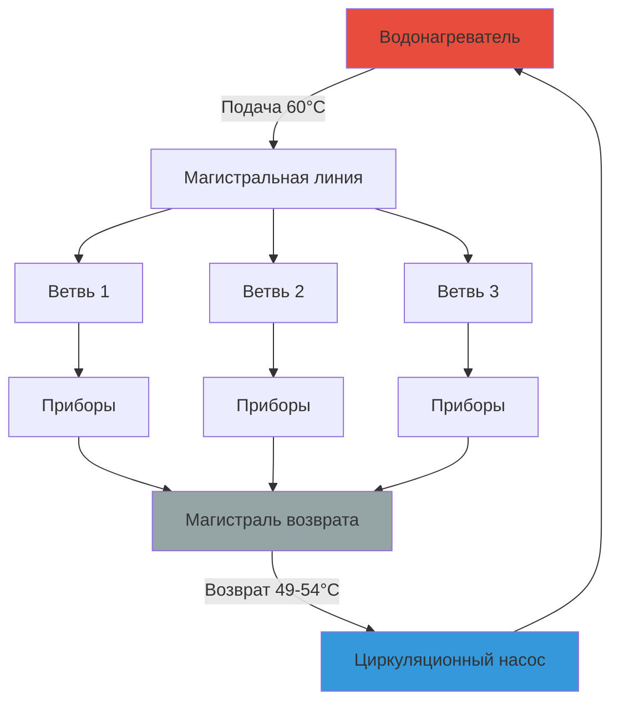

## Обзор

Циркуляционные контуры поддерживают температуру горячей воды у приборов путем непрерывной циркуляции нагретой воды через сети трубопроводов подачи и возврата. Надлежащее проектирование требует баланса между немедленной доступностью горячей воды и потерями тепла и энергией на перекачивание. Критические параметры включают схему контура, размеры труб, толщину теплоизоляции, расход и управление температурой возврата.

## Расчеты потерь тепла в контуре

Потери тепла из циркуляционного контура определяют требуемую тепловую мощность и эксплуатационные затраты. Для изолированного горизонтального трубопровода:

$$Q_{\text{loss}} = \frac{2\pi k L (T_w - T_a)}{\ln(r_o/r_i)}$$

Где:
- $Q_{\text{loss}}$ = интенсивность потерь тепла (Вт)
- $k$ = коэффициент теплопроводности теплоизоляции (Вт/м·K)
- $L$ = длина трубопровода (м)
- $T_w$ = температура воды (°C)
- $T_a$ = температура окружающей среды (°C)
- $r_o$ = внешний радиус теплоизоляции (м)
- $r_i$ = внешний радиус трубопровода (м)

Для систем с несколькими размерами труб и различными условиями теплоизоляции рассчитайте общие потери тепла как:

$$Q_{\text{total}} = \sum_{i=1}^{n} Q_i \times L_i$$

ASHRAE 90.1 требует минимальной толщины теплоизоляции в зависимости от диаметра трубы и температуры жидкости. Для воды при 60°C в кондиционируемых помещениях минимальная толщина теплоизоляции из стекловолокна составляет 25 мм на трубах ≤38 мм, 38 мм на трубах большего диаметра.

## Расчет расхода циркуляции

Минимальный расход циркуляции должен компенсировать потери тепла при одновременном поддержании температуры возврата:

$$\dot{m} = \frac{Q_{\text{total}}}{c_p \Delta T}$$

Где:
- $\dot{m}$ = массовый расход (кг/с)
- $c_p$ = удельная теплоемкость воды = 4,186 кДж/(кг·К)
- $\Delta T$ = разность температур между подачей и возвратом (K)

Конвертируйте в объемный расход:

$$\dot{V} = \frac{\dot{m}}{\rho} = \frac{Q_{\text{total}}}{\rho c_p \Delta T}$$

Типовое проектирование поддерживает перепад температуры 5–11°C от подачи к возврату. Меньший перепад улучшает комфорт, но увеличивает расход и энергию на перекачивание.

## Конфигурации контуров

### Прямой возврат и обратный возврат

**Прямой возврат:** Самые короткие ветвления возвращаются первыми, создавая неравномерные перепады давления. Требует балансировочных клапанов на каждой ветви для выравнивания распределения потока.

**Обратный возврат:** Последняя обслуживаемая ветвь возвращается первой, создавая равные длины труб и врожденный гидравлический баланс. Увеличивает стоимость установки, но упрощает пусконаладку.

## Выбор и расчет насоса

Требуемый напор насоса преодолевает потери на трение через подачу, возврат и самую длинную ветвь контура:

$$H_{\text{pump}} = \Delta P_{\text{friction}} + \Delta P_{\text{fittings}} + \Delta P_{\text{valve}}$$

Расчет потерь на трение с использованием уравнения Дарси-Вейсбаха:

$$\Delta P_f = f \frac{L}{D} \frac{\rho v^2}{2}$$

Для типичных скоростей циркуляции (0,6–1,2 м/с) используйте упрощенную оценку или диаграммы потерь давления в трубах из ASHRAE Fundamentals Chapter 22.

### Параметры проектирования

| Параметр | Рекомендуемый диапазон | Примечания |
|----------|----------------------|-----------|
| Температура возврата | 49–54°C | Выше снижает время ожидания, увеличивает потери |
| Разность температур подача–возврат | 5–11°C | Меньшая ΔT = больший расход, лучшая равномерность |
| Скорость потока в трубе | 0,6–1,2 м/с | Баланс эрозии и потери давления |
| Теплоизоляция (кондиционируемые помещения) | RSI 0,5–0,7 | Согласно минимумам ASHRAE 90.1 |
| Теплоизоляция (некондиционируемые помещения) | RSI 0,9–1,1 | Увеличение для повышения энергоэффективности |
| Время работы насоса | Непрерывная или по графику | Регуляторы температуры и таймеры сокращают потери |

## Балансировка системы

Надлежащая балансировка обеспечивает адекватный расход ко всем ветвям при одновременном предотвращении шунтирования через пути с низким сопротивлением.

**Процедура балансировки:**

1. Измерьте температуру подачи и возврата на каждом конце ветви
2. Отрегулируйте балансировочные клапаны для достижения целевой температуры возврата (в пределах ±3°C)
3. Убедитесь, что общий расход системы соответствует проектному значению с использованием кривой производительности насоса
4. Повторно проверьте температуру ветвей после регулировок
5. Задокументируйте окончательные положения клапанов и расходы

Установите балансировочные клапаны с отводами давления для измерения потока. В зависимости от бюджета и сложности могут использоваться откалиброванные шаровые краны или автоматические балансировочные клапаны.

## Стратегии повышения энергоэффективности

### Управление с регулятором температуры
Установите регулятор температуры на линию возврата для включения насоса только при снижении температуры возврата ниже уставки (обычно 49°C). Снижает энергию на перекачивание на 30–50% во многих приложениях.

### Управление по расписанию
Включайте циркуляцию только в часы работы. Отключение в ночное время в коммерческих зданиях может сократить потери тепла на 8–12 часов в день. Комбинируйте с циклом предварительного нагрева утром.

### Системы с активацией по требованию
Датчики движения или кнопочная активация запускают работу насоса. Лучше всего подходит для объектов с низкой интенсивностью использования или удаленных групп приборов.

### Модуляция температуры
Снижайте температуру контура в периоды низкого спроса. Понижение с 60°C до 49°C на ночь сокращает потери тепла примерно на 15–20%, сохраняя контроль Legionella.

## Требования нормативов

**Uniform Plumbing Code (UPC) Раздел 607:** Требует подачи горячей воды в разумное время. Циркуляционные системы или проточные нагреватели удовлетворяют это требование для приборов на расстоянии >15 м от нагревателя.

**International Plumbing Code (IPC) Раздел 607.2:** Обязывает подачу горячей воды или электрический обогрев для приборов, превышающих установленные пределы длины трубопровода на основе размера трубы.

**ASHRAE 90.1 Раздел 7.4.4.4:** Требует автоматических элементов управления (регулятор температуры, таймер или активация по требованию) для ограничения работы циркуляционного насоса. Запрещает непрерывную работу без отключения на основе температуры.

**NSF/ANSI 61:** Все материалы в контакте с питьевой водой должны быть сертифицированы для приложений с питьевой водой, включая насосы, клапаны и паровые барьеры теплоизоляции.

## Контрольный список проектирования

- Рассчитайте общие потери тепла в контуре, включая все трубопроводы подачи и возврата
- Определите расход циркуляции для максимально допустимого перепада температуры
- Выберите насос для полного напора системы при расчетном расходе
- Укажите теплоизоляцию, соответствующую минимумам ASHRAE 90.1 или превышающую их
- Предусмотрите балансировочные клапаны на всех параллельных ветвях (системы прямого возврата)
- Установите управление регулятором температуры и/или таймер согласно энергетическим нормам
- Убедитесь, что материалы соответствуют стандартам NSF/ANSI 61 для питьевой воды
- Предусмотрите доступ для обслуживания насоса, клапанов и элементов управления
- Рассмотрите расширительный бак, если система включает обратные клапаны или устройства защиты от обратного потока

Эффективное проектирование циркуляционного контура обеспечивает немедленную подачу горячей воды при одновременном минимизации постоянных потерь энергии благодаря надлежащему расчету, теплоизоляции и интеллектуальному управлению.
