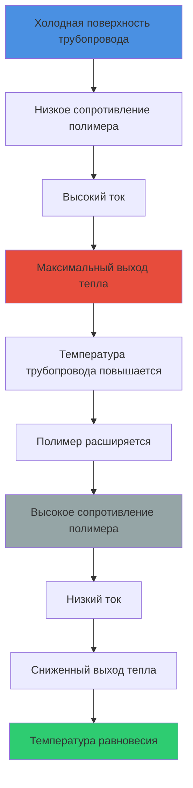

## Технология положительного температурного коэффициента

Саморегулирующийся греющий кабель использует матрицу из полупроводникового полимера с характеристиками положительного температурного коэффициента (PTC). Полимерное ядро, расположенное между двумя параллельными шинами, демонстрирует зависящее от температуры электрическое сопротивление, которое автоматически модулирует выходную мощность на основе локальной температуры трубопровода.

### Принцип физического действия

Проводящий полимер содержит рассеянные частицы углерода в матрице из полукристаллического полимера. При повышении температуры тепловое расширение снижает связность частиц углерода, увеличивая электрическое сопротивление и снижая ток. Эта обратная зависимость между температурой и выходной мощностью создает встроенную саморегуляцию в каждой точке по длине кабеля.

## Характеристики выходной мощности

Выходная мощность саморегулирующегося кабеля следует нелинейной зависимости температура-мощность, управляемой поведением PTC полимера.

### Взаимосвязь температура-мощность

Выходная мощность на единицу длины экспоненциально снижается с повышением температуры:

$$P(T) = P_0 \cdot e^{-\alpha(T - T_0)}$$

Где:
- $P(T)$ = Выходная мощность при температуре $T$ (Вт/м)
- $P_0$ = Максимальная номинальная выходная мощность при эталонной температуре (Вт/м)
- $\alpha$ = Температурный коэффициент полимера (К⁻¹)
- $T$ = Температура поверхности трубопровода (°C)
- $T_0$ = Эталонная температура, обычно 10°C (°C)

### Передача тепла к трубопроводу

Баланс теплопередачи в установившемся состоянии для поддержания температуры трубопровода:

$$P_{cable} = \frac{(T_{maintain} - T_{ambient})}{R_{thermal}}$$

Где:
- $P_{cable}$ = Требуемая выходная мощность кабеля (Вт/м)
- $T_{maintain}$ = Целевая температура поддержания трубопровода (°C)
- $T_{ambient}$ = Температура окружающего воздуха (°C)
- $R_{thermal}$ = Общее тепловое сопротивление (изоляция трубопровода + воздушная пленка) (м·К/Вт)

## Конструкция кабеля

```mermaid
graph LR
    A[Внешняя оболочка] --> B[Заземляющая оплетка]
    B --> C[Слой изоляции]
    C --> D[Проводящий полимер]
    D --> E[Шина 1]
    D --> F[Шина 2]

    style A fill:#34495E
    style B fill:#7F8C8D
    style C fill:#3498DB
    style D fill:#E67E22
    style E fill:#C0392B
    style F fill:#C0392B
```

### Основные компоненты

| Компонент | Материал | Функция |
|-----------|----------|---------|
| Шины | Облуженная медь, 16-12 AWG | Электрические проводники параллельно длине кабеля |
| Проводящий полимер | Углеронаполненный полиолефин | PTC нагревательный элемент между шинами |
| Электрическая изоляция | Модифицированный полиолефин | Диэлектрический барьер, обычно рассчитан на 600В |
| Заземляющая оплетка | Облуженная медь | Проводник заземления оборудования согласно NEC |
| Внешняя оболочка | Фторполимер или термопласт | Устойчивость к химикатам/влаге, механическая защита |

## Сравнение производительности

### Саморегулирующийся кабель и кабель с постоянной мощностью

| Параметр | Саморегулирующийся | Постоянная мощность |
|----------|-------------------|-------------------|
| Модуляция мощности | Автоматическая по местоположению | Фиксированный выход |
| Перекрытие | Допускается без повреждения | Запрещено - приводит к выгоранию |
| Максимальная длина | Обычно 40-100 м | Обычно 150-300 м |
| Энергопотребление | На 20-40% ниже (модулируется по мере необходимости) | Постоянное независимо от условий |
| Сложность установки | Ниже (самоограничивающийся) | Выше (требует высокой точности) |
| Начальная стоимость | Выше (за м) | Ниже (за м) |
| Ограничение температуры | Саморегулируется до ~150°C | Требует внешнего управления |
| Защита цепи | Стандартные автоматы достаточны | Требует точного подбора |

## Методология расчета размеров

### Расчет теплопотерь

Общие теплопотери от теплоизолированного трубопровода согласно ASHRAE Fundamentals:

$$Q_{loss} = \frac{2\pi L k_{ins} (T_{pipe} - T_{amb})}{\ln(r_{out}/r_{pipe})} + L \cdot h \cdot \pi D_{out} (T_{surf} - T_{amb})$$

Где:
- $Q_{loss}$ = Общие теплопотери (Вт)
- $L$ = Длина трубопровода (м)
- $k_{ins}$ = Теплопроводность изоляции (Вт/м·К)
- $r_{out}$ = Радиус внешней изоляции (м)
- $r_{pipe}$ = Внешний радиус трубопровода (м)
- $h$ = Коэффициент конвективной теплопередачи, обычно 10 Вт/м²·К (Вт/м²·К)
- $D_{out}$ = Внешний диаметр изоляции (м)

### Коэффициент безопасности конструкции

$$P_{required} = Q_{loss} \cdot SF \cdot \eta^{-1}$$

Где:
- $P_{required}$ = Требуемый номинальный мощность кабеля (Вт/м)
- $SF$ = Коэффициент безопасности, обычно 1,2-1,5 для горячего водоснабжения
- $\eta$ = Коэффициент эффективности установки (0,85-0,95 в зависимости от качества контакта)

### Стандартные номинальные мощности

| Номинальная мощность кабеля | Применение | Типичное использование |
|------------------------------|-----------|----------------------|
| 3-5 Вт/м при 10°C | Легкий режим | Внутренние помещения, хорошо изолированные трубопроводы |
| 8-12 Вт/м при 10°C | Стандартный режим | Рециркуляция горячей воды для бытовых нужд |
| 15-25 Вт/м при 10°C | Тяжелый режим | Наружные применения, минимальная изоляция |
| 30-50 Вт/м при 10°C | Промышленное | Технологические применения, высокая температура поддержания |

## Требования к установке

### Соответствие NEC Article 427

Согласно NEC Article 427 (Электрический обогрев трубопроводов):

**Защита цепи:**
- Защита от замыканий на землю требуется для всех цепей обогрева трубопровода
- Максимальная защита от перегрузки по току согласно инструкциям производителя
- Обычно: 15-30 А в зависимости от длины кабеля и номинальной мощности

**Методы установки:**
- Прямые проходы вдоль дна горизонтального трубопровода (положение 6 часов)
- Спиральная намотка с шагом, указанным производителем, для большей выходной мощности
- Должны соблюдать минимальный радиус изгиба (обычно 25 мм)
- Закреплять стеклоткаными лентами каждые 300-400 мм

**Заземление:**
- Проводник заземления оборудования требуется согласно NEC 427.29
- Заземляющая оплетка должна быть непрерывной и правильно подключена
- Оборудование защиты от замыкания на землю должно быть рассчитано на ожидаемый ток замыкания

### Тепловая изоляция

Изоляция, применяемая поверх кабеля и трубопровода, согласно ASHRAE 90.1:

| Размер трубопровода | Минимальная толщина изоляции | Теплопроводность |
|-------------------|------------------------------|------------------|
| ≤25 мм | 25 мм | ≤0,034 Вт/м·К при 24°C |
| 25-50 мм | 38 мм | ≤0,034 Вт/м·К при 24°C |
| 50-100 мм | 50 мм | ≤0,034 Вт/м·К при 24°C |
| >100 мм | 64 мм | ≤0,034 Вт/м·К при 24°C |

## Преимущества энергоэффективности

Саморегулирующийся кабель обеспечивает значительную экономию энергии по сравнению с системами с постоянной мощностью:

1. **Автоматическое согласование нагрузки:** Выходная мощность снижается по мере повышения температуры трубопровода, устраняя потери энергии во время периодов низкого спроса

2. **Ответ, специфичный для зоны:** Каждый участок кабеля независимо реагирует на локальные условия температуры

3. **Сезонная регулировка:** Более высокий выход зимой, более низкий летом без изменений в системе управления

4. **Сниженные потери при переключении:** Устраняет включение-выключение циклических переключений термостатически управляемых систем

**Типичная экономия энергии:** Снижение годового потребления энергии на 25-45% по сравнению с кабелем с постоянной мощностью с термостатическим управлением.

## Рабочие соображения

### Ограничения по температуре

- **Максимальная температура непрерывного воздействия:** 65-85°C (варьируется в зависимости от модели)
- **Максимальная температура при кратковременном режиме:** 85-110°C (короткая продолжительность)
- **Минимальная температура установки:** -40°C до -60°C в зависимости от материала оболочки
- **Выходная мощность при температуре поддержания:** Снизить до 30-50% от номинальной мощности при 10°C

### Ограничения длины цепи

Максимальная длина цепи определяется падением напряжения и минимальным начальным током:

$$L_{max} = \frac{V^2 \cdot R_{polymer}}{P_0 \cdot (2 R_{bus} + R_{polymer})}$$

Где:
- $L_{max}$ = Максимальная длина цепи (м)
- $V$ = Напряжение питания (В)
- $R_{polymer}$ = Сопротивление полимера на единицу длины при запуске (Ом/м)
- $R_{bus}$ = Сопротивление шины на единицу длины (Ом/м)
- $P_0$ = Номинальная мощность при 10°C (Вт/м)

**Типичные максимальные длины:**
- Цепи 120В: 40-60 м
- Цепи 208-240В: 70-100 м
- Цепи 277В: 100-130 м

## Техническое обслуживание и устранение неисправностей

**Ежегодный осмотр:**
- Визуальный осмотр целостности оболочки
- Оценка состояния изоляции
- Тестирование устройства защиты от замыканий на землю согласно NEC 427.22
- Тепловизионная диагностика для выявления неработающих участков

**Распространенные проблемы:**
- Физическое повреждение оболочки (наиболее частый режим отказа)
- Попадание воды в клеммы
- Чрезмерный изгиб, вызывающий разрыв шины
- Сжатие изоляции, снижающее эффективность

**Проверка производительности:**
- Измерение тока, потребляемого согласно таблицам производителя
- Сравнение с ожидаемыми значениями при измеренной температуре окружающей среды
- Отклонение >20% указывает на деградацию кабеля или проблемы с установкой
