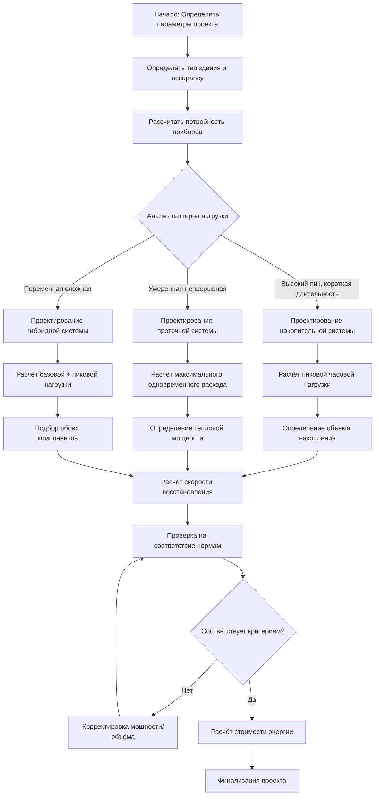
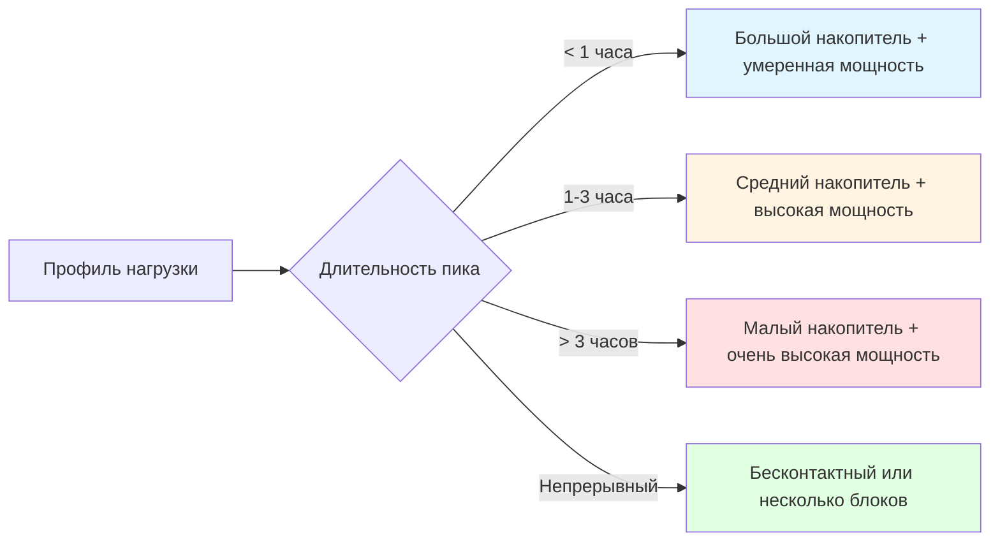

Подбор мощности водонагревателя определяет ёмкость оборудования для удовлетворения пиковых потребностей в горячей воде при сохранении энергоэффективности. Правильный подбор предотвращает создание систем недостаточной мощности, не способных удовлетворить спрос, и систем избыточной мощности, которые расходуют энергию на избыточные потери в режиме ожидания.

## Методологии подбора

Существует три основных метода подбора водонагревателей, каждый из которых имеет свои области применения и уровни точности.

### Метод накопительного бака

Метод накопительного бака определяет объём бака на основе пиковой часовой нагрузки и возможностей восстановления системы. Этот подход применяется в жилых и лёгких коммерческих объектах, где паттерны потребления предсказуемы.

**Расчёт объёма накопления:**

$$V_s = \frac{Q_p - R \cdot t_p}{C_p \cdot \rho \cdot (T_d - T_s)}$$

Где:
- $V_s$ = объём накопления (литры)
- $Q_p$ = пиковая часовая потребность (литры)
- $R$ = скорость восстановления (литры/час)
- $t_p$ = длительность пиковой нагрузки (часы)
- $C_p$ = удельная теплоёмкость воды (1.055 кДж/кг-°C)
- $\rho$ = плотность воды (1.0 кг/литр)
- $T_d$ = температура подачи (°C)
- $T_s$ = температура подачи (°C)

### Метод теплопередачи

Метод теплопередачи рассчитывает требуемую входную мощность на основе требований к тепловой энергии. Этот метод обеспечивает точный подбор для коммерческих систем с известными профилями нагрузки.

**Требуемая тепловая мощность:**

$$\dot{Q} = \frac{\dot{m} \cdot C_p \cdot (T_d - T_s)}{\eta}$$

Где:
- $\dot{Q}$ = тепловая мощность (кДж/ч)
- $\dot{m}$ = массовый расход (кг/ч)
- $\eta$ = КПД нагревателя (доля единицы)

### Модифицированный метод Хантера

ASHRAE рекомендует модифицированный метод Хантера для сложных коммерческих и институциональных зданий. Этот статистический подход учитывает вероятность одновременного использования.

**Расчёт пикового расхода:**

$$\dot{V}_p = K \cdot \sqrt{\sum WSU}$$

Где:
- $\dot{V}_p$ = пиковый расход (л/мин)
- $K$ = коэффициент спроса (варьируется в зависимости от типа здания)
- $WSU$ = условные единицы водоразборных приборов

## Сравнение накопительных и проточных систем

Выбор между накопительными и проточными системами зависит от паттернов потребления, ограничений по пространству и энергетических целей.

| Параметр | Накопительный бак | Проточный |
|-----------|---|---|
| **Время отклика** | Мгновенное | Задержка 2-5 секунд |
| **Эффективность** | 0.62-0.95 EF | 0.82-0.99 EF |
| **Потери в режиме ожидания** | 1-3% в час | Отсутствуют |
| **Пропускная способность** | Ограничена объёмом накопления | Ограничена скоростью нагрева |
| **Требуемое пространство** | 0.28-1.11 м² | 0.05-0.19 м² |
| **Нагрев** | Предварительный нагрев | Расчёт на каждый прибор |
| **Лучшее применение** | Высокая пиковая нагрузка | Непрерывная умеренная нагрузка |

**Проверка мощности проточного нагревателя:**

$$\dot{Q}_{required} = \frac{GPM \cdot 8.34 \cdot 60 \cdot \Delta T}{\eta}$$

Где:
- $\dot{Q}_{required}$ = минимальная входная мощность (кДж/ч)
- $GPM$ = одновременный расход (литров в минуту)
- $\Delta T$ = требуемый нагрев (°C)

## Оценка потребления

Точная оценка потребления требует анализа количества приборов, паттернов occupancy и профилей использования.

### Потребление в жилых зданиях

| Жильцы | Спальни | Накопительный (л) | Рейтинг первого часа (л) | Проточный (л/мин @ нагрев 43°C) |
|------|---|---|---|---|
| 1-2 | 1-2 | 114-151 | 151-189 | 0.13-0.19 |
| 2-3 | 2-3 | 151-189 | 189-227 | 0.19-0.23 |
| 3-4 | 3-4 | 189-246 | 227-284 | 0.23-0.28 |
| 4-5 | 4-5 | 246-303 | 284-341 | 0.28-0.35 |
| 5+ | 5+ | 303+ | 341+ | 0.35+ |

### Коэффициенты спроса для коммерческих зданий

ASHRAE предоставляет коэффициенты спроса на основе типа здания и плотности occupancy.

| Тип здания | Пиковая нагрузка | Длительность | Период восстановления |
|------|---|---|---|
| Офис | 0.08-0.15 л/чел-час | 1-2 часа | 4-6 часов |
| Ресторан | 5.7-9.5 л/приём пищи | 2-3 часа | 3-4 часа |
| Отель | 95-132 л/номер-день | 1-1.5 часа | 4-5 часов |
| Больница | 76-151 л/кровать-день | Непрерывно | Н/Д |
| Прачечная | 7.6-15.1 л/кг-прачи | 3-4 часа | 2-3 часа |

## Процесс подбора

## Требования к коду

Подбор мощности водонагревателя должен соответствовать нескольким положениям нормативных документов, касающимся емкости, эффективности и безопасности.

### Требования к емкости

- **Раздел 607 IPC**: Минимальная емкость на основе метода единиц приборов
- **Раздел 508 UPC**: Емкость водонагревателя и скорость восстановления
- **ASHRAE 90.1**: Минимальные требования к энергоэффективности
- **Местные нормы**: Могут устанавливать более строгие требования

### Стандарты энергоэффективности

**Федеральный минимальный стандарт эффективности (NAECA 2015):**

$$EF_{min} = 0.97 - \frac{0.00132 \cdot V}{1000}$$

Для газовых накопительных водонагревателей, где $V$ = объем в литрах.

### Проверка емкости восстановления

Накопительные системы должны демонстрировать достаточную скорость восстановления:

$$R = \frac{\dot{Q}_{input} \cdot \eta}{8.34 \cdot (T_d - T_s)}$$

Где:
- $R$ = скорость восстановления (л/ч)
- $\dot{Q}_{input}$ = мощность нагрева (кДж/ч)

Минимальные скорости восстановления:
- Жилые здания: 70% от пиковой часовой нагрузки
- Коммерческие здания: 100% от средней часовой нагрузки в пиковый период

## Матрица выбора системы

Правильный подбор мощности водонагревателя обеспечивает баланс между первоначальной стоимостью, эксплуатационными расходами и надежностью. Недооценка мощности на 20% приводит к жалобам на комфорт и перегрузке оборудования, тогда как переоценка на 20% увеличивает потери в режиме ожидания на 15–25% без улучшения производительности. Для детальных процедур подбора мощности для коммерческих зданий и профилей нагрузки конкретных типов зданий используйте справочник ASHRAE, глава 51 «HVAC Applications».
