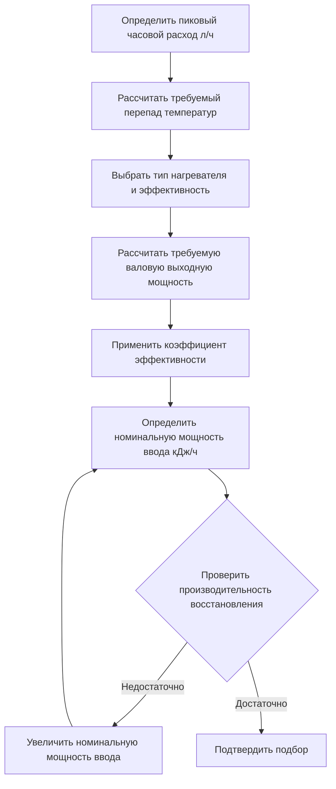
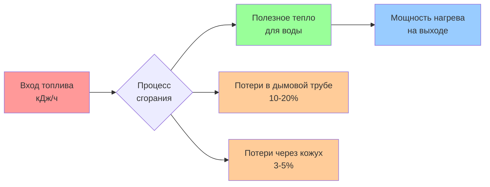

## Номинальная мощность ввода в БТЕ/час

Номинальная мощность ввода в БТЕ/час представляет собой общее энергопотребление водонагревателя и служит фундаментальным параметром для подбора как газовых, так и электрических нагревательных элементов. Этот параметр определяет способность нагревателя удовлетворять пиковую нагрузку при поддержании требуемой температуры на выходе в условиях непрерывного водоразбора.

## Расчет номинальной мощности ввода

Требуемая номинальная мощность ввода зависит от производительности восстановления, перепада температур, свойств жидкости и тепловой эффективности. Фундаментальная зависимость:

$$Q_{input} = \frac{\dot{m} \cdot c_p \cdot \Delta T}{\eta}$$

Где:
- $Q_{input}$ = Номинальная мощность ввода (кДж/ч)
- $\dot{m}$ = Массовый расход (кг/ч)
- $c_p$ = Удельная теплоемкость воды (4,18 кДж/кг·°C)
- $\Delta T$ = Перепад температур (°C)
- $\eta$ = Тепловая эффективность (доля единицы)

Для практического подбора водонагревателей с использованием объемного расхода:

$$Q_{input} = \frac{GPH \times 31,1 \times \Delta T}{\eta}$$

Где:
- $GPH$ = Производительность восстановления в литрах/час
- $31,1$ = Плотность воды (кг/л при 15,6°C)

## Требования к производительности восстановления

Производительность восстановления представляет собой количество литров в час, которое нагреватель должен подавать для удовлетворения пиковой нагрузки после истощения запаса в накопительном баке. Стандарт ASHRAE 90.1 устанавливает минимальные коэффициенты эффективности восстановления (RE):

$$RE = \frac{GPH_{recovery}}{Q_{input}/1000}$$

Минимальные значения RE по типам:
- Газовые накопительные: 67 л/ч на 1000 кДж/ч ввода
- Электрические накопительные: 95 л/ч на 1000 кДж/ч ввода

## Влияние эффективности на требования к вводу

Тепловая эффективность напрямую влияет на номинальную мощность ввода при эквивалентной выходной мощности. Коэффициент эффективности учитывает потери на сгорание, потери в режиме ожидания и потери через кожух.

### Газовые водонагреватели

Эффективность газовых водонагревателей варьируется от 75% до 95% в зависимости от технологии:

| Тип нагревателя | Диапазон эффективности | Множитель ввода |
|------|------------------------|------------------|
| Атмосферные | 75-80% | 1,25-1,33 |
| С принудительной тягой | 80-85% | 1,18-1,25 |
| Конденсационные | 90-95% | 1,05-1,11 |

Для требования по выходной мощности 40 000 БТЕ/ч (118,2 кДж/ч):
- Атмосферный блок: $Q_{input} = 40 000 / 0,78 = 51 282$ БТЕ/ч (151,6 кДж/ч)
- Конденсационный блок: $Q_{input} = 40 000 / 0,93 = 43 011$ БТЕ/ч (127,1 кДж/ч)

### Электрические водонагреватели с сопротивлением

Электрические блоки достигают эффективности 95-100%, поскольку вся входная энергия преобразуется в тепло внутри бака:

$$Q_{input} = Q_{output} \times \frac{1}{\eta} \times 3,412 \text{ (БТЕ/Вт·ч)}$$

Для практических целей входная мощность электрического нагревателя равна выходной мощности с минимальной корректировкой на потери через кожух.

## Методология подбора

### Пошаговый процесс подбора

1. **Установить профиль нагрузки**: Определить пиковое часовое потребление (л/ч) методом единиц арматуры или статистическим анализом согласно стандартам ASPE
2. **Рассчитать перепад температур**: $\Delta T = T_{outlet} - T_{inlet}$, обычно 55,6°C (60°C на выходе, 4,4°C на входе)
3. **Определить валовую выходную мощность**: $Q_{output} = GPH \times 31,1 \times \Delta T$
4. **Выбрать эффективность**: Применить соответствующий $\eta$ в зависимости от технологии нагревателя и типа топлива
5. **Рассчитать номинальную мощность ввода**: $Q_{input} = Q_{output} / \eta$
6. **Проверить по стандартам AHRI**: Подтвердить, что номинальная мощность соответствует рассчитанному требованию

## Таблицы номинальной мощности по типу нагревателя

### Газовые накопительные водонагреватели (сертифицированы AHRI)

| Размер бака (л) | Номинальная мощность ввода (БТЕ/ч) | Восстановление @ перепаде 55,6°C | Эффективность |
|------|------------------------|------------------|------------------|
| 30 | 30 000-40 000 | 25-32 л/ч | 78-80% |
| 40 | 36 000-50 000 | 30-40 л/ч | 78-82% |
| 50 | 38 000-55 000 | 32-45 л/ч | 78-82% |
| 75 | 75 000-76 000 | 60-65 л/ч | 80-82% |
| 100 | 100 000-120 000 | 80-100 л/ч | 80-84% |

### Электрические накопительные водонагреватели

| Размер бака (л) | Номинальная мощность (кВт) | Входная мощность (кДж/ч) | Восстановление @ перепаде 100°F |
|------|------|------|------|
| 30 | 3.8-4.5 | 13,680-16,200 | 12-15 гал/ч (м³/ч) |
| 40 | 4.5-5.5 | 16,200-19,800 | 15-18 гал/ч (м³/ч) |
| 50 | 5.5-6.0 | 19,800-21,500 | 18-20 гал/ч (м³/ч) |
| 80 | 6.0-6.0 | 21,500-21,500 | 20-20 гал/ч (м³/ч) |
| 120 | 6.0-6.0 | 21,500-21,500 | 20-20 гал/ч (м³/ч) |

## Схема энергопотока

## Конструктивные особенности

**Преимущества газовых нагревателей:**
- Более высокая скорость восстановления на доллар стоимости оборудования
- Быстрое восстановление температуры в периоды пиковой нагрузки
- Более низкие эксплуатационные расходы в большинстве регионов

**Преимущества электрических нагревателей:**
- Почти 100% тепловой КПД
- Отсутствие требований к вентиляции снижает стоимость монтажа
- Точный контроль входной мощности исключает избыточное sizing
- Меньшие габариты при эквивалентном объеме хранения

**Критические факторы подбора:**
1. Пиковый часовой расход определяет выбор номинальной мощности
2. Объем бака хранения снижает требуемую мощность для прерывистых нагрузок
3. Коэффициент запаса 1.1-1.25 учитывает вариацию температуры входящей воды
4. Снижение мощности для газовых агрегатов на высоте: 4% на каждые 305 м (1000 футов) над уровнем моря

## Ссылочные стандарты

- **ASHRAE 90.1**: Требования к энергоэффективности и минимальные показатели эффективности восстановления
- **AHRI 110**: Рейтинг производительности электрических мгновенных водонагревателей
- **AHRI 1010**: Испытания на тепловую эффективность газовых накопительных водонагревателей
- **ASPE Domestic Water Heating Design Manual**: Методологии подбора и процедуры расчета нагрузки

Правильный выбор номинальной мощности обеспечивает достаточную мощность восстановления при минимизации потерь в режиме ожидания и стоимости оборудования. Недооцененная входная мощность приводит к недостаточному снабжению в пиковые периоды, тогда как избыточно мощные агрегаты несут ненужные потери на циклирование и капитальные расходы.
