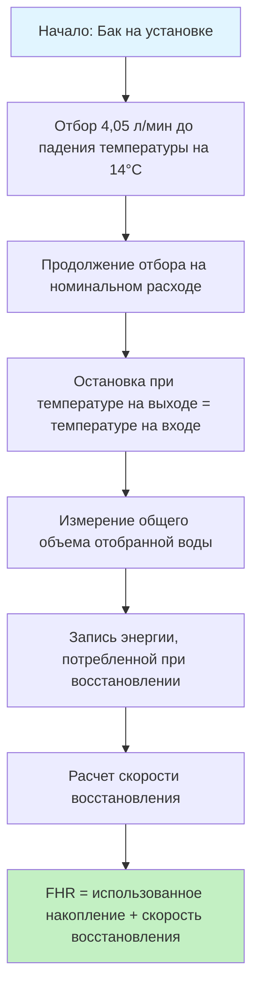
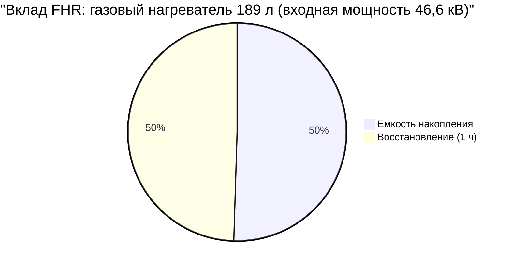

## Определение First Hour Rating

First Hour Rating (FHR) количественно определяет максимальный объем горячей воды, который накопительный водонагреватель может подать в течение одного часа непрерывного пикового спроса при полностью нагретом баке. Этот показатель производительности сочетает как емкость накопленной горячей воды, так и способность нагревателя восстанавливать температуру во время периодов отбора воды, что делает его основным критерием определения размера для жилых и легких коммерческих применений.

DOE требует раскрытия информации о FHR на этикетке EnergyGuide всех жилых накопительных водонагревателей согласно Единому методу испытаний для измерения потребления энергии водонагревателями (10 CFR 430, Подраздел B, Приложение E).

## Методология расчета FHR

### Основная формула FHR

First Hour Rating состоит из двух компонентов, которые работают одновременно во время пикового спроса:

$$\text{FHR} = V_{\text{storage}} + (Q_{\text{recovery}} \times t_{\text{hour}})$$

где:
- $\text{FHR}$ = First Hour Rating (литры)
- $V_{\text{storage}}$ = Полезная емкость накопления (литры)
- $Q_{\text{recovery}}$ = Скорость восстановления (литры в час)
- $t_{\text{hour}}$ = Период времени 1 час

### Расчет скорости восстановления

Скорость восстановления зависит от входной мощности и повышения температуры:

$$Q_{\text{recovery}} = \frac{P_{\text{input}} \times \eta}{4.18 \times \Delta T}$$

где:
- $P_{\text{input}}$ = Входная мощность (кДж/ч для газа, Вт × 3.412 для электричества)
- $\eta$ = Коэффициент полезного действия восстановления (обычно 0,76–0,78 для газа, 0,98 для электричества)
- $4.18$ = Теплоемкость воды (кДж/(кг·°C))
- $\Delta T$ = Повышение температуры (°C), обычно 50°C (вход 10°C, подача 60°C)

Для электрических резистивных нагревателей:

$$Q_{\text{recovery}} = \frac{W \times 3.412 \times 0.98}{4.18 \times 50} = \frac{W}{61.2}$$

Для газовых нагревателей с входной мощностью 11,6 кВ:

$$Q_{\text{recovery}} = \frac{11,600 \times 0.77}{4.18 \times 50} \approx 43 \text{ л/ч}$$

## Процедура испытаний DOE

Стандартизированный тест FHR следует этому протоколу:

### Условия испытаний (10 CFR 430)

| Параметр | Спецификация |
|----------|--------------|
| Температура воды на входе | 14°C ± 1°C |
| Установка термостата | 57°C ± 3°C |
| Скорость отбора | 0,19 л/с ± 0,012 л/с |
| Начальное состояние | Полностью восстановленный бак |
| Температура окружающей среды | 19,7°C ± 1,4°C |

## Таблицы производительности FHR

### Типичный FHR по типу и размеру нагревателя

**Электрические резистивные водонагреватели**

| Размер бака | Элемент (Вт) | Накопление (л) | Восстановление (л/ч) | FHR (л) |
|-----------|------------|----------------|-------------------|---------|
| 113 л | 4500 | 91 | 73 | 166 |
| 151 л | 4500 | 124 | 73 | 197 |
| 189 л | 4500 | 158 | 73 | 231 |
| 189 л | 5500 | 158 | 88 | 246 |
| 246 л | 5500 | 208 | 88 | 296 |
| 303 л | 5500 | 257 | 88 | 345 |

**Газовые накопительные водонагреватели**

| Размер бака | Входная мощность (кДж/ч) | Накопление (л) | Восстановление (л/ч) | FHR (л) |
|-----------|-------------------|----------------|-------------------|---------|
| 113 л | 35,2 кВ | 91 | 115 | 206 |
| 151 л | 42,1 кВ | 121 | 137 | 260 |
| 151 л | 44,4 кВ | 121 | 144 | 267 |
| 189 л | 46,6 кВ | 155 | 152 | 309 |
| 284 л | 87,6 кВ | 238 | 286 | 526 |

## Определение размера в соответствии с пиковым спросом

### Оценка жилого пикового часового спроса

Справочник ASHRAE—HVAC Applications содержит данные об использовании приборов для оценки пикового часового спроса:

**Типичное использование горячей воды приборами (за одно событие)**

| Прибор/установка | Литры горячей воды |
|-------------------|-------------------|
| Душ | 75 л |
| Ванна | 57 л |
| Бритье | 8 л |
| Мытье рук | 15 л |
| Мытье волос | 15 л |
| Посудомоечная машина | 26 л |
| Стиральная машина | 95 л |

### Пример определения размера для пикового часа

Для семьи из четырех человек в часы пикового утреннего спроса:
- 3 душа: 3 × 75 = 225 л
- 2 мытья рук: 2 × 15 = 30 л
- 1 посудомоечная машина: 1 × 26 = 26 л

**Общий пиковый спрос = 281 литр**

**Необходимый FHR ≥ 281 литр**

Выбор: газовый нагреватель объемом 284 л (входная мощность 87,6 кВ, FHR = 526 л) обеспечивает запас 87%.

## Баланс накопления и восстановления

Уравнение FHR раскрывает компромисс при проектировании:

$$\text{FHR} = \underbrace{V_{\text{storage}}}_{\text{Физический размер}} + \underbrace{Q_{\text{recovery}} \times 1}_{\text{Входная мощность}}$$

**Стратегия высокого восстановления:**
- Меньший бак с более высокой входной мощностью
- Сниженные потери в режиме ожидания
- Более быстрое падение температуры при интенсивном отборе
- Пример: газовый 151 л при 44,4 кВ (FHR = 367 л)

**Стратегия высокого накопления:**
- Больший бак с умеренной входной мощностью
- Более стабильная температура на выходе
- Более высокие потери в режиме ожидания
- Пример: электрический 303 л при 4500 Вт (FHR = 330 л)

## Коммерческие применения

Для коммерческих установок с более высокой вариабельностью спроса метод Fixture Unit согласно ASPE (Американское общество инженеров-сантехников) обеспечивает более точное определение размера. FHR остается действительным для:
- Небольших офисов (< 20 человек)
- Розничных помещений с минимальным использованием ГВС
- Применений в жилом масштабе

Для больших коммерческих систем требуется анализ соотношения накопления к спросу, коэффициенты разнообразия пиковой нагрузки и расчеты времени восстановления выходящие за пределы одного часа окна FHR.

## Справочные стандарты ASHRAE

ASHRAE 90.1 (Энергетический стандарт для зданий) и ASHRAE 62.1 (Вентиляция для приемлемого качества воздуха в помещении) не требуют прямого определения размера по FHR, но требуют рейтинги эффективности оборудования, которые коррелируют с процедурами испытаний FHR. Справочник ASHRAE—HVAC Applications, Глава 51 (Service Water Heating) предоставляет всеобъемлющие методы определения размера, включая пределы применения FHR.

## Ключевые принципы определения размера

1. **FHR должен быть равен или превышать пиковый часовой спрос** для адекватного снабжения горячей водой
2. **Емкость накопления обычно составляет 50–70%** от общего FHR
3. **Скорость восстановления зависит от типа топлива:** газ обеспечивает восстановление в 2–3 раза быстрее, чем электричество при одинаковом размере бака
4. **Стандартизация процедуры испытаний** гарантирует сопоставимость рейтингов производителей
5. **Запас 10–20% выше расчетного пикового спроса** учитывает вариацию использования

Надлежащее применение методологии FHR гарантирует, что системы водонагревателей удовлетворяют потребности пользователей, избегая чрезмерного увеличения размера, который увеличивает стоимость оборудования и потери энергии в режиме ожидания.
