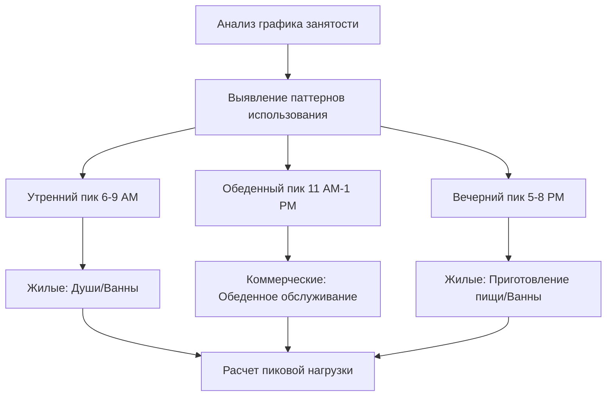

Расчет пиковой нагрузки определяет максимальную мгновенную расходную способность горячей воды, необходимую для правильного подбора водонагревателя. Точный анализ пиковой нагрузки предотвращает создание систем с недостаточной мощностью, не способных удовлетворить потребности пользователей, и систем с избыточной мощностью, которые приводят к неэффективному расходу энергии и капитальных затрат.

## Основные методы расчета

### Метод условных единиц сантехприборов

Метод условных единиц сантехприборов переводит отдельные приборы в стандартизированные единицы, представляющие относительный расход воды. Этот вероятностный подход учитывает тот факт, что не все приборы работают одновременно.

**Базовый расчет условных единиц:**

$$Q_{peak} = \sum_{i=1}^{n} (FU_i \times DF) \times GPM_{equivalent}$$

Где:
- $Q_{peak}$ = Расход воды при пиковой нагрузке (л/с)
- $FU_i$ = Условные единицы для типа прибора $i$
- $DF$ = Коэффициент одновременности (безразмерный)
- $GPM_{equivalent}$ = Расход воды на одну условную единицу (л/с/ед.)

### Применение кривой Хантера

Кривая Хантера, разработанная Роем Б. Хантером в 1940 году, устанавливает взаимосвязь между общим количеством условных единиц и вероятной одновременной нагрузкой. Этот эмпирический метод остается отраслевым стандартом для коммерческих применений.

**Уравнение кривой Хантера:**

$$Q = \sqrt{FU_{total}}$$

Для систем с $FU_{total}$ < 1000:

$$Q = 0.6 \times \sqrt{FU_{total}} \times (1 + 0.1\sqrt{FU_{total}})$$

Где $Q$ представляет вероятную пиковую нагрузку в л/с.

## Анализ вероятности использования

Вероятность одновременной работы нескольких приборов снижается по мере увеличения их количества. Эта взаимосвязь лежит в основе применения коэффициента одновременности.

**Уравнение вероятности:**

$$P_{simultaneous} = 1 - (1 - p)^n$$

Где:
- $P_{simultaneous}$ = Вероятность одновременного использования
- $p$ = Вероятность использования отдельного прибора
- $n$ = Количество приборов

## Коэффициенты одновременности по типу здания

Коэффициенты одновременности учитывают статистическую вероятность одновременного использования сантехприборов. Эти факторы снижают теоретический максимальный расход до реалистичных пиковых значений.

| Тип здания | Коэффициент одновременности | Длительность пика (мин) | Примечания |
|------|----------|----|----|
| Частный дом | 0.30 - 0.40 | 30 - 60 | Типичен утренний пик |
| Многоквартирный дом (< 20 единиц) | 0.40 - 0.50 | 45 - 90 | Ступенчатое заселение |
| Многоквартирный дом (> 20 единиц) | 0.25 - 0.35 | 60 - 120 | Высокая диверсификация |
| Офисные здания | 0.15 - 0.25 | 15 - 30 | Ограниченное использование горячей воды |
| Отели | 0.35 - 0.50 | 60 - 90 | Утренний пик приема душа |
| Больницы | 0.50 - 0.70 | Непрерывно | Более высокая одновременность использования |
| Рестораны | 0.60 - 0.80 | 180 - 240 | Циклы мойки посуды |
| Школы | 0.20 - 0.30 | 20 - 40 | Периоды смены классов |
| Спортивные залы | 0.40 - 0.60 | 30 - 45 | Души после активности |

## Расходные характеристики и единицы сантехприборов

Стандартные расходные характеристики сантехприборов устанавливают базис для расчетов нагрузки.

| Тип прибора | Расход (л/с) | Условные единицы (FU) | % горячей воды |
|------|-----------------|----------|----|
| Раковина умывальная (частная) | 2.0 | 1.0 | 100% |
| Раковина умывальная (общественная) | 2.5 | 2.0 | 100% |
| Душевая насадка | 2.5 | 2.0 | 100% |
| Ванна | 4.0 | 3.0 | 80% |
| Кухонная мойка | 2.5 | 1.5 | 75% |
| Посудомоечная машина (бытовая) | 2.0 | 1.5 | 100% |
| Посудомоечная машина (промышленная) | 15.0 | 6.0 | 100% |
| Стиральная машина | 3.0 | 2.0 | 50% |
| Мойка для обслуживания | 3.0 | 2.5 | 100% |

## Метод расчета по количеству спален

ASHRAE предоставляет упрощенный метод для жилых применений, основанный на количестве спален как прокси для оценки численности проживающих.

**Уравнение пиковой нагрузки:**

$$Q_{peak} = 12 + 3(N_{br} - 1)$$

Где:
- $Q_{peak}$ = Пиковая нагрузка (л/ч)
- $N_{br}$ = Количество спален

Этот метод предполагает стандартный набор сантехприборов и типичные модели использования в жилых помещениях.

## Определение пикового часа

Пиковая нагрузка в час варьируется в зависимости от типа здания и графика занятости. Идентификация критического периода обеспечивает достаточную мощность в период максимальной нагрузки.

## Анализ профиля спроса

Типичные профили спроса иллюстрируют почасовые закономерности потребления горячей воды в течение 24-часового периода.

```mermaid
gantt
    title Профиль спроса на горячую воду в жилом секторе
    dateFormat HH:mm
    axisFormat %H:%M

    section Уровень спроса
    Низкий (10-20%)        :00:00, 06:00
    Пиковый (80-100%)      :06:00, 09:00
    Средний (30-40%)     :09:00, 17:00
    Высокий (60-80%)       :17:00, 21:00
    Низкий (10-20%)        :21:00, 24:00
```

**Характеристики профиля спроса в коммерческих зданиях:**

## Метод подсчета санитарных приборов для коммерческих зданий

Для коммерческих применений суммируют условные единицы приборов и применяют кривую Хантера или специфические для производителя коэффициенты спроса.

**Пошаговая процедура:**

1. **Инвентаризация всех приборов** по типу и количеству
2. **Назначение условных единиц приборов** согласно стандартным таблицам
3. **Расчет общей суммы условных единиц:** $FU_{total} = \sum FU_i$
4. **Применение кривой Хантера** для определения вероятного спроса
5. **Корректировка на долю горячей воды** от общего расхода
6. **Применение фактора разнородности**, специфичного для здания

**Итоговое уравнение спроса:**

$$Q_{peak,hot} = Q_{probable} \times \frac{T_{desired} - T_{cold}}{T_{hot} - T_{cold}} \times DF$$

Где температуры указаны в °C, а дробь представляет собой коэффициент смешивания для достижения требуемой температуры подачи.

## Методология по справочнику ASHRAE

Справочник ASHRAE, глава 51 «Применение HVAC» (Обеспечение горячей водой для бытовых нужд), содержит подробные таблицы и процедуры для расчета спроса. Методология интегрирует условные единицы приборов, коэффициенты разнородности и требования к емкости накопительных баков для полного расчета системы.

Ключевые аспекты ASHRAE:
- **Влияние системы рециркуляции** на эффективный спрос
- **Энергозатраты на поддержание температуры**, отдельно от нагрузки спроса
- **Требования к скорости восстановления** на основе объема накопителя
- **Применение коэффициента запаса** (обычно от 1,1 до 1,25)

Расчет пикового спроса является основой для выбора мощности водонагревателя, sizing накопительного бака и проектирования распределительной системы. Правильное применение методов подсчета условных единиц приборов, коэффициентов разнородности и профилей спроса обеспечивает соответствие систем фактическим паттернам использования без избыточного завышения мощности.
