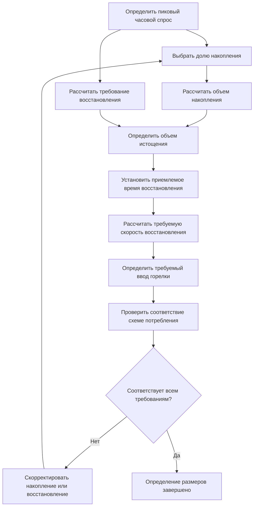
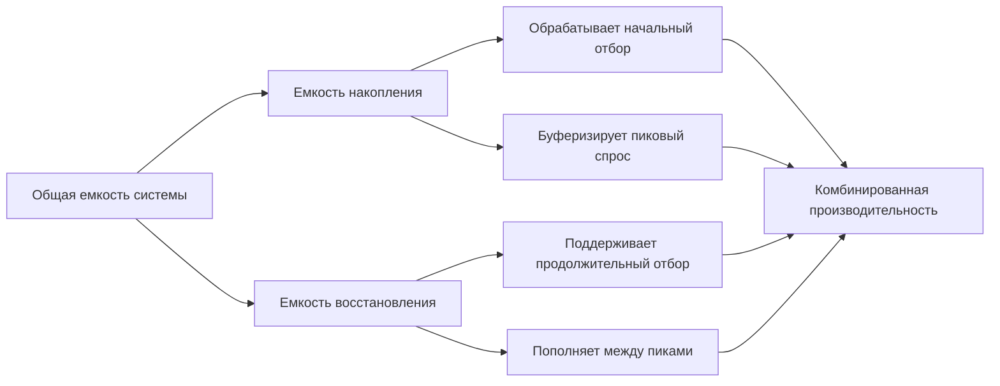

## Обзор метода времени восстановления

Метод времени восстановления балансирует емкость накопления относительно скорости нагрева для эффективного удовлетворения схем потребления. Этот подход определяет размеры водонагревателей на основе времени, необходимого для повторного нагрева израсходованного объема накопления, обеспечивая надлежащее снабжение в периоды пикового потребления при оптимизации емкости оборудования.

Метод решает фундаментальное соотношение между объемом хранящейся горячей воды, мощностью горелки и схемами потребления для предотвращения перебоев в снабжении во время последовательных отборов.

## Основное уравнение восстановления

Базовое расчетное значение скорости восстановления определяет, как быстро водонагреватель может восстановить температуру:

$$Q_{recovery} = \frac{m \cdot c_p \cdot \Delta T}{t_{recovery}}$$

Где:
- $Q_{recovery}$ = Скорость нагрева при восстановлении (кДж/ч)
- $m$ = Масса воды для нагрева (кг)
- $c_p$ = Удельная теплоемкость воды (4,18 кДж/кг·°C)
- $\Delta T$ = Повышение температуры (°C)
- $t_{recovery}$ = Допустимое время восстановления (ч)

Преобразование в расчет на основе литров:

$$Q_{recovery} = \frac{V_{tank} \cdot 1000 \cdot \Delta T}{t_{recovery}}$$

Где $V_{tank}$ — объем накопления в литрах.

## Скорость восстановления в литрах в час

Практическое выражение скорости восстановления, используемое при определении размеров:

$$R_{л/ч} = \frac{Q_{input} \cdot \eta_{recovery}}{1000 \cdot \Delta T}$$

Где:
- $R_{л/ч}$ = Скорость восстановления (л/ч)
- $Q_{input}$ = Ввод горелки (кДж/ч)
- $\eta_{recovery}$ = Эффективность восстановления (обычно 0,70–0,80 для газа, 0,90–0,98 для электричества)
- $\Delta T$ = Повышение температуры от входа до уставки (°C)

## Методология определения размеров

### Пошаговый процесс определения размеров

1. **Определить пиковый часовой спрос**: Установить максимальное часовое потребление горячей воды по единицам приборов, данным занятости или таблицам ASHRAE.

2. **Выбрать баланс накопления-восстановления**: Выбрать процент пикового спроса, удовлетворяемого емкостью накопления в сравнении с емкостью восстановления.

3. **Рассчитать объем накопления**:
$$V_{storage} = D_{peak} \cdot f_{storage}$$
Где $f_{storage}$ — доля накопления (обычно 0,25–0,70).

4. **Рассчитать долю восстановления**:
$$V_{recovery} = D_{peak} \cdot (1 - f_{storage})$$

5. **Установить время восстановления**: Определить приемлемый период восстановления истощения на основе интервалов потребления.

6. **Рассчитать требуемую скорость восстановления**:
$$R_{required} = \frac{V_{storage}}{t_{recovery}} + V_{recovery}$$

7. **Определить ввод горелки**:
$$Q_{input} = \frac{R_{required} \cdot 1000 \cdot \Delta T}{\eta_{recovery}}$$

## Стандарты типичного времени восстановления

| Тип применения | Приемлемое время восстановления | Доля накопления | Доля восстановления |
|---|---|---|---|
| Жилое | 2–4 часа | 60–70% | 30–40% |
| Офисное здание | 1–2 часа | 40–50% | 50–60% |
| Больница | 0,5–1 час | 30–40% | 60–70% |
| Ресторан/Кухня | 0,5–1 час | 25–35% | 65–75% |
| Гостиница/Мотель | 2–3 часа | 50–60% | 40–50% |
| Промышленное | 1–2 часа | 35–45% | 55–65% |

## Рассмотрение схем потребления

Метод времени восстановления требует подробного понимания характеристик спроса:

**Приложения с прерывистым высоким отбором**: Требуют большего накопления с более медленным восстановлением (прачечные, помещения для купания). Доля накопления 60–70%.

**Приложения с непрерывным умеренным отбором**: Благоприятствуют меньшему накоплению с высокими скоростями восстановления (коммерческие кухни, технологические приложения). Доля накопления 25–40%.

**Несколько периодов пиков**: Требуют достаточного восстановления между циклами спроса. Время восстановления должно быть меньше интервала между пиками.

## Баланс накопления и восстановления

Оптимальный баланс зависит от:

- **Ограничений по пространству**: Ограниченное пространство благоприятствует более высокому восстановлению, меньшему накоплению
- **Доступности источника энергии**: Газовое восстановление более экономично, чем большое электрическое накопление
- **Предсказуемости спроса**: Предсказуемые схемы позволяют агрессивное определение размеров восстановления
- **Требования рейтинга первого часа**: Должны соответствовать стандартам эффективности ASHRAE 90.1

## Факторы эффективности восстановления

Эффективность восстановления варьируется по типу нагревателя и условиям эксплуатации:

| Тип нагревателя | Типичная эффективность восстановления | Факторы, влияющие на эффективность |
|---|---|---|
| Газовое накопление | 70–76% | Потери в дымоходе, циклические потери |
| Газовое конденсирующее | 90–96% | Температура на входе, модуляция |
| Электрическое накопление | 95–98% | Минимальные потери, погружение элемента |
| Тепловой насос | 200–300% COP | Условия окружающей среды, температура источника |
| Косвенное (Котел) | 70–85% | Эффективность котла, теплообменник |

## Справочник стандартов ASHRAE

ASHRAE 90.1 Раздел 7.4.2 устанавливает минимальные требования производительности:

- Стандарты термической эффективности для водонагревателей с накоплением
- Ограничения потерь при стоянии на основе объема бака
- Требования эффективности восстановления для номинального ввода

Справочник ASHRAE—Приложения HVAC, Глава 50 обеспечивает:

- Таблицы определения размеров для различных типов зданий
- Процедуры расчета скорости восстановления
- Рекомендации по соотношению накопления-восстановления

## Практический пример определения размеров

Для офисного здания с пиковым часовым спросом 300 л, уставкой 60°C, входом 10°C:

Выбор доли накопления 45%:
- Объем накопления: $300 \times 0,45 = 135$ л
- Требование восстановления: $300 \times 0,55 = 165$ л/ч
- При времени восстановления 1,5 часа: $R_{required} = \frac{135}{1,5} + 165 = 255$ л/ч
- Повышение температуры: $\Delta T = 60 - 10 = 50°C$
- Для газового нагревателя (эффективность 75%): $Q_{input} = \frac{255 \times 1000 \times 50}{0,75} = 17 000 000$ кДж/ч

Выбрать бак объемом 150 л с вводом 75 кВт, обеспечивающий восстановление 265 л/ч.

## Критические соображения

**Выбор времени восстановления**: Должен учитывать самый короткий интервал между пиковыми спросами. Недостаточное время восстановления вызывает последовательные перебои.

**Вариация повышения температуры**: Температура входной воды варьируется сезонно. Определить размеры для самого холодного условия входа.

**Деградация эффективности**: Эффективность восстановления снижается с образованием накипи, неправильным сгоранием и старением. Включить коэффициент безопасности.

**Соответствие кодексу**: Проверить, что определение размеров соответствует минимальным требованиям кодекса энергоэффективности при удовлетворении спроса.

Метод времени восстановления обеспечивает точное определение размеров оборудования при хорошо определенных схемах потребления, оптимизируя капитальные затраты и эффективность эксплуатации посредством сбалансированного проектирования накопления-восстановления.
