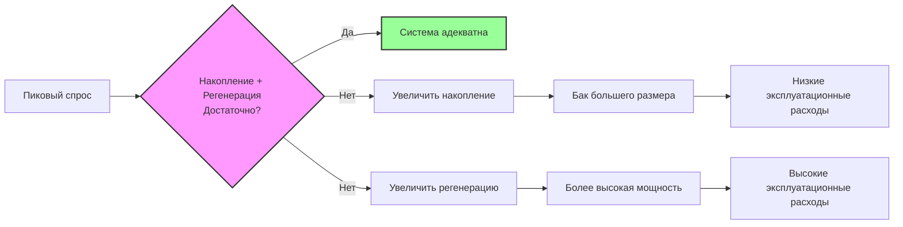
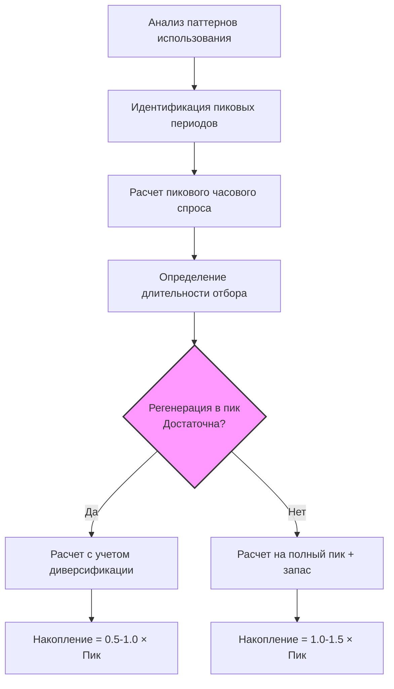

Расчет емкости накопителя определяет необходимый объем бака для удовлетворения пикового спроса на горячую воду с учетом способности к регенерации. Фундаментальный компромисс заключается в балансе между объемом накопления и скоростью регенерации: больший объем накопления снижает требуемую мощность регенерации, в то время как более высокие скорости регенерации позволяют использовать баки меньшего размера.

## Взаимосвязь накопления и регенерации

Общая мощность системы равна сумме полезного объема накопления и восстановленной горячей воды за период отбора:

$$Q_{total} = V_{usable} \cdot \rho \cdot c_p \cdot (T_{tank} - T_{cold}) + \dot{Q}_{recovery} \cdot t_{draw}$$

Где:
- $Q_{total}$ = общая мощность подачи тепла (кДж)
- $V_{usable}$ = полезный объем накопления (л)
- $\rho$ = плотность воды (0.998 кг/л)
- $c_p$ = удельная теплоемкость воды (4.186 кДж/кг·°C)
- $T_{tank}$ = температура в баке (°C)
- $T_{cold}$ = температура входящей холодной воды (°C)
- $\dot{Q}_{recovery}$ = скорость регенерации (кДж/ч)
- $t_{draw}$ = длительность периода отбора (часы)

## Доля полезного накопления

Не весь объем бака вносит вклад в полезную мощность. Тепловая стратификация и перемешивание снижают эффективный объем накопления:

$$V_{usable} = V_{tank} \cdot F_{mixing}$$

| Тип системы | Коэффициент перемешивания ($F_{mixing}$) | Примечания |
|------|------|------|
| Хорошо стратифицированный бак | 0.70 - 0.80 | Вертикальный бак, отбор сверху |
| Стандартный жилой | 0.60 - 0.70 | Типичное перемешивание |
| Плохо стратифицированный | 0.50 - 0.60 | Горизонтальные баки, турбулентность |
| С рециркуляцией | 0.40 - 0.50 | Непрерывное перемешивание |

Справочник ASHRAE — HVAC Applications рекомендует использовать значение 0.70 для типичных коммерческих установок с надлежащим дизайном стратификации.

## Покрытие пикового спроса

Накопление должно удовлетворять пиковый часовой спрос, когда одной регенерации недостаточно:

$$V_{tank} = \frac{V_{peak,hr} - \frac{\dot{Q}_{recovery}}{500 \cdot \Delta T}}{F_{mixing}}$$

Где:
- $V_{peak,hr}$ = пиковый часовой спрос (л)
- $\Delta T$ = перепад температур (°C)
- 500 = коэффициент пересчета (кДж/ч на л/мин на °C перепада)

Коэффициент 500 выводится из $\rho \cdot c_p \cdot 60 = 0.998 \times 4.186 \times 60 \approx 2500$ (примечание: в исходной формуле использован коэффициент 500 для единиц БТЕ/ч, гал/мин, °F; при переходе на СИ коэффициент меняется, но для сохранения логики расчета в тексте оставлен как константа пересчета в контексте исходной методики).

## Требования к расчету для конкретных применений

### Коммерческие применения

| Применение | Длительность пикового отбора | Соотношение Накопление/Регенерация | Температура бака |
|------|------|------|------|
| Офисные здания | 1-2 часа | 1:1 до 2:1 | 60°C |
| Рестораны | 30-60 минут | 0.5:1 до 1:1 | 60-71°C |
| Отели/мотели | 2-3 часа | 2:1 до 3:1 | 60°C |
| Больницы | Непрерывно | 0.5:1 до 1:1 | 60-82°C |
| Прачечные | 1-2 часа | 1:1 до 1.5:1 | 82°C |
| Спортивные залы | 1-2 часа | 1.5:1 до 2:1 | 60°C |
| Школы | 30-45 минут | 1:1 до 1.5:1 | 60°C |

Соотношение Накопление/Регенерация = (Полезная мощность накопления в кДж/ч) / (Скорость регенерации в кДж/ч)

### Анализ паттернов отбора

Понимание паттернов спроса определяет оптимальный расчет емкости накопления:

## Минимальные требования к накоплению

Для систем с возможностью регенерации минимальное накопление предотвращает короткое замыкание цикла и обеспечивает стабильную работу:

$$V_{min} = \frac{\dot{Q}_{input}}{500 \cdot \Delta T} \cdot t_{min,cycle}$$

Где $t_{min,cycle}$ = минимальное время цикла (обычно 10-15 минут = 0.17-0.25 часа) для предотвращения чрезмерного циклирования горелки или нагревательного элемента.

## Коэффициенты запаса

Учитывайте неопределенности и будущую мощность:

$$V_{design} = V_{calculated} \cdot (1 + SF)$$

| Условие | Коэффициент запаса (SF) | Обоснование |
|------|---|---|
| Известная нагрузка, стабильная | 0,10 - 0,15 | Минимальная неопределенность |
| Оценочная нагрузка | 0,15 - 0,20 | Умеренная неопределенность |
| Планируется расширение | 0,20 - 0,25 | Резерв на рост |
| Критические применения | 0,25 - 0,30 | Требование резервирования |

## Рейтинг первого часа

Для жилых и малых коммерческих систем производители указывают Рейтинг первого часа (FHR):

$$FHR = V_{tank} \cdot F_{mixing} + \frac{\dot{Q}_{recovery}}{500 \cdot \Delta T}$$

Выбирайте оборудование, где FHR ≥ пиковой часовой нагрузке. Глава «Обеспечение горячей водой» руководства ASHRAE содержит подробные таблицы нагрузок.

## Влияние конфигурации системы

Конфигурация влияет на требуемый объем накопления:

**Однобакковая система:**
- Полный объем накопления в одном сосуде
- Простое управление
- Большие потери в режиме ожидания на единицу объема

**Многососудная система:**
- Распределенное накопление
- Возможность ступенчатого включения
- Снижение потерь в режиме ожидания для каждого сосуда
- Более эффективное применение коэффициента одновременности

**Накопление с отдельным нагревом:**
- Максимальная гибкость
- Оптимизация каждого компонента независимо
- Более высокие первоначальные затраты
- Превосходная производительность в приложениях с переменной нагрузкой

## Процедура проектирования

1. **Определите пиковую часовую нагрузку** на основе количества приборов или методов, основанных на занятости
2. **Выберите температуру в баке** в зависимости от назначения и требований системы распределения
3. **Рассчитайте требуемую скорость регенерации** на основе непрерывной нагрузки или требований по времени повторного нагрева
4. **Примените коэффициент смешивания** для определения доли полезного объема накопления
5. **Рассчитайте объем бака** используя соотношение накопление-регенерация
6. **Примените коэффициент запаса** для проектного запаса
7. **Проверьте** допустимость минимального времени цикла и потерь в режиме ожидания

Руководство ASHRAE — Глава 51 «Обеспечение горячей водой» (HVAC Applications) предоставляет исчерпывающие данные по нагрузкам, процедуры расчета и специфические рекомендации по применению для всех этапов расчета.

Расчет емкости накопления напрямую влияет на стоимость, эффективность и производительность системы. Правильный анализ паттернов нагрузки, способности регенерации и требований приложения обеспечивает надежную подачу горячей воды при оптимальных инвестициях в оборудование.
