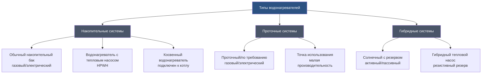

## Обзор

Системы горячего водоснабжения составляют 14-25% от общего энергопотребления зданий в жилых и коммерческих объектах. Выбор надлежащей технологии водонагревателя требует анализа профилей нагрузок, стоимости энергии, ограничений по пространству и требований эффективности. Современные типы водонагревателей кардинально отличаются по источнику энергии, методу накопления и характеристикам тепловой эффективности.

Министерство энергетики США (DOE) устанавливает минимальные стандарты эффективности для жилых и коммерческих водонагревателей, а ASHRAE 90.1 предоставляет дополнительные требования к производительности для коммерческих установок. Понимание метрик производительности и операционных характеристик каждой технологии необходимо для надлежащей спецификации системы.

## Классификация водонагревателей

## Метрики производительности

### Коэффициент энергии и тепловая эффективность

Коэффициент энергии (EF) количественно определяет общую эффективность водонагревателя с учетом потерь в режиме ожидания:

$$\text{EF} = \frac{Q_{\text{delivered}}}{Q_{\text{input}}} = \frac{m \cdot c_p \cdot \Delta T}{E_{\text{consumed}}}$$

Где:
- $Q_{\text{delivered}}$ = полезная энергия, подаваемая в воду (кДж)
- $Q_{\text{input}}$ = общая входная энергия (кДж)
- $m$ = масса нагреваемой воды (кг)
- $c_p$ = удельная теплоемкость воды (4,187 кДж/кг·°C)
- $\Delta T$ = температурный подъем (°C)
- $E_{\text{consumed}}$ = потребленная электрическая или топливная энергия (кДж)

Унифицированный коэффициент энергии (UEF) заменил EF в 2017 году, обеспечивая более реалистичные условия испытаний на основе фактических моделей использования. UEF учитывает циклические потери и потери тепла в режиме ожидания с повышенной точностью.

### Рейтинг первого часа

Рейтинг первого часа (FHR) указывает максимальный объем горячей воды, который может быть отпущен за один час при полном баке:

$$\text{FHR} = V_{\text{tank}} + (R_{\text{recovery}} \times 1 \text{ ч})$$

Где:
- $V_{\text{tank}}$ = объем накопительного бака (литры)
- $R_{\text{recovery}}$ = скорость восстановления (литры/час)

Скорость восстановления зависит от входной мощности и температурного подъема:

$$R_{\text{recovery}} = \frac{\dot{Q}_{\text{input}} \times \eta_{\text{thermal}}}{4.18 \times \Delta T}$$

Где:
- $\dot{Q}_{\text{input}}$ = входная мощность горелки или элемента (кДж/ч)
- $\eta_{\text{thermal}}$ = эффективность сгорания или элемента
- 4.18 = масса одного литра воды (кг/л)

## Сравнение типов водонагревателей

| Тип | Коэффициент энергии (UEF) | Скорость восстановления | Стоимость установки | Стоимость эксплуатации | Оптимальное применение | Срок служба |
|------|---------------------|---------------|----------------|----------------|------------------|----------|
| **Газовый накопительный бак** | 0,59-0,70 | 25-32 л/мин | Низкая (1,300-2,400 евро) | Средняя | Высокий спрос, низкая стоимость электроэнергии | 8-12 лет |
| **Электрический накопительный бак** | 0,90-0,95 | 11-16 л/мин | Низкая (800-1,900 евро) | Высокая | Низкий спрос, только электроэнергия | 10-15 лет |
| **Проточный газовый** | 0,82-0,96 | Не ограничена* | Высокая (2,400-4,800 евро) | Низкая-средняя | Переменный спрос, ограничено пространство | 20+ лет |
| **Проточный электрический** | 0,95-0,99 | Не ограничена* | Средняя (1,300-2,900 евро) | Средняя-высокая | Точка использования, малые нагрузки | 20+ лет |
| **Тепловой насос (HPWH)** | 2,0-3,5 | 9-13 л/мин | Высокая (2,900-5,600 евро) | Очень низкая | Умеренный климат, достаточное пространство | 10-15 лет |
| **Косвенный (котел)** | 0,70-0,85 | 25-63 л/мин | Средняя (1,900-4,000 евро) | Низкая-средняя | Существующий котел, гидравлические системы | 20-30 лет |
| **Солнечный + резерв** | 1,5-3,0 | Зависит от условий | Очень высокая (6,400-12,800 евро) | Очень низкая | Высокий солнечный ресурс, субсидии | 20+ лет |

*Подлежит ограничениям расхода и требованиям к температурному подъему

## Рассмотрение специфики технологий

### Водонагреватели с накопительным баком

Обычные накопительные баки поддерживают резервуар горячей воды с непрерывными потерями в режиме ожидания. Тепловая эффективность для газовых устройств:

$$\eta_{\text{thermal}} = \frac{Q_{\text{water}}}{Q_{\text{fuel}}} = \frac{m \cdot c_p \cdot \Delta T}{\dot{m}_{\text{fuel}} \times \text{HHV}}$$

Минимальные стандарты DOE (действует с 2015 года):
- Газовое накопление ≥208 л: UEF ≥ 0,64 (жилое)
- Электрическое накопление ≥208 л: UEF ≥ 0,93 (жилое)

Коэффициент потерь тепла в режиме ожидания не должен превышать 0,84% в час для газовых установок в соответствии с правилами DOE.

### Проточные водонагреватели

Проточные установки исключают потери в режиме ожидания, но требуют высоких мгновенных входных мощностей. Минимальная требуемая входная мощность:

$$\dot{Q}_{\text{required}} = \frac{\dot{V} \times 4.18 \times \Delta T \times 3600}{\eta_{\text{thermal}}}$$

Где:
- $\dot{V}$ = расход (литры в минуту)
- 3600 = коэффициент преобразования (с/ч)

Для душа с расходом 0,16 л/сек при подъеме температуры 39°C при эффективности 0,85:

$$\dot{Q}_{\text{required}} = \frac{0,16 \times 4.18 \times 39 \times 3600}{0.85} = 109,286 \text{ кДж/ч}$$

ASHRAE 90.1-2019 требует UEF ≥ 0,81 для проточных газовых установок производительностью <632 кДж/ч·л.

### Водонагреватели с тепловым насосом

HPWH достигают значений коэффициента производительности (COP) 2,0-3,5 путем извлечения тепла из окружающего воздуха:

$$\text{COP} = \frac{Q_{\text{delivered}}}{W_{\text{compressor}} + W_{\text{fans}}}$$

Тепло, удаляемое из окружающего пространства:

$$Q_{\text{cooling}} = Q_{\text{delivered}} \times \left(1 - \frac{1}{\text{COP}}\right)$$

Этот охлаждающий эффект приносит пользу в теплом климате, но увеличивает нагрузки отопления в холодном климате. Минимальная температура окружающей среды для работы обычно составляет 3-7°C в зависимости от производителя.

Стандарты DOE требуют UEF ≥ 2,0 для жилых электрических HPWH объемом ≥208 л.

### Косвенные водонагреватели

Косвенные водонагреватели используют теплообменник, погруженный в накопительный бак, с горячей водой или паром от котла, циркулирующими через змеевик. Эффективность системы:

$$\eta_{\text{system}} = \eta_{\text{boiler}} \times \eta_{\text{HX}} \times \left(1 - L_{\text{standby}}\right)$$

Где:
- $\eta_{\text{boiler}}$ = сезонная эффективность котла
- $\eta_{\text{HX}}$ = эффективность теплообменника (0,85-0,95)
- $L_{\text{standby}}$ = доля потерь в режиме ожидания

Высокоэффективные котлы (AFUE > 90%) в сочетании с хорошо изолированными накопительными баками достигают эффективности системы 0,75-0,85.

### Системы солнечного нагрева воды

Солнечная доля (SF) представляет процент от годовой нагрузки горячего водоснабжения, обеспеченной солнцем:

$$\text{SF} = \frac{Q_{\text{solar}}}{Q_{\text{total demand}}}$$

Активные системы используют насосы и контроллеры для циркуляции теплоносителя через коллекторы. Пассивные системы полагаются на конструкции термосифона или интегрированного накопителя коллектора (ICS). Резервное отопление (электрическое, газовое или тепловой насос) обеспечивает дополнительную мощность при низкой доступности солнца.

Размерирование системы требует данных о местном солнечном излучении, кривых эффективности коллектора и профилей нагрузок. Хорошо спроектированные системы достигают SF 50-80% в подходящих климатических условиях.

## Критерии выбора

### Анализ профиля нагрузки

Выбор водонагревателя начинается с характеристики спроса на горячую воду:

1. **Период пикового спроса** - максимальный одновременный расход через приборы
2. **Суточное потребление** - общее количество литров в день
3. **Модель использования** - частота и продолжительность периодов отбора
4. **Требования времени восстановления** - время между основными периодами отбора

Накопительная мощность должна соответствовать пиковым спросам, в то время как входная мощность должна обрабатывать требования восстановления между событиями.

### Анализ затрат на энергию

Анализ затрат жизненного цикла сравнивает общие затраты на владение:

$$\text{LCC} = C_{\text{initial}} + \sum_{t=1}^{n} \frac{C_{\text{energy,t}} + C_{\text{maint,t}}}{(1+r)^t}$$

Где:
- $C_{\text{initial}}$ = стоимость установленного оборудования
- $C_{\text{energy,t}}$ = годовая стоимость энергии в году $t$
- $C_{\text{maint,t}}$ = годовая стоимость обслуживания в году $t$
- $r$ = учетная ставка
- $n$ = период анализа (годы)

Высокоэффективные технологии с большими начальными затратами часто достигают более низких LCC за счет снижения операционных расходов.

### Соответствие нормам

ASHRAE 90.1-2019 устанавливает минимальные требования к производительности для коммерческих водонагревателей:
- Накопительные водонагреватели: на основе объема накопления и входной мощности
- Проточные водонагреватели: пороги UEF или тепловой эффективности
- Водонагреватели с тепловым насосом: требования COP
- Теплоакумулирующие баки: максимальные значения UA (кДж/ч·°C)

Международный энергетический кодекс по экономии (IECC) принимает аналогичные стандарты для жилых приложений.

## Заключение

Выбор технологии водонагревателя требует балансирования эффективности, мощности, ограничений установки и операционных затрат. Системы с накопительным баком обеспечивают простые, недорогие решения для постоянных нагрузок. Проточные установки превосходно работают в ограниченных по пространству приложениях с переменным спросом. Водонагреватели с тепловым насосом достигают наивысшей эффективности в умеренном климате. Косвенные системы эффективно интегрируются с гидравлическим отоплением. Системы солнечного нагрева максимизируют использование возобновляемой энергии, где климат и экономика совпадают.

Надлежащее размерирование с использованием расчетов FHR, проверка соответствия кодексам DOE и ASHRAE, а также анализ затрат жизненного цикла обеспечивают оптимальную производительность системы и энергоэффективность.
