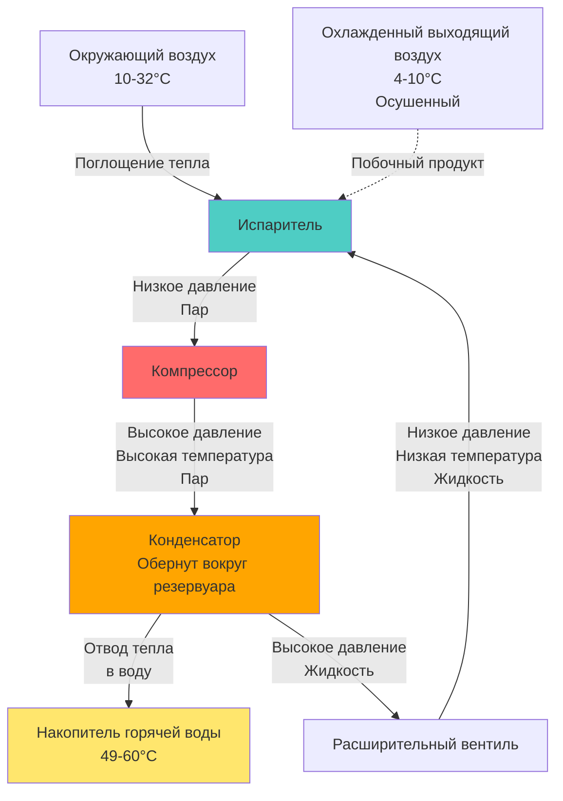

## Обзор

Тепловые насосы для нагрева воды (HPWH) представляют собой наиболее энергоэффективную технологию электрического водяного отопления, использующую цикл компрессионного охлаждения для извлечения тепловой энергии из окружающего воздуха и передачи её в систему горячего водоснабжения. В отличие от резистивных электрических нагревателей, которые преобразуют электрическую энергию в тепло с теоретической максимальной эффективностью 100%, HPWH перемещают тепло из одного места в другое, достигая коэффициентов производительности (COP) в диапазоне от 2,0 до 4,0.

Основной принцип работы включает цикл охлаждения, в котором компрессор, испаритель, конденсатор и расширительное устройство работают согласованно, поглощая тепло из окружающего воздуха и отводя его в накопитель горячей воды. Этот процесс имеет дополнительное преимущество в виде осушения и охлаждения пространства, где расположена установка, что может снизить нагрузку на охлаждение в теплом климате, но может увеличить нагрузку на отопление в холодном климате.

## Термодинамическая производительность

Коэффициент производительности количественно выражает эффективность HPWH как отношение полезного тепла, переданного электрической энергии:

$$COP = \frac{Q_H}{W_{input}}$$

Где:
- $Q_H$ = тепло, переданное воде (кДж/ч или кВт)
- $W_{input}$ = электрическая мощность, подаваемая на компрессор и вентиляторы (кДж/ч или кВт)

Унифицированный коэффициент энергии (UEF) обеспечивает стандартизированный показатель в соответствии с процедурами испытания DOE. Текущие спецификации Energy Star Version 4.0 требуют:
- UEF ≥ 3,75 для жилых HPWH емкостью 50-55 л
- UEF ≥ 3,55 для установок емкостью 65-80 л

Фактический COP варьируется в зависимости от температуры окружающего воздуха, температуры поступающей воды и установки температуры на выходе:

$$COP_{actual} = COP_{rated} \times \left(1 + k \cdot \frac{T_{amb} - T_{rated}}{T_{rated}}\right)$$

Где $k$ представляет коэффициент температурной чувствительности (обычно 0,015–0,025 для HPWH). Производительность снижается при температуре окружающего воздуха ниже 7°C и выше 35°C.

## Цикл охлаждения для нагрева воды

Цикл охлаждения извлекает явное и скрытое тепло из окружающего воздуха на испарителе (обычно около 424 м³/ч воздушного потока), сжимает холодильный агент для повышения температуры и давления, затем отводит тепло через катушку конденсатора, обернутую вокруг или погруженную в накопитель. Расширительный вентиль дросселирует жидкий холодильный агент под высоким давлением до условий испарителя, завершая цикл.

## Конфигурации систем

| Конфигурация | Описание | Преимущества | Недостатки | Типичные приложения |
|---------------|---------|------------|-----------|-------------------|
| **Интегрированная установка** | Автономный резервуар с тепловым насосом, установленным сверху | Простота установки, единое оборудование, компактная занимаемая площадь | Ограниченная гибкость размещения, требует достаточного объема воздуха в помещении | Жилые замены, механические помещения, кондиционируемые пространства |
| **Разделенная система** | Удаленный тепловой насос, подключенный к отдельному резервуару | Гибкое размещение, тепловой насос в некондиционируемом пространстве, тише | Более высокая стоимость установки, требуется набор линий холодильного агента, потенциальные точки утечки | Коммерческие приложения, модернизация, тесные механические помещения |
| **Канальная конфигурация** | Воздухозаборники/выпуски для удаленного источника воздуха | Возможность использования наружного воздуха или удаленных пространств, сниженное влияние на кондиционируемое пространство | Дополнительные затраты на установку воздуховодов, повышенное статическое давление снижает эффективность | Гаражи, некондиционируемые подвалы, подпольные пространства |
| **Некканальная** | Установка забирает воздух и выпускает его в окружающее пространство | Минимальная стоимость установки, максимальная эффективность (без потерь в воздуховодах) | Должна располагаться в достаточном пространстве, влияет на температуру/влажность помещения | Кондиционируемые подвалы, служебные помещения с достаточным объемом |

## Требования к окружающему воздуху

HPWH требуют достаточного объема воздуха для извлечения тепла без чрезмерного падения температуры:

$$V_{min} = \frac{Q_{capacity} \times 3,41}{CFM \times 1,08 \times \Delta T_{allowable}}$$

Для типового жилого HPWH емкостью 50 л с производительностью 11,7 кВт (режим теплового насоса) и воздушным потоком 236 м³/ч:

$$V_{min} = \frac{11,7 \times 3,41}{236 \times 1,08 \times 5,6} \approx 71 \text{ м}^3$$

Стандарты DOE требуют минимум 19,8 м³ окружающего воздуха для некканальных установок. Недостаточный объем воздуха вызывает быстрое падение температуры, срабатывание резервных резистивных элементов и снижение эффективности.

## Работа в холодном климате

Производительность HPWH значительно снижается при температуре окружающего воздуха ниже 7°C. При 4°C COP обычно падает до 1,8–2,2, а ниже 2°C многие установки не могут работать в режиме теплового насоса и переходят на резервное резистивное нагревание. Стратегии работы в холодном климате включают:

- **Канальный забор из кондиционируемого пространства**: Поддерживает более высокие температуры испарителя, но увеличивает нагрузку на отопление помещения
- **Рекуперация тепла выхлопа**: Захват охлажденного выхлопного воздуха для охлаждения или осушения
- **Гибридная работа**: Программирование установки на использование резистивных элементов в самые холодные месяцы
- **Стратегическое размещение**: Установка в пространствах с избыточным теплом (механические помещения, рядом с приборами)

Годовое энергопотребление в климате с преобладанием отопления должно учитывать взаимодействие между эффектом охлаждения HPWH и повышенной нагрузкой на отопление помещения:

$$E_{total} = E_{HPWH} + \frac{Q_{cooling} \times HDD \times 24}{\eta_{heating} \times 10^6}$$

Где HDD представляет градусо-дни отопления, а $\eta_{heating}$ — эффективность системы отопления помещения.

## Преимущество осушения

HPWH обеспечивают существенное скрытое охлаждение, удаляя приблизительно 0,9–1,9 л влаги в час во время работы. В влажном климате это осушение обеспечивает ценность сверх нагрева воды:

$$Q_{latent} = CFM \times 0,68 \times \Delta W \times h_{fg}$$

Где $\Delta W$ — изменение коэффициента влажности (кг воды/кг сухого воздуха), а $h_{fg}$ = 2 450 кДж/кг. При типичной работе с удалением около 0,9 л/ч скрытое охлаждение составляет приблизительно 2,3–2,9 кВт, что может компенсировать 25–30% от общей охлаждающей энергии, извлекаемой из воздуха.

## Проектные рекомендации

**Требования к установке:**
- Минимальные зазоры для воздушного потока (обычно 30 см спереди, 15 см по бокам)
- Напольный слив или удаление конденсата для сбора влаги
- Электроснабжение: цепь 30A для установок с резервным резистивным нагревом
- Акустические рассмотрения: обычно 49–55 дBA

**Определение размера емкости:**
Производительность восстановления объединяет выход теплового насоса с объемом резервуара. Рейтинг первого часа (FHR) должен превышать пиковый спрос. Для жилых помещений:

$$FHR_{required} = N_{bedrooms} \times 113 + 38 \text{ л}$$

**Органы управления и режимы работы:**
- Только тепловой насос: максимальная эффективность, более медленное восстановление
- Гибридный/автоматический: баланс между эффективностью и скоростью восстановления
- Электрический/резистивный: резервный для высокого спроса или холодных условий
- Режим отпуска: поддерживает минимальную температуру

**Техническое обслуживание:**
- Ежегодная очистка/замена воздушного фильтра
- Проверка дренажа конденсата
- Проверка анодного стержня (защита резервуара от коррозии)
- Проверка заряда холодильного агента (разделенные системы)

## Нормативные стандарты

Текущие нормативы DOE (10 CFR 430) устанавливают минимальные стандарты эффективности, вступившие в силу в апреле 2015 года. Сертификация Energy Star требует производительности, превышающей федеральные минимумы на 15–20%, обеспечивая значения UEF выше 3,5 для большинства жилых размеров. Местные программы возмещения коммунальных расходов и федеральные налоговые льготы (до $2 000 в соответствии с положениями Закона о сокращении инфляции до 2032 года) стимулируют внедрение HPWH как части стратегии декарбонизации зданий.
