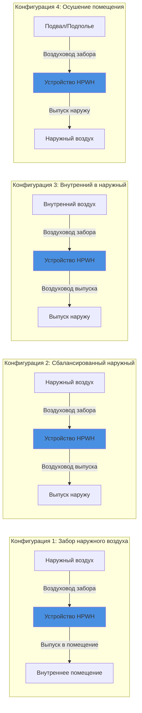

## Обзор

Установки тепловых насосов для нагрева воды с воздуховодами (HPWH) расширяют точки забора воздуха и выпуска за пределы самого устройства, обеспечивая гибкое размещение в ограниченных пространствах, кондиционируемых помещениях или местах, где локальный воздухообмен нежелателен. Воздуховоды позволяют устройству забирать воздух с улицы, из соседних помещений или вентилируемых зон, одновременно выпуская охлажденный, осушенный воздух в соответствующие места выброса. Надлежащее проектирование воздуховодов критически важно для поддержания расходов воздуха, минимизации потерь на статическое давление и сохранения эффективности системы.

## Основы расчета размеров воздуховодов

Тепловые насосы для нагрева воды обычно перемещают 200–500 CFM (339–849 м³/ч) в зависимости от мощности и производителя. Недостаточный размер воздуховодов увеличивает статическое давление, снижает поток воздуха, уменьшает COP и может вызвать коды ошибок.

### Требования к расходу воздуха

Технические характеристики производителя определяют требуемый расход воздуха на испарителе. Типичные бытовые устройства работают при:

| Мощность устройства | Типичный расход воздуха | Рекомендуемый диаметр воздуховода |
|---------------|-----------------|---------------------------|
| 189 л | 200–250 CFM (339–424 м³/ч) | 152–178 см |
| 246–303 л | 250–350 CFM (424–594 м³/ч) | 178–203 см |
| Коммерческие (>303 л) | 350–500 CFM (594–849 м³/ч) | 203–254 см |

### Расчеты статического давления

Максимально допустимое внешнее статическое давление составляет от 25 до 75 Па (0,1–0,3 дюйма вод. ст.) для большинства бытовых HPWH. Общее статическое давление представляет собой сумму потерь на трение и потерь на фитингах:

$$
\Delta P_{\text{total}} = \Delta P_{\text{friction}} + \Delta P_{\text{fittings}}
$$

Потеря давления на трение на 100 футов прямого воздуховода:

$$
\Delta P_{\text{friction}} = f \cdot \frac{L}{D} \cdot \frac{\rho V^2}{2} \cdot \frac{1}{12}
$$

Где:
- $f$ = коэффициент трения (безразмерный, обычно 0,02–0,03 для гладких воздуховодов)
- $L$ = длина воздуховода (м)
- $D$ = диаметр воздуховода (м)
- $\rho$ = плотность воздуха (1,2 кг/м³ при стандартных условиях)
- $V$ = скорость воздуха (м/с)

Для практического расчета ограничьте скорость в воздуховоде до 4–5 м/с на входе и 5–6 м/с на выпуске, чтобы минимизировать шум и падение давления.

### Потери на фитингах

Каждый отвод, переход или окончание добавляет эквивалентную длину:

| Тип фитинга | Эквивалентная длина (диаметры) |
|--------------|-------------------------------|
| Отвод 90° | 30–40 D |
| Отвод 45° | 15–20 D |
| Тройник ответвления | 60–80 D |
| Колпак стены/капюшон | 20–30 D |
| Переход (резкий) | 10–15 D |

Минимизируйте количество фитингов и используйте отводы с большим радиусом, где это возможно. Система с воздуховодом с двумя отводами 90° и колпаком стены на участке воздуховода 6 м диаметром 18 см добавляет примерно 37–62 Па статического давления.

## Конфигурации воздуховодов

## Сравнение вариантов маршрутизации воздуховодов

| Конфигурация | Преимущества | Недостатки | Лучшие приложения |
|---------------|------------|---------------|-------------------|
| **Забор наружного воздуха, выпуск в помещение** | Предотвращает нагрузку на кондиционирование; простой выпуск | Требует надлежащего окончания забора; защита от замерзания в холодных климатах | Механические помещения в жарких климатах; помещения, где охлаждение нежелательно |
| **Сбалансированный наружный** | Отсутствие влияния на нагрузку здания; круглогодичная работа | Максимальная сложность воздуховодов; два пробоя; максимальное падение давления | Кондиционируемые помещения; помещения, чувствительные к шуму; герметичные здания |
| **Забор внутреннего воздуха, выпуск наружу** | Обеспечивает охлаждение и осушение помещения | Повышает нагрузку отопления зимой; требует выпуска наружу | Неотапливаемые подвалы; механические помещения; жаркие климаты |
| **Целевое осушение помещения** | Двойное назначение: горячая вода + контроль влажности | Должен обеспечить адекватный объем воздуха в исходном помещении | Подполья; подвалы; закрытые гаражи |

## Требования подключения наружного воздуха

При заборе наружного воздуха убедитесь в следующем:

1. **Окончание забора**: Установите экранированный капюшон или колпак стены с минимальной сеткой 6,4 мм для предотвращения попадания мусора и вредителей. Расположите забор так, чтобы избежать рециркуляции выпущенного воздуха.

2. **Дренаж конденсата**: Наружный воздух во влажных климатах может произвести дополнительный конденсат на воздушном фильтре или переходе забора. Обеспечьте дренаж или наклон воздуховодов в сторону устройства.

3. **Защита от замерзания**: В климатах с продолжительными периодами ниже 4°C изолируйте воздуховоды забора и проверьте минимальную рабочую температуру производителя. Некоторые устройства включают амортизирующие клапаны на входе, которые закрываются во время режима ожидания, чтобы предотвратить инфильтрацию холодного воздуха.

4. **Зазоры**: Соблюдайте минимальный зазор 30 см от уровня земли, 60 см от границ участка и 90 см от механического выпуска или воздухозаборов горения в соответствии с указаниями производителя и местными кодексами.

## Стратегии звукоизоляции

Вентиляторы HPWH генерируют 45–55 дBA на расстоянии 1 м. Установки с воздуховодами могут усилить или передавать шум через жесткие пути воздуховодов.

### Методы снижения шума

- **Гибкие секции воздуховодов**: Установите 1–1,5 м изолированного гибкого воздуховода между устройством и жестким воздуховодом, чтобы отделить передачу вибрации.

- **Облицовка воздуховода**: Выстелите первые 3 м жесткого воздуховода 25 см стекловолокна для облицовки воздуховодов (снижение шума на 25–50% в диапазоне 250–1000 Гц).

- **Глушители**: Вставьте цилиндрические глушители (30–60 см длины) в воздуховоды выпуска для критических приложений. Добавляет 12–25 Па статического давления.

- **Избегайте прямых соединений**: Никогда не подключайте забор или выпуск непосредственно к жилым помещениям без звукоизоляции. Маршрутизируйте через механические помещения или буферные пространства.

## Лучшие практики установки

1. **Поддерживайте воздуховоды независимо**: Не позволяйте весу воздуховода давить на корпус HPWH. Используйте скобы каждые 1,5 м для горизонтальных участков.

2. **Герметизируйте все соединения**: Используйте мастику или ленту из фольги, соответствующую UL 181. Утечки снижают поток воздуха и эффективность.

3. **Изолируйте по мере необходимости**: Изолируйте наружные воздуховоды и все воздуховоды, проходящие через неотапливаемые пространства, до RSI 1,06 минимум, чтобы предотвратить конденсацию и потери тепла.

4. **Проверьте расход воздуха**: После установки измерьте статическое давление на устройстве и подтвердите, что оно остается ниже пределов производителя. Отрегулируйте размер воздуховода при необходимости.

5. **Обеспечьте доступ для обслуживания**: Убедитесь, что воздушные фильтры остаются доступными. Устройства с воздуховодами по-прежнему требуют чистки фильтров каждые 1–3 месяца в зависимости от уровня пыли.

## Руководства производителей и стандарты

Обратитесь к:
- **Руководствам по установке производителя**: Таблицы размеров воздуховодов, максимальная длина воздуховода и максимальное количество фитингов.
- **ASHRAE 90.2**: Нормативные требования к системам воздуховодов HVAC для жилых помещений, применимые к воздуховодам HPWH.
- **ACCA Manual D**: Принципы проектирования воздуховодов для систем низкого давления в жилых помещениях.
- **IMC Section 504**: Механическая вентиляция и системы выпуска.

Установки HPWH с воздуховодами значительно расширяют возможности применения, но требуют тщательного внимания к потоку воздуха, статическому давлению и акустическому проектированию для поддержания эффективности и комфорта жильцов.
