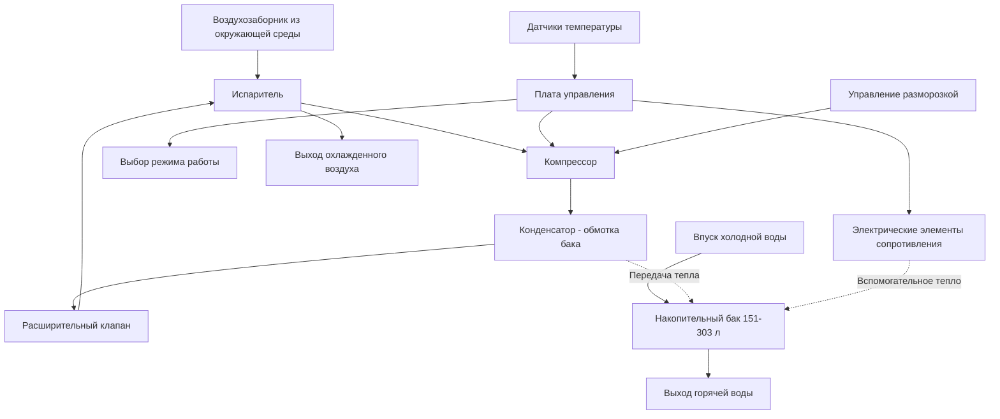

## Обзор системы

Интегрированные тепловые насосы для нагрева воды (HPWH) объединяют цикл паровой компрессии холодильной машины с накопительным баком в единый заводском собранном узле. Модуль теплового насоса устанавливается непосредственно на накопительном баке или рядом с ним, извлекая тепловую энергию из окружающего воздуха для нагрева воды и одновременно охлаждая и осушая окружающее пространство.

Эти системы достигают тепловой эффективности в 2–3 раза выше, чем обычные электрические проточные нагреватели воды, благодаря использованию цикла холодильной машины для перемещения тепла, а не его генерирования посредством электрического сопротивления. Стандартные интегрированные установки имеют объем от 151 до 303 л с мощностью теплового насоса от 440 до 1320 Вт.

## Термодинамическая производительность

### Коэффициент производительности

COP характеризует тепловую эффективность теплового насоса как отношение полезного теплового выхода к электрической энергии на входе:

$$\text{COP} = \frac{Q_{\text{heating}}}{W_{\text{compressor}} + W_{\text{fan}}}$$

Где:
- $Q_{\text{heating}}$ = тепло, передаваемое воде (кДж/ч)
- $W_{\text{compressor}}$ = электрическое потребление компрессора (кДж/ч)
- $W_{\text{fan}}$ = электрическое потребление вентилятора испарителя (кДж/ч)

Интегрированные системы HPWH достигают значений COP от 2,0 до 4,0 в зависимости от условий окружающей среды, с пиковой производительностью при температуре окружающей среды 21 °C и 50% относительной влажности. COP снижается при более низких температурах окружающей среды из-за снижения давления испарения хладагента и возрастания работы компрессора.

### Унифицированный энергетический коэффициент

Унифицированный энергетический коэффициент DOE (UEF) стандартизирует измерение эффективности при различных режимах потребления:

$$\text{UEF} = \frac{\sum{Q_{\text{delivered}}}}{\sum{E_{\text{input}}}}$$

Сертифицированные Energy Star интегрированные установки HPWH должны достигать UEF ≥ 3,0, что представляет улучшение на 200% по сравнению с минимально соответствующими нормам электрическими проточными нагревателями воды (UEF ≈ 0,95).

## Компоненты системы

### Основные компоненты

| Компонент | Функция | Спецификации |
|-----------|---------|--------------|
| Компрессор | Сжатие хладагента | 0,19–0,56 кВт ротационный или поршневой |
| Испаритель | Поглощение тепла из воздуха | Оребренная труба, 71–191 м³/ч (420–450 CFM) |
| Конденсатор | Отвод тепла в воду | Обмотанная или погруженная спираль, 1320–5280 Вт |
| Расширительное устройство | Снижение давления хладагента | Капиллярная трубка или TXV |
| Накопительный бак | Тепловое хранилище | 151–303 л, 5 см пенной изоляции |
| Вспомогательные элементы | Дополнительный нагрев | 3,8–4,5 кВт электрического сопротивления |
| Плата управления | Выбор режима и безопасность | Микропроцессор с несколькими датчиками |

## Режимы работы

Интегрированные установки HPWH предоставляют несколько режимов работы для баланса между эффективностью, скоростью восстановления и требованиями приложения:

1. **Только тепловой насос (режим экономии)** — максимально эффективная работа с использованием только компрессора теплового насоса. COP = 2,5–4,0, время восстановления 4–8 часов для полного бака.

2. **Гибридный режим (автоматический)** — автоматический выбор между тепловым насосом и электрическим сопротивлением на основе режимов потребления. Активирует вспомогательные элементы при больших объемах потребления.

3. **Только электрическое сопротивление (высокий спрос)** — обходит тепловой насос для наиболее быстрого восстановления. Используется во время пиковых периодов спроса или при температуре окружающей среды ниже 4 °C.

4. **Режим отпуска** — поддерживает минимальную уставку (10–16 °C) для предотвращения замерзания при минимизации энергопотребления.

## Мощность и определение размера

### Расчет номинальной мощности за первый час

$$\text{FHR} = \frac{Q_{\text{HP}} + Q_{\text{ER}}}{293} \times 1 \text{ ч} + V_{\text{tank}} \times 0,7$$

Где:
- FHR = номинальная мощность за первый час (л)
- $Q_{\text{HP}}$ = мощность теплового насоса (кДж/ч)
- $Q_{\text{ER}}$ = мощность электрического сопротивления (кДж/ч) если активна
- $V_{\text{tank}}$ = объем бака (л)
- 0,7 = полезная доля хранимой горячей воды

| Объем бака | Мощность теплового насоса | FHR (только TH) | FHR (гибридный) | UEF | Применение |
|-----------|--------------------------|-----------------|-----------------|-----|-----------|
| 151 л | 440–586 Вт | 170–189 л | 208–246 л | 3,0–3,5 | 1–2 человека |
| 189 л | 586–733 Вт | 197–219 л | 246–284 л | 3,2–3,7 | 2–3 человека |
| 246 л | 733–1025 Вт | 227–257 л | 284–333 л | 3,3–3,8 | 3–4 человека |
| 303 л | 1025–1320 Вт | 272–310 л | 341–397 л | 3,4–4,0 | 4–6 человек |

## Требования к установке

### Требования к пространству

Интегрированные установки HPWH требуют минимальных зазоров для надлежащего воздушного потока и обслуживания:

- **Минимальный объем воздуха**: 19,8–28,3 м³ открытого пространства
- **Высота помещения**: минимум 2,1–2,4 м для теплового насоса на крыше
- **Зазор для обслуживания**: 46–61 см со стороны панели доступа
- **Зазор для воздушного потока**: 15–30 см вокруг воздухозаборника/выхода

Неадекватный объем пространства вызывает быстрое снижение температуры окружающей среды, снижение COP и потенциальное срабатывание отключения при низкой температуре (обычно 3–4 °C).

### Акустические соображения

Работа теплового насоса создает звук от компрессора и вентилятора испарителя:

- **Уровень звукового давления**: 49–65 дBA на расстоянии 0,9 м
- **Частотное содержание**: широкополосное с тональными компонентами на частоте компрессора (основная частота 60 Гц)
- **Стратегии снижения**: разместить подальше от спален, установить на виброизолирующие подкладки, обеспечить надлежащие зазоры

Уровни шума превышают уровни проточных электрических нагревателей воды (< 35 дBA), но остаются ниже типичного оборудования HVAC (55–75 dBA).

## Холодильные системы

Современные интегрированные установки HPWH используют экологичные хладагенты:

| Хладагент | Тип | GWP | Рабочее давление | Применение |
|-----------|-----|-----|------------------|-----------|
| R-134a | HFC | 1430 | Низкое (483–1034 кПа испарения) | Системы прошлого поколения |
| R-744 (CO₂) | Природный | 1 | Транскритическое (6206–9653 кПа) | Установки премиум-класса |
| R-1234yf | HFO | 4 | Низкое (483–1034 кПа испарения) | Текущее производство |
| R-290 (пропан) | Природный | 3 | Низкое (345–896 кПа испарения) | Перспективные жилые системы |

Системы R-744 (CO₂) достигают наиболее высоких значений COP (3,5–4,5) благодаря превосходным свойствам передачи тепла, но требуют специализированных компонентов высокого давления и управления.

## Стандарты производительности

### Требования сертификации Energy Star

- **UEF ≥ 3,0** для интегрированного электрического HPWH
- **Номинальная мощность за первый час ≥ 189 л** для стандартных жилых приложений
- **Максимальные потери в режиме ожидания**: 135 Вт для установок на 189 л
- **Рейтинг звука**: раскрыто согласно стандарту AHRI 1160

### Процедуры тестирования DOE

24-часовой имитационный тест использования согласно 10 CFR 430, подчасть B, приложение E, оценивающий:
- Энергопотребление при различных режимах потребления
- Потери тепла в режиме ожидания
- Эффективность восстановления
- Проверка номинальной мощности за первый час

## Преимущества и ограничения

### Преимущества системы

- Снижение энергопотребления на водяное отопление на 50–70% по сравнению с электрическим сопротивлением
- Ежегодное удаление влаги при осушении от 151 до 227 л в режиме теплового насоса
- Преимущество охлаждения пространства от 440 до 1320 Вт во время работы
- Более низкие жизненные затраты несмотря на начальную стоимость оборудования в 2–3 раза выше

### Ограничения проектирования

- Зависимость от температуры окружающей среды (оптимум 10–32 °C, отключение ниже 3–4 °C)
- Более длительное время восстановления (4–8 часов в сравнении с 1–2 часами электрического сопротивления)
- Более высокое создание шума требует акустического планирования
- Более крупный физический размер (высота обычно 168–213 см)
- Требование отвода конденсата (7,6–15,1 л/день)

## Руководство по применению

Интегрированные системы HPWH достигают оптимальной производительности в кондиционируемых или полукондиционируемых пространствах (подвалы, механические помещения, гаражи) со стабильной температурой окружающей среды выше 10 °C. Установки в некондиционируемых пространствах требуют гибридного режима работы или резервного электрического сопротивления в зимние месяцы.

Выбирайте интегрированные конфигурации для новых проектов и модернизации, где ограничения пространства исключают разделенные системы, но существует достаточный объем установки. Для механических помещений, обслуживающих несколько функций, учитывайте эффект охлаждения при определении размера оборудования кондиционирования помещения.

Проверьте местные нормативные требования для трубопровода отвода температурного и предохранительного клапана, маршрутизации отвода конденсата и емкости электроснабжения (обычно цепь 30 А при 240 В для гибридной работы).
