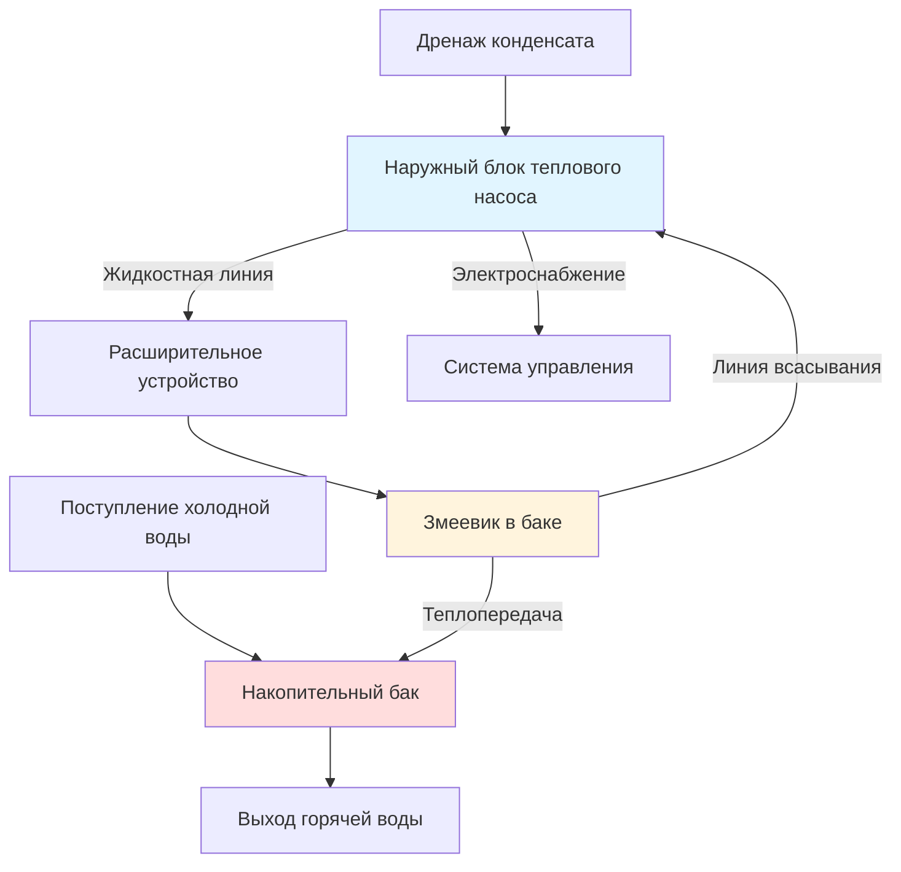

## Обзор

Тепловые насосы для нагрева воды (ТНВН) с раздельной системой отделяют испаритель/компрессор теплового насоса от накопительного бака и соединяют их фреонопроводами. Такая конфигурация обеспечивает гибкость монтажа, звукоизоляцию и доступ к наружному воздуху как источнику тепла, что делает раздельные ТНВН особенно выгодными для применения в холодном климате и помещениях с ограниченным пространством.

## Конфигурация системы

Раздельная система ТНВН состоит из:

- **Наружный блок**: Испаритель, компрессор, расширительное устройство, элементы управления
- **Накопительный бак**: Теплоизолированный бак с теплообменником фреон-вода (оборачивающий или погруженный змеевик)
- **Фреонопроводы**: Жидкостная и линия всасывания, соединяющие наружный блок со змеевиком бака
- **Система управления**: Управляет работой компрессора, циклами оттаивания, резервным нагревом

## Подбор размеров фреонопровода

Правильный подбор размеров фреонопровода обеспечивает адекватный массовый расход фреона при минимизации перепада давления. Перепад давления в линии всасывания напрямую влияет на производительность и эффективность системы.

**Перепад давления в линии всасывания:**

$$\Delta P_{\text{suction}} = f \cdot \frac{L}{D} \cdot \frac{\rho v^2}{2} + \Delta P_{\text{fittings}}$$

Где:
- $\Delta P_{\text{suction}}$ = перепад давления в линии всасывания (Па)
- $f$ = коэффициент трения (0,015–0,025 для фреонопроводов)
- $L$ = эквивалентная длина линии включая фитинги (м)
- $D$ = внутренний диаметр (м)
- $\rho$ = плотность паров фреона (кг/м³)
- $v$ = скорость фреона (м/с)

**Максимально рекомендуемый перепад давления:**
- Линия всасывания: 1–2°C эквивалент температуры насыщения (примерно 15–30 кПа для R-134a)
- Жидкостная линия: 0,5°C эквивалент температуры насыщения

**Влияние потерь на производительность:**

Эффективная производительность нагрева, подаваемая в бак, с учетом потерь в фреонопроводах:

$$Q_{\text{net}} = Q_{\text{rated}} \cdot \left(1 - \frac{\Delta P_{\text{suction}}}{P_{\text{evap}}}\right) - Q_{\text{line,loss}}$$

Где:
- $Q_{\text{net}}$ = чистая производительность нагрева на баке (Вт)
- $Q_{\text{rated}}$ = номинальная производительность наружного блока (Вт)
- $P_{\text{evap}}$ = давление испарения (кПа)
- $Q_{\text{line,loss}}$ = потери тепла из фреонопроводов (Вт)

## Требования к установке

### Пределы длины фреонопровода

| Производительность системы | Максимальная длина трассы | Предел вертикального подъема | Корректировка заряда хладагента |
|------|------|------|------|
| 2–3 кВт | 15 м | 7,5 м | Добавить 15 г/м при превышении 7,5 м |
| 3–4,5 кВт | 25 м | 10 м | Добавить 20 г/м при превышении 10 м |
| 4,5–6 кВт | 30 м | 15 м | Добавить 25 г/м при превышении 15 м |

### Размещение наружного блока

**Требования к зазорам:**
- Минимум 305 мм зазор со стороны забора воздуха
- Минимум 610 мм зазор для обслуживания спереди
- Поднять на 152–305 мм над уровнем земли для дренажа и снежного покрова
- Избегать размещения под карнизом кровли, где накапливается лед

**Требования для холодного климата:**
- Установить обогреватель поддона при температуре окружающего воздуха ниже -10°C
- Обеспечить адекватный воздушный поток вокруг испарителя (минимальная скорость потока 1,5 м/с)
- По возможности расположить вдали от господствующих зимних ветров
- Рассмотреть снежный щит или приподнятую платформу в регионах с обильным снегом

### Установка фреонопровода

**Требования к теплоизоляции:**
- Линия всасывания: минимум 19 мм закрытопористая эластомерная изоляция, R-4 минимум
- Жидкостная линия: минимум 9,5 мм изоляция в неотапливаемых помещениях
- Использовать парозащитный слой, рассчитанный на -40°C для предотвращения влажности
- Поддерживать линии через каждые 1,5–2 м для предотвращения провисания

**Лучшие практики прокладки трасс:**
- Свести к минимуму горизонтальные участки; скошение линии всасывания в сторону наружного блока для возврата масла
- Избегать задвижек, накапливающих масло; использовать инвертированные сифоны только при необходимости
- Установить виброизоляторы на соединения наружного блока
- Защитить линии УФ-стойким коробом при воздействии солнечного света

## Характеристики производительности

### Работа в холодном климате

Раздельные ТНВН сохраняют производительность нагрева при низких температурах окружающего воздуха лучше, чем интегрированные агрегаты с забором воздуха из помещения:

**Типичный COP в зависимости от температуры окружающего воздуха (выход горячей воды 55°C):**

| Температура окружающего воздуха | COP (R-134a) | COP (R-410A) | Сохранение производительности нагрева |
|------|------|------|------|
| 7°C | 3,5–4,0 | 3,8–4,2 | 100% |
| 0°C | 2,8–3,2 | 3,0–3,5 | 85–90% |
| -7°C | 2,2–2,6 | 2,4–2,8 | 70–75% |
| -15°C | 1,8–2,1 | 2,0–2,3 | 55–65% |

**Влияние цикла оттаивания:**
При температуре ниже 5°C с высокой относительной влажностью циклы оттаивания происходят каждые 45–90 минут, снижая эффективный COP на 5–15%.

### Расчет коэффициента энергоэффективности

Унифицированный коэффициент энергоэффективности (UEF) для раздельных ТНВН учитывает потери в режиме ожидания от бака и фреонопроводов:

$$\text{UEF} = \frac{Q_{\text{delivered}}}{\sum E_{\text{input}} + E_{\text{standby}}}$$

Где:
- $Q_{\text{delivered}}$ = энергия горячей воды, поставленная ежедневно (кВт·ч)
- $E_{\text{input}}$ = электроэнергия компрессора и управления (кВт·ч)
- $E_{\text{standby}}$ = потери тепла в режиме ожидания из бака и линий (кВт·ч)

Раздельные системы обычно достигают UEF 2,8–3,5 в умеренном климате, 2,3–3,0 в холодном климате с наружным размещением.

## Сравнение: раздельные и интегрированные системы ТНВН

| Характеристика | Раздельная система | Интегрированная система |
|------|------|------|
| **Гибкость монтажа** | Высокая — отдельные компоненты | Ограниченная — односекционный агрегат |
| **Шум в жилом помещении** | Минимальный — компрессор снаружи | Умеренный — все компоненты внутри |
| **Пригодность для холодного климата** | Отличная — наружный источник воздуха | Плохая — охлаждение кондиционированного воздуха |
| **Требования к фреонопроводам** | Требуются (обычно 15–30 м) | Отсутствуют — заводская сборка |
| **Требования к пространству** | Только бак внутри | Полный агрегат внутри (больший размер) |
| **Сложность монтажа** | Высокая — требуется работа с фреоном | Низкая — подключение и готово |
| **Доступ для обслуживания** | Наружный блок легко доступен | Внутренний агрегат в стесненном пространстве |
| **Первоначальная стоимость** | Выше — полевая установка | Ниже — заводская сборка |
| **Эксплуатационная стоимость (холодный климат)** | Ниже — лучший COP при низких температурах | Выше — штраф на охлаждение внутреннего воздуха |
| **Типичный UEF** | 2,8–3,5 | 3,2–3,8 (только мягкий климат) |
| **Влияние потерь в линиях** | Снижение производительности 3–8% | Отсутствует |
| **Защита от замерзания** | Требуется для наружного блока | Не применимо |

## Руководство по установке

**Контрольный список перед установкой:**
1. Проверить размещение наружного блока на соответствие требованиям зазоров
2. Подтвердить длину пути фреонопровода в пределах ограничений производителя
3. Обеспечить мощность электроснабжения (обычно 15–30 А, 240 В)
4. Проверить конструктивную поддержку массы бака (400–600 кг при полном заполнении)
5. Спланировать дренаж конденсата из наружного блока

**Критические этапы установки:**
1. Установить наружный блок на ровную площадку с виброизоляцией
2. Проложить фреонопроводы с надлежащим скошением и поддержкой
3. Полностью изолировать линии с парозащитным слоем
4. Эвакуировать фреоновую систему до 500 микрон перед зарядкой
5. Провести испытание давлением при 550 кПа азотом в течение 24 часов
6. Зарядить систему согласно спецификациям производителя (обычно 1,5–3 кг хладагента)
7. Запустить управление и проверить работу оттаивания

**Проверка при вводе в эксплуатацию:**
- Измерить давления всасывания и нагнетания в расчетных условиях
- Проверить повышение температуры воды на соответствие номинальной производительности
- Протестировать логику инициирования и завершения оттаивания
- Подтвердить работу элемента резервного нагрева (если установлен)
- Задокументировать заряд хладагента и перегрев/переохлаждение

## Заключение

Тепловые насосы для нагрева воды с раздельной системой обеспечивают превосходную производительность в холодном климате и установках, требующих звукоизоляции. Правильный подбор размеров фреонопровода и его установка имеют решающее значение для достижения номинальной эффективности. Дополнительные сложность и стоимость полевой установки фреонопроводов компенсируются эксплуатационными преимуществами в подходящих приложениях.
