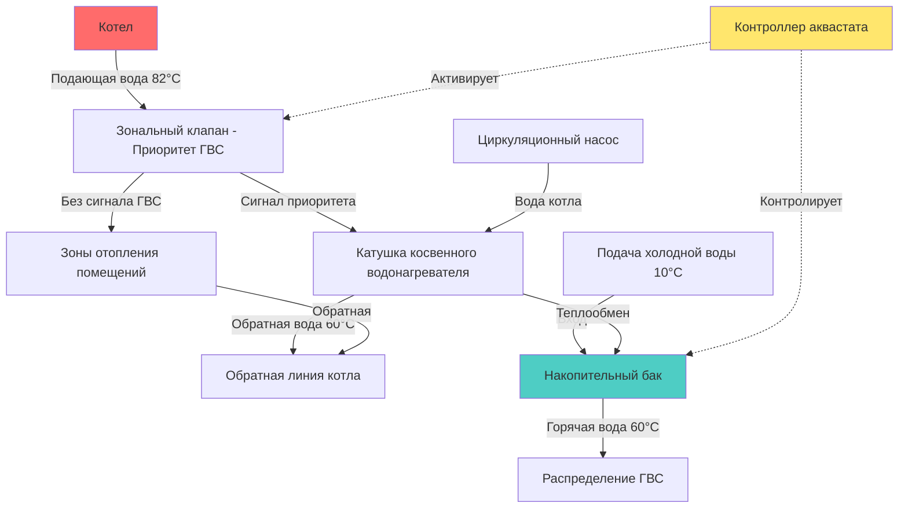

## Обзор

Косвенные водонагреватели используют теплообменник, погруженный в накопительный бак, для передачи тепловой энергии от основного источника тепла — обычно гидравлического котла — к питьевой воде. Эта конфигурация изолирует питьевую воду от жидкости системы отопления, обеспечивая превосходную эффективность, долговечность и качество воды по сравнению с прямонагреваемыми системами или котлами без накопительного бака.

Основное преимущество косвенных водонагревателей заключается в возможности использовать высокоэффективное оборудование отопления для производства горячей воды при полном разделении воды системы отопления и питьевой воды.

## Принципы работы

### Механизм теплопередачи

Теплопередача в косвенных водонагревателях происходит путем кондукции через поверхность теплообменника в соответствии с соотношением:

$$Q = U \cdot A \cdot \Delta T_{lm}$$

Где:
- $Q$ = Скорость теплопередачи (кДж/ч)
- $U$ = Общий коэффициент теплопередачи (кДж/ч·м²·°C)
- $A$ = Площадь поверхности теплообменника (м²)
- $\Delta T_{lm}$ = Логарифмическая средняя разность температур (°C)

Логарифмическая средняя разность температур учитывает изменяющийся температурный градиент по длине теплообменника:

$$\Delta T_{lm} = \frac{(T_{h,in} - T_{c,out}) - (T_{h,out} - T_{c,in})}{\ln\left(\frac{T_{h,in} - T_{c,out}}{T_{h,out} - T_{c,in}}\right)}$$

Где индексы $h$ и $c$ обозначают горячий (котел) и холодный (питьевая вода) потоки соответственно.

### Конфигурация системы

## Расчеты скорости восстановления

Скорость восстановления определяет объем воды, нагреваемый в час от температуры на входе до установленной температуры:

$$R = \frac{Q}{4.186 \cdot (T_{out} - T_{in})}$$

Где:
- $R$ = Скорость восстановления (л/ч)
- $Q$ = Тепловой ввод в воду (кДж/ч)
- $4.186$ = Удельная теплоемкость воды (кДж/кг·°C)
- $T_{out}$ = Требуемая температура на выходе (°C)
- $T_{in}$ = Температура холодной воды на входе (°C)

**Пример расчета:** Для системы с эффективной теплопередачей 105,515 кДж/ч, нагревающей воду с 10°C до 60°C:

$$R = \frac{105,515}{4.186 \cdot (60 - 10)} = \frac{105,515}{209.3} = 504 \text{ л/ч}$$

## Сравнение типов систем

| Характеристика | Косвенная с накопителем | Котел без накопительного бака |
|---------|-----------------|---------------|
| **Объем накопления** | Обычно 114-454 л | Отсутствует - мгновенное |
| **Скорость восстановления** | 379-758 л/ч | Ограничена размером катушки |
| **Потери в режиме ожидания** | Минимальные при изоляции | Отсутствуют |
| **Рейтинг за первый час** | Высокий (накопитель + восстановление) | Низкий-средний |
| **Циклирование котла** | Снижено буфером накопителя | Частое летом |
| **Качество воды** | Отличное (без застоя) | Риск образования накипи |
| **Начальная стоимость** | Выше | Ниже |
| **Эффективность** | 90-95% | 70-85% |
| **Техническое обслуживание** | Низкое | Среднее-высокое |
| **Срок службы** | 30+ лет | 15-20 лет |

## Рекомендации по интеграции с котлом

### Расчет размера

Котел должен обеспечивать достаточную мощность как для отопления помещений, так и для нагрева ГВС. Существуют два подхода:

**1. Отдельный котел ГВС:** Рассчитан на пиковое потребление ГВС с управлением приоритетом

**2. Комбинированная система:** Общая мощность котла должна удовлетворять:

$$Q_{boiler} \geq Q_{heating} + Q_{DHW,peak}$$

Или при управлении приоритетом (ГВС прерывает отопление):

$$Q_{boiler} \geq \max(Q_{heating}, Q_{DHW,peak})$$

Для жилых приложений распространенный метод расчета использует требуемый тепловой ввод косвенного бака плюс 70% расчетной нагрузки отопления помещений для учета тепловой массы и времени восстановления.

### Стратегия управления приоритетом

Контроллеры аквастата контролируют температуру бака и активируют режим приоритета котла, когда температура ГВС падает ниже установленного значения. Управление приоритетом обеспечивает:

- Закрытие зональных клапанов к цепям отопления помещений
- Полный выход котла направляется на косвенный нагреватель
- Быстрое восстановление минимизирует неудобства для жильцов
- Снижение короткоциклирования котла при низких нагрузках отопления

Дифференциал аквастата обычно находится в диапазоне 3-6°C для предотвращения чрезмерного циклирования.

### Материалы и выбор катушки

Материалы теплообменника должны устойчивы к коррозии и обладать максимальной теплопроводностью:

| Материал | Теплопроводность | Устойчивость к коррозии | Применение |
|----------|---------------------|---------------------|-------------|
| **Медь** | 1,385 кДж/ч·м·°C | Хорошая (pH 6,5-8,5) | Стандартные жилые |
| **Нержавеющая сталь** | 58 кДж/ч·м·°C | Отличная (любой pH) | Агрессивная вода |
| **Медно-никелевый сплав** | 177 кДж/ч·м·°C | Отличная | Высокое содержание хлорида |

Медные катушки обеспечивают превосходную эффективность теплопередачи, но требуют управления химией воды. Нержавеющая сталь обеспечивает долговечность в агрессивных водных условиях ценой увеличенной площади поверхности из-за более низкой теплопроводности.

## Рекомендации по проектированию

### Расчет размера теплообменника

Выберите мощность теплообменника для достижения целевой скорости восстановления. Для жилых приложений ASHRAE рекомендует рейтинги за первый час на основе количества жильцов:

- 1-2 человека: 151-189 л
- 3-4 человека: 227-303 л
- 5+ человек: 303-454 л

Коммерческие приложения требуют подробного профилирования нагрузки и анализа коэффициента разнообразия.

### Соображения по установке

**Критические параметры:**
- Температура подачи котла: 82-93°C для оптимальной работы
- Минимальная изоляция бака: RSI 2,8 для минимизации потерь в режиме ожидания
- Клапан сброса давления: минимум 1,034 МПа
- Бак расширения: требуется в соответствии с IPC 607.3
- Клапан ограничения температуры: термостатический смесительный клапан ASSE 1017 для предотвращения ожогов

### Оптимизация эффективности

Максимизируйте эффективность системы посредством:
- Интеграции высокоэффективного конденсационного котла (AFUE > 90%)
- Управления сброса по наружной температуре для цепей отопления помещений
- Изолированного трубопровода с противотепловыми фитингами
- Стратегического размещения бака рядом с основными нагрузками ГВС
- Регулярного технического обслуживания поверхностей теплообменника

## Заключение

Косвенные водонагреватели представляют оптимальное решение для гидравлических систем отопления, требующих надежного горячего водоснабжения. Комбинация высокой скорости восстановления, отличной долговечности и эксплуатационной эффективности оправдывает более высокие начальные инвестиции. Надлежащий расчет размера, внедрение управления приоритетом и выбор материалов обеспечивают десятилетия безотказной работы с минимальными требованиями к техническому обслуживанию.
