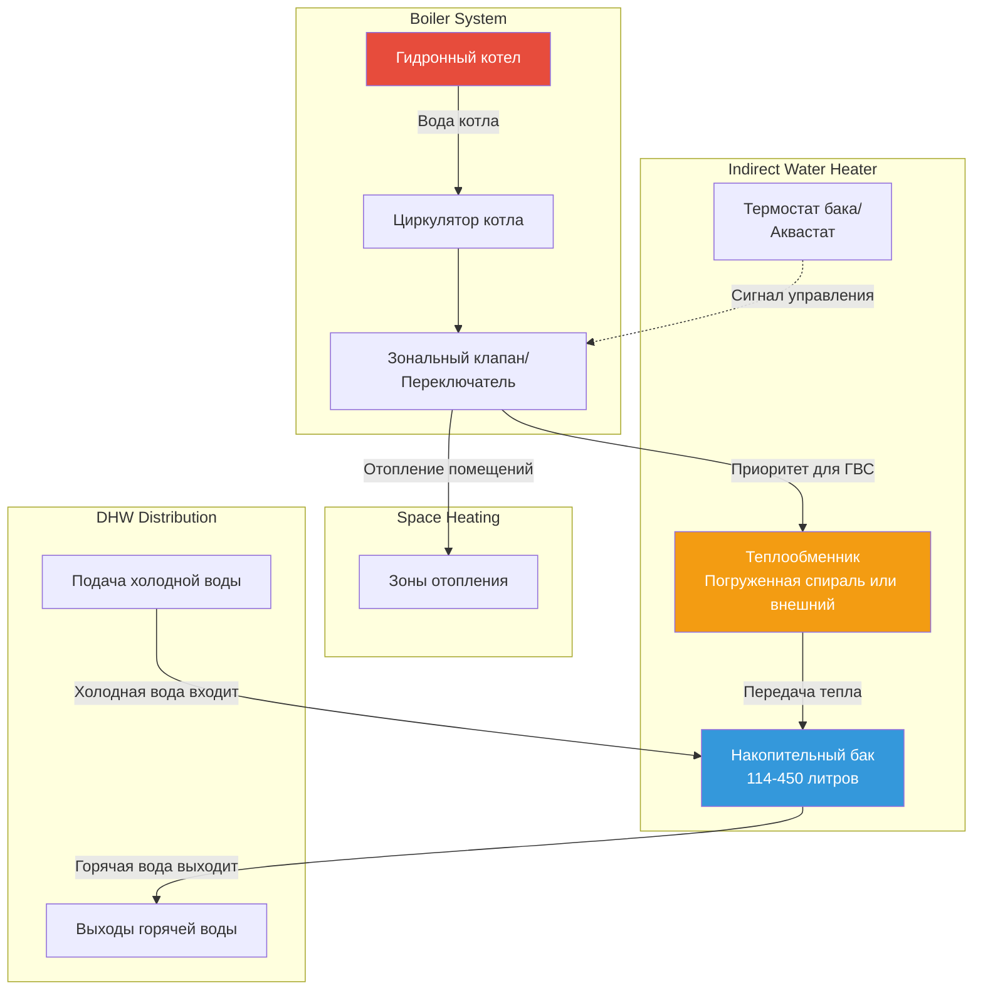

## Обзор

Водонагреватели косвенного нагрева с котельной используют гидронный котел в качестве источника тепла, передавая тепловую энергию через теплообменник для производства горячей воды хозяйственно-бытового назначения. Эти системы обеспечивают высокие скорости восстановления, отличную эффективность благодаря использованию существующей котельной инфраструктуры и длительный срок службы оборудования благодаря разделению продуктов сгорания и питьевой воды.

Основная работа основана на циркуляции воды котла через теплообменник — либо спираль, погруженную в накопительный бак, либо внешний блок типа "трубка в оболочке". При возникновении спроса на горячую воду хозяйственно-бытового назначения приоритетное управление отводит выход котла к водонагревателю, временно приостанавливая отопление пространства для обеспечения быстрого восстановления.

## Конфигурации теплообменников

### Конструкция с погруженной спиралью

Теплообменники с погруженной спиралью состоят из трубок из нержавеющей стали или меди, намотанной спиралью внутри накопительного бака, полностью погруженной в питьевую воду. Передача тепла происходит через стенку спирали к окружающей воде путем естественной конвекции и теплопроводности.

**Преимущества:**
- Компактная интеграция в бак
- Насосы не требуются для стороны бака
- Простые трубопроводные соединения
- Более низкая начальная стоимость

**Ограничения:**
- Более низкие коэффициенты теплопередачи из-за естественной конвекции
- Возможная расслоение, снижающее эффективную емкость
- Трудно обслуживать без слива бака

### Конструкция с внешним теплообменником

Внешние теплообменники монтируются отдельно от накопительного бака, как правило, используя конфигурации типа "трубка в оболочке" или паяные пластины. Специальный циркуляционный насос перемещает воду бака через теплообменник и обратно в накопитель.

**Преимущества:**
- Более высокие скорости теплопередачи при принудительной конвекции
- Обслуживаемый без доступа к баку
- Лучший контроль над процессом теплопередачи
- Может обрабатывать более высокие температуры котла

**Ограничения:**
- Требуется дополнительный циркулятор
- Более сложная схема трубопровода
- Более высокая стоимость монтажа
- Повышенные требования к пространству

## Расчеты теплопередачи и восстановления

Емкость теплообменника определяет скорость восстановления, рассчитанную с использованием фундаментального уравнения теплопередачи:

$$Q = UA \cdot LMTD$$

Где:
- $Q$ = скорость теплопередачи (кДж/ч)
- $U$ = общий коэффициент теплопередачи (кДж/ч·м²·°C)
- $A$ = площадь поверхности теплообменника (м²)
- $LMTD$ = логарифмическая средняя разность температур (°C)

Логарифмическая средняя разность температур учитывает различные профили температуры:

$$LMTD = \frac{(T_{h,in} - T_{c,out}) - (T_{h,out} - T_{c,in})}{\ln\left(\frac{T_{h,in} - T_{c,out}}{T_{h,out} - T_{c,in}}\right)}$$

Где индексы $h$ и $c$ обозначают горячие (котел) и холодные (вода в баке) потоки, а $in$ и $out$ обозначают условия входа и выхода.

Скорость восстановления в литрах в час можно определить из:

$$л/ч = \frac{Q}{4.187 \cdot \Delta T}$$

Где $\Delta T$ — повышение температуры от поступающей холодной воды к уставке (обычно 21-27°C для жилых приложений).

**Пример расчета:**

Для теплообменника, передающего 127 700 кДж/ч с входящей водой при 15,5°C и уставке 60°C:

$$л/ч = \frac{127 700}{4.187 \times (60 - 15,5)} = \frac{127 700}{189.4} = 674.4 \text{ л/ч}$$

## Конфигурация системы трубопровода

## Стратегия приоритетного управления

Приоритетное управление обеспечивает то, что производство горячей воды хозяйственно-бытового назначения имеет приоритет над отоплением помещений, когда температура бака падает ниже уставки. Эта схема управления максимизирует скорость восстановления, направляя полный выход котла к косвенному баку.

**Последовательность управления:**
1. Аквастат бака обнаруживает падение температуры ниже уставки (обычно 54-60°C)
2. Управление активирует котел и открывает косвенный зональный клапан или активирует специальный циркулятор
3. Зоны отопления помещений закрыты или остаются закрытыми во время вызова ГВС
4. Вода котла течет через теплообменник с расчетной скоростью потока
5. Бак достигает уставки; управление прерывает приоритет ГВС
6. Зоны отопления помещений возобновляют нормальную работу

**Рассмотрение времени отклика:**

Отклик системы зависит от нескольких факторов:
- Скорость розжига котла и доступная емкость
- Эффективность теплообменника
- Длина трубопровода и изоляция
- Скорость потока циркулятора
- Характеристики расслоения бака

Для оптимальной производительности минимизируйте длину трубопровода между котлом и косвенным баком, изолируйте весь гидронный трубопровод до RSI 0,7 минимум и размеры циркуляторов для скорости потока 0,25-0,4 м³/ч на каждые 29 300 кДж/ч емкости теплопередачи.

## Рекомендации по калькуляции размеров труб

Правильная калькуляция размеров труб балансирует адекватную доставку потока с приемлемыми перепадами давления и потреблением энергии насоса. Гидронный трубопровод для водонагревателей косвенного нагрева должен быть размещен для скоростей между 0,6-1,2 м/сек.

| Емкость теплообменника | Скорость потока (м³/ч) | Размер трубы (медь тип L) | Перепад давления (кПа/30 м) |
|-------------------------|------------------------|---------------------------|---------------------------|
| 58,6 кДж/ч | 0,08 | 19 мм | 22 |
| 117,2 кДж/ч | 0,16 | 25 мм | 26 |
| 175,9 кДж/ч | 0,25 | 32 мм | 20 |
| 234,5 кДж/ч | 0,34 | 32 мм | 34 |
| 293,1 кДж/ч | 0,42 | 38 мм | 27 |

Расчет скорости потока на основе повышения температуры на 11°C через теплообменник:

$$м³/ч = \frac{Q}{10.44 \cdot \Delta T} = \frac{Q}{10.44 \times 11} = \frac{Q}{114.8}$$

## Сравнение теплообменников

| Функция | Погруженная спираль | Внешний теплообменник |
|---------|---------------|-------------------------|
| **Коэффициент теплопередачи (U)** | 284-568 кДж/ч·м²·°C | 851-1704 кДж/ч·м²·°C |
| **Сложность установки** | Низкая - заводская интеграция | Средняя - полевое трубопроводное устройство |
| **Требования к пространству** | Минимальные - в баке | Средние - отдельное крепление |
| **Доступ к обслуживанию** | Сложный - требует слива бака | Простой - изолировать и обслуживать |
| **Начальная стоимость** | Более низкая - меньше компонентов | Более высокая - дополнительный насос и теплообменник |
| **Эффективность** | Хорошая - естественная циркуляция | Отличная - принудительная циркуляция |
| **Возможность работы при температуре** | Ограниченная - максимум 93°C | Высокая - 116°C и выше |
| **Контроль расслоения** | Ограниченный - пассивное смешивание | Хороший - проектирование контролируемого входа |
| **Типичные приложения** | Жилые, легкие коммерческие | Коммерческие, высокопроизводительные приложения |

## Рекомендации по интеграции

**Совместимость с котлом:**

Убедитесь, что емкость котла превышает объединенные пиковые нагрузки отопления помещений и горячего водоснабжения. Для целей калькуляции размеров предположим одновременную работу несмотря на приоритетное управление, особенно в холодном климате, где быстрое восстановление бака в сезон отопления критично.

**Управление температурой:**

Установите аквастат котла для поддержания температуры подачи, адекватной для работы косвенного бака, обычно 71-82°C. Более высокие температуры повышают скорость теплопередачи, но могут вызвать образование накипи в жесткой воде. Рассмотрите использование смешивающих клапанов на распределении ГВС для предотвращения ошпаривания при поддержании более высоких температур хранения для контроля легионеллы.

**Расширение и сброс давления:**

Установите баки теплового расширения как в гидронную, так и в систему питьевой воды. Размер бака теплового расширения для стороны питьевой воды в соответствии с общим объемом системы и уставкой клапана сброса давления. Установите клапан сброса температуры и давления номиналом не менее 1035 кПа и 99°C на накопительном баке.

**Проводка управления:**

Подключите аквастат бака для прерывания управления зональным отоплением через реле или непосредственно к зональным клапанам. Обеспечьте надлежащую электрическую блокировку для предотвращения одновременной работы приоритета ГВС и отопления помещений. Используйте управление напряжением 24VAC для зональных клапанов и циркуляторов для соответствия стандартным системам управления котлом.

## Оптимизация производительности

Максимизируйте эффективность системы благодаря надлежащему вводу в эксплуатацию:
- Балансируйте скорости потока в соответствии со спецификациями производителя
- Проверьте последовательность приоритетного управления
- Проверьте скорость розжига котла при нагрузке ГВС
- Подтвердите адекватное напорное давление циркулятора
- Протестируйте работу клапана сброса давления
- Проверьте целостность изоляции всего трубопровода

Контролируйте долгосрочную производительность, отслеживая время работы котла, выделенное для производства ГВС в сравнении с отоплением помещений, выявляя возможности увеличения накопительного бака или улучшения теплообменника, если циклы восстановления становятся чрезмерными.

## Заключение

Водонагреватели косвенного нагрева с котельной обеспечивают надежное и эффективное производство горячей воды хозяйственно-бытового назначения благодаря интеграции с существующей инфраструктурой гидронного отопления. Правильный выбор между конфигурациями погруженной спирали и внешним теплообменником зависит от требований приложения, соображений обслуживания и ограничений бюджета. Точные расчеты теплопередачи, надлежащая калькуляция размеров труб и эффективная реализация приоритетного управления обеспечивают оптимальную производительность и долговечность системы.
