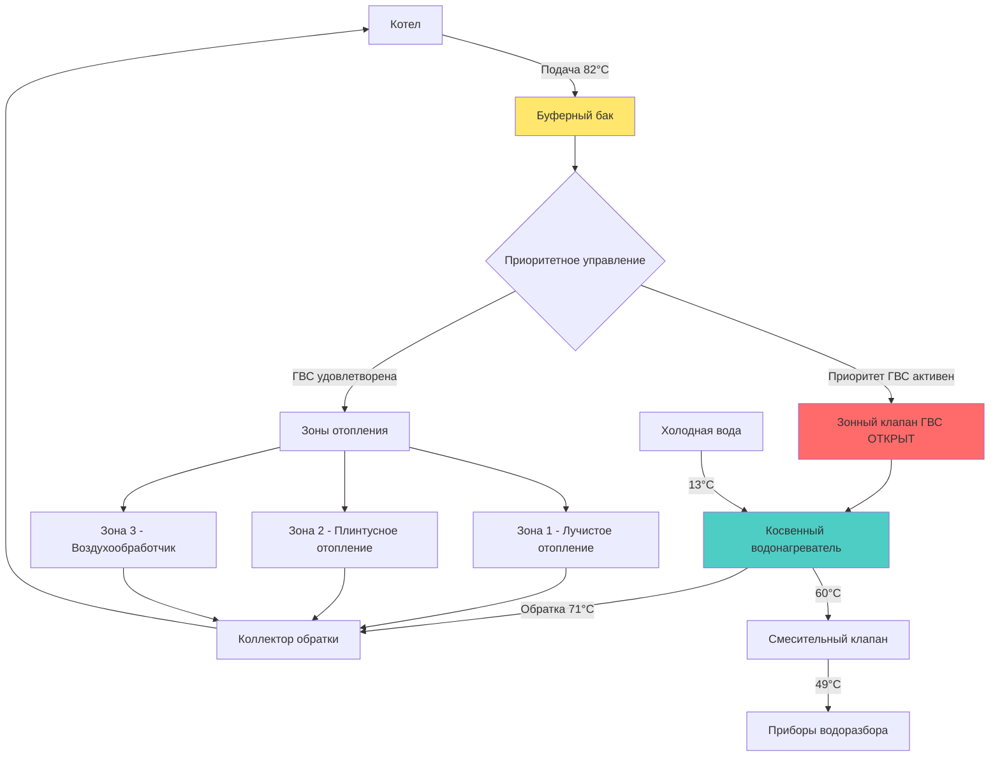

## Обзор

Косвенные водонагреватели гидравлических систем используют основную систему отопления — обычно котел — в качестве источника тепла для производства горячей воды для хозяйственных нужд. Интеграция создает двухцелевую тепловую установку, где теплообменник (погруженная спираль или внешний пластинчатый теплообменник) передает тепловую энергию от гидравлической жидкости в питьевую воду. Этот подход обеспечивает высокие коэффициенты восстановления тепла, длительный срок службы оборудования и исключает необходимость в отдельном источнике топлива для водонагревателя.

## Основы теплопередачи

Интенсивность теплопередачи в косвенном водонагревателе зависит от разности температур между гидравлической жидкостью и накопленной водой, площади поверхности теплообменника и общего коэффициента теплопередачи:

$$Q = UA \cdot LMTD$$

Где:
- $Q$ = интенсивность теплопередачи (кДж/ч)
- $U$ = общий коэффициент теплопередачи (кДж/ч·м²·°C)
- $A$ = площадь поверхности теплообменника (м²)
- $LMTD$ = логарифмическая средняя разность температур (°C)

Логарифмическая средняя разность температур для конфигурации спирали в баке рассчитывается как:

$$LMTD = \frac{(T_{h,in} - T_{w,out}) - (T_{h,out} - T_{w,in})}{\ln\left(\frac{T_{h,in} - T_{w,out}}{T_{h,out} - T_{w,in}}\right)}$$

Где:
- $T_{h,in}$ = температура подачи гидравлической жидкости
- $T_{h,out}$ = температура обратной гидравлической жидкости
- $T_{w,in}$ = температура входа холодной воды
- $T_{w,out}$ = температура горячей воды в баке накопления

## Подходы интеграции

Существует три основных метода интеграции косвенных водонагревателей с гидравлическими системами:

| Метод интеграции | Преимущества | Недостатки | Оптимальное применение |
|-------------------|------------|---------------|------------------|
| **Приоритетное управление ГВС** | Максимальная интенсивность восстановления тепла, простая логика управления | Перерывы в отоплении помещений во время запросов ГВС | Жилые дома, легкие коммерческие здания |
| **Параллельная зонная работа** | Непрерывное отопление помещений, отсутствие перерывов | Более медленное восстановление ГВС, требуется больший котел | Коммерческие здания, высокие тепловые нагрузки |
| **Буферный бак с приоритетом** | Быстрое восстановление, тепловое накопление снижает циклирование | Более высокие затраты на установку, требования к пространству | Переменные профили нагрузок, энергоэффективные системы |

### Приоритетное управление ГВС

Наиболее распространенный жилой подход использует зонный клапан или реле для отключения зон отопления помещений, когда аквастат резервуара ГВС требует тепла. Весь выход котла направляется на нагрев горячей воды для хозяйственных нужд до достижения резервуаром заданной температуры.

**Логика управления:**
1. Аквастат ГВС закрывается при падении температуры
2. Зоны отопления помещений закрываются
3. Циркуляционный насос ГВС включается
4. Котел работает при высокой заданной температуре
5. Аквастат ГВС открывается при достижении заданной температуры
6. Зоны отопления помещений возобновляют работу

### Параллельная зонная работа

Коммерческие приложения часто требуют непрерывного отопления помещений. Косвенный водонагреватель работает как стандартная зона наряду с зонами отопления, при этом котел рассчитан на одновременные нагрузки.

**Требование к мощности котла:**

$$Q_{boiler} = Q_{heating,peak} + Q_{DHW,recovery}$$

Этот подход требует тщательного расчета нагрузок для предотвращения короткого циклирования котла при низких нагрузках.

### Интеграция буферного бака

Буферный бак между котлом и нагрузками обеспечивает тепловую емкость, которая снижает частоту циклирования, особенно полезно для конденсационных котлов и модулирующих горелок. Косвенный водонагреватель черпает из буферного бака через последовательность приоритетного управления.

## Конфигурация гидравлической системы

## Требования к конфигурации трубопроводов

### Первичное-вторичное трубопроводное соединение

Гидравлическое разделение между контуром котла и косвенным водонагревателем предотвращает помехи потока и поддерживает расчетные расходы через каждый компонент:

$$\dot{m} = \frac{Q}{c_p \cdot \Delta T}$$

Где:
- $\dot{m}$ = расход массы (кг/ч)
- $c_p$ = удельная теплоемкость воды (4,19 кДж/кг·°C)
- $\Delta T$ = перепад температуры через теплообменник (°C)

Для косвенного резервуара мощностью 14,66 кВт с перепадом температуры 11°C:

$$\dot{m} = \frac{14,66}{4,19 \times 11} \approx 318 \text{ кг/ч} \approx 5,3 \text{ л/мин}$$

### Установка смесительного клапана

Термостатические смесительные клапаны на выходе резервуара предотвращают ошпаривание и расширяют полезный объем резервуара путем хранения воды при повышенных температурах. Температура хранения 60-71°C предотвращает рост Legionella при одновременном обеспечении подачи воды температурой 49°C к приборам водоразбора.

**Коэффициент расширения полезного объема:**

$$V_{effective} = V_{storage} \times \frac{T_{storage} - T_{cold}}{T_{delivery} - T_{cold}}$$

Резервуар объемом 151 л при температуре 60°C доставляет эквивалент 200 л при температуре 49°C (при условии входа 13°C).

## Расчет буферного бака

Буферные баки снижают частоту циклирования котла и повышают эффективность системы. Размер рассчитывается на основе требований минимального времени работы:

$$V_{buffer} = \frac{Q_{boiler,min} \times t_{min}}{c_p \cdot \rho \times \Delta T_{system}}$$

Где:
- $V_{buffer}$ = объем буферного бака (л)
- $Q_{boiler,min}$ = минимальная мощность горения котла (кДж/ч)
- $t_{min}$ = требуемое минимальное время работы (ч, обычно 0,167 для 10 минут)
- $\rho$ = плотность воды (1000 кг/м³)
- $\Delta T_{system}$ = системный перепад температуры (°C)

Для котла мощностью 29,3 кВт с 10-минутным минимальным временем работы и 11°C перепадом:

$$V_{buffer} = \frac{29,3 \times 0,167}{4,19 \times 1000 \times 11} \approx 0,114 \text{ м³} \approx 114 \text{ л}$$

## Рассмотрение сезонной эксплуатации

### Летний режим только ГВС

Эксплуатация большого котла исключительно для горячей воды для хозяйственных нужд вне сезона отопления приводит к штрафам в эффективности из-за потерь от корпуса и короткого циклирования. Стратегии смягчения включают:

- **Снижение заданной температуры котла:** Более низкая температура подачи 60-66°C снижает потери в режиме ожидания
- **Управление по таймеру:** Ограничение часов работы периодами максимального спроса (утро/вечер)
- **Двухтопливный вариант:** Переход на электрическое сопротивление в летний период
- **Отдельный летний котел:** Небольшой выделенный агрегат для нагрузок ГВС

**Расчет потерь в режиме ожидания:**

$$Q_{standby} = UA_{jacket} \times (T_{boiler} - T_{ambient}) \times 24$$

Типичный чугунный котел с площадью поверхности 9,3 м² и коэффициентом U 2,84 кДж/ч·м²·°C, поддерживаемый при 82°C в помещении при 21°C, теряет приблизительно 15,4 МДж/день в окружающее пространство.

## Рекомендации проектирования

**Справочник ASHRAE - Системы и оборудование HVAC:**
- Рассчитывайте косвенные резервуары на пиковый часовой спрос с использованием модифицированных кривых Hunter
- Поддерживайте минимальное соотношение 2:1 входной мощности котла к коэффициенту восстановления ГВС при приоритетном управлении
- Обеспечивайте надлежащий размер трубопровода для расхода 1,9-3,8 л/мин через теплообменник
- Установите расширительный бак на стороне ГВС, если обратный клапан препятствует сбросу давления при тепловом расширении

**Интеграция гидравлической системы:**
- Используйте тройники близко расположенные (первичное-вторичное трубопроводное соединение) на расстоянии 30 см по центру
- Установите сепаратор грязи на обратке котла для защиты теплообменников
- Обеспечьте предотвращение обратного потока между питьевой и гидравлической системами в соответствии с нормативами
- Рассмотрите требования к давлению в системе (давление питьевой воды обычно превышает гидравлическое)

**Последовательность управления:**
1. Установите приоритет ГВС выше всех зон отопления помещений
2. Реализуйте задержку по времени (5-10 минут) для предотвращения нежелательного циклирования
3. Отслеживайте температуру обратки котла для предотвращения конденсации дымовых газов на не конденсационных агрегатах
4. Свяжите аквастат с включением котла для оптимизации летней эксплуатации

## Факторы эффективности системы

Общая эффективность гидравлического интегрированного косвенного нагрева воды зависит от множества факторов:

$$\eta_{system} = \eta_{boiler} \times \eta_{heat\ exchanger} \times (1 - f_{standby})$$

Где:
- $\eta_{boiler}$ = сезонная эффективность котла (AFUE)
- $\eta_{heat\ exchanger}$ = эффективность теплообменника (обычно 0,85-0,95)
- $f_{standby}$ = доля потерь в режиме ожидания (0,05-0,15 в зависимости от изоляции и режима работы)

Высокопроизводительные системы достигают общей эффективности 80-85%, сопоставимой с отдельными высокоэффективными накопительными водонагревателями, обеспечивая при этом превосходные коэффициенты восстановления тепла.

## Заключение

Косвенные водонагреватели гидравлических систем обеспечивают эффективное решение двойного назначения при надлежащей интеграции с системами отопления. Схемы приоритетного управления, надлежащий расчет буферных баков, гидравлическое разделение посредством первичного-вторичного трубопроводного соединения и стратегии сезонной эксплуатации оптимизируют производительность и эффективность. Этот подход особенно выгоден для установок с существующими высокоэффективными котлами, исключая капитальные затраты и техническое обслуживание отдельного оборудования для нагрева воды, обеспечивая при этом неограниченную интенсивность восстановления тепла для приложений с высоким спросом.
