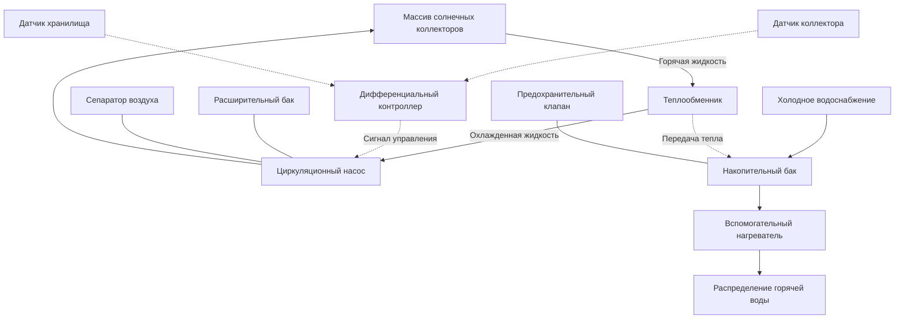

## Обзор системы

Активные системы солнечного нагрева воды используют насосы для циркуляции теплоносителя через солнечные коллекторы и накопительные баки. В отличие от пассивных систем, активные системы используют контроллеры, которые контролируют температурные дифференциалы и активируют циркуляционные насосы при наличии солнечной энергии для сбора. Эти системы достигают солнечной доли от 40% до 80% в зависимости от климата, режимов нагрузки и размеров системы.

Фундаментальная работа основана на дифференциальном температурном контроллере (DTC), который сравнивает температуру коллектора с температурой хранилища. Когда коллектор превышает хранилище на предопределенный дифференциал (обычно 8-11°C), контроллер активирует циркуляционный насос для сбора солнечной энергии.

## Типы систем

### Системы с прямой циркуляцией

Системы с прямой циркуляцией прокачивают питьевую воду непосредственно через солнечные коллекторы и обратно в хранилище. Эта конфигурация обеспечивает наивысшую эффективность благодаря отсутствию теплообменников, но налагает значительные ограничения.

**Применение:**
- Климаты без замерзания (минимальная температура окружающей среды выше 0°C)
- Водоснабжение с низким содержанием минеральных веществ (предотвращает отложения в коллекторах)
- Отсутствие материалов коллекторов, подверженных коррозии, в контакте с питьевой водой

**Преимущества:**
- Более высокая эффективность системы (отсутствие штрафа теплообменника)
- Более низкая первоначальная стоимость
- Более простая гидравлическая конструкция

**Ограничения:**
- Риск повреждения от замерзания в холодных климатах
- Потенциал образования отложений при жесткой воде
- Коррозия в определенных типах коллекторов

### Системы с непрямой циркуляцией

Системы непрямой циркуляции циркулируют теплоноситель через коллекторы и передают энергию питьевой воде через теплообменник. Эта конфигурация является доминирующей в установках в климатах с замерзанием.

**Теплоносители:**
- Растворы пропиленгликоля/воды (наиболее распространены)
- Этиленгликоль/вода (выше токсичность, избегать в системах с питьевой водой)
- Пищевые углеводородные масла (специальные применения)

**Типы теплообменников:**
- Внешний кожухотрубный (наиболее эффективный)
- Встроенная спираль в баке (интегрирована с хранилищем)
- Пластинчатый (компактный, высокая эффективность)

## Компоненты системы

### Циркуляционный насос

Циркуляционный насос должен преодолеть:
1. Перепад давления в массиве коллекторов
2. Потери трения в системе трубопроводов
3. Перепад давления в теплообменнике
4. Статический напор (вертикальное расстояние)

Размеры насоса используют стандартные расчеты потерь на трение. Для растворов гликоля отрегулируйте коэффициенты трения на повышенную вязкость:

$$\mu_{\text{solution}} = \mu_{\text{water}} \times (1 + 0.05 \times \%_{\text{glycol}})$$

Типичная мощность насоса составляет от 0,015 до 0,037 кВт на 1 м² площади коллектора.

### Дифференциальный температурный контроллер

DTC работает по простому алгоритму:

$$\Delta T_{\text{on}} = T_{\text{collector}} - T_{\text{storage}} \geq 8-11°C$$

$$\Delta T_{\text{off}} = T_{\text{collector}} - T_{\text{storage}} < 3-4°C$$

Дифференциал предотвращает частое включение/выключение, обеспечивая эффективный сбор энергии. Продвинутые контроллеры включают:
- Защиту верхнего предела (предотвращает чрезмерное повышение температуры хранилища)
- Активацию защиты от замерзания
- Координацию вспомогательного нагревателя
- Регистрацию данных и контроль производительности

## Стратегии защиты от замерзания

### Рециркуляция (системы с прямой циркуляцией)

Когда температура коллектора приближается к точке замерзания, контроллер активирует насос для циркуляции теплой воды из хранилища через коллекторы. Этот метод:
- Sacrifices накопленную солнечную энергию
- Увеличивает нагрузку вспомогательного нагревателя
- Подходит для мягких климатов с редким замерзанием

### Системы с автоматическим сливом

Коллекторы и открытые трубопроводы автоматически сливаются при остановке насоса. Требования:
- Коллекторы и трубопроводы должны иметь постоянный уклон (минимум 1,3 см на 30 см длины)
- Резервуар слива в нижней точке системы
- Насос должен преодолеть высоту подъема для заполнения коллекторов
- Система остается при атмосферном давлении

### Системы с антифризом

Растворы гликоля предотвращают замерзание в закрытых непрямых системах. Критические параметры:

| Концентрация гликоля | Защита от замерзания | Защита от разрыва | Штраф удельной теплоемкости |
|---------------------|-------------------|------------------|---------------------|
| 30% пропиленгликоль | -18°C | -12°C | 5% снижение |
| 40% пропиленгликоль | -26°C | -32°C | 8% снижение |
| 50% пропиленгликоль | -34°C | -46°C | 12% снижение |

Гликоль деградирует со временем из-за воздействия высоких температур. Стандарт ASHRAE 90.2 рекомендует тестирование и замену каждые 3-5 лет.

## Размеры системы и солнечная доля

Солнечная доля (SF) представляет процент годовой нагрузки на горячее водоснабжение, удовлетворяемый солнечной энергией:

$$SF = \frac{Q_{\text{solar}}}{Q_{\text{total}}}$$

Где:
- $Q_{\text{solar}}$ = Годовой вклад солнечной энергии (кДж/год)
- $Q_{\text{total}}$ = Годовая нагрузка на нагрев горячей воды (кДж/год)

### Метод F-Chart

Стандартный в отрасли метод F-Chart коррелирует солнечную долю с двумя безразмерными параметрами:

$$X = \frac{F_R U_L A_c (T_{\text{ref}} - T_a) \Delta t}{Q_{\text{load}}}$$

$$Y = \frac{F_R (\tau\alpha) A_c \overline{H_T}}{Q_{\text{load}}}$$

Где:
- $F_R$ = Коэффициент удаления тепла коллектором
- $U_L$ = Общий коэффициент потерь коллектора (кВт/(м²·°C))
- $A_c$ = Площадь коллектора (м²)
- $T_{\text{ref}}$ = Эталонная температура (обычно 100°C)
- $T_a$ = Температура окружающей среды (°C)
- $\Delta t$ = Период времени (ч)
- $(\tau\alpha)$ = Произведение пропускания-поглощения
- $\overline{H_T}$ = Среднесуточное месячное излучение на наклонную поверхность (кДж/(день·м²))

Солнечная доля следует эмпирически полученной корреляции на основе значений X и Y.

### Рекомендации по размерам

| Климатическая зона | Площадь коллектора на человека | Объем хранения на площадь коллектора |
|--------------|---------------------------|----------------------------|
| Жаркий, солнечный (Феникс, Майами) | 1,4-1,9 м² | 23-30 л/м² |
| Умеренный (Сан-Франциско, Атланта) | 1,9-2,3 м² | 27-33 л/м² |
| Холодный (Бостон, Денвер) | 2,3-2,8 м² | 30-37 л/м² |

Предположения: 76 л/человека/день использование горячей воды, температура доставки 49°C.

## Управление и безопасность

### Температурные ограничения

**Защита верхнего предела:** Контроллеры должны предотвращать превышение температуры хранилища выше 82°C для предотвращения:
- Опасности от ожогов
- Деградации гликоля (непрямые системы)
- Разрядов предохранительного клапана накопительного бака

Реализация: Контроллер останавливает циркуляционный насос при достижении хранилищем установленного значения.

**Защита от перегрева:** В условиях стагнации (отсутствие нагрузки, отказ насоса) коллекторы могут превышать 177°C. Защита включает:
- Предохранительные клапаны, рассчитанные на максимальную температуру стагнации
- Расширительные баки, рассчитанные на полное расширение жидкости
- Материалы трубопроводов с высокой температурой и изоляция

### Предохранительный клапан

Системы требуют двойной защиты:
1. Предохранительный клапан накопительного бака (обычно 1034 кПа для жилых помещений)
2. Предохранительный клапан контура коллектора (обычно 207-345 кПа для закрытых систем)

## Стандарты производительности

**SRCC OG-300:** Стандарт сертификации солнечного теплового коллектора от Solar Rating & Certification Corporation. Обеспечивает стандартизированные рейтинги производительности:
- Выход в ясный день при определенных условиях
- Коэффициенты тепловой производительности ($F_R U_L$ и $F_R (\tau\alpha)$)
- Температура стагнации
- Характеристики перепада давления

**Стандарт ASHRAE 90.2:** Энергоэффективный дизайн малоэтажных жилых зданий. Указывает:
- Минимальные требования солнечной доли по климатическим зонам
- Значения R для изоляции трубопроводов и хранилища
- Алгоритмы управления и функции безопасности

**Стандарт ASHRAE 62.1:** Вентиляция для приемлемого качества воздуха в помещении. Рассматривает контроль легионеллы в системах предварительного нагрева солнечной энергии (поддерживают хранилище выше 60°C или периодическую тепловую пастеризацию).

## Рекомендации по установке

**Ориентация коллектора:**
- Оптимальный азимут: истинный юг (северное полушарие)
- Приемлемый диапазон: ±15° от юга (минимальный штраф производительности)
- Угол наклона: Широта ±10° для круглогодичной производительности
- Сезонная оптимизация: Широта +15° (приоритет зимы), Широта -15° (приоритет лета)

**Конструкция трубопровода:**
- Минимизируйте длину трубопровода между коллекторами и хранилищем
- Изоляция: минимум RSI-0,7 для внутреннего трубопровода, RSI-1,1 для внешнего трубопровода
- Поддержки: предусмотрите тепловое расширение (до колебаний температуры 111°C)
- Удаление воздуха: высокие точечные воздухоотводы в закрытых системах

**Гидравлический баланс:**
- Параллельные массивы коллекторов требуют клапанов балансировки потока
- Целевая скорость потока: 0,0109-0,0163 л/с на м² площади коллектора
- Обратный трубопровод способствует равномерному распределению потока

Активные системы солнечного нагрева воды обеспечивают значительную экономию энергии при правильном проектировании и установке. Выбор между конфигурациями с прямой и непрямой циркуляцией зависит от климата, качества воды и ограничений конкретного места. Соответствие стандартам ASHRAE и SRCC обеспечивает надежную и эффективную работу в течение срока службы системы 20-25 лет.
