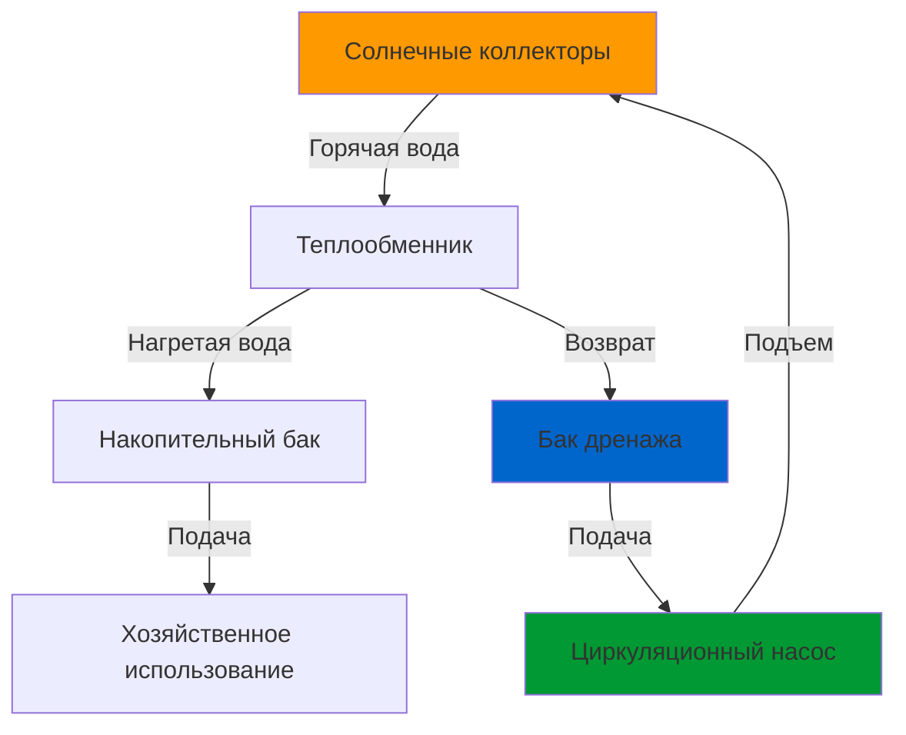

## Принцип работы

Системы с дренажом используют основанную на гравитации стратегию защиты от замерзания, при которой теплоноситель (обычно дистиллированная вода) стекает из солнечных коллекторов и открытых трубопроводов в бак дренажа всякий раз, когда циркуляционный насос останавливается. Этот пассивный механизм защиты исключает необходимость использования антифриза и связанных с ним требований к техническому обслуживанию.

Система работает в двух отличительных режимах:

**Режим сбора:** Циркуляционный насос поднимает воду из бака дренажа через коллекторы, где она поглощает солнечную энергию, затем возвращается в систему хранения. Насос должен преодолеть как статический напор, так и потери на трение.

**Режим дренажа:** Когда насос деактивируется (из-за недостаточного солнечного прироста, условий замерзания или отсутствия электроэнергии), вода стекает под действием гравитации из коллекторов и всего наружного трубопровода в крытый бак дренажа. Это осушение происходит в течение 1-3 минут в зависимости от конфигурации системы.

## Требования к напору насоса

Циркуляционный насос должен преодолеть значительный статический напор плюс динамические потери. Расчет общего напора:

$$H_{total} = H_{static} + H_{friction} + H_{minor}$$

Где:
- $H_{static}$ = вертикальный перепад высот от уровня воды в баке дренажа до самой высокой точки в коллекторах (м)
- $H_{friction}$ = потери на трение в трубопроводах
- $H_{minor}$ = незначительные потери от фитингов, клапанов, теплообменников

Компонент статического подъема доминирует в системах с дренажом:

$$H_{static} = h_{collector} - h_{tank}$$

Для типичной жилой установки с коллекторами на 4,6 м выше бака дренажа статический напор составляет 4,6 м (45 кПа). Общий напор системы обычно варьируется от 5,5 до 7,6 м (54-74 кПа) для жилых систем.

Насос также должен обеспечивать адекватный расход в соответствии с рекомендациями SRCC:

$$\dot{m} = \frac{12.5 \times A_c}{c_p \times \Delta T_{design}}$$

Где:
- $\dot{m}$ = массовый расход (кг/ч)
- $A_c$ = площадь коллектора (м²)
- $c_p$ = удельная теплоемкость воды = 4,18 кДж/кг·°C
- $\Delta T_{design}$ = расчетный скачок температуры = 5,5-11°C

Типичные расходы варьируются от 0,8-1,6 л/ч на м² площади коллектора.

## Конструкция бака дренажа

Бак дренажа выполняет три критические функции:

1. **Хранение жидкости:** Содержит всю воду, стекающую из коллекторов и трубопроводов
2. **Разделение воздуха:** Позволяет захватываемому воздуху отделяться перед входом насоса
3. **Тепловое расширение:** Компенсирует изменения объема

### Методология расчета размера

Минимальный объем бака:

$$V_{tank} = V_{collectors} + V_{piping} + V_{expansion} + V_{reserve}$$

**Объем коллектора:** Варьируется в зависимости от типа коллектора:
- Плоская пластина: 0,6-1,0 л/м²
- Эвакуированная трубка: 0,4-0,6 л/м²

**Объем трубопровода:** Расчет из размеров трубы:

$$V_{pipe} = \pi r^2 L \times 1000$$

Где $r$ = радиус (м), $L$ = длина (м), результат в литрах.

**Объем расширения:** Минимум 10% от общего объема жидкости.

**Резервный объем:** 8-20 литров, чтобы насос никогда не кавитировал.

### Требования к конфигурации

- Бак должен располагаться внутри в кондиционируемом или полукондиционируемом помещении
- Уровень воды должен быть ниже самого низкого подключения коллектора
- Адекватное воздушное пространство над уровнем воды (минимум 30% объема бака)
- Доступность для проверки и обслуживания качества воды

## Соображения при проектировании системы

### Требования к трубопроводам

**Уклон:** Все наружные трубопроводы должны иметь непрерывный уклон в сторону бака дренажа:
- Минимальный уклон: 0,6 см на 30 см (2%)
- Предпочтительный уклон: 1,3 см на 30 см (4%)
- Отсутствие горизонтальных участков или провисаний, задерживающих воду

**Размер:** Диаметр трубы влияет на дренаж:

| Размер трубы | Макс. горизонтальный пролет | Время дренажа |
|-----------|-------------------|---------------|
| 19 мм | 6 м | < 90 сек |
| 25 мм | 12 м | < 120 сек |
| 32 мм | 18 м | < 150 сек |

**Материал:** Предпочтителен медь типов L или M; PEX-AL-PEX приемлем, если рассчитан на температуры до 93°C.

### Интеграция теплообменника

Большинство систем с дренажом используют внешние теплообменники между контуром коллектора и накопительным баком, чтобы предотвратить загрязнение. Эффективность теплообменника должна превышать 0,50 согласно протоколам тестирования ASHRAE 93.

**Перепад давления:** Перепад давления на теплообменнике $\Delta P$ обычно составляет 40-60% от общего напора системы. Пластинчатые теплообменники обеспечивают превосходную производительность по сравнению с конструкциями с катушкой в баке:

| Тип теплообменника | Типичная эффективность | Перепад давления |
|---------------------|----------------------|---------------|
| Пластинчатый | 0,60-0,75 | 0,9-1,8 м |
| Паяный пластинчатый | 0,55-0,70 | 1,2-2,1 м |
| Катушка в баке | 0,40-0,60 | 0,6-1,2 м |

## Преимущества и ограничения

### Основные преимущества

- **Встроенная защита от замерзания:** Отсутствие деградации антифриза или технического обслуживания
- **Защита от перегрева:** Система автоматически осушается во время застоя
- **Упрощенное техническое обслуживание:** Теплоноситель только вода
- **Долгий срок службы:** Отсутствие замены гликоля каждые 3-5 лет
- **Более низкие эксплуатационные расходы:** Сокращенные интервалы обслуживания

### Ограничения конструкции

- **Повышенная энергия насоса:** Преодоление статического напора требует больше энергии
- **Ограничения установки:** Требуется надлежащий уклон для дренажа
- **Крытое пространство:** Бак дренажа должен располагаться внутри
- **Сложность:** Надлежащее управление воздухом критично для надежной работы
- **Первоначальная стоимость:** Высокопроизводительные насосы и органы управления увеличивают начальные инвестиции

## Стратегия управления

Контроллеры дифференциальной температуры активируют насос когда:

$$\Delta T = T_{collector} - T_{storage} > T_{on}$$

Типичное $T_{on}$ = 8-11°C. Контроллер деактивируется когда:

$$\Delta T < T_{off}$$

Где $T_{off}$ = 1,5-3°C, чтобы предотвратить частые включения/выключения.

Продвинутые контроллеры включают:
- Переопределение защиты от замерзания (дренаж при наружной температуре < 4°C)
- Отсечка максимального предела (дренаж при температуре коллектора > 93°C)
- Обнаружение низкого расхода для выявления проблем с дренажом
- Суммирование времени работы для планирования обслуживания

## Стандарты и тестирование

SRCC OG-300 устанавливает стандарты сертификации для систем солнечного нагрева воды, включая конфигурации с дренажом. Системы должны продемонстрировать:

- Полный дренаж в течение 5 минут в наихудших условиях
- Отсутствие задержания воды в коллекторах или трубопроводах после дренажа
- Производительность насоса адекватна для указанных условий температуры и расхода
- Устойчивость к замерзанию при наружной температуре -34°C

ASHRAE 90.1 и 90.2 устанавливают минимальные требования к эффективности систем солнечного теплоснабжения в коммерческих и жилых приложениях.

## Проверка при установке

Вводите в эксплуатацию системы с дренажом, проверяя:

1. Все трубопроводы имеют уклон в сторону бака дренажа без провисаний
2. Полный дренаж происходит в течение расчетного временного интервала
3. Отсутствие журчащих звуков или воздушной пробки при работе насоса
4. Бак дренажа поддерживает адекватный уровень воды
5. Теплообменник достигает расчетного температурного дифференциала
6. Насос обеспечивает указанный расход при измеренном напоре

Надлежащая установка обеспечивает надежную защиту от замерзания и оптимальную тепловую производительность на протяжении всего расчетного срока службы системы в 20-25 лет.
