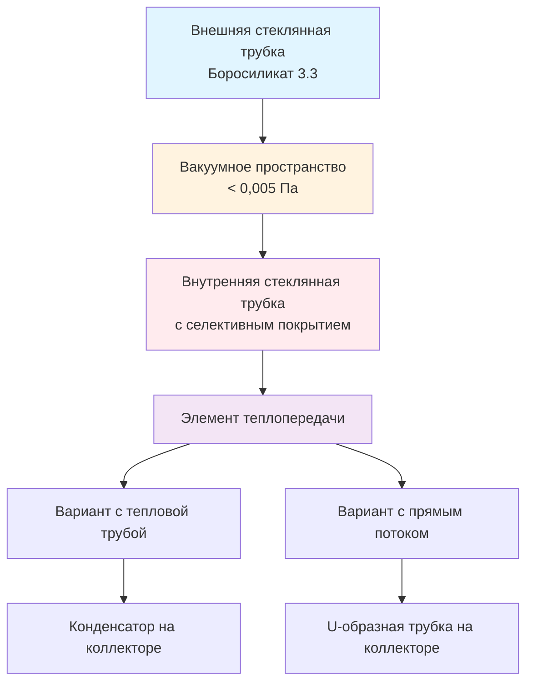

## Физические принципы вакуумных трубчатых коллекторов

Вакуумные трубчатые коллекторы (ВТК) представляют собой передовую технологию солнечного теплоснабжения, которая достигает превосходной эффективности благодаря вакуумной изоляции. Каждый коллектор состоит из параллельных стеклянных трубок диаметром 47–58 мм и длиной 1500–1800 мм, содержащих поглощающую поверхность внутри вакуумного кожуха, поддерживаемого при давлении ниже 0,005 Па.

Вакуум исключает потери тепла за счет теплопроводности и конвекции, оставляя только радиационные потери, регулируемые законом Стефана–Больцмана. Эта конструкция обеспечивает эффективную работу при температурах на 50–100°C выше окружающей среды, где плоские коллекторы испытывают значительную тепловую деградацию.

## Конструкция трубок и теплопередача

### Физика вакуумной изоляции

Теплопроводность через вакуумное кольцевое пространство минимизируется за счет удаления молекул газа, которые иначе проводили бы тепло. Остаточная теплопередача происходит только через:

1. **Радиационный обмен** между стеклянными поверхностями (минимизируется низкоэмиссионными покрытиями)
2. **Теплопроводность через опорные конструкции** (геттерный материал и концы трубок)
3. **Теплопроводность остаточного газа** (пренебрежимо мала при рабочих уровнях вакуума)

Общий коэффициент теплопотерь вакуумного пространства составляет обычно 0,3–0,6 Вт/м²·К, в сравнении с 4–6 Вт/м²·К для плоских коллекторов.

## Технология тепловых труб

Вакуумные трубки с тепловыми трубами используют герметичную медную трубку, содержащую небольшое количество чистой воды или другой рабочей жидкости при пониженном давлении. Физика работает следующим образом:

**Фаза испарения:**
$$Q_{evap} = \dot{m} \cdot h_{fg}$$

Где:
- $\dot{m}$ = массовый расход пара (кг/с)
- $h_{fg}$ = скрытая теплота парообразования (кДж/кг)

Поглотитель нагревает рабочую жидкость, которая испаряется и поднимается в конденсаторную луковицу на герметичном конце трубки. В конденсаторе тепло передается жидкости коллектора, пар конденсируется и жидкость возвращается под действием гравитации для завершения цикла.

**Тепловое сопротивление тепловой трубы:**
$$R_{hp} = \frac{1}{h_e A_e} + \frac{\ln(r_o/r_i)}{2\pi k L} + \frac{1}{h_c A_c}$$

Где:
- $h_e, h_c$ = коэффициенты теплопередачи испарителя и конденсатора (Вт/м²·К)
- $A_e, A_c$ = площади поверхности испарителя и конденсатора (м²)
- $r_o, r_i$ = внешний и внутренний радиусы трубки (м)
- $k$ = теплопроводность трубки (Вт/м·К)
- $L$ = длина трубки (м)

Тепловые трубы обеспечивают встроенную защиту от перегрева, так как рабочая жидкость перестает испаряться, когда температура коллектора превышает предельные значения (обычно 120–150°C).

## Конфигурация прямого потока

Вакуумные трубки прямого потока содержат U-образную медную трубку, которая пропускает теплоноситель непосредственно через каждую трубку. Эта конструкция предлагает:

- Более высокие скорости потока жидкости для систем, требующих больших перепадов температуры
- Более простую конструкцию коллектора
- Более низкие производственные затраты
- Отсутствие ограничения максимальной температуры из-за физики тепловых труб

Схема потока создает противоточный теплообмен между восходящими и нисходящими потоками жидкости, улучшая тепловую эффективность.

## Эффективность коллектора

Мгновенная тепловая эффективность вакуумных трубчатых коллекторов следует уравнению:

$$\eta = \eta_0 - a_1 \frac{(T_m - T_a)}{G} - a_2 \frac{(T_m - T_a)^2}{G}$$

Где:
- $\eta_0$ = оптическая эффективность (обычно 0,60–0,75)
- $a_1$ = коэффициент теплопотерь первого порядка (Вт/м²·К), обычно 0,8–1,5
- $a_2$ = коэффициент теплопотерь второго порядка (Вт/м²·К²), обычно 0,003–0,008
- $T_m$ = средняя температура жидкости (°C)
- $T_a$ = температура окружающей среды (°C)
- $G$ = падающая солнечная облученность (Вт/м²)

Низкие значения $a_1$ и $a_2$ отражают минимальные потери за счет конвекции, позволяя ВТК сохранять эффективность 40–60% при разнице температур 80–100°C, где эффективность плоского коллектора падает ниже 20%.

## Сравнение производительности

| Параметр | Вакуумная трубка | Плоский коллектор |
|-----------|----------------|------------|
| Оптическая эффективность ($\eta_0$) | 0,60–0,75 | 0,70–0,80 |
| Коэффициент теплопотерь ($a_1$) | 0,8–1,5 Вт/м²·К | 3,5–4,5 Вт/м²·К |
| Эффективность при ΔT=50°C, G=800 Вт/м² | 55–65% | 40–55% |
| Температура стагнации | 200–400°C | 150–200°C |
| Сход снега | Отличный | Удовлетворительный |
| Чувствительность к ветру | Низкая | Средняя |
| Производительность при рассеянном излучении | Хорошая | Удовлетворительная |
| Стоимость за м² апертуры | $250–400 | $150–250 |

## Применение и проектирование системы

Вакуумные трубчатые коллекторы превосходны в приложениях, требующих:

1. **Высоких рабочих температур** (70–100°C) для промышленных процессов, абсорбционного охлаждения или отопления помещений
2. **Установок в холодном климате**, где температура окружающей среды часто опускается ниже 0°C
3. **Ограниченной площади крыши**, где более высокая эффективность на единицу площади обеспечивает экономическое преимущество
4. **Климатов с рассеянным излучением**, где облачные условия снижают прямое солнечное излучение

**Соображения по выбору размера системы:**

Для горячего водоснабжения в холодном климате ASHRAE 90.1 и стандарт SRCC OG-100 (Solar Rating and Certification Corporation) рекомендуют площадь вакуумного коллектора на основе:

$$A_{col} = \frac{Q_{daily}}{F_R(\tau\alpha) \cdot G_{avg} \cdot \eta_{system}}$$

Где:
- $Q_{daily}$ = суточное энергетическое требование горячей воды (МДж/день)
- $F_R(\tau\alpha)$ = коэффициент удаления тепла коллектором × произведение пропускания-поглощения
- $G_{avg}$ = среднее суточное облучение на плоскость коллектора (МДж/м²·день)
- $\eta_{system}$ = эффективность системы, включая потери в хранилище и трубопроводах (0,60–0,75)

## Установка и техническое обслуживание

**Ориентация:** Вакуумные трубки хорошо работают при неоптимальной ориентации благодаря цилиндрической геометрии поглотителя. Трубки можно вращать в креплении коллектора для оптимизации угла поглотителя в направлении экватора.

**Уклон:** Соблюдайте минимальный уклон 30° для дренажа тепловых труб и 20° для систем прямого потока.

**Интеграция коллектора:** Сухие соединительные тепловые трубы позволяют заменять отдельные трубки без опорожнения системы. Системы прямого потока требуют изоляции коллектора для обслуживания трубок.

**Целостность вакуума:** Визуальная проверка выявляет потерю вакуума через обесцвечивание баритового геттера (активные геттеры остаются серебристыми). Сертификация SRCC OG-100 требует сохранения вакуума в течение 10 лет.

## Стандарты и сертификация

Тестирование SRCC OG-100 в соответствии с ISO 9806 устанавливает рейтинги производительности коллектора:
- Целодневная эффективность при указанных рабочих условиях
- Пределы температуры стагнации
- Устойчивость к тепловому удару (испытание распылением)
- Испытание на воздействие (30 дней в открытом воздухе)
- Испытание на механическую нагрузку (ветер, снег)

ASHRAE 90.1, раздел 6.5.5 требует минимальные расчеты доли солнечной энергии для нагрева служебной воды с использованием рейтингов сертифицированных SRCC коллекторов.

## Технические соображения

**Риск конденсации:** Внутренние поверхности коллектора могут испытывать конденсацию, если температура теплоносителя опустится ниже точки росы во время стагнации. Надлежащая вентиляция или циркуляция жидкости предотвращает накопление влаги.

**Тепловое расширение:** Соединения коллектора и трубок должны компенсировать дифференциальное расширение. Медные конденсаторы тепловых труб расширяются на 1,7 мм на метр на каждые 100°C повышения температуры.

**Защита от перегрева:** Системы требуют средств для отвода избыточной энергии в периоды низкой нагрузки. Тепловые трубы обеспечивают пассивную защиту; системы прямого потока требуют активный сброс нагрузки или конструкцию с обратным сливом.
