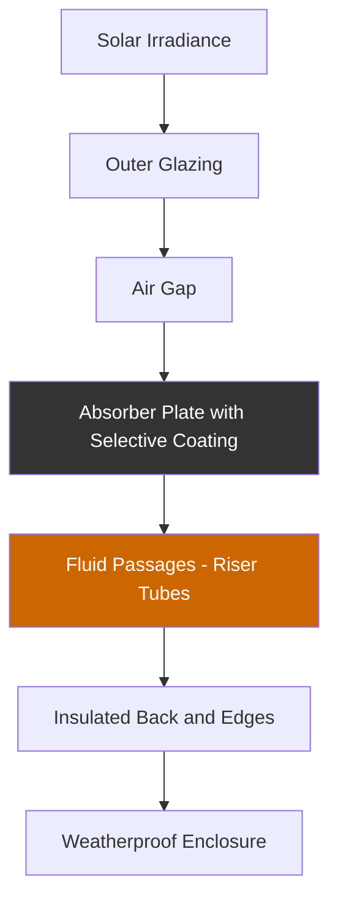
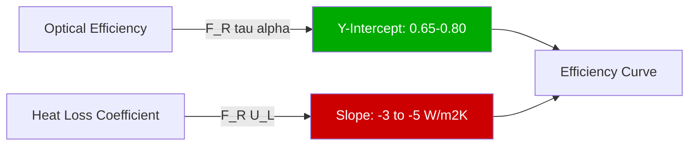

## Физическая конструкция

Плоские солнечные коллекторы представляют наиболее широко развернутую технологию солнечной тепловой энергии для систем горячего водоснабжения, преобразуя солнечное излучение в тепловую энергию через поглощающие поверхности. Сборка коллектора состоит из пяти основных компонентов, функционирующих как интегрированная тепловая система.

### Конструкция поглощающей пластины

Поглощающая пластина функционирует как основная поверхность теплопередачи, обычно изготавливаемая из меди или алюминия для обеспечения высокой теплопроводности. Медные поглотители обеспечивают теплопроводность 385 Вт/м·К, обеспечивая минимальный температурный градиент между поглощающей поверхностью и жидкостными каналами.

**Конфигурации трубок подъемников:**
- Параллельная трубка: 8–12 трубок, диаметр 1,3–1,9 см, подключены коллекторными коллекторами
- Змеевик: Один непрерывный путь трубки, больший перепад давления
- Наполненная пластина: интегральные жидкостные каналы в связанных металлических листах

Селективные поверхностные покрытия максимизируют солнечную поглощательную способность, минимизируя тепловое излучение. Покрытия из черного хрома, черного никеля или оксинитрида титана достигают:
- Солнечная поглощательная способность (α): 0,92–0,96
- Тепловое излучение (ε): 0,05–0,15
- Повышенная производительность при повышенных температурах

### Системы остекления

Одинарное или двойное остекление снижает конвективные и радиационные потери тепла от поглотителя. Низкожелезистое закаленное стекло пропускает 85–91% падающего солнечного излучения, выдерживая при этом термические напряжения и воздействия окружающей среды.

| Конфигурация остекления | Пропускаемость | Снижение потерь тепла | Коэффициент стоимости |
|----------------------|---------------|---------------------|-------------|
| Одинарное 3,2 мм низкожелезистое стекло | 0,91 | Базовый уровень | 1,0 |
| Одинарное 4,0 мм низкожелезистое стекло | 0,89 | +5% | 1,1 |
| Двойное остекление с воздушным зазором | 0,82 | +15–25% | 1,6–1,8 |
| Одинарное с антирефлекторным покрытием | 0,94 | Базовый уровень | 1,3 |

Воздушный зазор между остеклением и поглотителем обычно составляет 2–4 см, оптимизирован для подавления конвекции при минимизации теплопроводности.

### Изоляция и корпус

Изоляция задней и боковой сторон минимизирует проводящие потери тепла в окружающую среду. Стекловолокно, минеральная вата или полиизоциануратная изоляция с тепловым сопротивлением R-11 до R-19 (1,9–3,3 м²·К/Вт) ограничивает задние потери до 5–8% собранной энергии.

Водостойкий корпус, изготовленный из экструдированного алюминия или оцинкованной стали, защищает внутренние компоненты, сохраняя при этом конструктивную целостность при ветровых и снежных нагрузках в соответствии с ASCE 7.

## Анализ тепловой производительности

### Уравнение эффективности

Тепловая эффективность коллектора следует уточненному уравнению Хоттеля-Виллиера-Блисса в соответствии со стандартом ASHRAE 93:

$$\eta = F_R(\tau\alpha) - F_R U_L \frac{(T_i - T_a)}{G_T}$$

Где:
- $\eta$ = мгновенная тепловая эффективность (безразмерная)
- $F_R$ = коэффициент удаления тепла коллектором (0,85–0,95)
- $\tau$ = пропускаемость остекления (0,85–0,91)
- $\alpha$ = поглощательная способность поглотителя (0,92–0,96)
- $U_L$ = общий коэффициент потерь тепла (Вт/м²·К)
- $T_i$ = температура жидкости на входе (°C)
- $T_a$ = температура окружающего воздуха (°C)
- $G_T$ = общее солнечное излучение на плоскость коллектора (Вт/м²)

Кривая эффективности показывает линейное ухудшение по мере увеличения параметра разницы температур $(T_i - T_a)/G_T$.

### Характеристики кривой эффективности

**Типовые параметры производительности:**
- Оптическая эффективность $F_R(\tau\alpha)$: 0,65–0,80
- Коэффициент первого порядка $F_R U_L$: 3,0–5,0 Вт/м²·К
- Коэффициент второго порядка (нелинейные потери): 0,005–0,015 Вт/м²·К²

Высокопроизводительные коллекторы с селективными покрытиями и двойным остеклением достигают сниженных коэффициентов потерь тепла (2,5–3,5 Вт/м²·К), поддерживая эффективность при более высоких рабочих температурах.

### Рейтинги производительности SRCC

Solar Rating and Certification Corporation (SRCC) предоставляет стандартизированные рейтинги производительности в соответствии со стандартом ANSI/SRCC 100. Программа сертификации OG-100 тестирует коллекторы в контролируемых условиях, сообщая:
- Суточный выход энергии при указанных условиях (МДж/день)
- Коэффициенты эффективности, валидированные тестированием
- Долговечность при термоциклировании и воздействиях окружающей среды

## Диапазон рабочих температур

Плоские солнечные коллекторы работают оптимально в приложениях с низкой и умеренной температурой:

| Приложение | Диапазон работы | Типичная эффективность |
|-------------|----------------|-------------------|
| Предварительный нагрев горячего водоснабжения | 40–60°C | 50–70% |
| Обогрев бассейна | 25–35°C | 60–80% |
| Гидравлическое отопление помещений | 50–70°C | 40–60% |
| Нагрев технической воды | 60–80°C | 30–50% |

Эффективность ухудшается при повышенных температурах из-за увеличения тепловых потерь. Для приложений, требующих температур выше 80°C, вакуумные трубчатые коллекторы обеспечивают превосходную производительность.

## Рассмотрения интеграции системы

**Оптимизация расхода:** Поддерживайте скорость жидкости 0,3–0,5 м/с через подъемники, соответствующую расходам 0,012–0,020 л/с·м² (0,02–0,03 галл/мин/фут²) площади коллектора. Адекватный расход обеспечивает высокий коэффициент удаления тепла при минимизации энергии насоса.

**Температура застоя:** При отсутствии расхода при полном солнечном облучении температуры поглотителя могут достигать 150–200°C. Конструкция системы должна учитывать тепловое расширение, сброс давления и деградацию материала при застое.

**Ориентация и угол наклона:** Максимизируйте годовую энергосбережение, ориентируя коллекторы к экватору под углом наклона, равным широте ±15°. Стационарные установки компрометируют между углами солнца летом и зимой.

**Конфигурация массива:** Последовательное подключение трубопровода увеличивает повышение температуры на проход, но повышает среднюю рабочую температуру, снижая эффективность. Параллельное трубопроводное обратное соединение обеспечивает сбалансированное распределение расхода по нескольким коллекторам.

## Валидация производительности

Стандарт ASHRAE 93 задает процедуры испытаний для тепловой производительности солнечного коллектора, устанавливая стандартные условия:
- Уровни облучения: 800–1000 Вт/м²
- Входные температуры: Несколько контрольных точек, охватывающих диапазон работы
- Скорость ветра: Контролируемая или измеренная
- Угол падения: Нормальный к апертуре коллектора

Испытания генерируют кривые эффективности, позволяя разработчикам систем предсказать энергодоставку в различных метеорологических условиях, используя час-за-часом инструменты моделирования, такие как TRNSYS или WATSUN.

## Экономическая и практическая оценка

Плоские солнечные коллекторы уравновешивают производительность, долговечность и экономическую эффективность для жилых и легких коммерческих приложений. Типовые установленные затраты составляют 3200–6400 руб./м² ($30–60/фут²), обеспечивая периоды простой окупаемости 10–20 лет в зависимости от вытесненных затрат на топливо и качества солнечного ресурса.

Срок службы превышает 25 лет при правильной установке и обслуживании, в первую очередь включая периодическую проверку герметичности остекления, целостности покрытия поглотителя и качества жидкости. Коллекторы, сертифицированные по SRCC OG-100 и ISO 9806, демонстрируют доказанную долгосрочную надежность в разнообразных климатических условиях.
