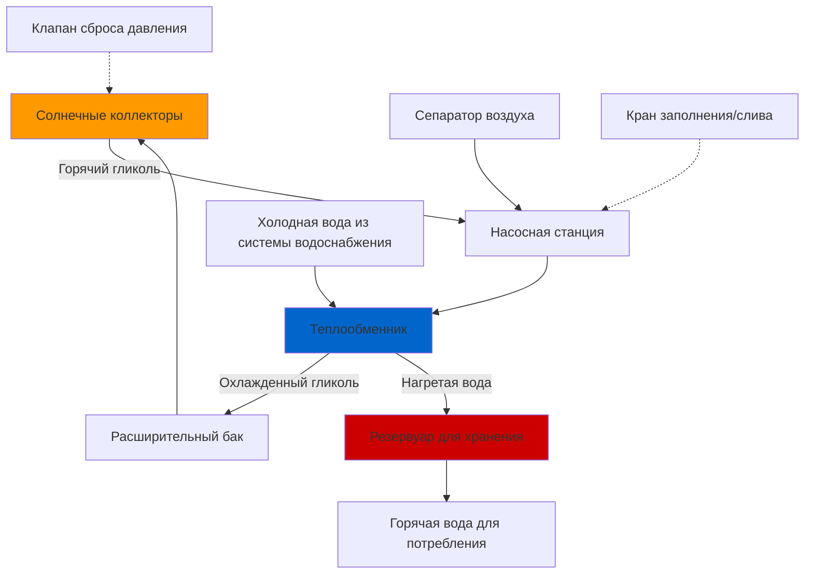

## Обзор

Системы солнечного водяного отопления на основе гликоля используют закрытый контур с циркуляцией раствора антифриза через солнечные коллекторы и передачей тепла питьевой воде через теплообменник. Такой непрямой подход обеспечивает защиту от замерзания в холодном климате, изолируя жидкость коллектора от системы водоснабжения.

## Типы гликолей и их выбор

### Пропиленгликоль в сравнении с этиленгликолем

Пропиленгликоль является предпочтительным антифризом для приложений солнечного отопления благодаря его низкой токсичности. Хотя этиленгликоль обладает превосходными свойствами теплопередачи, его токсичность создает неприемлемые риски при утечке теплообменника в систему питьевой воды.

**Сравнение ключевых свойств:**

| Свойство | Пропиленгликоль | Этиленгликоль | Вода |
|----------|-----------------|-----------------|-------|
| Удельная теплоемкость при 25°C (кДж/кг·К) | 2,48 | 2,35 | 4,18 |
| Теплопроводность (Вт/м·К) | 0,20 | 0,26 | 0,61 |
| Вязкость при 20°C (сП) | 60 | 20 | 1,0 |
| Токсичность | Низкая | Высокая | Отсутствует |

## Защита от замерзания и концентрация

### Определение необходимой концентрации гликоля

Концентрация гликоля должна быть рассчитана на основе минимальной ожидаемой температуры окружающей среды с соответствующим запасом безопасности.

**Расчетная температура = Минимальная историческая температура - 5,6°C**

Этот запас безопасности учитывает застой коллектора во время отключений питания и продолжительные периоды без солнечного излучения.

### Точка замерзания в зависимости от концентрации

| Концентрация гликоля (% по объему) | Точка замерзания (°C) | Защита от разрыва (°C) |
|------------------------------------|-------------------|-----------------------|
| 30% | -10 | -29 |
| 40% | -23 | -40 |
| 50% | -34 | -51 |
| 60% | -48 | -62 |

**Примечание:** Концентрации выше 60% обеспечивают снижающуюся защиту от замерзания и значительно снижают эффективность теплопередачи. Оптимальный диапазон для большинства приложений составляет 40-50% по объему.

## Конфигурация системы

### Компоненты первичного контура

1. **Солнечные коллекторы** - поглощают солнечное излучение и нагревают раствор гликоля
2. **Циркуляционный насос** - поддерживает расход гликоля в соответствии со спецификациями проекта
3. **Теплообменник** - передает тепловую энергию от гликоля к питьевой воде
4. **Расширительный бак** - компенсирует тепловое расширение раствора гликоля
5. **Сепаратор воздуха** - удаляет захваченный воздух из системы
6. **Клапан сброса давления** - защищает от условий избыточного давления

## Расчет размера теплообменника

### Расчеты теплопередачи

Требуемая площадь теплообменника зависит от выходной мощности массива коллекторов, свойств жидкости и перепада температур.

**Основное уравнение теплопередачи:**

$$Q = UA \cdot LMTD$$

Где:
- $Q$ = скорость теплопередачи (кДж/ч)
- $U$ = общий коэффициент теплопередачи (кДж/ч·м²·К)
- $A$ = площадь поверхности теплообменника (м²)
- $LMTD$ = логарифмическая средняя разность температур (К)

**Логарифмическая средняя разность температур:**

$$LMTD = \frac{\Delta T_1 - \Delta T_2}{\ln(\Delta T_1 / \Delta T_2)}$$

Где:
- $\Delta T_1 = T_{гликоль,вход} - T_{вода,выход}$
- $\Delta T_2 = T_{гликоль,выход} - T_{вода,вход}$

### Общий коэффициент теплопередачи

Общий коэффициент теплопередачи для теплообменников гликоль-вода учитывает конвективное сопротивление с обеих сторон плюс проводящее сопротивление через материал теплообменника:

$$\frac{1}{U} = \frac{1}{h_{гликоль}} + \frac{t_{стенка}}{k_{стенка}} + \frac{1}{h_{вода}}$$

**Типичные значения U для солнечных приложений:**
- Пластинчатые теплообменники: 852-1420 кДж/ч·м²·К
- Кожухотрубные: 455-682 кДж/ч·м²·К
- Змеевик в баке: 284-455 кДж/ч·м²·К

### Эффективность теплообменника

Метод эффективности-NTU предоставляет альтернативный подход к расчету размеров:

$$\varepsilon = \frac{Q_{фактический}}{Q_{максимальный}} = \frac{C_h(T_{h,вход} - T_{h,выход})}{C_{мин}(T_{h,вход} - T_{c,вход})}$$

$$NTU = \frac{UA}{C_{мин}}$$

Где:
- $\varepsilon$ = эффективность теплообменника
- $NTU$ = число единиц передачи
- $C_{мин}$ = минимальная скорость теплоемкости (кДж/ч·К)

**Цель проектирования:** эффективность теплообменника 0,4-0,5 для экономичных систем солнечного отопления согласно руководящим принципам ASHRAE 90.1.

## Деградация гликоля и техническое обслуживание

### Механизмы деградации

Высокотемпературный застой гликоля вызывает деградацию через:
1. **Термическое разложение** - происходит при температурах выше 121°C
2. **Окисление** - ускоряется захватом воздуха
3. **Снижение pH** - кислотные условия способствуют коррозии

### Требования к мониторингу

**Годовой протокол тестирования:**
- измерение pH (приемлемый диапазон: 8,0-10,5)
- проверка точки замерзания рефрактометром
- визуальный осмотр на изменение цвета (потемнение указывает на деградацию)
- проверка концентрации ингибиторов

### Критерии замены

Замените раствор гликоля, если:
- pH падает ниже 7,5
- точка замерзания повышается более чем на 5,6°C выше расчетного значения
- раствор становится темно-коричневым или содержит осадок
- система испытывает повторные события высокотемпературного застоя

Стандарт ASHRAE 90.1 требует, чтобы системы на гликоле включали средства для тестирования, слива и перезарядки жидкости коллектора без нарушения герметичности соединений под давлением.

## Расчет размера расширительного бака

Расширительный бак должен вмещать объемное расширение от минимальной температуры заполнения до максимальной температуры застоя.

$$V_t = \frac{V_s \cdot \Delta v}{1 - \frac{P_i}{P_f}}$$

Где:
- $V_t$ = требуемый объем бака (л)
- $V_s$ = объем жидкости в системе (л)
- $\Delta v$ = изменение удельного объема (обычно 0,10-0,15 для 40-50% гликоля)
- $P_i$ = начальное давление в системе (кПа абсолютное)
- $P_f$ = конечное давление в системе при установке клапана сброса (кПа абсолютное)

**Практика проектирования:** выбирайте расширительные баки для максимальной температуры жидкости 176°C для учета условий застоя.

## Защита от избыточного давления

Стандарт ASHRAE 90.1 раздел 7.4.4.2 требует:
- установку клапана сброса давления на максимальный рейтинг коллектора или 1034 кПа, в зависимости от того, что меньше
- отвод сброса клапана в одобренное место
- отсутствие запорных клапанов между коллекторами и клапаном сброса
- выбор размера клапана сброса в соответствии с объемом заполнения системы и температурой застоя коллектора

## Рассмотрения производительности

### Штраф теплопередачи

Растворы гликоля снижают эффективность теплопередачи по сравнению с водой из-за более низкой удельной теплоемкости и теплопроводности. Штраф за производительность составляет 5-15% в зависимости от концентрации.

**Коэффициент коррекции:**

$$\eta_{гликоль} = \eta_{вода} \cdot (0,90 - 0,002 \cdot C)$$

Где $C$ = концентрация гликоля (% по объему)

### Энергия насоса

Более высокая вязкость увеличивает требуемую мощность насоса. При концентрации 40% и температуре 37,8°C вязкость пропиленгликоля примерно в 4-5 раз выше вязкости воды, требуя тщательного выбора насоса и проверки расходов.

## Соответствие кодексам

Системы должны соответствовать:
- **ASHRAE 90.1** - энергетический стандарт для зданий
- **IAPMO PS 11** - теплоносители солнечных систем
- **Стандарт SRCC 400** - рейтинг и сертификация систем солнечного водяного отопления
- Местные сантехнические и механические кодексы, регулирующие установку теплообменников и защиту от перекрестных соединений

Двустенные теплообменники с промежуточной вентиляцией могут быть требованием местного органа, имеющего юрисдикцию, для предотвращения загрязнения питьевой воды гликолем.
