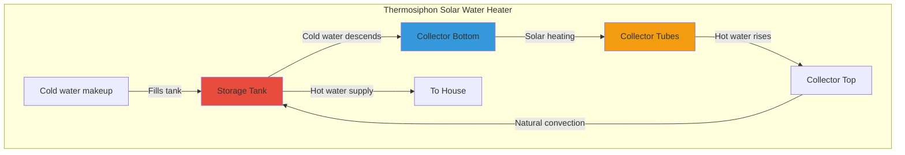
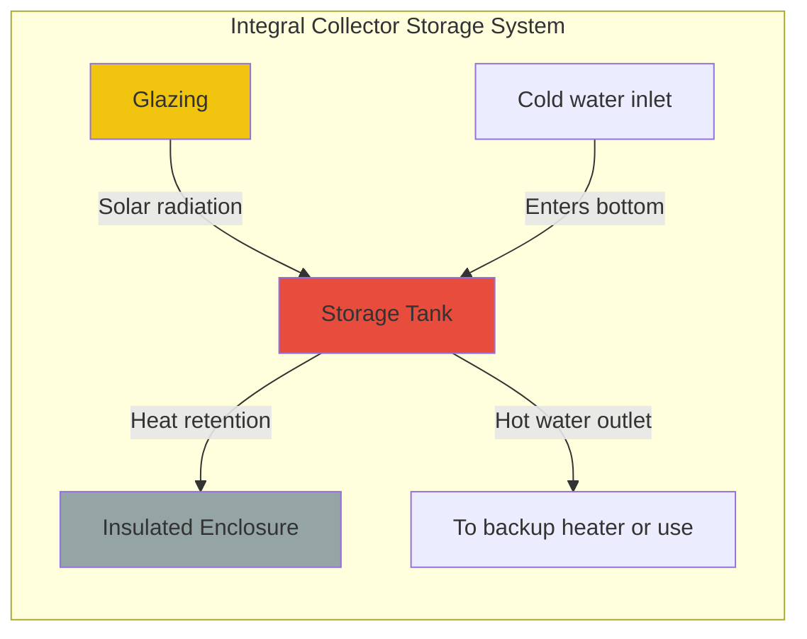

## Введение в пассивное солнечное нагревание воды

Системы пассивного солнечного нагревания воды используют солнечную энергию без механических насосов или контроллеров, полагаясь на естественную конвекцию (эффект термосифона) или прямое хранение в коллекторе. Эти системы обеспечивают простоту, надежность и более низкие затраты на установку по сравнению с активными системами, что делает их подходящими для мягкого климата с минимальным риском замерзания.

## Системы термосифона

### Принцип работы

Системы термосифона используют разницу в плотности горячей и холодной воды для установления естественной циркуляции. По мере нагревания воды в коллекторе солнечным излучением её плотность снижается, что вызывает её подъем в накопительный бак, расположенный выше. Холодная вода из нижней части бака спускается вниз, заменяя её, создавая непрерывный циркуляционный контур.

Скорость потока, управляемая плавучестью в контуре термосифона, определяется следующим образом:

$$Q = A \cdot v = A \sqrt{2g H \frac{\Delta \rho}{\rho_{avg}}}$$

Где:
- $Q$ = объемный расход (м³/с)
- $A$ = площадь поперечного сечения потока (м²)
- $v$ = скорость потока (м/с)
- $g$ = ускорение свободного падения (9,81 м/с²)
- $H$ = вертикальная высота между центром коллектора и центром бака (м)
- $\Delta \rho$ = разница плотности между горячей и холодной водой (кг/м³)
- $\rho_{avg}$ = средняя плотность воды (кг/м³)

Движущий перепад давления составляет:

$$\Delta P = g \cdot H \cdot \Delta \rho$$

Это давление должно преодолеть потери на трение в трубопроводах:

$$\Delta P_{friction} = f \frac{L}{D} \frac{\rho v^2}{2}$$

Где $f$ – коэффициент трения Дарси, $L$ – длина трубопровода, $D$ – диаметр трубопровода.

### Критические параметры проектирования

**Требование высоты:** Дно накопительного бака должно быть расположено как минимум на 76–152 мм (3–6 дюймов) выше верхней части коллектора для обеспечения адекватного давления термосифона. Недостаточная высота приводит к слабой циркуляции и плохой производительности.

**Размер труб:** Трубопроводы большего диаметра (обычно 19–25 мм или 3/4–1 дюйм) снижают сопротивление трению. Соединительные трубы должны быть как можно более короткими и прямыми с минимальным количеством изгибов.

**Предотвращение обратной циркуляции:** Ночью обратное течение в термосифоне может произойти, если коллектор охлаждается ниже температуры бака. Обратные клапаны или тепловые ловушки (восходящие петли трубопровода) предотвращают потерю тепла при обратной циркуляции.

### Конфигурация системы

| Компонент | Спецификация | Назначение |
|-----------|--------------|-----------|
| Площадь коллектора | 2–6 м² | Размер в соответствии со спросом домохозяйства |
| Накопительный бак | 150–300 л | 50–75 л на м² коллектора |
| Высота бака | 76–152 мм выше коллектора | Обеспечивает давление термосифона |
| Диаметр трубы | 19–25 мм | Минимизирует сопротивление потоку |
| Теплоизоляция | RSI 1,8–3,5 | Снижает потери в режиме ожидания |

## Системы накопителя с интегральным коллектором (ICS)

### Конструкция проточного водонагревателя

Системы ICS, обычно называемые проточными водонагревателями, объединяют сбор и хранение в одном изолированном устройстве. Один или несколько баков для воды заключены в застекленный, изолированный корпус, который служит одновременно коллектором и хранилищем. Вода нагревается в течение дня и используется непосредственно или подается на традиционный резервный нагреватель.

Полезный прирост энергии для системы ICS составляет:

$$Q_u = A_c \left[ S - U_L (T_{storage} - T_{ambient}) \right]$$

Где:
- $Q_u$ = полезная собранная энергия (Вт)
- $A_c$ = площадь апертуры коллектора (м²)
- $S$ = поглощенное солнечное излучение (Вт/м²)
- $U_L$ = общий коэффициент потерь тепла (Вт/м²·K)
- $T_{storage}$ = температура воды в хранилище (°C)
- $T_{ambient}$ = температура окружающего воздуха (°C)

Повышение температуры в объеме хранилища за время $\Delta t$ составляет:

$$\Delta T = \frac{Q_u \cdot \Delta t}{m \cdot c_p}$$

Где $m$ – масса воды, $c_p$ – удельная теплоемкость (4186 Дж/кг·K).

### Характеристики производительности

**Преимущества:**
- Отсутствие движущихся частей и отдельного накопительного бака
- Более низкие затраты на установку
- Минимальное обслуживание
- Компактный размер

**Ограничения:**
- Большие потери тепла ночью (несмотря на теплоизоляцию)
- Ограниченная емкость по сравнению с системами термосифона
- Не подходит для климата с риском замерзания
- Меньшая эффективность из-за более высокой рабочей температуры

## Анализ пригодности для климата

Системы пассивного солнечного нагревания воды имеют географические и климатические ограничения:

| Климатическая зона | Возможность применения термосифона | Возможность применения ICS | Основной риск |
|-----------|--------------------------|-----------------|-----------------|
| Без морозов (USDA 9–11) | Отличная | Отличная | Нет |
| Мягкая зима (USDA 7–8) | Хорошо с дренажом | Средняя | Периодическое замерзание |
| Умеренная зима (USDA 5–6) | Требует осушения | Не рекомендуется | Частое замерзание |
| Суровая зима (USDA 1–4) | Не рекомендуется | Не рекомендуется | Серьезный риск замерзания |

**Стратегии защиты от замерзания:**

1. **Ручное осушение:** Пользователь осушает систему при прогнозе мороза
2. **Автоматический дренаж:** Система осушается во внутренний бак при остановке циркуляции
3. **Рециркуляция:** Насос циркулирует теплую воду во время морозов (преобразует в активную систему)
4. **Растворы антифриза:** Непрактичны для контакта с питьевой водой в пассивных системах

## Стандарты проектирования и производительность

ASHRAE 90.2 и Солнечная корпорация рейтинга и сертификации (SRCC) предоставляют стандарты тестирования для пассивных солнечных водонагревателей. SRCC OG-300 устанавливает процедуры оценки для систем ICS, тогда как системы термосифона следуют аналогичным протоколам, адаптированным из стандартов активных систем.

**Типичные метрики производительности:**

- Доля солнечной энергии: 40–70% в пригодных климатических условиях
- Дневная эффективность: 30–50% (ICS), 40–60% (термосифон)
- Период окупаемости: 5–12 лет в зависимости от стоимости энергии
- Срок службы системы: 15–25 лет при надлежащем обслуживании

## Сравнение систем

| Характеристика | Термосифон | ICS (проточный водонагреватель) |
|---------|--------------|---------------------|
| Сложность | Средняя | Низкая |
| Эффективность | Более высокая | Средняя |
| Потеря тепла ночью | Низкая (изолированный бак) | Высокая (открытая тепловая масса) |
| Допуск к замерзанию | Очень низкий | Очень низкий |
| Стоимость установки | 4500–7500 долл. | 3000–6000 долл. |
| Нагрузка на крышу | Отдельный бак и коллектор | Более тяжелый единый блок |
| Лучшее применение | Мягкий климат, круглогодичное использование | Дома отдыха, сезонное использование |

## Соображения по установке

**Конструктивные требования:** Блоки ICS создают значительные нагрузки на крышу (200–400 кг в заполненном состоянии). Конструктивный анализ является обязательным согласно строительным кодексам.

**Ориентация:** Коллекторы должны быть обращены на истинный юг (северное полушарие) с углом наклона, примерно равным широте, для оптимальной производительности в течение всего года.

**Интеграция сантехники:** Пассивные системы обычно служат в качестве предварительных нагревателей для традиционных водонагревателей, обеспечивая подогретую воду, которая снижает энергию резервного нагрева.

**Обслуживание:** Ежегодный осмотр включает проверку целостности остекления, состояния теплоизоляции и проверку надлежащей циркуляции термосифона путем измерения температуры на входе и выходе коллектора.

## Заключение

Системы пассивного солнечного нагревания воды обеспечивают надежное, требующее минимального обслуживания использование солнечной энергии в надлежащих климатических условиях. Системы термосифона обеспечивают превосходную производительность, но требуют тщательного внимания к высоте бака и конструкции трубопровода. Системы ICS требуют компромисс между эффективностью и простотой, а также более низкой стоимостью. Обе технологии жизнеспособны только в климате без морозов или с мягкой зимой, если они не оснащены мерами защиты от замерзания, которые могут нарушить их пассивную работу.

Выбор между пассивным и активным солнечным нагреванием воды зависит от суровости климата, ограничений при установке, бюджета и терпимости пользователя к сезонным колебаниям производительности.
