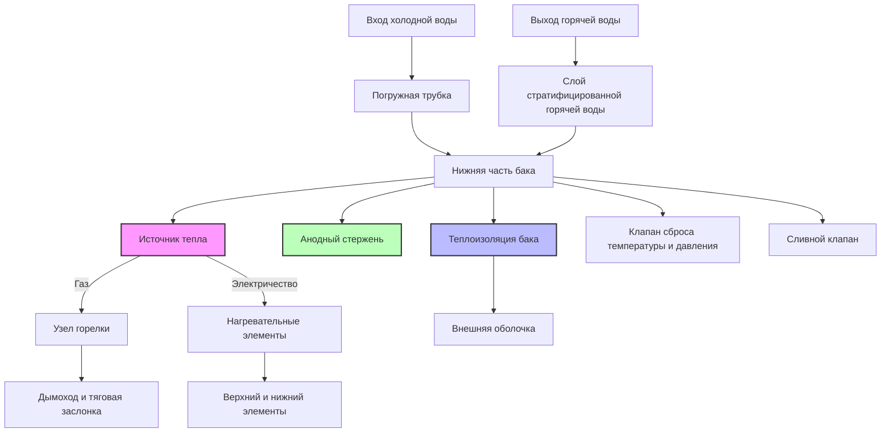

Накопительные водонагреватели представляют собой наиболее распространенную систему подготовки горячей воды в жилых и легких коммерческих приложениях. Эти устройства объединяют генерацию тепла с тепловым аккумулятором, поддерживая резерв горячей воды при установленной температуре через непрерывные или поэтапные циклы отопления.

## Принципы работы

Накопительные водонагреватели работают по простому принципу термостатического управления. Холодная вода поступает в нижнюю часть бака через погружную трубку, вытесняя горячую воду вверх благодаря стратификации, обусловленной плавучестью. Когда температура в баке падает ниже установленного значения, горелки или электрические элементы активируются до восстановления температуры. Такой подход с тепловым аккумулятором обеспечивает высокие мгновенные расходы, превышающие непрерывную мощность нагревателя.

Фундаментальный энергетический баланс, управляющий работой бака:

$$Q_{stored} = m c_p \Delta T = \rho V c_p (T_{tank} - T_{inlet})$$

Где:
- $Q_{stored}$ = накопленная энергия (кДж)
- $m$ = масса воды (кг)
- $\rho$ = плотность воды (1000 кг/м³)
- $V$ = объем бака (л или м³)
- $c_p$ = удельная теплоемкость воды (4,186 кДж/кг·K)
- $\Delta T$ = повышение температуры (K или °C)

## Компоненты системы

**Критические компоненты:**

- **Конструкция бака**: Стальной или нержавеющий стальной сосуд под давлением с эмалевым покрытием, рассчитанный на минимум 1034 кПа
- **Анодный стержень**: Расходуемый электрод из магния или алюминия, защищающий бак от гальванической коррозии
- **Изоляция**: Полиуретановая пена или стекловолоконное одеяло (типично RSI 2,1–4,2)
- **Погружная трубка**: Подает холодную воду в дно бака, сохраняя стратификацию
- **Клапан Т&П**: Устройство безопасности, открывающееся при 1034 кПа или 99°C

## Показатели производительности

### Скорость восстановления

Скорость восстановления количественно оценивает способность нагревателя непрерывно повышать температуру воды:

$$R = \frac{Q_{input} \times \eta}{4.186 \times \rho \times \Delta T} \text{ (л/ч)}$$

Где:
- $Q_{input}$ = входная мощность горелки или элемента (кДж/ч)
- $\eta$ = тепловая эффективность (десятичная)
- $\Delta T$ = повышение температуры (K или °C)
- 4,186 = удельная теплоемкость воды (кДж/кг·K)

**Пример**: газовый нагреватель мощностью 11,7 кВ (40 000 BTU/ч) с эффективностью 62%, повышающий температуру на 50 K:

$$R = \frac{11,700 \times 0.62}{4.186 \times 1000 \times 50} = 34,7 \text{ л/ч}$$

### Рейтинг первого часа (FHR)

FHR представляет общую подачу горячей воды в первый час максимального отбора:

$$FHR = V \times 0,7 + R \text{ (литры)}$$

Коэффициент 0,7 учитывает полезное хранилище перед чрезмерным смешиванием. Этот показатель определяет размер нагревателя для пиковых периодов спроса.

### Потери в режиме ожидания

Потери в режиме ожидания количественно определяют рассеивание тепла через поверхности бака:

$$Q_{standby} = UA(T_{tank} - T_{ambient})$$

Где:
- $U$ = общий коэффициент теплопередачи (кДж/ч·м²·K)
- $A$ = площадь поверхности бака (м²)
- Типичные потери в режиме ожидания: 1–3% энергии бака в час

Процедуры испытаний DOE измеряют потери в режиме ожидания как процент в час при установке 57°C.

## Тепловая стратификация

Тепловая стратификация существенно влияет на производительность. Горячая вода (меньшая плотность) естественным образом поднимается, создавая отличные температурные слои. Сильная стратификация сохраняет доступность горячей воды; смешивание снижает эффективное хранилище. Факторы проектирования, влияющие на стратификацию:

- Длина и размещение погружной трубки
- Расходы отбора (>47 л/ч способствует смешиванию)
- Соотношение высоты бака к диаметру (оптимально >2:1)
- Внутренние перегородки или диффузоры

## Сравнение газовых и электрических систем

| Параметр | Газовый накопительный | Электрический накопительный |
|-----------|----------------------|---------------------------|
| **Коэффициент энергии (EF)** | 0,58 – 0,70 | 0,90 – 0,95 |
| **Скорость восстановления** | 33–57 л/ч (11,7 кВ) | 14–24 л/ч (4,5 кВ) |
| **Диапазон входной мощности** | 8,8 – 21,9 кВ | 3,0 – 6,0 кВ |
| **Требуется вентиляция** | Да (тип B или принудительная) | Нет |
| **Стоимость эксплуатации** | Ниже (типично) | Выше (тарифы на электричество) |
| **Стоимость установки** | Выше (вентиляция, газопровод) | Ниже |
| **Срок службы** | 8–12 лет | 10–15 лет |
| **Воздух для горения** | 24 м³/ч на 3,5 кВ | Не требуется |

## Стандарты эффективности DOE

Текущие федеральные стандарты (действительны с 2015 года, обновлены в 2023 году) требуют минимальных значений коэффициента энергии (EF) или унифицированного коэффициента энергии (UEF):

**Жилые газовые накопительные (<208 л)**:
- UEF ≥ 0,64 – 0,0019 × V (где V = объем в галлонах)

**Жилые электрические накопительные (<208 л)**:
- UEF ≥ 0,93 – 0,00132 × V

**Коммерческие приложения (>450 л)**:
- Тепловая эффективность ≥ 80% (газ)
- Потери в режиме ожидания ≤ значения в таблицах

Протокол испытаний UEF включает реалистичные схемы отбора (низкий, средний, высокий расход), заменяя одноточечный тест EF.

## Методология расчета

Правильный расчет уравновешивает рейтинг первого часа с пиковым спросом:

1. **Определить пиковый часовой спрос**: Суммировать использование приборов в период максимального отбора
2. **Рассчитать требуемый FHR**: Должен превышать пиковый спрос на 10–20%
3. **Выбрать размер бака**: Уравновесить FHR, скорость восстановления и ограничения пространства
4. **Проверить восстановление**: Скорость восстановления должна справляться с устойчивыми отборами

**Типичный жилой расчет**:
- 1–2 человека: 113–151 л (224–284 л FHR)
- 3–4 человека: 151–189 л (284–380 л FHR)
- 5+ человек: 189–302 л (380–476+ л FHR)

## Оптимизация эффективности

Максимизация тепловой эффективности требует внимания к сохранению тепла и эффективности сгорания/электричества:

- **Улучшение изоляции**: Добавить одеяло RSI 1,8 на старые блоки (до 2004 года)
- **Изоляция труб**: Первые 1,8 м горячих и холодных труб снижают потери в режиме ожидания на 2–4%
- **Установка температуры**: 49°C уравновешивает безопасность и эффективность (каждое снижение на 5,6°C экономит 3–5%)
- **Обслуживание анода**: Заменить, когда >15 см сердечника проволоки открыто
- **Промывка отложений**: Ежегодный слив удаляет изолирующий слой накипи

## Соображения по установке

Установка в соответствии с кодексом обеспечивает безопасность и производительность:

- **Зазоры**: 15 см от горючих материалов (газ), обычно нулевой зазор разрешен (электричество)
- **Слив Т&П**: Прокладывать в одобренное место в пределах 15 см от пола
- **Сейсмические крепления**: Два ремня требуются в сейсмических зонах
- **Воздух для горения**: Минимум 12 м³/ч на 3,5 кВ входной мощности (газ)
- **Расширительный бак**: Требуется в закрытых системах для предотвращения чрезмерного давления
- **Поддон слива**: Обязателен в помещениях над готовыми помещениями

Накопительные водонагреватели продолжают развиваться с улучшенной изоляцией, электронными управлениями и гибридными тепловыми насосами, но фундаментальные принципы теплового накопления остаются неизменными. Правильный выбор, установка и техническое обслуживание обеспечивают надежное обеспечение горячей водой для жилых и легких коммерческих приложений.
