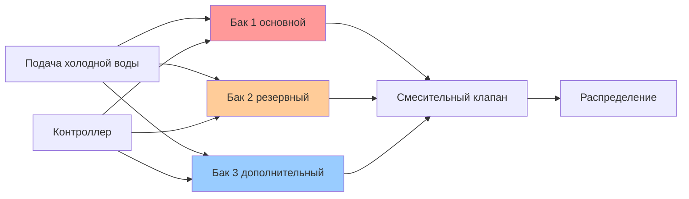
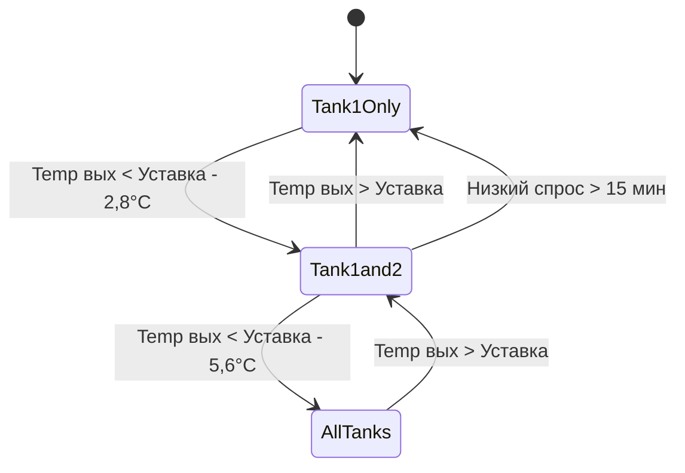

## Обзор

Коммерческие накопительные водонагреватели предназначены для приложений, требующих значительных объемов горячей воды с стабильной температурой подачи. Эти системы имеют объем от 303 до 3785 л и более и включают прочную конструкцию, улучшенную теплоизоляцию и горелки высокой производительности для удовлетворения коммерческих профилей потребления.

Накопительные водонагреватели хранят нагретую воду при заданной температуре (обычно 49–60°C) и подают ее по требованию. Бак обеспечивает тепловую массу, которая компенсирует кратковременные пиковые нагрузки, а горелка восстанавливает запас воды в непиковые периоды.

## Конструкция и компоненты

### Конструкция стеклокерамического бака

Коммерческие накопительные баки используют конструкцию из стали со стеклокерамическим покрытием для защиты от коррозии при работе с питьевой водой:

**Основные элементы конструкции бака:**
- Стальной бак с керамико-фарфоровым стеклокерамическим покрытием
- Толщина покрытия 0,25–0,51 мм
- Виtreous покрытие, наносимое при 816°C
- Магниевый или алюминиевый жертвенный стержень для защиты от гальванической коррозии
- Сертификация по ASME в качестве сосуда под давлением (типично 1034 кПа рабочего давления)

Стеклокерамическое покрытие создает барьер между водой и стальной основой. Магниевые или алюминиевые жертвенные стержни защищают открытую сталь в местах дефектов покрытия.

### Системы теплоизоляции

Коммерческие агрегаты имеют значительно более высокие значения теплоизоляции, чем бытовые модели:

| Уровень изоляции | RSI | Применение |
|-----------------|---------|-------------|
| Стандартная коммерческая | 2,8 | Общие коммерческие приложения |
| Высокоэффективная | 3,5–4,2 | Соответствие энергетическим кодексам, высокие температуры в режиме ожидания |
| Высокоэффективная | 4,9+ | Больницы, лаборатории, требующие минимальных потерь в режиме ожидания |

Изоляция состоит из пенополиуретана или стекловолоконного мата между баком и корпусом. Потери тепла в режиме ожидания снижаются примерно на 15–20% при увеличении RSI на каждые 0,7.

### Высокопроизводительные горелки

Коммерческие горелки обеспечивают значительно более высокую теплопроизводительность, чем бытовые агрегаты:

**Типичные диапазоны теплопроизводительности по объему бака:**

| Объем бака (л) | Входная мощность газа (кВт) | Входная мощность электрическая (кВт) | Производительность восстановления при повышении на 56°C (л/ч) |
|---------------------|-----------------|---------------------|------------------------------|
| 303–378 | 22–29 | 18–27 | 71–90 |
| 450–568 | 29–44 | 36–54 | 90–137 |
| 757–1136 | 44–73 | 54–90 | 137–227 |
| 1514–1893 | 73–117 | 90–144 | 227–360 |

Производительность восстановления представляет собой объем воды в литрах в час, который горелка может нагреть от температуры поступающей холодной воды до заданной температуры.

## Методология подбора

### Расчет накопления и восстановления

Подбор коммерческого водонагревателя объединяет объем накопления и производительность восстановления для удовлетворения пикового часового спроса. ASHRAE 90.1 и местные сантехнические нормы определяют минимальную эффективность и методы подбора.

**Основное уравнение подбора:**

$$V_{storage} + (t_{peak} \times R) \geq Q_{peak}$$

Где:
- $V_{storage}$ = полезный объем накопления (литры)
- $t_{peak}$ = длительность периода пикового спроса (часы)
- $R$ = производительность восстановления (л/ч)
- $Q_{peak}$ = пиковый часовой спрос (литры)

**Расчет производительности восстановления:**

$$R = \frac{Q_{input} \times \eta \times 3600}{4186 \times \Delta T}$$

Где:
- $Q_{input}$ = входная мощность горелки (кДж/ч)
- $\eta$ = тепловая эффективность (обычно 0,80–0,82 для атмосферного газа, 0,98+ для конденсационных)
- $\Delta T$ = повышение температуры (°C) = заданная температура - температура поступающей воды
- $4186$ = удельная теплоемкость воды (Дж/кг·°C)
- $3600$ = секунд в час

**Пример расчета:**

Для коммерческой кухни, требующей подачи 1514 л в час пикового спроса, поступающей воды при 10°C, заданной температуре 60°C:

$$\Delta T = 60 - 10 = 50°C$$

Предположим входную мощность 59 кВт (200 MBH), эффективность 80%:

$$R = \frac{210{,}600 \times 0,80 \times 3600}{4186 \times 50} = 152 \text{ л/ч}$$

Требуемое накопление:

$$V_{storage} = 1514 - (1,0 \times 152) = 1362 \text{ л}$$

Выбрать бак объемом 1514 л с входной мощностью 59 кВт.

### Метод профиля подачи воды ASHRAE

ASHRAE стандарты 118.1 и 118.2 определяют стандартизированные профили подачи для испытания оборудования. Модифицированный метод подачи учитывает реалистичные схемы использования:

**Уравнение профиля подачи:**

$$V_{tank} = \frac{Q_{peak} - (R \times t_{draw})}{F_{storage}}$$

Где:
- $F_{storage}$ = коэффициент использования накопления (0,70–0,85 типично)
- $t_{draw}$ = фактическая длительность подачи в период пикового спроса

Этот метод учитывает, что только 70–85% объема бака являются термически полезными перед значительным снижением температуры.

## Системы с несколькими баками

### Варианты конфигурации

Крупные коммерческие установки часто используют несколько меньших баков вместо одного крупного для обеспечения резервирования, удобства обслуживания и размещения оборудования.

**Последовательная конфигурация:**

Холодная вода поступает в первый бак, выход подает воду во второй бак. Обеспечивает максимальную производительность восстановления, но имеет риск последовательного отказа.

**Параллельная конфигурация:**

Холодная вода поступает во все баки через коллектор, выходы объединяются для распределения. Обеспечивает резервирование и возможность ступенчатого включения.

**Ступенчатое управление основной-вспомогательный:**

Основной бак(и) работает непрерывно, вспомогательные баки включаются в зависимости от температуры выхода или спроса на подачу. Снижает циклирование и повышает эффективность в периоды низкого спроса.

### Логика управления ступенчатым включением

Современные коммерческие системы используют микропроцессорное управление для ступенчатого включения нескольких баков:

Логика ступенчатого включения предотвращает частое включение-отключение при сохранении температуры подачи в период колебаний спроса.

## Стандарты эффективности

ASHRAE 90.1 и DOE 10 CFR 431 устанавливают минимальные требования к эффективности коммерческих накопительных водонагревателей:

**Газовые накопительные (≥ 22 кВт):**

$$E_t = \frac{Q_{input}}{2346 + 322\sqrt{V}}$$

Где:
- $E_t$ = тепловая эффективность (десятичная)
- $V$ = номинальный объем накопления (литры)

**Требование к потерям в режиме ожидания:**

$$SL \leq \frac{Q_{input}}{2346 + 322\sqrt{V}} \times \left(\frac{205}{\sqrt{V}}\right)$$

Максимальные потери в режиме ожидания уменьшаются с увеличением объема бака из-за соотношения площади поверхности к объему.

## Рекомендации по установке

**Требования вентиляции:**

Атмосферные агрегаты высокой мощности требуют вентиляции категории I, рассчитанной по NFPA 54. Диаметр одностенного металлического дымохода:

$$D_{vent} = \sqrt{\frac{Q_{input}}{2930 \times C_{factor}}}$$

Где $C_{factor}$ варьируется от 25–35 в зависимости от высоты дымохода и конфигурации.

Конденсационные агрегаты используют вентиляцию категории IV (с положительным давлением, конденсационная) из ПВХ или ХПВХ.

**Воздух для горения:**

Стандартный метод требует 24 м³/ч воздуха снаружи на 100 кДж/ч входной мощности или 6,5 см² свободной площади на каждые 100 кДж/ч.

**Сейсмическое крепление:**

IBC и IPC требуют сейсмического крепления с помощью ремней в верхней трети и нижней трети высоты бака в сейсмических зонах. Ремни должны выдерживать нагрузку, равную 0,4 кратного операционному весу оборудования.

## Обслуживание и срок службы

**Ожидаемый срок службы:**

Стеклокерамические коммерческие баки: 10–15 лет типично, 20+ лет при надлежащем обслуживании.

**Критические задачи обслуживания:**

- Проверка жертвенного стержня ежегодно, замена при 75% истощении
- Ежегодное испытание клапана предохранительного по давлению и температуре
- Слив и промывка осадка раз в полгода в зонах с жесткой водой
- Анализ горения и настройка горелки ежегодно
- Проверка корпуса изоляции на повреждения

**Режимы отказа:**

Основной режим отказа — деградация покрытия, подвергающая сталь коррозионному воздействию химического состава воды. Истощенные жертвенные стержни ускоряют перфорацию бака. Регулярная замена жертвенных стержней значительно продлевает срок службы.

## Руководство по выбору применения

| Тип применения | Рекомендуемая конфигурация | Коэффициент подбора |
|------------------|---------------------------|---------------|
| Офисные здания | Один бак, стандартная производительность | 1,9–1,9 л на человека |
| Рестораны | Несколько баков, высокая производительность | 5,7–9,5 л на обеденное место |
| Отели | Ступенчатые параллельные баки | 113–151 л на номер |
| Здравоохранение | Резервные параллельные, высокая температура | 94–132 л на кровать |
| Фитнес-центры | Высокая производительность, темперирование | 11–19 л на душевую |

Выбор должен учитывать разнообразие использования, длительность пиковой нагрузки и требования по температуре в соответствии с ASHRAE Applications Handbook Chapter 51.

---

**Ссылки:**
- ASHRAE 90.1: Energy Standard for Buildings
- ASHRAE 118.1: Method of Testing for Rating Commercial Gas Water Heating Equipment
- AHRI 1500: Performance Rating of Commercial Storage Water Heaters
- IPC: International Plumbing Code
