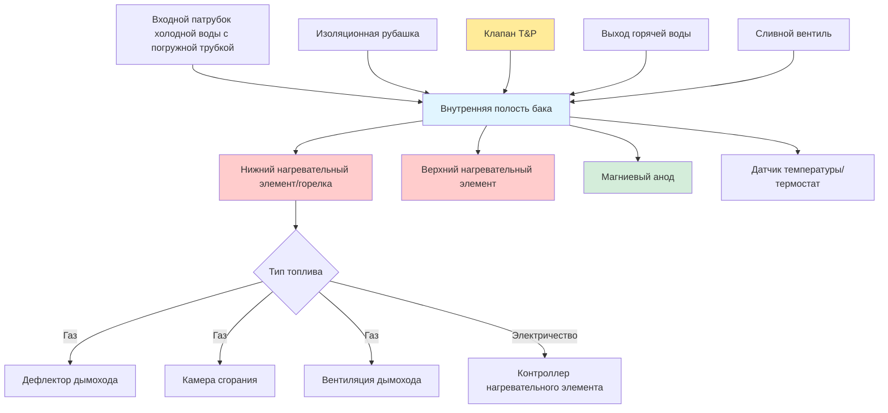

Накопительные водонагреватели для жилых помещений являются доминирующей технологией производства горячей воды для бытовых нужд в одноквартирных и многоквартирных зданиях. Эти системы поддерживают объем нагретой воды при заданной температуре (обычно 49-60°C) благодаря непрерывному подводу энергии для компенсации потерь тепла в режиме ожидания и удовлетворения периодических потребностей в отборе воды.

## Типы топлива и механизмы передачи тепла

### Газовые накопительные нагреватели

Газовые агрегаты оснащены атмосферными или принудительно вентилируемыми горелками, расположенными под баком. Продукты сгорания передают тепло через центральную дымовую трубу, проходящую вертикально через объем воды. Типичные входные мощности варьируются от 31 кВт до 80 кВт для жилищных приложений, с тепловым КПД 60-67% для атмосферной вентиляции и до 80% для принудительно вентилируемых или прямовентилируемых конфигураций.

Скорость восстановления для газовых нагревателей рассчитывается следующим образом:

$$R_{gas} = \frac{\eta \cdot Q_{input}}{4.187 \cdot \Delta T}$$

где:
- $R_{gas}$ = скорость восстановления (л/ч)
- $\eta$ = тепловой КПД (десятичная дробь)
- $Q_{input}$ = входная мощность горелки (кВт)
- $\Delta T$ = повышение температуры (°C), типично 50°C для входной температуры 10°C до заданной температуры 60°C

### Электрические резистивные нагреватели

Электрические агрегаты используют погружные нагревательные элементы (обычно мощностью 3,5-5,5 кВт каждый), расположенные в нижней и верхней части бака. Передача тепла происходит путем прямого кондуктивного теплообмена с окружающей водой. Электрические нагреватели достигают 100% эффективности преобразования, но имеют более высокие эксплуатационные расходы при большинстве тарифных структур.

Скорость восстановления для электрических нагревателей:

$$R_{elec} = \frac{P_{total}}{4.187 \cdot \Delta T}$$

где $P_{total}$ — общая мощность элементов в кВт.

## Показатели производительности

### Рейтинг первого часа (FHR)

FHR определяет объем горячей воды, который можно подать в течение одного часа, начиная с полностью нагретого бака, учитывая как накопленный объем, так и восстановление во время отбора. Этот показатель прямо соответствует характерам использования жильцами.

$$\text{FHR} = V_{tank} \cdot 0.70 + R \cdot 1.0$$

где $V_{tank}$ — номинальная емкость, а $R$ — скорость восстановления. Коэффициент 0.70 учитывает тепловую стратификацию и полезный объем.

### Коэффициент энергии (EF)

Коэффициент энергии представляет отношение полезной энергии на выходе к общей энергии на входе в стандартных условиях испытаний DOE. Обратное соотношение определяет годовое потребление энергии:

$$E_{annual} = \frac{52,400 + 71,200 \cdot N_{BR} - 16,700 \cdot N_{units}}{\text{EF}}$$

где $N_{BR}$ — количество спален, а $N_{units}$ — количество жилых единиц, обслуживаемых системой.

### Унифицированный коэффициент энергии (UEF)

Стандарты DOE, действующие с 2015 года, заменили EF на UEF, который оценивает производительность при различных режимах отбора воды. Протоколы испытания UEF лучше имитируют фактическое использование и условия в режиме ожидания. Минимальные требования UEF варьируются в зависимости от емкости бака и типа топлива, при этом текущие стандарты требуют:

- Газовые накопительные ≥ 208 л: UEF ≥ 0,64
- Электрические накопительные ≥ 208 л: UEF ≥ 0,92

## Компоненты жилого накопительного водонагревателя

## Сравнение жилых накопительных баков

| Параметр | 151 л | 189 л | 302 л |
|-----------|-----------|-----------|-----------|
| **Газовые агрегаты** | | | |
| Входная мощность (кВт) | 12-13 | 13-13 | 25-25 |
| Восстановление при повышении на 50°C (л/ч) | 114-122 | 116-122 | 227-233 |
| Рейтинг первого часа (л) | 257-269 | 284-295 | 515-523 |
| Типовой UEF | 0,62-0,67 | 0,61-0,65 | 0,64-0,68 |
| Потери в режиме ожидания (%/ч) | 1,8-2,2 | 1,5-1,9 | 1,2-1,6 |
| **Электрические агрегаты** | | | |
| Мощность элемента | 4,5 | 4,5-5,5 | 5,5 |
| Восстановление при повышении на 50°C (л/ч) | 51-54 | 51-65 | 65-68 |
| Рейтинг первого часа (л) | 174-178 | 201-220 | 303-310 |
| Типовой UEF | 0,93-0,95 | 0,92-0,94 | 0,90-0,92 |
| Потери в режиме ожидания (%/ч) | 1,0-1,4 | 0,9-1,2 | 0,7-1,0 |
| **Физические размеры** | | | |
| Высота (см) | 137-155 | 147-165 | 183-198 |
| Диаметр (см) | 51-56 | 51-56 | 61-66 |
| Масса пустого (кг) | 43-59 | 50-66 | 75-95 |
| Масса полного (кг) | 195-211 | 238-254 | 377-397 |

## Методология расчета мощности

Выбор водонагревателя для жилых помещений требует соответствия FHR пиковому часовому спросу. Рекомендуемые значения ASHRAE для расходов приборов:

- Душ: 9,5 л/мин × 10 минут = 95 л
- Ванна: 3,8 л/мин × 15 минут = 57 л
- Посудомоечная машина: 23 л на цикл
- Стиральная машина: 26 л на цикл

Для трехкомнатного дома с пиковым утренним использованием (2 душа + посудомоечная машина), минимальное значение FHR = 212 л, что указывает на необходимость газового агрегата на 151 л или электрического на 189 л.

## Критические требования к установке

### Воздух для горения и вентиляция

Газовые нагреватели требуют достаточного воздуха для сгорания — 1,4 м³/ч на каждый кВт входной мощности при использовании внутреннего воздуха. Атмосферная вентиляция требует двустенного дымохода типа B с минимальным подъемом 1 см на 30 см длины. Принудительно вентилируемые агрегаты выбрасывают выхлопные газы через ПВХ или ХПВХ горизонтально.

### Предохранительный клапан температуры и давления

Все накопительные нагреватели требуют клапана T&P, рассчитанного на рабочее давление бака (обычно 1035 кПа) и температуру 99°C, с трубопроводом сброса, заканчивающимся в пределах 15 см от пола и размером по присоединению клапана (обычно 1,9 см).

### Контроль теплового расширения

Закрытые системы подачи воды (с обратными клапанами или клапанами предотвращения обратного потока) требуют бака для теплового расширения для размещения объемного увеличения при нагревании, предотвращая нежелательный сброс T&P или избыточное давление в системе.

### Сейсмические соображения и зоны затопления

Установка в сейсмических зонах требует крепления ремнями в верхней и нижней трети высоты бака. Агрегаты в зонах затопления должны быть подняты выше базовой отметки затопления или использовать конструкцию, устойчивую к затоплению.

## Технологии повышения эффективности

Современные жилые накопительные нагреватели включают пенную изоляцию (R-2,8 до R-4,2 м²·K/W), погруженные камеры сгорания и электронное зажигание для минимизации потерь в режиме ожидания. Ловушки тепла на входном и выходном патрубках предотвращают термосифонирование. Питаемые от источника анодные стержни продлевают срок службы, обеспечивая постоянную защиту от коррозии независимо от расходования жертвенного анода.

## Техническое обслуживание и срок службы

Жилые накопительные баки обычно достигают срока службы 8-12 лет при надлежащем обслуживании. Ежегодные работы включают:

- Промывку осадка через сливной вентиль
- Проверку магниевого анода и его замену при 50% истощении
- Проверку функционирования клапана T&P
- Анализ сгорания для газовых агрегатов (уровни CO, тяга дымохода)

Причины преждевременного отказа включают прободение бака вследствие коррозии, перегорание элемента из-за накопления осадка и неисправность термостата вследствие минерального накипи.
