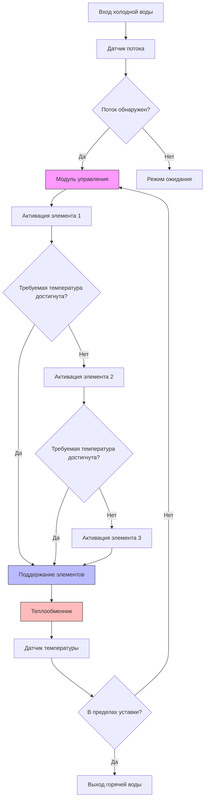
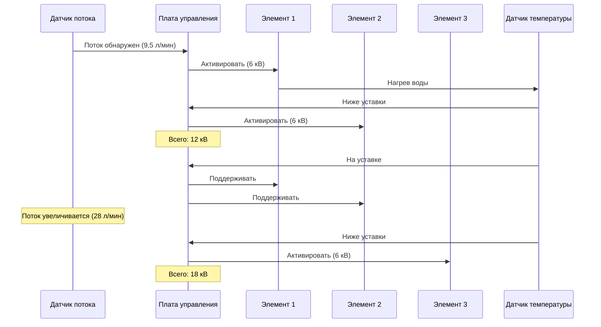

Электрические проточные водонагреватели обеспечивают подачу горячей воды по требованию через элементы резистивного нагрева без накопительных баков. Эти устройства варьируются от компактных моделей у точки потребления (3-12 кВ) до систем для всего дома (18-36 кВ), обеспечивая гибкость установки, но требуя значительной электрической инфраструктуры.

## Принципы работы

Электрические проточные нагреватели используют элементы резистивного нагрева, которые активируются, когда датчики потока обнаруживают движение воды. По мере прохождения холодной воды через теплообменник несколько нагревательных элементов последовательно включаются для достижения требуемого повышения температуры. Мгновенный характер работы исключает потери в режиме ожидания, но требует высокой плотности электрической мощности.

**Уравнение теплопередачи:**

Требуемая мощность рассчитывается из фундаментального соотношения теплопередачи:

$$P = \frac{\dot{m} \cdot c_p \cdot \Delta T}{\eta}$$

Где:
- $P$ = требуемая электрическая мощность (кВ)
- $\dot{m}$ = расход массы (кг/с)
- $c_p$ = удельная теплоёмкость воды = 4,186 кДж/(кг·К)
- $\Delta T$ = повышение температуры (К или °C)
- $\eta$ = эффективность нагрева (обычно 0,98-0,99)

**Практическая формула расчёта:**

Для расчётов в полевых условиях с использованием метрических единиц:

$$P_{кВ} = \frac{л/мин \times \Delta T \times 1,0}{860 \times \eta}$$

Упрощённая для 99% эффективности:

$$P_{кВ} \approx \frac{л/мин \times \Delta T}{860}$$

Где:
- $л/мин$ = литры в минуту
- $\Delta T$ = повышение температуры (°C)
- 860 = кДж на кВт·ч

## Электрические требования

Электрические проточные нагреватели предъявляют значительные электрические требования, которые часто превышают возможности жилищного электроснабжения. Статья NEC 422.13 классифицирует их как водонагреватели накопительного типа, требующие выделенных ветвевых цепей.

### Типичные требования по мощности

| Применение | Расход | Повышение температуры | Требуемая мощность | Напряжение | Сила тока |
|-------------|--------|----------------------|-------------------|-----------|----------|
| У точки потребления (раковина) | 9,5 л/мин | 39°C | 7 кВ | 240В | 29А |
| У точки потребления (душ) | 28 л/мин | 39°C | 21 кВ | 240В | 87А |
| Одна ванная комната | 38 л/мин | 39°C | 28 кВ | 240В | 117А |
| Весь дом (2 ванные) | 66 л/мин | 39°C | 49 кВ | 240В | 204А |
| Весь дом (3 ванные) | 95 л/мин | 39°C | 70 кВ | 240В | 292А |

**Примечание:** Расчёты силы тока предполагают 240В однофазной сети. Фактический расход тока включает коэффициент безопасности в соответствии с NEC 422.10.

### Требования соответствия NEC

В соответствии с NEC 2020:

- **Расчёт ветвевой цепи:** Проводники, рассчитанные минимум на 125% номинальной мощности нагревателя (NEC 422.10)
- **Защита от перегрузки по току:** Автоматический выключатель, рассчитанный в соответствии со спецификациями производителя
- **Сечение провода:** Должно выдерживать постоянную нагрузку без превышения температурного рейтинга
- **Заземление:** Требуется в соответствии с NEC 250.110
- **Защита GFCI:** Требуется для устройств в ванных комнатах и наружных местах (NEC 422.5)

### Расчёт проводников

Для медных проводников на 75°C (обычно в жилищном строительстве):

| Мощность нагревателя | Минимальный проводник | Автоматический выключатель | Примечания |
|----------------------|----------------------|--------------------------|-----------|
| 3-7 кВ | 10 AWG | 30А | У точки потребления |
| 8-11 кВ | 8 AWG | 40А | У точки потребления |
| 12-16 кВ | 6 AWG | 60А | Одна точка водоотведения |
| 18-24 кВ | 4 AWG | 80А | Малый дом |
| 27-36 кВ | 2 AWG | 125А | Типичный дом |

## Методология расчёта

### Шаг 1: Определение пиковой нагрузки

Рассчитайте одновременный спрос по методу вероятности ASHRAE 49 или методу единиц оборудования. Типичные пиковые спросы:

- Кухонная раковина: 28 л/мин
- Раковина в ванной: 9,5 л/мин
- Душ: 38-47 л/мин
- Ванна: 76 л/мин

### Шаг 2: Расчёт повышения температуры

$$\Delta T = T_{требуемая} - T_{входная}$$

Стандартные входные температуры по регионам:
- Южная часть США: 15-18°C
- Центральная часть США: 10-13°C
- Северная часть США: 4-7°C

Требуемые выходные температуры:
- Мытьё рук: 40°C
- Душ: 40-43°C
- Мытьё посуды: 49°C

### Шаг 3: Применение формулы расчёта

Используя упрощённую формулу требуемой мощности, проверьте соответствие доступной ёмкости электроснабжения.

## Архитектура системы

## Управление последовательностью элементов

Электрические проточные нагреватели используют последовательное включение элементов для соответствия нагревательной способности спросу:

## Применение у точки потребления

Электрические проточные нагреватели у точки потребления (3-12 кВ) отличаются в специфических приложениях:

**Преимущества:**
- Минимальная длина трубопроводов снижает потери тепла
- Меньший электрический спрос по сравнению с моделями для всего дома
- Исключает время ожидания горячей воды
- Несколько устройств распределяют электрическую нагрузку
- Идеален для ремонта с ограниченной электрической мощностью

**Распространённые применения:**
- Удалённые ванные комнаты
- Наружные душевые
- Коммерческие станции мытья рук
- Усилители циркуляционного контура
- Поддержание температуры

**Рекомендации по установке:**
- Устанавливайте в пределах 3 м от точки водоотведения для оптимальной работы
- Проверьте адекватность электроснабжения в месте установки
- Учтите падение напряжения на длинных цепях
- Убедитесь в адекватном расходе (минимум 9-15 л/мин для активации)

## Характеристики эффективности

Электрические проточные нагреватели достигают высокой энергетической эффективности благодаря резистивному нагреву и исключению потерь в режиме ожидания.

**Рейтинги ASHRAE 118.2:**
- Тепловая эффективность: 98-99%
- Энергетический коэффициент (EF): 0,96-0,99
- Унифицированный энергетический коэффициент (UEF): 0,91-0,96

**Преимущества эффективности:**
- Отсутствие потерь через дымоход (по сравнению с камерными нагревателями)
- Отсутствие потерь тепла в режиме ожидания
- Коэффициент мощности близко к единице
- Модулирующая способность соответствует нагрузке

**Ограничения:**
- Высокие тарифы на электроэнергию снижают операционные сбережения
- Могут применяться платежи за пиковый спрос
- Требует увеличения электроснабжения
- Источник энергетической эффективности зависит от метода выработки электроэнергии

## Ограничения производительности

Способность повышения температуры уменьшается с увеличением расхода:

| Расход (л/мин) | Повышение 7 кВ | Повышение 14 кВ | Повышение 21 кВ | Повышение 28 кВ |
|----------------|----------------|-----------------|-----------------|-----------------|
| 9,5 | 39°C | 78°C | 117°C | 156°C |
| 19 | 20°C | 39°C | 58°C | 78°C |
| 38 | 10°C | 20°C | 29°C | 39°C |
| 57 | 7°C | 13°C | 20°C | 26°C |
| 76 | 5°C | 10°C | 15°C | 20°C |

Эта обратная зависимость требует тщательного расчёта на основе климатической зоны и ожидаемых одновременных спросов.

## Рекомендации по проектированию

**Анализ электроснабжения:**
Проверьте, что общая ёмкость электроснабжения позволяет подключить нагреватель плюс другие нагрузки. Нагреватель мощностью 36 кВ для всего дома потребляет непрерывно 150А, превышая возможности многих 200А жилищных электроснабжений.

**Качество воды:**
Жёсткая вода вызывает образование накипи на нагревательных элементах. Установите смягчитель воды или используйте самоочищающиеся модели в районах с жёсткостью более 5,8 ммоль/л.

**Перепад давления:**
Компактные теплообменники создают перепад давления 34-103 кПа. Проверьте адекватное входное давление (минимум 206 кПа рекомендуется).

**Стабильность температуры:**
Модулирующие управления поддерживают выходную температуру в пределах 0,6-1,1°C при постоянном потоке. Изменения расхода вызывают кратковременные колебания температуры.

**Доступ для обслуживания:**
Устанавливайте устройства с зазорами в соответствии со спецификациями производителя. Замена нагревательного элемента требует слива устройства и отключения электроэнергии.

## Нормативные ссылки и стандарты

- **Статья NEC 422:** Приборы, в частности 422.10 (рейтинг ветвевой цепи), 422.13 (накопительные водонагреватели)
- **ASHRAE 118.2:** Метод тестирования и определения рейтингов для жилищных водонагревателей
- **ASHRAE 90.2:** Энергоэффективное проектирование малоэтажных жилых зданий
- **UL 499:** Стандарт безопасности для электрических отопительных приборов
- **NSF/ANSI 372:** Компоненты систем питьевого водоснабжения - содержание свинца

Надлежащая спецификация требует координации между сантехническими, электрическими и строительными работами для обеспечения соответствия нормам установки с адекватной ёмкостью для условий проектирования.
