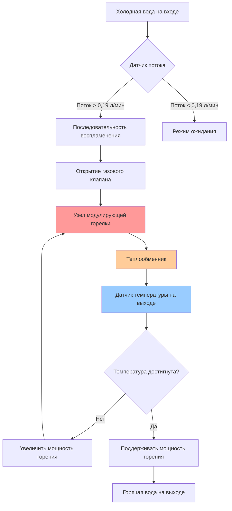
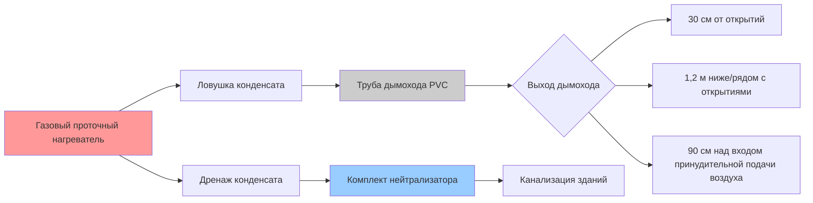

Газовые проточные водонагреватели обеспечивают непрерывное снабжение горячей водой для хозяйственных нужд путем нагрева воды только при обнаружении потока, устраняя потери в режиме ожидания, присущие баковым системам. Эти системы мгновенного нагрева достигают теплового КПД от 80% (неконденсационные) до 98% (конденсационные модели) и требуют тщательного выбора мощности на основе одновременного потребления приборов и требуемого прироста температуры.

## Принцип работы

Газовые проточные водонагреватели активируются, когда поток воды превышает минимальный порог (обычно 0,15-0,23 л/мин). Датчики потока запускают последовательность воспламенения, и модулирующие горелки регулируют мощность горения для поддержания установленной пользователем температуры на выходе. Фундаментальное соотношение теплопередачи определяет выбор мощности:

$$Q = \dot{m} \cdot c_p \cdot \Delta T = 4.19 \cdot \text{л/мин} \cdot \Delta T$$

Где:
- $Q$ = Требуемая мощность нагрева (кДж/ч)
- $\dot{m}$ = Массовый расход (кг/ч)
- $c_p$ = Удельная теплоемкость воды (4.19 кДж/кг·°C)
- л/мин = Объемный расход (литры в минуту)
- $\Delta T$ = Прирост температуры (°C)

Коэффициент 4.19 представляет произведение плотности воды (1 кг/л) и удельной теплоемкости (4.19 кДж/кг·°C).

## Конденсационная и неконденсационная технология

Различие между конденсационными и неконденсационными газовыми проточными приборами сосредоточено на рекуперации теплоты дымовых газов и соответствующем КПД:

**Неконденсационные приборы:**
- Тепловой КПД: 80-85%
- Температура выхлопа: 149-204°C
- Дымоход категории I или III (одностенная металл или нержавеющая сталь)
- Более низкая начальная стоимость
- Нейтрализация конденсата не требуется

**Конденсационные приборы:**
- Тепловой КПД: 90-98%
- Температура выхлопа: 38-54°C
- Дымоход категории II или IV (PVC, CPVC или полипропилен)
- Вторичный теплообменник восстанавливает скрытую теплоту
- Требуется дренаж конденсата с нейтрализацией pH согласно местным кодексам
- Более высокая начальная стоимость компенсируется экономией энергии

ASHRAE 90.1 требует минимальный тепловой КПД 0,82 Et для газовых проточных водонагревателей, что фактически требует конденсационной технологии для большинства коммерческих применений.

## Методология выбора мощности

Правильный выбор мощности требует анализа одновременного потребления приборами и температуры воды на входе. Процесс проектирования следует этим этапам:

1. **Определение пикового одновременного потока:**

| Тип прибора | Расход (л/мин) | Количество | Общий расход |
|-------------|----------------|-----------|-------------|
| Душ | 0,95 | 2 | 1,90 |
| Раковина | 0,57 | 1 | 0,57 |
| Кухонная мойка | 0,76 | 1 | 0,76 |
| **Расход проектирования** | | | **3,23 л/мин** |

2. **Расчет требуемого прироста температуры:**

$$\Delta T = T_{\text{выход}} - T_{\text{вход}}$$

Для установки 49°C при температуре входа 10°C:
$$\Delta T = 49 - 10 = 39°C$$

3. **Определение требуемой мощности:**

$$Q = 4.19 \times 3.23 \times 39 = 529 \text{ кДж/мин} = 31,740 \text{ кДж/ч}$$

4. **Применение коэффициента КПД:**

Для конденсационного прибора с КПД 95%:
$$\text{Вход} = \frac{31,740}{0.95} = 33,411 \text{ кДж/ч входа}$$

Выберите прибор, рассчитанный минимум на 35,000 кДж/ч входа.

## Производительность при различных условиях

Мощность газового проточного нагревателя значительно зависит от температуры входа. Следующая таблица иллюстрирует максимальные расходы для прибора мощностью 58 кДж/мин:

| Темп. входа (°C) | Темп. выхода (°C) | ΔT (°C) | Макс. расход (л/мин) |
|-----------------|------------------|--------|---------------------|
| 4 | 49 | 45 | 1,88 |
| 10 | 49 | 39 | 2,17 |
| 16 | 49 | 33 | 2,54 |
| 21 | 49 | 28 | 2,99 |

Это демонстрирует критическую важность использования реалистичных температур входа. Приложения в северном климате с грунтовой водой 4°C требуют приборов большей мощности, чем установки на юге с температурой воды на входе 21°C.

## Требования к дымоходам

Дымоходы газовых проточных нагревателей должны соответствовать NFPA 54 (Национальному кодексу газовых топлив) и IFGC (Международному кодексу газовых топлив). Категория дымохода определяет требования к материалам и монтажу:

**Категория I (неконденсационная):**
- Дымоход типа B или указанный дымоход
- Естественная тяга
- Положительное давление в дымоходе
- Не может быть общим с другими приборами, если не указано иное

**Категория III (неконденсационная, с принудительной тягой):**
- Труба дымохода из нержавеющей стали
- Положительное давление, неконденсационная
- Конфигурации с прямым выводом или с вентилятором

**Категория IV (конденсационная):**
- PVC Schedule 40, CPVC или полипропилен
- Температура выхлопа ниже 60°C
- Прямой вывод (герметичное горение) предпочтителен
- Минимальный уклон дымохода 1,3 см на 30 см по направлению к прибору
- Требуется ловушка конденсата у прибора

Максимальная эквивалентная длина дымохода зависит от модели и категории. Типичный конденсационный прибор мощностью 58 кДж/мин с дымоходом PVC диаметром 7,5 см может допускать эквивалентную длину 18 м (каждое колено 90° считается как 1,5 м).

## Подача газа и электрические требования

Газопроводы должны доставлять достаточное давление и объем для поддержки максимальной мощности горения. Типичные требования включают:

- **Природный газ:** давление подачи 12,5-26 см вод. ст.
- **Пропан (СНГ):** давление подачи 28-36 см вод. ст.
- **Размер газопровода:** согласно IFGC Глава 4, с учетом общей тепловой нагрузки и эквивалентной длины
- **Электроснабжение:** цепь 120В/15А, выделенная для воспламенения, управления и вентилятора

Проверьте, что емкость газового счетчика превышает общую подключенную нагрузку. Прибор мощностью 58 кДж/мин требует примерно 59 м³/ч природного газа при полной мощности горения.

## Энергоэффективность и эксплуатационные затраты

Конденсационные газовые проточные приборы достигают рейтингов коэффициента энергоэффективности (UEF) 0,90-0,96 согласно испытательным процедурам DOE. Сравнение годовых эксплуатационных затрат для потребления 241 литра в день:

| Тип нагревателя | КПД | Годовое потребление, ГДж | Стоимость при $12/ГДж |
|-----------------|-----|--------------------------|----------------------|
| Бак (0,60 EF) | 60% | 0,93 | $11,16 |
| Неконд. проточный | 82% | 0,68 | $8,16 |
| Конд. проточный | 95% | 0,59 | $7,08 |

Конденсационный проточный нагреватель экономит примерно $4/год по сравнению с баковым, при этом экономия выше в холодном климате, требующем большего прироста температуры.

## Рассмотрения при монтаже

Критические факторы при монтаже включают:

- **Минимальный расход:** Приборы не активируются ниже порога (0,15-0,23 л/мин). Приборы с низким расходом могут не запустить воспламенение.
- **Модуляция температуры:** Цифровое управление поддерживает температуру на выходе ±1-1°C при изменяющихся расходах.
- **Защита от замерзания:** Требуется для наружных или неотапливаемых помещений. Большинство приборов включают электрические нагревательные элементы для защиты от замерзания, увеличивая электрическую нагрузку до 600-1400 Вт.
- **Качество воды:** Жесткая вода (>120 мг/л) требует ежегодного удаления накипи. Умягчители воды продлевают срок службы теплообменника.
- **Воздух горения:** Прямой вывод (герметичное горение) исключает потери инфильтрации и проблемы разрежения.

Стандарт ASHRAE 118.2 содержит процедуры испытания и рейтинга для газовых проточных водонагревателей, устанавливая унифицированные показатели производительности у производителей.

## Резюме соответствия кодексам

Монтаж должен соответствовать:
- **NFPA 54 / IFGC:** Газопроводы, дымоходы, воздух горения
- **UPC / IPC:** Сантехнические соединения, температура и давление, тепловое расширение
- **ASHRAE 90.1:** Минимумы энергоэффективности для коммерческих приложений
- **Местные поправки:** Нейтрализация конденсата, защита от обратного потока, сейсмическое крепление

Комбинация высокого КПД, компактного размера и неограниченной мощности делает газовые проточные водонагреватели идеальными для приложений со средним и высоким потреблением горячей воды и доступной газовой сетью. Правильный выбор мощности на основе одновременного потребления и реалистичных температур входа обеспечивает удовлетворительную производительность при всех условиях работы.
