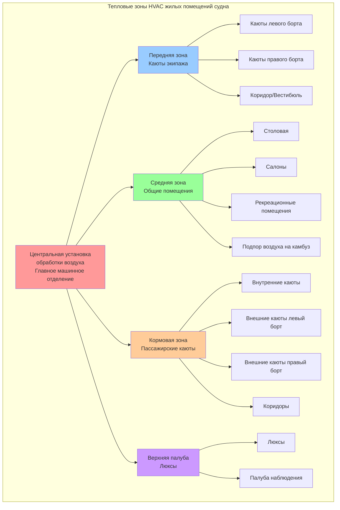

Жилые помещения судна требуют точного управления климатом для поддержания пригодности для жизни в течение длительных рейсов через различные климатические зоны. Системы HVAC, обслуживающие эти помещения, должны уравновешивать требования комфорта, пространственные ограничения, энергетическую эффективность и соответствие нормативным требованиям при работе в сложных морских условиях. Понимание физики теплопередачи, психрометрии и распределения воздушных потоков в замкнутых пространствах является основой эффективного проектирования систем HVAC для жилых помещений.

## Характеристики тепловых нагрузок

Жилые помещения судна характеризуются специфическими профилями нагрузок, определяемыми графиками присутствия экипажа и пассажиров, конструкцией ограждающих конструкций и режимом эксплуатации судна.

**Внутренние источники теплоты**

Каюты экипажа и пассажирские каюты генерируют явное тепло от находящихся в них людей примерно 75 Вт на человека при малоподвижной деятельности и 115 Вт при легкой активности. Скрытое тепло, выделяемое людьми, составляет 55–75 Вт на человека в результате дыхания и потоотделения, создавая отношение явного тепла к полному 0,55–0,65 в занятых каютах. Электронное оборудование, включая телевизоры, освещение и персональные устройства, вносит дополнительный вклад 150–300 Вт на каюту в зависимости от уровня комфорта.

Общие помещения, такие как салоны, столовые и рекреационные помещения, испытывают более высокую плотность занятости, достигающую 3–5 человек на 10 м². В периоды пиковой нагрузки внутренние источники теплоты могут достигать 150–200 Вт/м² площади пола, требуя значительной холодопроизводительности. Переходящий характер занятости этих помещений требует отзывчивых систем управления, чтобы предотвратить переохлаждение в периоды низкой занятости.

**Теплопередача через ограждающие конструкции**

Корпус судна формирует основную тепловую границу для жилых помещений. Стальная конструкция корпуса обеспечивает минимальное тепловое сопротивление, при этом значения U для неизолированных поверхностей составляют 5–6 Вт/м²K. Системы теплоизоляции с использованием минеральной ваты или закрытопористого пенопласта снижают теплопередачу до 0,3–0,5 Вт/м²K. Внешние каюты, подвергающиеся воздействию прямого солнечного излучения на открытые переборки и окна, испытывают дополнительное теплоприток 150–400 Вт/м² в пиковых условиях в зависимости от ориентации и широты.

Внутренние каюты, окруженные кондиционируемыми помещениями, испытывают минимальные теплопотери через ограждающие конструкции, при этом теплопередача определяется в основном разностью температур между смежными зонами. Примыкание к машинному отделению создает повышенные граничные температуры 40–50°C, требующие усиленной изоляции для предотвращения чрезмерного поступления тепла.

## Требования к вентиляции и расчеты кратности воздухообмена

Жилые помещения судна требуют адекватного наружного воздуха для поддержания качества воздуха в помещении и предотвращения накопления запахов в замкнутых объемах.

**Минимальные расходы вентиляционного воздуха**

SOLAS Глава II-2 и правила классификационных обществ устанавливают минимальные требования к вентиляции:

- Каюты экипажа: 6–8 кратностей воздухообмена в час (ACH)
- Пассажирские каюты: 8–10 ACH для внутренних кают, 6–8 ACH для внешних кают с открывающимися окнами
- Общие помещения: 10–15 ACH или 10 л/с на человека, в зависимости от того, что больше
- Коридоры и проходы: 6–10 ACH

Требуемый объемный расход воздуха рассчитывается на основе объема помещения и кратности воздухообмена:

$$Q = \frac{V \cdot ACH}{3600}$$

где $Q$ — объемный расход (м³/с), $V$ — объем каюты (м³), $ACH$ — кратность воздухообмена в час.

Для типовой каюты экипажа размерами 3,0 м × 2,5 м × 2,4 м высотой с объемом 18 м³, требующей 8 ACH:

$$Q = \frac{18 \text{ м}^3 \cdot 8 \text{ ACH}}{3600 \text{ с/ч}} = 0,04 \text{ м}^3\text{/с} = 40 \text{ л/с}$$

**Доля наружного воздуха**

Доля наружного воздуха в потоке приточного воздуха должна удовлетворять требованиям как вентиляции, так и поддержания избыточного давления:

$$\frac{Q_{oa}}{Q_{supply}} = \max\left(\frac{V_{oa,min}}{Q_{supply}}, \frac{\Delta P \cdot A_{leak}}{Q_{supply} \cdot \rho}\right)$$

где $Q_{oa}$ — расход наружного воздуха, $V_{oa,min}$ — минимальное требование вентиляции согласно нормам (типично 2–3 ACH на основе только наружного воздуха), $\Delta P$ — требуемое избыточное давление в помещении (10–15 Па для жилых помещений), $A_{leak}$ — эффективная площадь утечек, $\rho$ — плотность воздуха.

Жилые помещения судна поддерживаются при избыточном давлении относительно наружного пространства и машинных отделений, чтобы предотвратить проникновение влажного морского воздуха и выхлопных газов двигателей. Это требует постоянной подачи наружного воздуха даже в режимах максимального охлаждения или нагрева.

## Конфигурации систем HVAC

Системы HVAC жилых помещений судна используют централизованные или распределенные архитектуры в зависимости от размера судна и типа эксплуатации.

**Централизованные системы обработки воздуха**

Крупные пассажирские суда оснащены централизованными установками обработки воздуха, обслуживающими несколько кают через системы воздуховодов. Каждая установка включает:

- Предварительные фильтры (MERV 8) и окончательные фильтры (MERV 11–13)
- Охлаждающие ребристо-трубные радиаторы с 6-позиционными регулирующими клапанами
- Нагревающие ребристо-трубные радиаторы для эксплуатации в холодном климате
- Приточные вентиляторы с регулятором частоты вращения (VFD)
- Смесительные камеры для интеграции наружного воздуха

Охлаждающая жидкость подается при 5–7°C от центральных холодильных машин с возвратом при 12–15°C. Повышение температуры охлаждающей жидкости через радиатор составляет:

$$\Delta T_{water} = \frac{Q_{cooling}}{\.m_{water} \cdot c_{p,water}} = \frac{Q_{cooling}}{\.V_{water} \cdot \rho_{water} \cdot c_{p,water}}$$

Для холодопроизводительности 100 кВт с расходом воды 5 л/с:

$$\Delta T_{water} = \frac{100{,}000 \text{ Вт}}{0,005 \text{ м}^3\text{/с} \cdot 1000 \text{ кг/м}^3 \cdot 4186 \text{ Дж/кг·К}} = 4,8 \text{ К}$$

**Системы с доводчиками воздуха**

Индивидуальные доводчики воздуха в каждой каюте обеспечивают управление на уровне отдельной зоны, минимизируя протяженность воздуховодов. Четырехтрубные системы подают одновременно как охлаждающую, так и нагревающую жидкость, позволяя осуществлять индивидуальное управление температурой. Удаление конденсата требует насосных систем дренажа для преодоления килевой качки и кривизны корпуса судна.

Доводчики воздуха, подобранные для жилых помещений судна, обычно обеспечивают:

- Холодопроизводительность: 1,5–2,5 кВт для стандартных кают, 3–5 кВт для люксов
- Теплопроизводительность: 1,0–1,5 кВт (ниже, чем холодопроизводительность, из-за сниженных теплопотерь через ограждающие конструкции)
- Расход воздуха: 80–150 л/с на единицу
- Уровень шума: <35 дБ(А) на расстоянии 1 метра для поддержания приемлемой акустической среды

**Распределение наружного воздуха**

Системы с раздельной подготовкой наружного воздуха (DOAS) кондиционируют вентиляционный воздух перед его подачей в каюты. Система DOAS справляется с скрытыми нагрузками путем охлаждения ниже температуры точки росы, а затем повторного нагрева для предотвращения переохлаждения. Колеса утилизации энергии восстанавливают 60–75% холода из вытяжного воздуха, снижая нагрузку на центральные холодильные машины.

## Проектирование зон и распределение воздуха

Жилые помещения разделяются на тепловые зоны в зависимости от ориентации, графиков присутствия и противопожарных границ.

**Распределение по воздуховодам**

Основные приточные воздуховоды прокладываются через специальные шахты по ДП судна, чтобы минимизировать длину трассы. Ответвления к отдельным каютам включают:

- Дроссельные заслонки для балансировки расходов воздуха
- Противопожарные заслонки на границах зон согласно требованиям SOLAS
- Акустически облицованные воздуховоды для ослабления шума вентилятора
- Гибкие соединения оборудования для поглощения вибрации

Приточные диффузоры обеспечивают 4–6 кратностей воздухообмена в час с диаграммами струй, предотвращающими сквозняки на спальных местах. Скорости выхода воздуха на выходе из диффузора 2–3 м/с создают надлежащее перемешивание без чрезмерного шума.

**Системы возврата воздуха**

Возвратный воздух циркулирует через подрезы в дверях (зазор 15–20 мм) или через вентиляционные решетки в коридорные возвратные плены. Центральные возвратные воздуховоды собирают воздух для возврата к установкам обработки воздуха. Системы вытяжки из туалетов и душевых работают независимо с выделенными вентиляторами, выбрасывающими воздух над палубой для предотвращения его рециркуляции.

## Требования для отдельных типов помещений

Различные типы жилых помещений требуют адаптированных подходов HVAC на основе функционального назначения и режима занятости.

| Тип помещения | Диапазон температур | Требуемое ACH | Диапазон влажности | Специальные требования |
|------------|------------------|--------------|----------------|------------------------|
| Каюты экипажа | 22–24°C | 6–8 | 40–60% ОВ | Индивидуальное управление, тихая работа <35 дБ(А) |
| Пассажирские каюты | 21–25°C (регулируемо) | 8–10 | 40–60% ОВ | Управление термостатом, низкие скорости <0,15 м/с |
| Столовые | 22–24°C | 12–15 | 40–55% ОВ | Высокая скрытая нагрузка от посетителей и обслуживания |
| Салоны/Бары | 22–24°C | 10–12 | 40–55% ОВ | Переменная занятость, вытяжка при наличии курящих |
| Коридоры/Вестибюли | 23–25°C | 6–10 | 40–60% ОВ | Поддержание избыточного давления, транзитное пространство |
| Спортивные залы | 18–20°C | 15–20 | 35–50% ОВ | Высокие явные и скрытые нагрузки, усиленная вентиляция |
| Библиотеки/Читальни | 22–24°C | 8–10 | 40–55% ОВ | Тихая работа критична, управление влажностью для документов |
| Медицинские помещения | 21–23°C | 12–15 | 40–60% ОВ | Фильтрация MERV 14+, возможность изоляции |

**Каюты экипажа**

Жилые помещения экипажа требуют надежных, малообслуживаемых систем с простым управлением. Каюты обычно вмещают 1–2 человека в объеме 15–25 м³. Компактный размер создает быстрые колебания температуры при работе оборудования, требуя модулирующего управления вместо включения/выключения. Контроль шума критичен в периоды сна, требуя виброизоляции и акустической обработки.

**Пассажирские каюты**

Ожидания пассажиров в отношении комфорта превышают стандарты экипажа, требуя индивидуального управления температурой в каюте, низких скоростей воздуха для предотвращения сквозняков и почти беззвучной работы. Люксы первого класса могут включать раздельные климатические зоны для спальных и жилых помещений, с отдельными термостатами для каждой зоны.

Внешние каюты с окнами требуют управления солнечной нагрузкой через защиту окон и повышенную холодопроизводительность. Асимметричный профиль нагрузки между открытыми и внутренними стенами может создавать проблемы с комфортом, если не быть должным образом решенным посредством проектирования распределения воздуха.

**Общие помещения**

Рестораны, театры и атриумы испытывают крайне переменную занятость, при этом пиковые нагрузки в 3–5 раз превышают минимальные. Система вентиляции с управлением по требованию, использующая датчики CO₂, модулирует подачу наружного воздуха в соответствии с фактической занятостью, снижая переохлаждение и энергопотребление в периоды низкой нагрузки.

Высокие потолки в атриумах и общественных помещениях создают расслоение, при котором теплый воздух накапливается на верхних уровнях. Вентиляторы дестратификации или правильно спроектированное распределение воздуха с высокими скоростями выхода через боковые стены поддерживают равномерные условия по всей занятой зоне.

## Стандарты комфорта и соответствие нормативным требованиям

Международные морские нормативы устанавливают минимальные требования к условиям окружающей среды для пригодности к проживанию.

**Требования SOLAS**

Международная конвенция по охране человеческой жизни на море (SOLAS) Глава II-1, Регламент 3-12 предписывает, чтобы жилые помещения поддерживали «воздух надлежащей температуры, влажности и чистоты». Хотя конкретные числовые значения не определены в самом SOLAS, классификационные общества интерпретируют это как требование:

- Управление температурой в диапазоне 21–27°C с точностью ±2°C
- Относительная влажность поддерживается между 30–70% (целевой диапазон 40–60%)
- Адекватная вентиляция для предотвращения накопления CO₂ выше 1000 ppm
- Скорость воздуха в занятых зонах ниже 0,25 м/с для предотвращения сквозняков

**Правила классификационных обществ**

Отдельные классификационные общества предоставляют детальные требования:

- American Bureau of Shipping (ABS): Устанавливает 24°C ±2°C для жилых помещений с целевой влажностью 50% ОВ
- Det Norske Veritas (DNV): Требует условий проектирования 35°C при 70% ОВ для наружного воздуха
- Lloyd's Register: Предписывает проверку и пусконаладку, верификацию температуры и расходов воздуха
- Bureau Veritas: Устанавливает ограничения по шуму 60 дБ(А) в каютах, 65 дБ(А) в общих помещениях

**Проверка производительности**

Пусконаладка проверяет производительность системы HVAC перед передачей судна. Проверка включает:

1. Верификацию расходов воздуха в каждом диффузоре и общего расхода системы
2. Поддержание температуры в условиях проектирования с наружной температурой от 0°C до 45°C
3. Верификацию управления влажностью при высоких скрытых нагрузках
4. Измерение уровня звука во всех жилых помещениях
5. Испытание давления для подтверждения избыточного давления относительно наружного пространства

Системы HVAC жилых помещений судна представляют критически важный компонент обитаемости судна, требуя тщательной интеграции принципов теплового комфорта, морских нормативов и практических ограничений, присущих условиям на судне. Успешные проекты уравновешивают комфорт пассажиров и экипажа с энергетической эффективностью, при этом поддерживая надежность в требовательной морской среде.
