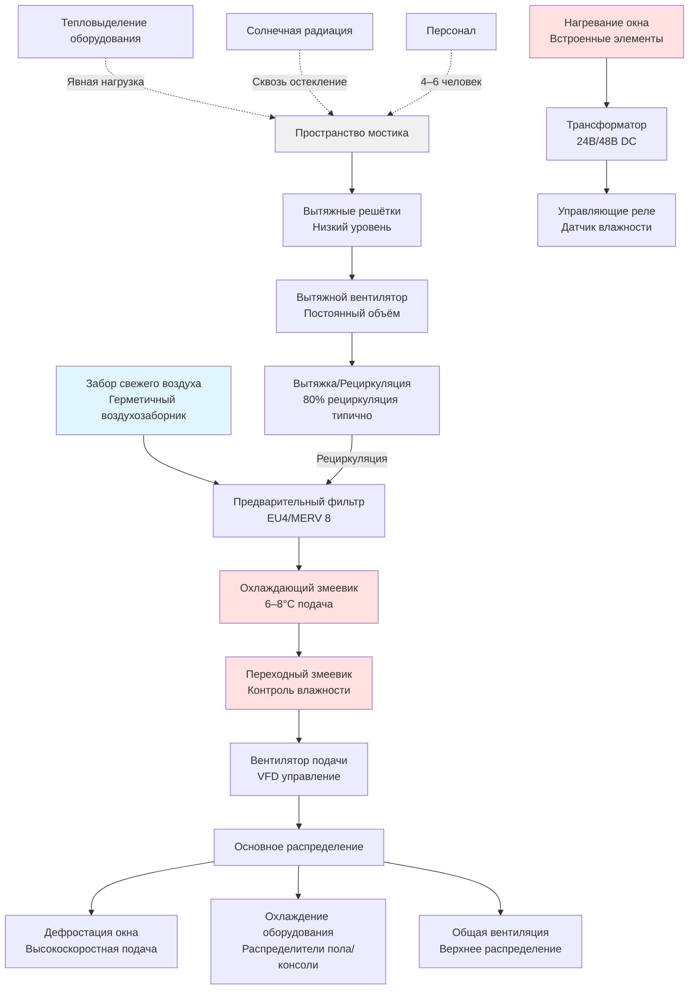

## Физические принципы климатического контроля мостика

Мостик судна представляет наиболее критичное обитаемое помещение на судне, требующее точного управления окружающей средой для обеспечения навигационных операций, производительности оборудования и эффективности экипажа во время непрерывных 24-часовых вахт. В отличие от других помещений для проживания, мостик имеет уникальные тепловые проблемы, вызванные обширной остекленённостью, высокими тепловыделениями от высокоточного электронного оборудования и жёсткими требованиями видимости, которые исключают образование конденсата или запотевания окон при любых условиях.

Основная проблема вытекает из архитектурного требования мостика обеспечивать круговую видимость на 360 градусов, результатом чего является отношение площади остекления к площади пола часто превышающее 0.6 в сравнении с типичными зданиями 0.15–0.30. Это создаёт интенсивное солнечное тепловыделение при работе в тропических условиях и значительные кондуктивные потери в арктических условиях, оба требующие активного вмешательства HVAC для поддержания узкого диапазона температур, необходимого для надёжности оборудования и производительности персонала.

## Солнечное тепловыделение сквозь остекление мостика

Солнечная радиация сквозь окна мостика представляет доминирующий компонент охлаждающей нагрузки во время дневных операций. Мгновенное тепловыделение следует уравнению:

$$Q_{solar} = A_{window} \cdot SHGC \cdot I_{total} \cdot CLF$$

Где:
- $Q_{solar}$ = солнечное тепловыделение (Вт)
- $A_{window}$ = общая площадь остекления (м²)
- $SHGC$ = коэффициент солнечного тепловыделения (безразмерный, типично 0.25–0.40 для морского остекления)
- $I_{total}$ = общая интенсивность падающей солнечной радиации (Вт/м²)
- $CLF$ = коэффициент охлаждающей нагрузки, учитывающий тепловую массу

Общая интенсивность падающей радиации объединяет прямые и диффузные компоненты:

$$I_{total} = I_{beam} \cdot \cos(\theta) + I_{diffuse}$$

Для мостика с площадью остекления 45 м² на широте 20°N летом в полдень с SHGC = 0.30:

$$Q_{solar} = 45 \times 0.30 \times (950 \times \cos(15°) + 120) \times 0.85 = 10,890 \text{ Вт}$$

Это тепловыделение 10.9 кВ только от остекления обычно превышает общую явную нагрузку небольшого жилого пространства, требуя выделенной охлаждающей мощности сверх базовых требований вентиляции.

Кондуктивная нагрузка окна добавляет дополнительное бремя:

$$Q_{cond} = U \cdot A_{window} \cdot (T_{outside} - T_{inside})$$

С U-значениями для морского остекления в диапазоне 2.8–5.7 Вт/(м²·К) в зависимости от спецификаций одно/двойного остекления и покрытий.

## Тепловой менеджмент навигационного оборудования

Современные интегрированные системы мостика генерируют значительные тепловыделения от электронного навигационного оборудования, которые должны постоянно отводиться для предотвращения отказа оборудования и сохранения точности. Рабочие станции ECDIS (Электронная система отображения и информации морских карт), процессоры радаров, приёмники GPS и оборудование связи совместно производят:

$$Q_{equipment} = \sum (P_{rated} \times LF \times FUM)$$

Где:
- $P_{rated}$ = номинальная потребляемая мощность
- $LF$ = коэффициент нагрузки (типично 0.70–0.85 для навигационного оборудования)
- $FUM$ = доля поступающей в кондиционируемое пространство (0.90–1.00 для оборудования мостика)

Типичные тепловыделения оборудования мостика находятся в диапазоне 5–15 кВ в зависимости от размера и сложности судна. Критичное оборудование требует температуры подаваемого воздуха поддерживаемой в диапазоне 18–24°C с влажностью ниже 60% ОВ для предотвращения конденсации на печатных платах при переходных температурных процессах.

Производители оборудования указывают максимальные температуры окружающей среды 40–55°C для компонентов военного исполнения, однако оптимальная производительность достигается при 20–25°C. Срок службы магнетрона радара уменьшается экспоненциально с температурой согласно:

$$L = L_0 \cdot e^{-E_a/kT}$$

Где срок службы оборудования $L$ следует соотношению Аррениуса с энергией активации $E_a$, демонстрируя почему поддержание более низких температур значительно продлевает срок службы дорогостоящей электроники.

## Системы антизапотевания окон и дефростации

Ясность окон мостика представляет неоспоримое требование безопасности. Конденсат образуется когда температура внутренней поверхности стекла падает ниже температуры точки росы воздуха мостика:

$$T_{surface} < T_{dewpoint} = T_{db} - \frac{100 - RH}{5}$$

Это требует поддержания температуры внутренней поверхности стекла выше точки росы посредством трёх механизмов:

1. **Вынужденная циркуляция воздуха** - Высокоскоростной воздух (3–5 м/с) направляется поперёк внутренних поверхностей окна
2. **Резистивное нагревание** - Встроенные нагревательные элементы в стекле (150–300 Вт/м²)
3. **Контроль влажности** - Поддержание ОВ ниже 50% снижает температуру точки росы

Теплопередача от тёплого воздуха к поверхности стекла следует уравнению:

$$q = h \cdot (T_{air} - T_{surface})$$

Где коэффициент конвекции $h$ увеличивается со скоростью воздуха согласно:

$$h = 5.7 + 3.8v$$

Для вынужденной конвекции при v = 4 м/с, h = 20.9 Вт/(м²·К), обеспечивая достаточную теплопередачу для поддержания температуры стекла выше точки росы даже при внешних температурах −20°C при комбинации с нагреваемым стеклом.

## Требования к окружающей среде мостика

| Параметр | Требование | Обоснование |
|----------|-----------|-------------|
| Температура сухого термометра | 22–24°C ± 1°C | Спецификации оборудования, бдительность персонала |
| Относительная влажность | 40–50% | Предотвращение конденсации, электростатический контроль |
| Скорость воздуха | < 0,15 м/с (зона занятия) | Предотвращение разброса бумаги, дискомфорт от сквозняков |
| Уровень звука | NC 35–40 | Ясность коммуникации, различимость сигналов тревоги |
| Скорость вентиляции | 8–10 ACH минимум | Отвод тепла оборудования, контроль CO₂ |
| Равномерность температуры | ± 2°C макс отклонение | Предотвращение локального перегрева оборудования |
| Время восстановления | < 15 минут | После событий открытия дверей |

## Архитектура системы

Системы HVAC мостика используют выделенные воздухообрабатывающие установки отдельно от систем общих помещений проживания для обеспечения непрерывной работы независимо от других пространств и допуска различных установок температуры. Типичная конфигурация включает:

## Проектные соображения

**Требования резервирования** - Критичные операции судна требуют N+1 резервирования для HVAC мостика с автоматическим переключением на резервные установки в течение 30 секунд при отказе основной установки. Аварийная вентиляция должна поддерживать минимум 4 ACH используя аварийную мощность судна.

**Управление давлением** - Помещения мостика поддерживают небольшой избыток давления (+5 to +15 Па) относительно соседних пространств предотвращая инфильтрацию тепла машинного отделения, запахов камбуза или воздуха из коридоров помещений проживания. Это требует точного баланса подачи/вытяжки с датчиками давления и моторизованным управлением заслонок.

**Звукоизоляция** - Контроль звука получает приоритет для обеспечения различимости сигналов тревоги и ясности радиокоммуникации. Воздуховоды подачи включают звукопоглощающую облицовку, конструкцию низких скоростей (< 5 м/с в зонах занятия) и виброизоляцию механического оборудования. Выбор вентилятора направлен на уровни звуковой мощности ниже 65 dBA при расчётном расходе.

**Фильтрация** - Морские окружающие среды мостика требуют надёжной фильтрации для обработки соляных брызг, дизельных частиц и воздушных загрязнителей во время портовых операций. Многоступенчатая фильтрация с предварительными фильтрами (MERV 8) и финальными фильтрами (MERV 13) защищает чувствительное навигационное оборудование при сохранении приемлемого перепада давления.

**Интеграция управления** - Современное HVAC мостика интегрируется с системами судовой автоматизации, обеспечивая удалённый мониторинг, автоматическое переключение режимов (тропический/арктический/умеренный) и предупреждения о техническом обслуживании. Датчики температуры в нескольких местоположениях предотвращают локальные горячие точки у сконцентрированного оборудования, в то время как датчики влажности активируют нагревание окна при приближении точки росы.

Система HVAC мостика представляет специализированное приложение где последствия отказа выходят за рамки дискомфорта занимающих пространство до безопасности судна, делая надёжное проектирование, компоненты высокого качества и профилактическое техническое обслуживание существенными вложениями в морские операции.

## Проверка производительности

Пусконаладка систем HVAC мостика должна проверить равномерность температуры через навигационные рабочие станции, адекватные скорости воздуха при поверхностях окон, правильный контроль влажности в экстремальных условиях и время отклика системы на тепловые возмущения. Тестирование в условиях моделирования максимальной солнечной нагрузки обеспечивает адекватную мощность до передачи судна.
