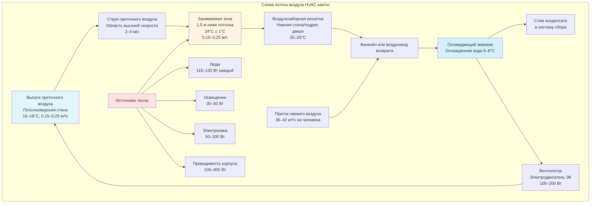

## Физические принципы климатизации кают судов

Каюты и каютные помещения судов представляют уникальные вызовы для HVAC, обусловленные ограниченной геометрией, дефицитом пространства, требованиями непрерывной эксплуатации и переменными воздействиями окружающей среды. Термодинамическое поведение этих компактных закрытых пространств требует точного анализа теплового баланса, учитывающего солнечную радиацию через корпус, тепловую связь с соседними помещениями, метаболические тепловыделения занимающих помещение людей и рассеивание тепла оборудованием.

Морские жилые помещения испытывают теплопередачу через множество граничных условий одновременно: открытые внешние переборки передают солнечные и климатические нагрузки, внутренние перегородки имеют тепловую связь с соседними каютами и коридорами, палубные границы проводят тепло от машинных отделений ниже или от открытых палуб с солнечным освещением выше, и остекление пропускает как кондуктивные, так и радиационные тепловые поступления.

## Расчет тепловой нагрузки каюты

Полная холодильная нагрузка для каюты судна складывается из компонентов проводимости, конвекции, радиации, инфильтрации и внутреннего теплогенерирования. Фундаментальное уравнение теплового баланса:

$$Q_{total} = Q_{cond} + Q_{sol} + Q_{vent} + Q_{occ} + Q_{lights} + Q_{equip}$$

### Теплопередача через корпус и переборки

Теплопередача через ограждающие конструкции каюты подчиняется закону Фурье, адаптированному для композитных морских конструкций:

$$Q_{cond} = U \cdot A \cdot \Delta T$$

где $U$ — коэффициент теплопередачи (Вт/м²·К), $A$ — площадь поверхности (м²), $\Delta T$ — разность температур между внешними и внутренними условиями.

Для изолированных стальных участков корпуса:

$$U = \frac{1}{\frac{1}{h_o} + \frac{t_{steel}}{k_{steel}} + \frac{t_{insul}}{k_{insul}} + \frac{1}{h_i}}$$

Типичные значения: $h_o$ = 20–25 Вт/м²·К (внешняя), $h_i$ = 8–10 Вт/м²·К (внутренняя), $k_{steel}$ = 45 Вт/м·К, $k_{insul}$ = 0,03–0,04 Вт/м·К для полиуретанового пенопласта.

### Солнечная радиация через иллюминаторы

Поступление солнечного тепла через окна кают объединяет прямое лучистое, рассеянное и отраженное компоненты:

$$Q_{sol} = A_{glass} \cdot SHGC \cdot I_{total} \cdot CF$$

где $SHGC$ — коэффициент солнечного теплопоступления (обычно 0,25–0,40 для морского остекления), $I_{total}$ — полная падающая радиация (Вт/м²), $CF$ — коэффициент коррекции для штор или жалюзи (0,5–0,8).

### Вентиляция и нагрузки наружного воздуха

Требования к свежему воздуху согласно ISO 7547 и SOLAS устанавливают минимальные показатели вентиляции. Явная и скрытая нагрузки от наружного воздуха:

$$Q_{vent,sens} = \dot{m} \cdot c_p \cdot (T_{outside} - T_{cabin})$$

$$Q_{vent,lat} = \dot{m} \cdot h_{fg} \cdot (W_{outside} - W_{cabin})$$

где $\dot{m}$ — массовый расход (кг/с), $c_p$ = 1,006 кДж/кг·К, $h_{fg}$ = 2450 кДж/кг, $W$ — влагосодержание (кг воды/кг сухого воздуха).

Минимальный свежий воздух: 36 м³/ч на человека для пассажирских кают, 42 м³/ч на человека для служебных кают согласно ISO 8861.

### Метаболическое теплогенерирование людей

Метаболическое теплогенерирование человека варьируется в зависимости от уровня активности. Для занятости каюты в состоянии покоя:

$$Q_{occ} = N \cdot (Q_{sens} + Q_{lat})$$

Типичные значения на человека: $Q_{sens}$ = 65–75 Вт, $Q_{lat}$ = 45–55 Вт при температуре каюты 24°C, малоподвижная деятельность. Общий метаболический уровень примерно 115–130 Вт на человека.

## Типы систем HVAC морских кают

| Тип системы | Холодильная мощность | Преимущества | Недостатки | Типичное применение |
|-------------|---------------------|-------------|-----------|---------------------|
| **Встроенные сквозьстенные агрегаты** | 2,0–3,5 кВт | Простой монтаж, индивидуальное управление, легкое обслуживание | Проемы в корпусе, шум, ограниченная эффективность | Служебные каюты, суда эконом-класса |
| **Фанкойлы (FCU)** | 1,5–4,0 кВт | Тихая работа, эффективность центрального генератора, экономия пространства | Требует сети охлажденной воды, сложная трубопроводная система | Пассажирские каюты, люкс-суда |
| **Переменный поток хладагента (VRF)** | 2,0–5,0 кВт | Высокая эффективность, утилизация тепла, точное управление | Высокие начальные затраты, ограничение заполнения хладагента | Современные круизные суда, паромы |
| **Раздельные системы** | 2,5–4,5 кВт | Умеренная стоимость, хорошая эффективность, гибкое размещение | Магистрали хладагента, множество наружных блоков | Небольшие суда, модернизация |
| **Пакетные терминальные AC (PTAC)** | 2,0–3,0 кВт | Прочная конструкция, простое управление, проверенная надежность | Более высокое энергопотребление, затруднение доступа при обслуживании | Военные корабли, служебные каюты грузовых судов |

## Схемы распределения потоков воздуха

Надлежащее распределение воздуха предотвращает расслоение, исключает сквозняки и поддерживает равномерное распределение температуры в пределах ограниченного объема каюты.

## Морские стандарты комфорта и критерии проектирования

**Требования к температуре:**
- Пассажирские каюты: 22–24°C сухого термометра, регулируемая ±2°C
- Служебные каюты: 22–26°C сухого термометра согласно SOLAS
- Условия наружного проектирования: 35–45°C в зависимости от маршрута плавания

**Управление влажностью:**
- Относительная влажность: 45–55% для комфорта
- Максимум 65% ОВ для предотвращения плесени и коррозии
- Мощность осушки: 0,3–0,5 л/сут на м² площади каюты

**Стандарты вентиляции:**
- ISO 7547: Минимум 36 м³/ч свежего воздуха на человека
- Кратность воздухообмена: 8–12 ACH для занимаемых кают
- Фильтрация: MERV 8–11 для приточного воздуха

**Акустические характеристики:**
- Максимум NC 35–40 для пассажирских кают
- NC 40–45 приемлемо для служебных помещений
- Скорость в воздуховодах ограничена 3–5 м/с для минимизации шума

**Виброизоляция:**
- Оборудование установлено на пружинные изоляторы (прогиб 12–25 мм)
- Гибкие соединения для всех трубопроводов и воздуховодов
- Конструктивная развязка для предотвращения передачи от машинных отделений

## Соображения проектирования системы

**Ограничения пространства:**
Высота потолков кают 2,1–2,4 м ограничивает вертикальное размещение оборудования. Кассеты фанкойлов обычно требуют глубины 250–350 мм над потолком. Горизонтальные фанкойлы, установленные над санузлами, максимизируют полезное пространство каюты.

**Коррозия морского воздуха:**
Все оборудование, подверженное контакту с наружным воздухом, требует защиты от коррозии морского уровня. Алюминиевые ребра получают эпоксидное покрытие, медные трубы используют сплавы с ингибиторами, стальные каркасы применяют горячее цинкование или порошковую окраску.

**Индивидуальное управление:**
Термостатическое управление в диапазоне ±2°C обеспечивает удовлетворение пассажиров. Современные системы интегрируют цифровые термостаты с выбором скорости вентилятора (обычно 3–4 скорости) и функцией вкл./выкл.

**Управление конденсатом:**
Гравитационный слив в сборные баки или насосный выброс предотвращает переполнение. Поддоны конденсата из нержавеющей стали с минимальным уклоном 1:50 к выпуску. Глубина ловушки минимум 50 мм предотвращает повторное захватывание воздуха.

**Энергоэффективность:**
Электродвигатели переменной скорости ЭК снижают энергопотребление вентилятора на 30–50% по сравнению с синхронными двигателями. Система охлажденной воды преимуществом центрального генератора (COP 4,5–6,0) против самостоящих DX-систем (EER 2,5–3,2).

**Доступ для обслуживания:**
Фильтры доступны через вход в каюту или потолок санузла. Чистка змеевика требует снятия панели или люков доступа. Проверочные отверстия слива конденсата предотвращают засорение.

**Аварийная вентиляция:**
Возможность естественной вентиляции через открываемые иллюминаторы или механический резерв от аварийных генераторов поддерживает пригодность помещения при отключении электроэнергии.

---

## Компоненты

- HVAC пассажирских кают
- Вентиляция служебных кают
- Индивидуальное управление температурой
- Встроенные кондиционеры
- Фанкойлы в каютах
- Приток свежего воздуха в каюты
- Вытяжка из санузлов кают
- Подавление шума в каютах
- Виброизоляция в каютах
