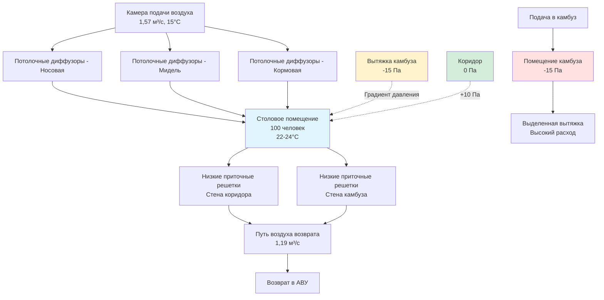

Столовые помещения на морских судах требуют специализированного проектирования HVAC для управления одновременными охлаждающими нагрузками, передачей запахов от соседних камбузов, колебаниями занятости и требованиями санитарии. Эти помещения испытывают изменения плотности нагрузки от пустого до пиковой загрузки в период приема пищи в течение минут, что требует оперативного контроля температуры и вентиляции при предотвращении проникновения запахов камбуза в столовые.

## Характеристики тепловых нагрузок

Столовые помещения генерируют явную и скрытую теплоту от людей, освещения и теплопередачи от соседних операций в камбузе. Фундаментальный тепловой баланс управляет температурой помещения:

$$Q_{total} = Q_{occupants} + Q_{lights} + Q_{equipment} + Q_{infiltration} + Q_{transmission}$$

**Тепловыделение от людей**

Люди, сидящие за приемом пищи, генерируют примерно 115 Вт явной теплоты и 55 Вт скрытой теплоты на человека, что ниже, чем при стоячей или активной позе, благодаря сниженной метаболической активности. Пиковая занятость приходится на запланированные периоды приема пищи, создавая скачкообразные нагрузки:

$$Q_{occupants} = N_{people} \times (q_{sensible} + q_{latent})$$

Для кают-компании экипажа, обслуживающей 100 человек:

$$Q_{occupants} = 100 \times (115 + 55) = 17000 \text{ Вт} = 17 \text{ кВт}$$

**Теплопередача из камбуза**

Столовые помещения, прилегающие к камбузам, испытывают теплопередачу через переборки несмотря на изоляцию. Тепловой поток следует закону Фурье:

$$Q_{transmission} = U \times A \times \Delta T$$

Где U — коэффициент теплопередачи (обычно 0,5–1,0 Вт/м²K для изолированных морских переборок), A — площадь переборки, ΔT — разность температур между камбузом (30–35 °C) и столовой (22–24 °C).

Для переборки площадью 20 м² с U = 0,7 Вт/м²K и ΔT = 10 °C:

$$Q_{transmission} = 0,7 \times 20 \times 10 = 140 \text{ Вт}$$

## Требования вентиляции

Вентиляция столовых помещений должна обеспечивать достаточное количество наружного воздуха для людей, поддерживать небольшое положительное давление относительно коридоров и предотвращать проникновение запахов от операций в камбузе.

**Расчет наружного воздуха**

Минимальная вентиляция следует требованиям на основе занятости из руководств классификационных обществ и IMO. Для столовых помещений 7,5 л/с на человека обеспечивает адекватное качество воздуха:

$$\dot{V}_{OA} = N_{people} \times v_{person}$$

Для 100 человек:

$$\dot{V}_{OA} = 100 \times 7,5 = 750 \text{ л/с} = 0,75 \text{ м³/с} = 2700 \text{ м³/ч}$$

**Подача воздуха для охлаждения**

Общая подача воздуха должна удовлетворять требованиям охлаждения и вентиляции. Расход охлаждающего воздуха определяется по формуле:

$$\dot{V}_{cooling} = \frac{Q_{sensible}}{\rho \times c_p \times \Delta T}$$

Используя стандартные свойства воздуха (ρ = 1,2 кг/м³, cp = 1005 Дж/кг·K) и разность температур подаваемого воздуха 8–10 °C:

$$\dot{V}_{cooling} = \frac{17000}{1,2 \times 1005 \times 9} = 1,57 \text{ м³/с} = 5652 \text{ м³/ч}$$

Требование охлаждения доминирует, поэтому подача воздуха составляет 1,57 м³/с с минимальной долей наружного воздуха 48% (750/1570).

**Стратегия нагнетания давления**

Столовые помещения должны поддерживать положительное давление относительно коридоров (+5–+10 Па) и отрицательное давление относительно камбузов (-10–-15 Па) для предотвращения миграции запахов. Это требует тщательной балансировки подачи и вытяжки:

$$\Delta P = \frac{\rho \times (\dot{V}_{supply} - \dot{V}_{exhaust})^2}{2 \times A_{leakage}^2}$$

Достижение -10 Па относительно камбуза требует вытяжки из столовой или подачи в камбуз, превышающих подачу в столовую. Типичные конфигурации поддерживают камбуз в состоянии отрицательного давления благодаря выделенной вытяжке, позволяя столовой работать с небольшим положительным давлением относительно коридоров.

## Механизмы контроля запахов

Предотвращение проникновения запахов камбуза в столовые требует интегрированного управления давлением, распределения воздуха и систем барьеров.

**Каскад давления**

Установить иерархию давления: столовая (+10 Па) → коридор (0 Па) → камбуз (-15 Па). Этот градиент обеспечивает поток воздуха от чистых к загрязненным помещениям. Воздушные завесы или тамбуры на границе камбуза и столовой обеспечивают дополнительное разделение при открытии дверей.

**Проектирование тамбура**

Выделенные тамбуры между камбузом и столовой создают барьеры потока воздуха. Подача воздуха в тамбур на высокой скорости (2–3 м/с), направленная в камбуз, создает завесу давления, предотвращающую обратный поток запахов при открытии двери. Расход подачи воздуха в тамбур:

$$\dot{V}_{vestibule} = A_{door} \times v_{air} = 2 \times 2,5 = 5 \text{ м³/с}$$

Для дверного проема площадью 2 м² со скоростью воздуха 2,5 м/с.

**Расположение вытяжки**

Выделенная вытяжка из столовой, если предусмотрена, должна располагаться рядом со стеной границы камбуза на низком уровне, где накапливаются попадающие запахи. Скорость вытяжки 20–30% от подачи предотвращает избыточную вентиляцию при удалении локальных загрязнений.

## Проектирование распределения воздуха

Эффективное распределение воздуха в кают-компаниях должно приспосабливаться к переменной занятости, предотвращать сквозняки при низких нагрузках и обеспечивать быстрое восстановление температуры во время приема пищи.

**Выбор диффузоров**

Потолочные диффузоры с высокой индукцией и регулируемыми характеристиками направления потока приспосабливаются к переменным нагрузкам. При пиковой занятости высокая подача воздуха создает хорошее перемешивание без чрезмерных скоростей в зоне обитания. При низкой занятости сниженный расход воздуха поддерживает приемлемый обмен воздуха для санитарии.

Расстояние броска должно доходить до 75% длины помещения при пиковом потоке, соответствуя конечной скорости 0,25 м/с в зоне обитания. Для линейных диффузоров уравнение броска:

$$L = K \times \sqrt{\frac{\dot{V}}{l}}$$

Где K — константа диффузора (60–80 для потолочных диффузоров), V̇ — расход на диффузор, l — длина диффузора.

**Расположение воздуха возврата**

Низкоуровневый возврат обеспечивает нисходящее движение воздуха, переносящее запахи и загрязнения к точкам вытяжки. Размещение на стене со стороны камбуза захватывает любые попадающие запахи до их распространения в столовой. Скорость на решетке возврата не должна превышать 2,5 м/с для предотвращения шума и увлечения пыли.

## Сравнение скоростей вентиляции

Различные зоны, прилегающие к объектам пищевого обслуживания или находящиеся в них, требуют определенных скоростей вентиляции на основе источников загрязнения и режимов занятости.

| Тип помещения | Минимальная вентиляция | Проектные обмены воздуха | Давление относительно коридора | Основные требования |
|-----------|-------------------|------------------|-------------------------------|------------------|
| Кают-компания экипажа | 7,5 л/с на человека | 8–12 ACH | +5–+10 Па | Предотвращение запахов, нагрузки занятости |
| Офицерская столовая | 7,5 л/с на человека | 10–15 ACH | +8–+12 Па | Комфорт, сниженный шум |
| Пассажирская столовая | 10 л/с на человека | 12–18 ACH | +10–+15 Па | Премиум-комфорт, быстрый отклик нагрузки |
| Камбуз собственно | 20 л/с на человека | 30–40 ACH | -15–-25 Па | Отвод теплоты, локализация запахов |
| Мойка посуды | 15 л/с на человека | 25–35 ACH | -10–-20 Па | Удаление пара, санитария |
| Подготовка пищи | 12 л/с на человека | 15–25 ACH | -5–-15 Па | Контроль температуры, контроль запахов |
| Сухое хранилище | Минимум 2 ACH | 4–6 ACH | 0–+5 Па | Контроль влажности, стабильность температуры |
| Холодильное хранилище | Минимум 2 ACH | 4–8 ACH | 0–+5 Па | Поддержание температуры, влажность оттаивания |

Помещения камбуза требуют значительно более высокой скорости вентиляции, обусловленной теплогенерацией от кухонного оборудования и требованиями контроля запахов. Каскад отрицательного давления предотвращает миграцию загрязнений в столовые при поддержании приемлемых условий температуры для рабочих.

## Требования санитарии

Морские столовые помещения должны соответствовать санитарным нормам для сред пищевого обслуживания, включая качество воздуха, чистоту поверхностей и предотвращение передачи патогенов.

**Фильтрация подаваемого воздуха**

Фильтрация подаваемого воздуха до MERV 8–11 удаляет твердые частицы и биологические загрязнения. Более высокие уровни фильтрации (MERV 13–14) могут быть установлены для пассажирских судов с объектами здравоохранения или пассажирами с ослабленным иммунитетом. Расписания обслуживания фильтров должны учитывать нагрузку соляного аэрозоля в морской среде, обычно требуя ежемесячного осмотра и квартального заменения.

**Предотвращение конденсации на поверхностях**

Холодные поверхности компонентов кондиционирования или контакта с корпусом могут способствовать конденсации и микробному росту. Изоляция с паровыми барьерами на трубопроводах охлаждающей воды и диффузорах предотвращает падение температуры поверхности ниже точки росы. Для открытых корпусом участков, внутренняя изоляция должна поддерживать температуру поверхности выше:

$$T_{surface,min} = T_{dewpoint} + 2°C$$

Этот запас предотвращает конденсацию при нормальной работе и скачках влажности.

**Циклы санитизации**

HVAC системы должны поддерживать периодическую санитизацию через повышенную температурную очистку или ультрафиолетовое бактерицидное излучение (UVGI) в пути воздуха возврата. Размер систем UVGI следует формуле:

$$I_{required} = \frac{D \times \dot{V}}{A_{lamp} \times \eta_{lamp}}$$

Где D — требуемая доза для инактивации целевого микроорганизма (обычно 20–40 мДж/см² для бактерий), V̇ — расход воздуха, Alamp — облучаемая площадь поперечного сечения, ηlamp — эффективность лампы.

## Стратегии управления нагрузкой

Экстремальное изменение занятости столовых от пустого между приемами пищи до 100% во время обслуживания требует оперативных стратегий управления.

**Запланированное снижение уставок**

Программируйте уставки температуры на основе расписаний приема пищи. В периоды без занятости (обычно 2–3 часа между приемами), поднимите уставку охлаждения до 26–27 °C и снизьте вентиляцию до минимальных санитарных скоростей (2–4 ACH). Это снижает время работы компрессора и энергию насоса при поддержании адекватного воздухообмена.

**Вентиляция по требованию**

Датчики CO₂ обеспечивают управление вентиляцией с реагированием на занятость. По мере увеличения занятости во время приема пищи концентрация CO₂ повышается, активируя повышенный забор наружного воздуха. Целевые уровни CO₂ 800–1000 ppm выше окружающей среды (примерно 1200–1400 ppm абсолютно) обеспечивают адекватную вентиляцию без чрезмерного штрафа энергии на наружный воздух.

Требуемый наружный воздух на основе концентрации CO₂:

$$\dot{V}_{OA} = \frac{N \times G_{CO_2}}{C_{space} - C_{outdoor}}$$

Где N — занятость, GCO₂ — генерация CO₂ на человека (0,005 л/с), Cspace — целевая концентрация в помещении (1200 ppm), Coutdoor — наружная концентрация (400 ppm).

**Предварительное охлаждение**

Начните охлаждение помещения за 30–45 минут до запланированного времени приема пищи для достижения целевой температуры до появления людей. Эта стратегия предварительного охлаждения учитывает тепловую массу столов, стульев и конструкции, которые иначе задержали бы отклик температуры. Требуемый период предварительного охлаждения:

$$t_{precool} = \frac{m \times c_p \times \Delta T}{Q_{cooling}}$$

Где m — эффективная тепловая масса, cp — удельная теплоемкость, ΔT — желаемое снижение температуры, Qcooling — доступная мощность охлаждения.

HVAC системы морских столовых и кают-компаний должны уравновешивать конкурирующие требования комфорта, санитарии, контроля запахов и энергоэффективности в условиях ограничений судовой установки. Надлежащее управление давлением предотвращает проникновение запахов камбуза, оперативное управление приспосабливается к переменным нагрузкам, адекватная вентиляция поддерживает качество воздуха во всем диапазоне операционных условий. Эти системы демонстрируют интеграцию фундаментальных принципов теплопередачи, гидромеханики и психрометрии со специфическими требованиями морского судоходства.
