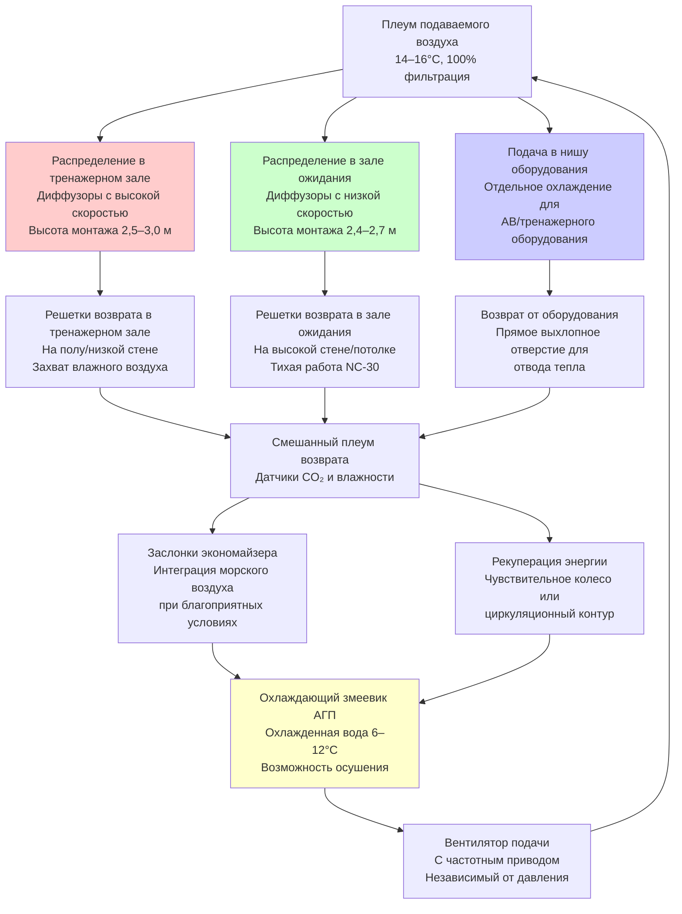

Рекреационные помещения на судах представляют уникальные вызовы для HVAC из-за высокой переменности численности людей, разнообразных скоростей выделения метаболического тепла и критической важности благоустройства экипажа при длительных плаваниях. Проектирование должно обеспечивать все виды деятельности — от малоподвижных занятий в залах ожидания до интенсивных тренировок в тренажерных залах, при этом работая в условиях ограниченной судовой мощности и площади.

## Основные аспекты теплопередачи

Рекреационные помещения испытывают резкие колебания нагрузки при изменении численности людей между запланированными мероприятиями и часами отдыха. Чувствительное тепловыделение от людей варьируется в зависимости от интенсивности деятельности: от 70 Вт на человека в малоподвижных залах ожидания до 300–400 Вт на человека при интенсивных упражнениях. Эта переменность требует отзывчивых систем HVAC, способных модулировать мощность.

Общая охлаждающая нагрузка объединяет метаболическое тепло, освещение, оборудование и солнечное излучение через иллюминаторы или окна. Для помещений ниже ватерлинии солнечный вклад отсутствует, но нагрузки от оборудования развлекательных систем, тренажеров и вспомогательного освещения остаются постоянными. Нагрузка на ограждающие конструкции минимальна из-за окружающих кондиционируемых пространств, поэтому нагрузки, зависящие от численности людей, являются преобладающими.

Требования к вентиляции зависят от интенсивности деятельности. Малоподвижные помещения требуют 7,5–10 л/с на человека для контроля запахов и разбавления CO₂, в то время как тренажерные залы требуют 20–25 л/с на человека для управления повышенным метаболическим выделением CO₂ и образованием влаги. Повышенная вентиляция в фитнес-зонах также помогает управлять скрытым теплом, которое может составлять 50–60% от общего тепловыделения людей при упражнениях.

## Расчеты вентиляции при переменной численности людей

Требуемая скорость вентиляции для рекреационных помещений должна учитывать как расчетную численность людей, так и интенсивность метаболизма. Объемный расход наружного воздуха:

$$\dot{V}_{oa} = N \cdot v_{pp} \cdot AF$$

где:
- $\dot{V}_{oa}$ = расход наружного воздуха (л/с)
- $N$ = расчетная численность людей (человек)
- $v_{pp}$ = вентиляция на человека (л/с на человека)
- $AF$ = коэффициент деятельности (1,0 для малоподвижности, 2,5–3,0 для упражнений)

Для контроля спроса на основе CO₂ требуемая вентиляция для поддержания концентрации ниже 1000 ppm:

$$\dot{V}_{oa} = \frac{N \cdot G_{CO_2}}{(C_s - C_o) \cdot \rho_{air}}$$

где:
- $G_{CO_2}$ = скорость выделения CO₂ на человека (18–20 мл/с при малоподвижности, 50–70 мл/с при упражнениях)
- $C_s$ = предел концентрации CO₂ в помещении (1000 ppm = 1,8 г/м³)
- $C_o$ = концентрация CO₂ в наружном воздухе (400 ppm = 0,72 г/м³)
- $\rho_{air}$ = плотность воздуха (1,2 кг/м³)

Чувствительное охлаждающее тепловыделение от людей варьируется в зависимости от метаболической скорости:

$$q_s = N \cdot M \cdot (1 - LHR)$$

где:
- $q_s$ = чувствительное тепловыделение (Вт)
- $M$ = метаболическая скорость (115 Вт при малоподвижности, 350 Вт при умеренных упражнениях, 440 Вт при интенсивных упражнениях)
- $LHR$ = коэффициент скрытого тепла (0,25–0,30 при малоподвижности, 0,50–0,60 при упражнениях)

Температура подаваемого воздуха должна быть выбрана так, чтобы избежать сквозняков в зонах низкой активности, обеспечивая при этом адекватное охлаждение в зонах высокой интенсивности:

$$T_{supply} = T_{space} - \frac{q_s}{\dot{m}_{air} \cdot c_p}$$

где типичная $T_{space}$ = 24°C для тренажерных залов, 22–23°C для залов ожидания и $c_p$ = 1005 Дж/(кг·К).

## Сравнение HVAC рекреационных помещений

| Тип помещения | Скорость вентиляции | Охлаждающая нагрузка | Температура | Контроль влажности | Специальные требования |
|------------|-----------------|--------------|-------------|------------------|---------------------|
| **Тренажерный зал** | 20–25 л/с/чел | 300–400 Вт/чел | 22–24°C | 40–55% ОВ | Высокая кратность воздухообмена (12–15 ACH), удаление влаги, отвод тепла оборудования |
| **Зал ожидания/библиотека** | 7,5–10 л/с/чел | 90–115 Вт/чел | 22–23°C | 45–55% ОВ | Низкий уровень шума (NC-30), минимальные сквозняки, охлаждение АВ-оборудования |
| **Игровая комната** | 10–12 л/с/чел | 115–150 Вт/чел | 22–24°C | 45–55% ОВ | Отвод тепла электронного оборудования, умеренная интенсивность деятельности |
| **Кинотеатр/театр** | 8–10 л/с/чел | 90–105 Вт/чел | 21–23°C | 45–50% ОВ | Очень низкий уровень шума (NC-25), отвод тепла проекционного оборудования, расположение рядами |
| **Бассейн/спа** | 15–20 л/с/чел | 200–250 Вт/чел | 26–28°C | 50–60% ОВ | Осушение (3–5 кг/ч), удаление хлораминов, устойчивость к коррозии |

## Стратегия распределения воздуха

Рекреационные помещения требуют тщательного распределения воздуха для поддержания комфорта во всех зонах деятельности при минимизации шума и сквозняков. Следующая диаграмма иллюстрирует многоуровневый подход к вентиляции:

## Стандарты благоустройства экипажа и комфорта

Морские нормы все больше подчеркивают благоустройство экипажа как существенный фактор безопасности и операционной эффективности. Конвенция о труде в морском судоходстве (MLC, 2006) устанавливает минимальные стандарты для жилых помещений, включая рекреационные зоны. Хотя специальные параметры HVAC не установлены, конвенция требует "надлежащей высоты и надлежащего пространства для воздуха" и "надлежащей вентиляции и отопления".

Классификационные общества и флаговые государства интерпретируют эти требования более конкретно. Американское бюро судоходства (ABS) рекомендует поддерживать 22–24°C в рекреационных помещениях с относительной влажностью между 40–60%. Кратность воздухообмена должна обеспечивать минимум 25 м³/ч на человека в тренажерных залах и 15 м³/ч на человека в залах ожидания.

Соображения относительно длительных плаваний требуют более строгих требований к комфорту. Экипажи на судах дальнего плавания (рейсы на 30+ дней) требуют рекреационных помещений, приближающихся по качеству к берегу, для поддержания морального духа и психического здоровья. Это преобразуется в системы HVAC с отзывчивыми регуляторами, низким уровнем шума (NC-30 или ниже) и способностью поддерживать заданные значения в пределах ±1°C при любых морских условиях.

Звукоизоляция становится критически важной в многофункциональных рекреационных помещениях. Глушители воздуховодов, виброизоляция и распределение с низкой скоростью (конечная скорость ниже 3 м/с в малоподвижных зонах) предотвращают помехи от HVAC при выполнении деятельности. В кинотеатрах фоновый шум должен оставаться ниже NC-25 для сохранения качества звука.

## Стратегии управления при переменных нагрузках

Современная HVAC рекреационных помещений использует датчики присутствия и контроль спроса на основе CO₂ для оптимизации потребления энергии при сохранении комфорта. Пассивные инфракрасные (PIR) датчики обнаруживают присутствие людей в отдельных зонах, позволяя системе управления зданием модулировать объем и температуру подаваемого воздуха.

Датчики CO₂ обеспечивают надежный индикатор метаболической нагрузки в тренажерных залах и помещениях с высокой численностью людей. Когда концентрация превышает 800–900 ppm, система управления увеличивает долю наружного воздуха и объем подачи для восстановления качества воздуха. Этот подход снижает потребление энергии на 20–35% по сравнению с постоянным объемом при частичной численности людей.

Стратегии сброса температуры корректируют температуру подаваемого воздуха в зависимости от спроса помещения. При низкой численности людей в тренажерных залах температура подачи может повышаться до 16–18°C, снижая энергию охладителя и требования к переподогреву. По мере увеличения численности людей и метаболических нагрузок температура подачи снижается до 13–15°C для поддержания условий в помещении.

Контроль влажности в фитнес-зонах требует активного осушения при интенсивном использовании. Когда влажность в помещении превышает 55–60% ОВ, охлаждающий змеевик работает при сниженном расходе воздуха для повышения удаления влаги, при необходимости применяется переподогрев для избежания чрезмерного охлаждения. Это поддерживает диапазон 40–55% ОВ, оптимальный для комфорта и сохранения оборудования.

## Компоненты

- Системы HVAC залов ожидания
- Вентиляция фитнес-центра тренажерного зала
- Кондиционирование кинотеатра
- Климат читального зала библиотеки
- Вентиляция игровой комнаты
- Осушение бассейна
- Вентиляция спа-саун
